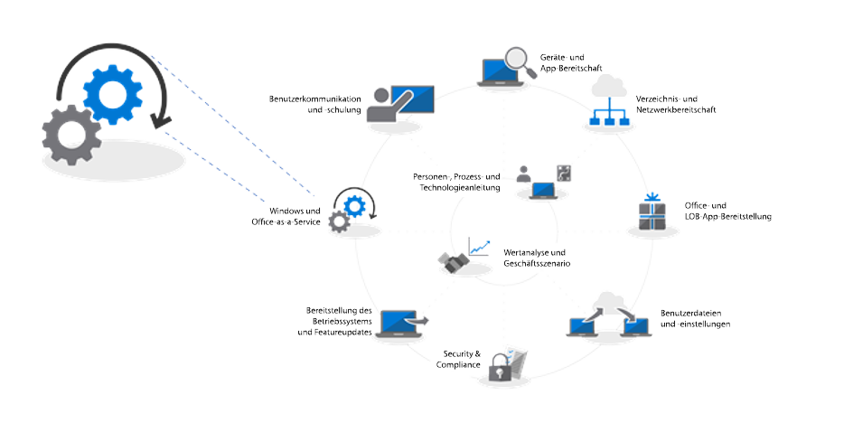
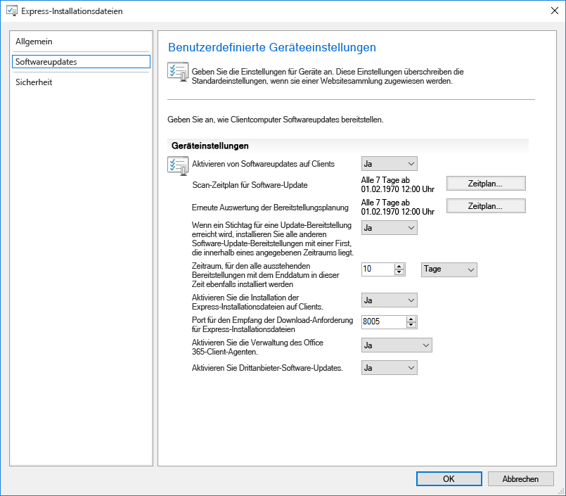
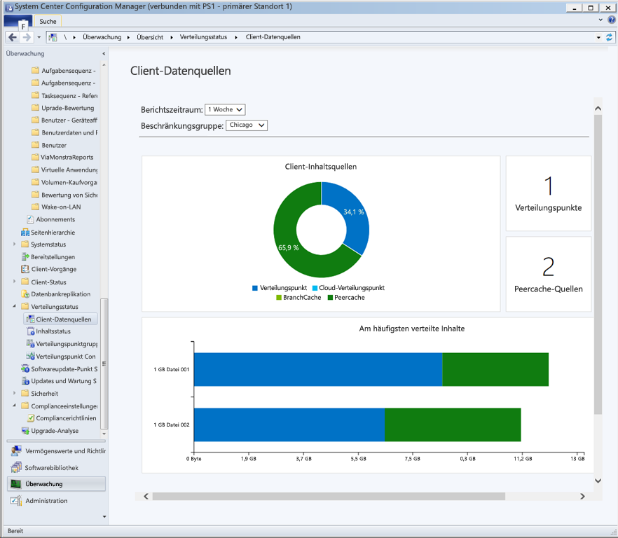
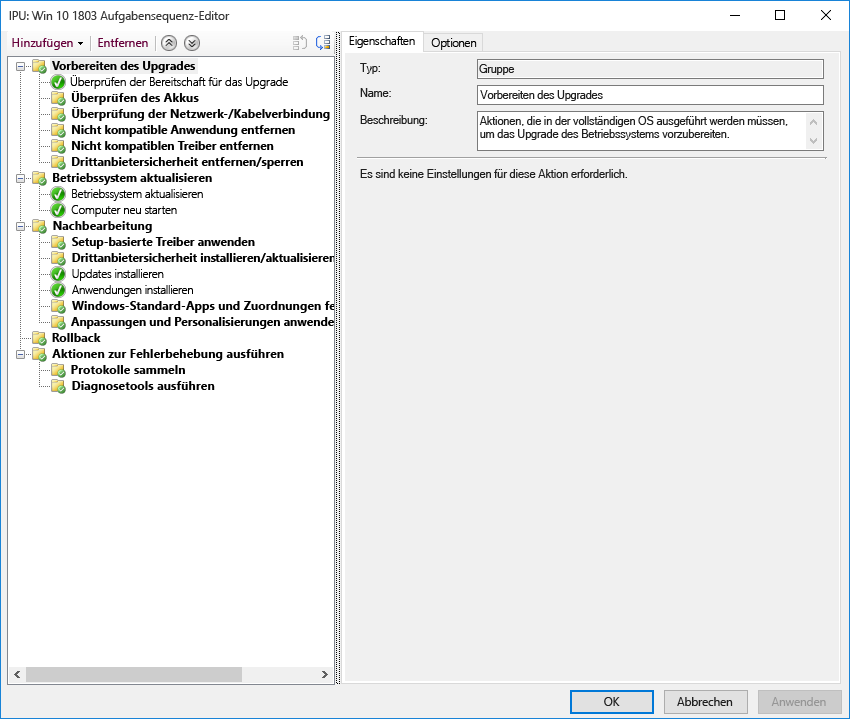

# Schritt 7: Windows und Office als Dienst

<table>
<thead>
<td></td>
<td>
<strong>Schritt 7: Windows und Office als Dienst</strong>

Sowohl Windows 10 als auch Office 365 ProPlus fügen ständig neue Funktionen hinzu, um die Benutzerfreundlichkeit und Sicherheit durch die neuesten Innovationen zu bereichern. Erfahren Sie, wie Sie mit halbjährlichen und monatlichen Updates auf dem Laufenden bleiben, wie das neue Wartungsmodell funktioniert und welche Tools und Optionen Sie haben.
</td>
<td></td>
</thead>
</table>

>[!NOTE]
>Windows und Office als Dienst ist der siebte Schritt in dem von uns empfohlenen Rad für den Bereitstellungsprozess, der die Planungsaspekte der Vorbereitung auf halbjährliche Updates für Features behandelt. Wenn Sie den vollständigen Desktopbereitstellungsprozess sehen möchten, besuchen Sie das [Bereitstellungscenter für Desktop](https://aka.ms/HowToShift).
>

Sowohl in Windows 10 und als auch in Office 365 ProPlus werden neue Wartungsoptionen, Supportmodelle und Zeitpläne für Updates eingeführt. Anhand dieser Änderungen können Sie leichter über die neuesten Features auf dem Laufenden bleiben. Neben diesen Updates gibt es neue Konfigurationsoptionen, die Wartungspläne ermöglichen, die Ihren Anforderungen entsprechen. Erfahren Sie, wie Sie sich auf halbjährliche Kanalupdates mit neuen Features und Funktionen in Windows 10 und Office 365 ProPlus vorbereiten können, während Sie neue Features in System Center Configuration Manager Current Branch nutzen.

[Kunden beim Umstieg auf Windows 10 und Office 365 ProPlus unterstützen](https://www.microsoft.com/de-DE/microsoft-365/blog/2018/09/06/helping-customers-shift-to-a-modern-desktop/)

## Updatetypen

Updates werden in zwei Hauptkategorien unterteilt, und zwar Featureupdates und Qualitäts- und Sicherheitsupdates, die kumulierte Sicherheit, Zuverlässigkeit und Fehlerbehebungen enthalten. Im Hinblick auf den Zeitplan stellen sowohl Windows als auch Office einen halbjährlichen Kanal bereit, der zweimal im Jahr im März und September neue Features liefert, während Qualitäts- und Sicherheitsupdates monatlich veröffentlicht werden. Darüber hinaus bieten wir nur für Office 365-Clientanwendungen einen vollständig unterstützten monatlichen Kanal, bei dem Updates sowohl neue Features als auch Qualitätsupdates enthalten.

Wenn Sie sich an einen längeren Zyklus zwischen Updates für Desktopbetriebssysteme und Apps gewöhnt hatten, fragen Sie sich vielleicht Folgendes:

  - Sind die Updates kompatibel?

  - Muss ich meine Benutzer ständig schulen?

  - Was sind die Risiken?

Zur Beantwortung dieser Fragen und zur Darstellung des Grundgedankens der häufigeren Bereitstellung neuer Funktionen werden nachfolgend einige der Vorteile dieses Ansatzes erläutert:

### Vorteile von Featureupdates

Als Erstes haben wir uns von dem bisherigen Modell verabschiedet, bei dem alle drei Jahre riesige Änderungswellen auf uns zu kamen. Nun gibt es zwei Mal pro Jahr kleinere inkrementelle Änderungen mit Featureupdates. Warum? Die Technologietrends entwickeln sich rasend schnell, und es gibt immer mehr Sicherheitsbedrohungen. Mit inkrementellen Änderungen bleiben Oberflächen und Schutzmaßnahmen immer aktuell. Einige der sicherheitsbezogenen Updates können zum Beispiel nicht einfach durch monatliche Sicherheitsupdates oder Antivirus-Signaturdateien bereitgestellt werden; es handelt sich dabei möglicherweise um Änderungen auf niedriger Ebene, z. B. virtualisierungsbasierte Sicherheit.

[Kurzübersicht für Windows as a service](https://docs.microsoft.com/de-DE/windows/deployment/update/waas-quick-start)

[Risikominimierung mithilfe von Windows 10-Sicherheitsfeatures](https://docs.microsoft.com/de-DE/windows/security/threat-protection/overview-of-threat-mitigations-in-windows-10%20%20)

### Vorteile des Modells mit kumulativen Updates

Durch Bereitstellen von Qualitäts- und Sicherheitsupdates als kumulatives Updatepaket werden viele Probleme der Vergangenheit gelöst. Bisher war es so, dass Sie sowohl für Windows als auch für Office jeden Monat aus zwölf oder mehr Updates eine Auswahl treffen konnten. Wie Sie sich vorstellen können, entsteht dadurch eine nahezu nicht verwaltbare Menge an Testmatrizen für den Support. Wenn Sie eine Version von Windows oder Office installieren, die ein Jahr alt oder älter ist, kann es außerdem Stunden oder manchmal auch Tage dauern, um alle Updates anzuwenden, die seit der Veröffentlichung der Version bereitgestellt wurden.

Beim kumulativen Modell fehlt Ihnen immer nur das letzte Update. Dadurch wird die Anzahl von monatlichen Updates, die Sie bereitstellen müssen, reduziert. Jedes Update baut auf Updates aus früheren Monaten auf und enthält alle Fixes, die Sie benötigen, um auf dem aktuellen Stand zu sein. Kumulative Updates sind besonders dann hilfreich, wenn Computer mehrere Monate lang ausgeschaltet waren, weil sie im Lager waren, bis sie wieder einem anderen Benutzer zugewiesen wurden.

### Erweiterte Überprüfung von Updates

Ein weiterer Vorteil besteht darin, dass wir vor der Veröffentlichung von Updates für die allgemeine Bereitstellung zunächst Builds über die Insider-Programme für [Office](https://products.office.com/en-us/office-insider?tab=Windows-Desktop) und [Windows](https://insider.windows.com/de-DE/) veröffentlichen, sodass wir Diagnosedaten und Feedback vor der allgemeinen Veröffentlichung von Updates sammeln können. Die Insider-Programme sind jetzt für alle verfügbar, Sie können sich also schon mit den Updates vertraut machen. Bis Updates veröffentlicht werden, haben wir Diagnosedaten von Millionen von Konfigurationen erhalten, wenn die Updates schließlich eingeführt werden, ist die Qualität viel besser prognostizierbar.

Ein weiterer Punkt: Wenn Sie einen halbjährlichen Kanal für Office zur Bereitstellung von Featureupdates zwei mal pro Jahr in Übereinstimmung mit Windows verwenden, können Sie, da die Insider-Builds von Office 365 ProPlus monatliche Kanalupdates wiedergeben, diese Builds frühzeitig mithilfe der halbjährlichen Kanalversionen überprüfen.

### Unterstützen der Verwaltungstools

Wir haben uns auch Gedanken darüber gemacht, wie wir die Bereitstellung von Updates für Sie reibungslos gestalten können. System Center Configuration Manager Current Branch wird häufig aktualisiert, um die Einführung dieser Updates für Windows und Office sowie andere neue Funktionen zu unterstützen.

[Bereitstellen von Windows 10-Updates mit System Center Configuration Manager](https://docs.microsoft.com/de-DE/windows/deployment/update/waas-manage-updates-configuration-manager)

[Verwalten von Office 365 ProPlus mit Configuration Manager](https://docs.microsoft.com/de-DE/sccm/sum/deploy-use/manage-office-365-proplus-updates)

## Übersicht über Windows und Office-Kanäle

Windows 10 bietet drei Wartungskanäle:

- Das [**Windows-Insider-Programm**](https://docs.microsoft.com/de-DE/windows/deployment/update/waas-overview#windows-insider) für Organisationen zum Testen und für Feedback zu Features, die im nächsten Featureupdate veröffentlicht werden.
- Der **halbjährliche Kanal** bietet zwei Mal pro Jahr neue Funktionen mit neuen Featureupdates.
- Der **langfristige Wartungskanal** wurde nur für spezielle Geräte entwickelt, die eine längere Wartungsoption benötigen.

Office 365 bietet vier Wartungskanäle:

- [**Office Insider-Programm** ](https://support.office.com/de-DE/article/What-is-Office-Insider-f4208185-b63a-4b68-9c7a-9a32d2411c16) für Organisationen zum Testen und für Feedback zu den neuesten Office-Features und Funktionen, die sich noch in der Entwicklung befinden.
- Der **monatliche Kanal** stellt Benutzern die neuesten Funktionen von Office bereit, sobald diese verfügbar sind.
- Der **halbjährliche Kanal** bietet nur zwei Mal pro Jahr neue Funktionen mit neuen Features.
- Der **halbjährliche Kanal (gezielt)** ist ein vollständig unterstützter Build von Office, mit dem Pilotbenutzer und Anwendungskompatibilitätstester den nächsten halbjährlichen Kanal testen und überprüfen können.

Ausführliche Informationen zu Windows- und Office-Wartungskanälen finden Sie in der folgenden Dokumentation:

- [Übersicht über Windows als Dienst](https://docs.microsoft.com/de-DE/windows/deployment/update/waas-overview#servicing-channels)
- [Übersicht über die Updatekanäle für Office 365 ProPlus](https://docs.microsoft.com/de-DE/DeployOffice/overview-of-update-channels-for-office-365-proplus#BKMK_SAC)

## Phasenweise Bereitstellung von Updates

Lassen Sie uns nun aber darüber sprechen, wie diese Updates eingeführt werden. Für alle Versionen empfehlen wir mindestens drei Bereitstellungsphasen für IT – Überprüfung, Pilotphase und allgemeine Produktionsbereitstellung. Nachdem Sie Windows 10 und Office 365 ProPlus zum Laufen gebracht haben, verwenden Sie eine monatliche Wartung, um mit kritischen Sicherheits- und Qualitätsupdates auf dem Laufenden zu bleiben. Danach verwenden Sie eine halbjährliche Wartung für neue Features.

### Monatliche Updates

Das Servicemodell ist so konzipiert, dass neue Features wahlweise nur zwei Mal pro Jahr eingeführt werden; bei Bedarf können Sie ein halbjährliches Updates auch überspringen und weiterhin Qualitäts- und Sicherheitsfeatures erhalten. Wie erwähnt, werden monatliche Updates aufgrund ihrer kumulativen Natur jeden Monat größer.

#### Express-Updates

Mithilfe einer Technologie mit dem Namen „Express Updates“ in Windows und Binary Delta Compression in Office kann die Downloadgröße wesentlich reduziert werden. Bei beiden Ansätzen vergleichen die Updatemodule, was sich auf dem Computer befindet, und es wird nur nach den erforderlichen Unterschieden gesucht, um die bereits vorhandenen Komponenten zu aktualisieren.

[Erläuterung von Windows 10-Qualitätsupdates und das Ende von Deltaaktualisierungen](https://techcommunity.microsoft.com/t5/Windows-IT-Pro-Blog/Windows-10-quality-updates-explained-amp-the-end-of-delta/ba-p/214426)

Windows Update for Business und Windows Server Update Services haben Express-Updates über einen langen Zeitraum unterstützt, dieser Support wurde nun auf System Center Configuration Manager erweitert, sodass auch hier Express-Updates verwendet werden können.

#### Binary Delta Compression

Binary Delta Compression in Office wird nur verwendet, wenn Sie eine Aktualisierung von der neuesten Version von Office 365 ProPlus ausführen. Verwenden Sie diesen Ansatz also, wenn Sie eine Aktualisierung vom vorherigen Build ausführen müssen und keine Updates überspringen können.

Windows- und Office-Updatekanäle können mithilfe des Standardgenehmigungs- und Zielprozesses über Configuration Manager verwaltet werden. Darüber hinaus können Sie Richtlinieneinstellungen sowie verwandte Einstellungen in Office und Windows verwenden, um verwendete Updatekanäle zu erzwingen.

### Halbjährliche Updates

Da Sie nun die Überlegungen für monatliche Updates kennen, fahren wir mit den größeren, halbjährlichen Updates fort.

Wie bei der Geräte- und App-Bereitschaft behandelt, sollten Sie zur Vorbereitung auf diese größeren Updates die gleichen Bereitschaftstools verwenden, die in Schritt 1 des Bereitstellungsprozesses eingerichtet wurden.

Was die Tools angeht, so können Sie Richtlinieneinstellungen mit Windows Update for Business, die Softwareupdateverwaltung über System Center Configuration Manager, Windows Server Update Services (WSUS) oder von Microsoft Intune festgelegte Updaterichtlinien verwenden. Wenn Sie sich Sorgen um die Netzwerkbandbreite machen, sehen Sie sich „Schritt 2: Verzeichnis- und Netzwerkbereitschaft“ an, um mehr über Ihre Optionen zur Reduzierung des Netzwerkdatenverkehrs über die Übermittlungsoptimierung und andere Peer-to-Peer-Cachingtechnologien zu erfahren.

[Halbjährlicher Kanal in Windows](https://docs.microsoft.com/de-DE/windows/deployment/update/waas-overview#semi-annual-channel)

[Halbjährlicher Kanal für Office 365 ProPlus](https://docs.microsoft.com/de-DE/DeployOffice/overview-of-update-channels-for-office-365-proplus#BKMK_SAC)

#### Aufgabensequenzen bei Upgrades

Das Installieren der größeren Featureupdates über standardäßige Routinen der Softwareupdateverwaltung ist eine unterstützte Option, aber viele Organisationen verwenden lieber eine Upgradeaufgabensequenz mit System Center Configuration Manager oder das Microsoft Deployment Toolkit.

Mit einer Aufgabensequenz können Sie benutzerdefinierte Prüfungen oder Aufgaben VOR der Installation der Featureupdates erstellen und benutzerdefinierte Aufgaben ausführen, NACHDEM die Installation des Updates selbst abgeschlossen wurde – Aufgaben nach der Aktualisierung beinhalten möglicherweise das vorübergehende Aussetzen von Diensten, wenn dies während des Updates, der Treiberinstallation und des Treiberaustauschs, während Anwendungsupgrades oder Personalisierungseinstellungen für die Taskleiste und Windows 10-Start erforderlich ist.

Wenn Sie bereits Aufgabensequenzen zum Migrieren Ihrer Windows 7-Computer auf Windows 10 verwenden und sich mit diesen Tools gut auskennen, ist dies ein guter Ausgangspunkt, der die ultimative Kontrolle liefert. Sie können zwar eine einzige Aufgabensequenz für das gesamte Upgrade verwenden, häufig verwenden Organisationen aber zwei Aufgabensequenzen. Eine Aufgabensequenz, um sicherzustellen, dass die Computer bereit für das Upgrade sind, bei der alle erforderlichen Setupdateien auf Zielcomputern vorab bereitgestellt werden. Und eine andere Aufgabensequenz für das eigentliche Upgrade. Bei diesem Ansatz wird sichergestellt, dass die Benutzerproduktivität weniger beeinträchtigt wird.

[Erstellen einer Aufgabensequenz für ein Betriebssystemupgrade in Configuration Manager](https://docs.microsoft.com/de-DE/sccm/osd/deploy-use/create-a-task-sequence-to-upgrade-an-operating-system)

#### Halbjährliche Kanalunterstützung für Featureupdates

[Wie im September 2018 angekündigt](https://www.microsoft.com/de-DE/microsoft-365/blog/2018/09/06/helping-customers-shift-to-a-modern-desktop/), wird für die Supportzeitskala für halbjährliche Kanalupdates das folgende Modell verwendet.

  - Alle derzeit unterstützten Featureupdates von Windows 10 Enterprise und Education werden ab Version 1607 30 Monate ab dem ursprünglichen Veröffentlichungsdatum unterstützt.

  - Alle zukünftigen Featureupdates (ab Version 1809) mit dem Ziel September werden 30 Monate ab dem Tag ihrer Veröffentlichung unterstützt.

  - Zukünftige Featuresupdates (ab Version 1903), die auf März abzielen, werden weiterhin 18 Monate ab dem Tag ihrer Veröffentlichung unterstützt.

  - Halbjährliche Updates für Office 365 ProPlus weiterhin 18 Monate lang unterstützt.

#### Weitere Setup-Automatisierungsoptionen außerhalb von Aufgabensequenzen

Wenn Sie keine Upgradeaufgabensequenzen verwenden, können Sie nun benutzerdefinierte Aktionen ausführen oder Treiberdateien während Featureupdates in der Phase vor der Installation anwenden – bevor Setup die Kompatibilitätsprüfungen ausführt – oder in der Phase vor dem Commit – bevor das Upgrade angewendet wird.

[Neuigkeiten im Windows 10-Setup, Version 1803](https://docs.microsoft.com/de-DE/windows/whats-new/whats-new-windows-10-version-1803%23windows-setup)

## Nächster Schritt 

## [Schritt 8: Benutzerkommunikation und Schulung](https://aka.ms/mdd8)

## Vorheriger Schritt 

## [Schritt 6: Bereitstellung des Betriebssystems und Featureupdates](https://aka.ms/mdd6)