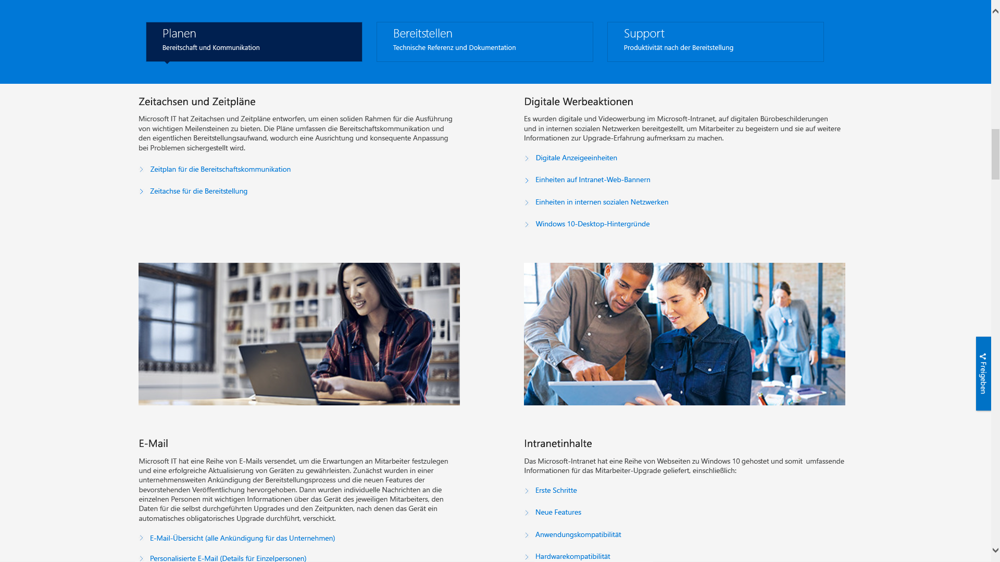

# Schritt 8: Benutzerkommunikation und Schulung

<table>
<thead>
<td></td>
<td>
<strong>Schritt 8: Benutzerkommunikation und Schulung</strong>

Stellen Sie sicher, dass Ihre Benutzer über neue Oberflächen und neue Arbeitsmethoden informiert sind, wenn Sie Ihre Computer auf Windows 10 und Office 365 ProPlus umstellen. Erfahren Sie, wie Sie mit Microsoft FastTrack, Schulungsmaterialien und Kommunikationsvorlagen die Akzeptanz beim Endbenutzer beschleunigen können, und lernen Sie neue Möglichkeiten zur Überwachung der Benutzerakzeptanz und -verwendung kennen.
</td>
<td></td>
</thead>
</table>

>[!NOTE]
>Benutzerkommunikation und Schulung ist der achte Schritt in unserem empfohlenem Bereitstellungsprozess, bei dem Tipps und Empfehlungen zum Informieren und Vorbereiten der Benutzer behandelt werden. Den vollständigen Desktopbereitstellungsprozess finden Sie im [Bereitstellungscenter für Desktop](https://aka.ms/HowToShift).
>

Informieren Sie die Benutzer über den modernen Arbeitsplatz, der Office 365, Windows 10 und neue Sicherheits- sowie Compliance-Steuerungen mit Azure Active Directory und vielem mehr umfasst und entscheidend für die Akzeptanz ist. Hierbei geht es darum, herauszufinden, wie Sie Updates am besten einführen: Einige Benutzer fürchten Auswirkungen auf ihre Produktivität oder Änderungen in ihrem Arbeitsablauf, oder sie müssen neue Dinge lernen.

Es gibt jedoch auch eine gute Nachricht: Wenn Sie von Windows 7 und Office 2010 oder Office 2013 umsteigen, kennen viele Benutzer Windows 10 und neuere Versionen von Office bereits von ihren persönlichen Geräten, sodass die Auswirkungen der Änderung oft nicht so gravierend sind, wie befürchtet.

## Vorbereitung auf neue Oberflächen

Wir fangen bei Office an: Wenn Sie Office 365 ProPlus das erste Mal bereitstellen, dann können Sie die Vorteile herausstellen, die sich durch die Anmeldung bei den Office-Apps und durch das Speichern von Dateien in OneDrive oder SharePoint ergeben, wie zum Beispiel die einfachere gemeinsame Verwendung, geringere Dateiverzweigungen und die Aktivierung der gemeinsamen Dokumenterstellung in Echtzeit.

Detaillierte Kommunikations- und Schulungsvorlagen stehen für diese und andere lokale oder browserbasierten Apps, wie Teams und Planer, zur Verfügung.

Darüber hinaus stellen wir auch Leitfäden für neue In-App-Funktionen bereit, wie z. B. das Anfügen von mit OneDrive verknüpften Dateien in Outlook oder die Verwendung des neuen Folienübergangs „Morphen“ und der Designerfeatures in PowerPoint.

Bei Windows 10 helfen wir Ihnen dabei, Ihre Benutzer mit optionalen und standardmäßigen Funktionen wie Windows Hello zum sicheren Anmelden mit biometrischen Funktionen, Start-Updates zum Personalisieren der Windows-Oberfläche, der Zeitachse, mit der sie einfach zurück zu ihrer Arbeit gelangen, Cortana und vielem mehr vertraut zu machen.

Es gibt außerdem sichtbare Sicherheits- und Compliance-Steuerungen, die möglicherweise für die Benutzer angezeigt werden. Enterprise Mobility + Security, das Azure AD und Microsoft Intune umfasst, integriert zusätzliche Funktionen in Windows 10 und Office 365, die Sie für das Desktop-Upgrade nutzen können.

[Microsoft Enterprise Mobility + Security](https://www.microsoft.com/cloud-platform/enterprise-mobility-security)

Wenn Sie zum Beispiel die mehrstufige Authentifizierung aktiviert haben, verwendet diese Azure AD und schützt so die Benutzeranmeldung bei Ressourcen, indem eine Telefon-App oder PIN zum sicheren Zugriff auf die Dienste genutzt wird. Azure Information Protection erleichtert es Benutzern außerdem, Dokumente zu klassifizieren und mit Bezeichnungen zu versehen.

[Einrichten der mehrstufigen Authentifizierung für Office 365-Benutzer](https://support.office.com/article/set-up-multi-factor-authentication-for-office-365-users-8f0454b2-f51a-4d9c-bcde-2c48e41621c6)

Dies sind nur einige wenige der neuen Funktionen, die den Benutzern nun zur Verfügung stehen, und einige Benutzer werden überrascht sein – positiv, oder auch weniger positiv. Dies kann dazu führen, dass Sie mehr Support-Anfragen und -Tickets für den Helpdesk erhalten, insbesondere dann, wenn sich der normale Arbeitsablauf ändert.

## Proaktive Vorbereitung und kontrolliertes Rollout

Um die Risiken zu minimieren, die mit Änderungen der Benutzeroberfläche einher gehen, empfehlen wir zwei sich ergänzende Ansätze:

  - Die proaktive Kommunikation mit den Benutzer, damit sie wissen, was sie erwartet,

  - und die Verwendung von Bereitstellungsringen zum Steuern der Bereitstellungsrate.

### Phasenweise Bereitstellung

Das Konzept der phasenweisen Bereitstellung mit Bereitstellungsringen sieht wie folgt aus: Es beginnt mit kleinen Gruppen und weitet den Bereitstellungsumfang dann mit der Zeit kontrolliert aus. In der Regel sind zu dem Zeitpunkt, zu dem ein Kommunikations- und Schulungsplan entworfen ist, diese Ringe und deren Mitglieder bereits gebildet. Auf diese Weise können Sie das potenzielle Risiko verringern und Ihren Ansatz überprüfen, während Sie kontinuierlich das Bereitstellungsventil öffnen oder bei Bedarf die Aktivitäten anhalten, wenn beispielsweise mehr Anrufe beim Helpdesk eingehen als erwartet.

Erstellen Sie Bereitstellungsringen am besten in Zusammenarbeit mit den Geschäftsbereichen und deren Vorgesetzten. Sie müssen über wichtige Daten und Zeiten Bescheid wissen, die Sie bei der Bereitstellung oder dem Vornehmen von Änderungen berücksichtigen müssen. Ohne eine sorgfältige Planung und die Unterstützung der Prozessbeteiligten wird es schwierig, Benutzer ins Boot zu holen und sie an die Änderungen zu gewöhnen, die bevorstehen.

### Phase 1: Das IT Team und Early Adopter-Insider 

Es ist in der Regel am besten, die Bereitstellung beim IT-Team und mit enthusiastischen Early Adoptern zu beginnen, die sich gerne für einen frühzeitigen Zugriff bereitstellen. Mit diesen „Insidern“ können Sie die Kommunikation, die Auswirkungen der Änderung und die Effektivität Ihrer Kommunikation und Schulungen testen. In dieser Phase führt die IT kleine Pilotprojekte durch und lernt Techniken zur Problembehandlung und Automatisierung kennen, die in der Phase der umfangreicheren Bereitstellung nützlich sein können.

Es ist wichtig, in der anfänglichen Pilotphase engagierte Mitglieder zu haben, um so sicherzustellen, dass sie ihre Beobachtungen dokumentieren und Feedback zum Prozess geben. Außerdem ist es sinnvoll, Befürworter außerhalb des IT-Teams zu haben, die die neuen Funktionen durch Mund-zu-Mund-Propaganda bekannt machen und häufig die erste Anlaufstelle sind, wenn Benutzer in späteren Phasen Hilfe benötigen.

### Phase 2: Pilotprojekt 

Sobald Sie ein gutes Gefühl haben, was diese erste Phase angeht, können Sie sich eine größere Anzahl von Benutzern für die zweite Phase, die Pilotphase, vornehmen. Die Benutzer sollten eine repräsentative Mischung aus Benutzerrollen, Gerätetypen, Windows-Apps und Office-Add-Ins sein. Die von diesen Gruppen erhaltenen Daten werden über die Analysefunktionen genutzt, um auf die anfänglichen Wellen der Phase 3, die umfassende Bereitstellung, abzuzielen.

Denken Sie daran, dass alle PCs in dieser Phase und zukünftigen Phasen Protokolle für den Analysedienst bereitstellen, damit Sie Diagnosedaten zur Geräte- und App-Integrität sowie zur Einsparung von Bandbreite von der Übermittlungsoptimierung und über die Nutzung von Windows Hello erfassen können.

In dieser Phase ist es besonders wichtig, Änderungen an die Benutzer zu kommunizieren und sie dabei zu unterstützen, die neuen Funktionen zu nutzen. Benutzer lesen E-Mails oder andere Kommunikation der IT-Abteilung häufig nicht mit Priorität oder ignorieren sie. Daher ist es hilfreich, sich mit dem Management zu treffen und dessen Unterstützung zu gewinnen, um Änderungen zu kommunizieren und die Akzeptanz neuer Tools und Technologien voranzutreiben.

Außerdem benötigen Sie deren Input in Bezug auf Zeiten, die bei der Bereitstellung vermieden werden sollten, damit die Benutzer so wenig wie möglich gestört werden. So kann es beim Finanzteam insbesondere am Ende des Finanzquartals kritisch sein, oder bei Produktentwicklungsteams während der Einführung eines neuen Produkts.

Parallel zur Planung für Geräte, Benutzer, Abteilungen und Zeiten können Sie mit der Ausarbeitung von Kommunikations- und Schulungsplänen beginnen und bereits Inhalte zusammenstellen oder externe Ressourcen für die Schulung der Benutzer gewinnen.

#### Microsoft FastTrack 

Bei der Zusammenstellung von Schulungsinhalten haben Sie in der Produktivitätsbibliothek von Microsoft FastTrack Zugriff auf einen umfassenden Satz von kurzen, auf Videos basierenden Trainings mit Schrittanleitungen.

[Microsoft FastTrack-Produktivitätsbibliothek](https://www.microsoft.com/microsoft-365/success/?rtc=2)

Es gibt Hunderte von Themen, basierend auf dem, was für Ihre Organisation wesentlich ist: Erstellen von wirkungsvolleren Inhalten, Freigeben von Websites und Inhalten, Transformieren der Teamarbeit und Steigern der Produktivität mit modernen Geräten.

Wenn Sie Microsoft 365 oder Office 365 verwenden, stehen die Chancen gut, dass Sie berechtigt sind, über den Microsoft FastTrack-Dienst Hilfe beim Vorantreiben der Benutzerakzeptanz zu erhalten Dabei leiten unsere Mitarbeiter Sie während des Rollouts von Microsoft 365 – Windows, Office und EMS – durch bewährte Methoden zum Vorantreiben der Benutzerakzeptanz.

#### Microsoft IT Showcase 

Die Microsoft IT Showcase-Serie ist eine andere großartige Ressource für Inhalte im Zusammenhang mit der Bereitstellung von Windows 10. Sie enthält Zeitachsen und Zeitpläne, digitale Angebotsvorlagen, E-Mail-Vorlagen und Intranetinhalte. Diese basieren auf eigenen Materialien von Microsoft für die Bereitstellung von Windows 10, die für die Verwendung durch andere Organisationen angepasst wurden.

[Vorbereiten Ihrer Organisation für eine nahtlose Bereitstellung von Windows 10](https://www.microsoft.com/itshowcase/windows10deployment)

Diese Komponenten und Dienste können während der Pilotphase genauer abgestimmt werden. Während Sie erfahren, was Benutzer in Bezug auf Schulungen wichtig ist, auf welche Geräte ausgehend von der Analyse abgezielt werden sollte und welche Geräte oder Benutzergruppen vermieden oder erst später herangezogen werden sollten, können Sie damit beginnen, die Bereitstellung in späteren Phasen anhand des daten- und erfahrungsgesteuerten Ansatzes auszuweiten.

Bei der Ausweitung des Pilotprojekts müssen Sie häufig gestellte Fragen und Self-Service-Inhalte dokumentieren und veröffentlichen, um so proaktiv dazu beizutragen, dass Support-Tickets und Helpdeskaktivitäten reduziert werden.

### Phase 3 und weiter: Umfassende Produktionsbereitstellung 

Zu dem Zeitpunkt, zu dem Sie die allgemeinen Bereitstellungsphasen erreichen, haben Sie bereits Ihre Prozesse, Kommunikation, Schulungen und Self-Service-Tools überarbeitet. Jetzt können Sie die über Diagnosedaten erfassten Daten nutzen, um immer mehr PCs abzuarbeiten.

Führen Sie die Bereitstellung in dem Maße durch, mit dem Ihre IT-Abteilung, das Helpdesk, die Benutzer und die Netzwerkkapazität zurecht kommen. Sie können auch stets zu Schritt 2 des Bereitstellungsprozesses zurückkehren, um das Netzwerk durch Peer-zu-Peer-Cache, LEDBAT und andere Techniken noch weiter zu optimieren und so eine schnellere Übertragung der Daten im Rahmen der Bereitstellung zu ermöglichen.

Zusätzlich zu den Diagnosedaten, die Sie über die Analysewerkzeuge überwachen, können Sie auch die Nutzung von Office 365- und Microsoft 365-Diensten anhand von umfangreichen Nutzungsberichten nach Arbeitslast im Admin Center und unter Verwendung der Administratordashboards über Power BI detailliert überwachen. Dies sind hervorragende Tools, um Ziele bei der Einführung neuer Tools für die Zusammenarbeit festzulegen und nachzuverfolgen – z. B. Microsoft Teams – oder neue Methoden zum Freigeben von Dateien – z. B OneDrive.

Der Prozess, bei dem die Benutzer neue Technologien akzeptieren und übernehmen, wird noch lange fortdauern, nachdem auf jedem PC in Ihrer Organisation Windows 10 und Office 365 ProPlus installiert wurden. Und wenn Sie sich nicht die Zeit nehmen, die Benutzer zu informieren und sie zu schulen, werden sie nicht unbedingt ihre Arbeitsweise ändern. Und nun, da die neuen Servicemodelle fortlaufend nach einem halbjährlichen Zeitplan neue Funktionen für Windows und optional monatlich für Office bereitstellen, ist die Kommunikation ein andauernder Prozess.

## Vorheriger Schritt 

## [Schritt 7: Windows und Office als Dienst](https://aka.ms/mdd7)