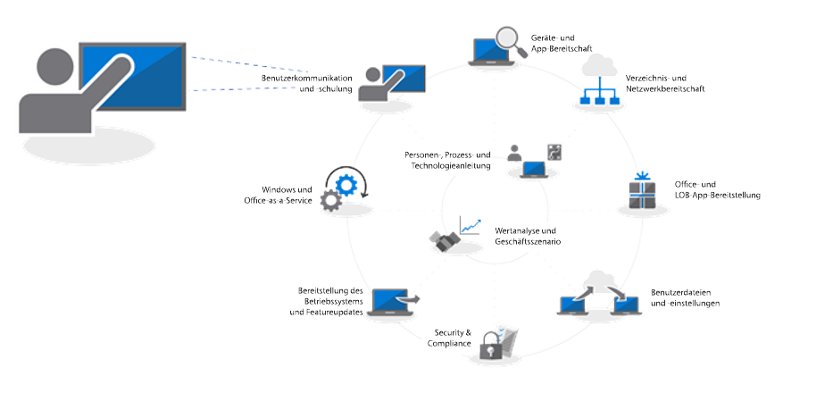
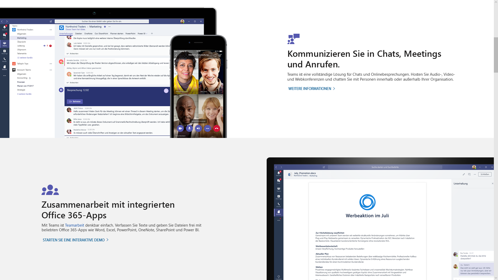
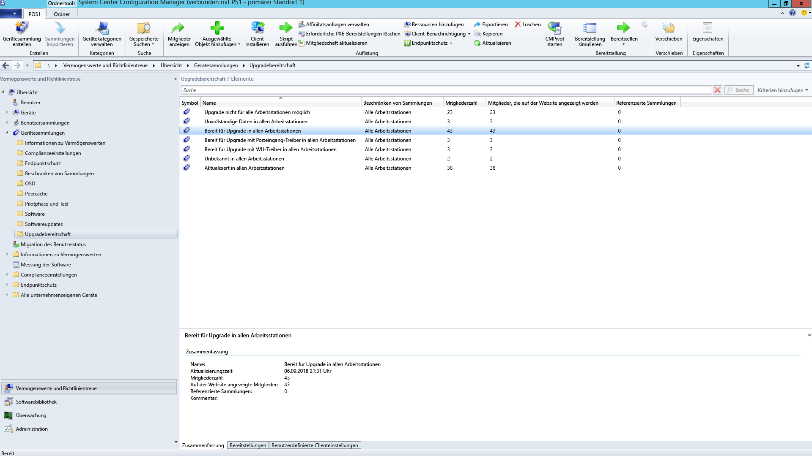

# Schritt 8: Benutzerkommunikation und SchulungStep 8: User Communications and Training

<table>
<thead>
<td></td>
<td>
<strong>Schritt 8: Benutzerkommunikation und Schulung</strong><strong>Step 8: User Communication and Training</strong>

Stellen Sie sicher, dass Ihre Benutzer über neue Oberflächen und neue Arbeitsmethoden informiert sind, wenn Sie Ihre Computer auf Windows 10 und Office 365 ProPlus umstellen. Erfahren Sie, wie Sie mit Microsoft FastTrack, Schulungsmaterialien und Kommunikationsvorlagen die Akzeptanz beim Endbenutzer beschleunigen können, und lernen Sie neue Möglichkeiten zur Überwachung der Benutzerakzeptanz und -verwendung kennen.Make sure your users are informed about new experiences and new ways of working as you shift your PCs to Windows 10 and Office 365 ProPlus. Learn how to take advantage of user adoption assistance with Microsoft FastTrack, training materials and communication templates, as well as new ways to monitor user acceptance and usage.
</td>
<td></td>
</thead>
</table>

>[!NOTE]
>Benutzerkommunikation und Schulung ist der achte Schritt in unserem empfohlenem Bereitstellungsprozess, bei dem Tipps und Empfehlungen zum Informieren und Vorbereiten der Benutzer behandelt werden.User Communications and Training is the eighth step in our recommended deployment process wheel by covering tips and recommendations to inform and prepare users. Den vollständigen Desktopbereitstellungsprozess finden Sie im [Bereitstellungscenter für Desktop](https://aka.ms/HowToShift).To see the full desktop deployment process, visit the [Desktop Deployment Center](https://aka.ms/HowToShift).
>

Informieren Sie die Benutzer über den modernen Arbeitsplatz, der Office 365, Windows 10 und neue Sicherheits- sowie Compliance-Steuerungen mit Azure Active Directory und vielem mehr umfasst und entscheidend für die Akzeptanz ist.Informing and preparing your users for modern workplace experiences spanning Office 365, Windows 10, and new security and compliance controls with Azure Active Directory is critical to driving adoption. Hierbei geht es darum, herauszufinden, wie Sie Updates am besten einführen: Einige Benutzer fürchten Auswirkungen auf ihre Produktivität oder Änderungen in ihrem Arbeitsablauf, oder sie müssen neue Dinge lernen.The trick here is to figure out how to introduce updates -- when some users may fear disruptions to their productivity or changes in their workflow, or if they have to learn new things.

Es gibt jedoch auch eine gute Nachricht: Wenn Sie von Windows 7 und Office 2010 oder Office 2013 umsteigen, kennen viele Benutzer Windows 10 und neuere Versionen von Office bereits von ihren persönlichen Geräten, sodass die Auswirkungen der Änderung oft nicht so gravierend sind, wie befürchtet.The good news is if you are moving from Windows 7 and Office 2010 or Office 2013, there will be a lot of people familiar with Windows 10 and newer versions of Office running on their personal devices, and all this will help reduce the impact of change.

## Vorbereitung auf neue OberflächenGetting ready for new experiences

Wir fangen bei Office an: Wenn Sie Office 365 ProPlus das erste Mal bereitstellen, dann können Sie die Vorteile herausstellen, die sich durch die Anmeldung bei den Office-Apps und durch das Speichern von Dateien in OneDrive oder SharePoint ergeben, wie zum Beispiel die einfachere gemeinsame Verwendung, geringere Dateiverzweigungen und die Aktivierung der gemeinsamen Dokumenterstellung in Echtzeit.Starting with Office, if you’re deploying Office 365 ProPlus for the first time, this is when you can communicate the benefits of signing in to Office apps and saving files to OneDrive or SharePoint locations to enable easier sharing, reduce file branching and enable real-time co-authoring.

Detaillierte Kommunikations- und Schulungsvorlagen stehen für diese und andere lokale oder browserbasierten Apps, wie Teams und Planer, zur Verfügung.Detailed communication and training templates are available for these and other local or browser-based apps, like Teams and Planner.

Darüber hinaus stellen wir auch Leitfäden für neue In-App-Funktionen bereit, wie z. B. das Anfügen von mit OneDrive verknüpften Dateien in Outlook oder die Verwendung des neuen Folienübergangs „Morphen“ und der Designerfeatures in PowerPoint.We also give guidance for new in-app capabilities like attaching OneDrive linked files in Outlook or using the new Morph slide transitions and Designer features in PowerPoint.

Bei Windows 10 helfen wir Ihnen dabei, Ihre Benutzer mit optionalen und standardmäßigen Funktionen wie Windows Hello zum sicheren Anmelden mit biometrischen Funktionen, Start-Updates zum Personalisieren der Windows-Oberfläche, der Zeitachse, mit der sie einfach zurück zu ihrer Arbeit gelangen, Cortana und vielem mehr vertraut zu machen.For Windows 10, we help you to familiarize your users with optional and default capabilities like Windows Hello to log in securely using biometrics, Start updates to personalize your Windows experience, Timeline to easily get back to what you were working on, Cortana and more.

Es gibt außerdem sichtbare Sicherheits- und Compliance-Steuerungen, die möglicherweise für die Benutzer angezeigt werden. Enterprise Mobility + Security, das Azure AD und Microsoft Intune umfasst, integriert zusätzliche Funktionen in Windows 10 und Office 365, die Sie für das Desktop-Upgrade nutzen können.There are also visible security and compliance controls that your users may be exposed to. Enterprise Mobility + Security which comprises Azure AD and Microsoft Intune, integrates additional capabilities with Windows 10 and Office 365 that you can target for your desktop upgrade.

[Microsoft Enterprise Mobility + SecurityMicrosoft Enterprise Mobility + Security](https://www.microsoft.com/de-DE/cloud-platform/enterprise-mobility-security)

Wenn Sie zum Beispiel die mehrstufige Authentifizierung aktiviert haben, verwendet diese Azure AD und schützt so die Benutzeranmeldung bei Ressourcen, indem eine Telefon-App oder PIN zum sicheren Zugriff auf die Dienste genutzt wird. Azure Information Protection erleichtert es Benutzern außerdem, Dokumente zu klassifizieren und mit Bezeichnungen zu versehen.For example, if you've enabled Multi-factor Authentication, this uses Azure AD --and protects user sign-in to resources by leveraging a phone app or PIN to securely access services. And Azure Information Protection makes it easy for users to classify and label documents.

[Einrichten der mehrstufigen Authentifizierung für Office 365-BenutzerSet up multi-factor authentication for Office 365 users](https://support.office.com/de-DE/article/set-up-multi-factor-authentication-for-office-365-users-8f0454b2-f51a-4d9c-bcde-2c48e41621c6)

Dies sind nur einige wenige der neuen Funktionen, die den Benutzern nun zur Verfügung stehen, und einige Benutzer werden überrascht sein – positiv, oder auch weniger positiv. Dies kann dazu führen, dass Sie mehr Support-Anfragen und -Tickets für den Helpdesk erhalten, insbesondere dann, wenn sich der normale Arbeitsablauf ändert.These are just a handful of new capabilities that will be experienced by your users and some may catch them by surprise – either in a positive or less positive way. And these surprises – especially if they alter the normal work flow – can result in more calls and tickets for you or your helpdesk.

## Proaktive Vorbereitung und kontrolliertes RolloutProactive Preparation and Measured Roll-outs

Um die Risiken zu minimieren, die mit Änderungen der Benutzeroberfläche einher gehen, empfehlen wir zwei sich ergänzende Ansätze:To help minimize the risk associated with changes in the user experience, we recommend two complementary approaches:

  - Die proaktive Kommunikation mit den Benutzer, damit sie wissen, was sie erwartet,Proactive communication to your users so they know what to expect

  - und die Verwendung von Bereitstellungsringen zum Steuern der Bereitstellungsrate.Use of deployment rings to control the rate of deployment

### Phasenweise BereitstellungPhased Deployment

Das Konzept der phasenweisen Bereitstellung mit Bereitstellungsringen sieht wie folgt aus: Es beginnt mit kleinen Gruppen und weitet den Bereitstellungsumfang dann mit der Zeit kontrolliert aus. In der Regel sind zu dem Zeitpunkt, zu dem ein Kommunikations- und Schulungsplan entworfen ist, diese Ringe und deren Mitglieder bereits gebildet. Auf diese Weise können Sie das potenzielle Risiko verringern und Ihren Ansatz überprüfen, während Sie kontinuierlich das Bereitstellungsventil öffnen oder bei Bedarf die Aktivitäten anhalten, wenn beispielsweise mehr Anrufe beim Helpdesk eingehen als erwartet.Phased deployment using deployment rings is the concept of starting with small groups then broadened deployment scale in a measured way over time. Normally by the time a communication and training plan is drafted, these rings and their members should be formed. This way, you can reduce potential risk and validate your approach as you continually open the deployment valve, or pause activities if needed, for example, when you see more helpdesk calls come in than expected.

Erstellen Sie Bereitstellungsringen am besten in Zusammenarbeit mit den Geschäftsbereichen und deren Vorgesetzten. Sie müssen über wichtige Daten und Zeiten Bescheid wissen, die Sie bei der Bereitstellung oder dem Vornehmen von Änderungen berücksichtigen müssen. Ohne eine sorgfältige Planung und die Unterstützung der Prozessbeteiligten wird es schwierig, Benutzer ins Boot zu holen und sie an die Änderungen zu gewöhnen, die bevorstehen.Deployment rings are best created in cooperation with business units and their managers. You’ll want an understanding of critical dates and times to avoid when deploying or making changes. Without careful planning and buy-in from stakeholders, it will be difficult to get users on-board and comfortable with any changes coming their way.

### Phase 1: Das IT Team und Early Adopter-InsiderPhase 1: The IT Team and Early Adopter Insiders 

Es ist in der Regel am besten, die Bereitstellung beim IT-Team und mit enthusiastischen Early Adoptern zu beginnen, die sich gerne für einen frühzeitigen Zugriff bereitstellen. Mit diesen „Insidern“ können Sie die Kommunikation, die Auswirkungen der Änderung und die Effektivität Ihrer Kommunikation und Schulungen testen. In dieser Phase führt die IT kleine Pilotprojekte durch und lernt Techniken zur Problembehandlung und Automatisierung kennen, die in der Phase der umfangreicheren Bereitstellung nützlich sein können.It’s usually best to begin your deployment with the IT team and enthusiastic early adopters, who volunteer for early access. With these “insiders” you can test your communications, the impacts of change and the effectiveness of your communications and training. During this phase, IT runs small pilots, learns troubleshooting and automation techniques to help during broader deployment phases.

Es ist wichtig, in der anfänglichen Pilotphase engagierte Mitglieder zu haben, um so sicherzustellen, dass sie ihre Beobachtungen dokumentieren und Feedback zum Prozess geben. Außerdem ist es sinnvoll, Befürworter außerhalb des IT-Teams zu haben, die die neuen Funktionen durch Mund-zu-Mund-Propaganda bekannt machen und häufig die erste Anlaufstelle sind, wenn Benutzer in späteren Phasen Hilfe benötigen.It’s important to have engaged members in the initial pilot phase, to make sure they are documenting their observations and feeding back to the process. Also, it’s good to have champions outside the IT team that help extend organic, word-of-mouth communication of new capabilities, and they’ll often be first line of support when users in later phases need help.

### Phase 2: PilotprojektPhase 2: Pilot 

Sobald Sie ein gutes Gefühl haben, was diese erste Phase angeht, können Sie sich eine größere Anzahl von Benutzern für die zweite Phase, die Pilotphase, vornehmen. Die Benutzer sollten eine repräsentative Mischung aus Benutzerrollen, Gerätetypen, Windows-Apps und Office-Add-Ins sein. Die von diesen Gruppen erhaltenen Daten werden über die Analysefunktionen genutzt, um auf die anfänglichen Wellen der Phase 3, die umfassende Bereitstellung, abzuzielen.Once you feel good about the first phase, you can target a larger set of users for your second, pilot phase. This should comprise a representative mix of user roles, device types, Windows apps and Office add-ins. The data returning from these groups will be used via Analytics to target the initial waves for phase 3, the broader deployment.

Denken Sie daran, dass alle PCs in dieser Phase und zukünftigen Phasen Protokolle für den Analysedienst bereitstellen, damit Sie Diagnosedaten zur Geräte- und App-Integrität sowie zur Einsparung von Bandbreite von der Übermittlungsoptimierung und über die Nutzung von Windows Hello erfassen können.Remember, all PCs in this phase and future phases should be logging up to the Analytics service, so you can collect diagnostic data about device and app health as well as bandwidth savings from Delivery Optimization and use of Windows Hello login.

In dieser Phase ist es besonders wichtig, Änderungen an die Benutzer zu kommunizieren und sie dabei zu unterstützen, die neuen Funktionen zu nutzen. Benutzer lesen E-Mails oder andere Kommunikation der IT-Abteilung häufig nicht mit Priorität oder ignorieren sie. Daher ist es hilfreich, sich mit dem Management zu treffen und dessen Unterstützung zu gewinnen, um Änderungen zu kommunizieren und die Akzeptanz neuer Tools und Technologien voranzutreiben.For this phase it is especially important to communicate changes and help users take advantage of new capabilities. Users can often de-prioritize or ignore email or other communications coming from IT – so it helps to meet with management to get their help in communicating change and drive adoption of new tools and technology.

Außerdem benötigen Sie deren Input in Bezug auf Zeiten, die bei der Bereitstellung vermieden werden sollten, damit die Benutzer so wenig wie möglich gestört werden. So kann es beim Finanzteam insbesondere am Ende des Finanzquartals kritisch sein, oder bei Produktentwicklungsteams während der Einführung eines neuen Produkts.You’ll also need their input on timeframes to avoid, so you can minimize user disruption – for example the finance team may be particularly sensitive at the end of fiscal quarters or product development teams during a product launch.

Parallel zur Planung für Geräte, Benutzer, Abteilungen und Zeiten können Sie mit der Ausarbeitung von Kommunikations- und Schulungsplänen beginnen und bereits Inhalte zusammenstellen oder externe Ressourcen für die Schulung der Benutzer gewinnen.In parallel to planning for devices, users, departments and timing, you can start to build your communication and training plans, as well as begin compiling content or engaging outside resources to help train users.

#### Microsoft FastTrackMicrosoft FastTrack 

Bei der Zusammenstellung von Schulungsinhalten haben Sie in der Produktivitätsbibliothek von Microsoft FastTrack Zugriff auf einen umfassenden Satz von kurzen, auf Videos basierenden Trainings mit Schrittanleitungen.To help your effort in pulling together training content, you can access a comprehensive set of short, video-based training with step-by-step instructional guidance on the Microsoft FastTrack Productivity Library.

[Microsoft FastTrack-ProduktivitätsbibliothekMicrosoft FastTrack Productivity Library](https://www.microsoft.com/en-us/microsoft-365/success/?rtc=2)

Es gibt Hunderte von Themen, basierend auf dem, was für Ihre Organisation wesentlich ist: Erstellen von wirkungsvolleren Inhalten, Freigeben von Websites und Inhalten, Transformieren der Teamarbeit und Steigern der Produktivität mit modernen Geräten.There are hundreds of topics, based on what’s important to your organization, including: creating more impactful content, sharing sites and content, transforming teamwork and unlocking productivity with modern devices.

Wenn Sie Microsoft 365 oder Office 365 verwenden, stehen die Chancen gut, dass Sie berechtigt sind, über den Microsoft FastTrack-Dienst Hilfe beim Vorantreiben der Benutzerakzeptanz zu erhalten Dabei leiten unsere Mitarbeiter Sie während des Rollouts von Microsoft 365 – Windows, Office und EMS – durch bewährte Methoden zum Vorantreiben der Benutzerakzeptanz.Also, if you are using Microsoft 365 or Office 365, there is good chance that you’re eligible for help with driving user adoption via Microsoft’s FastTrack service. Representatives guide you through adoption best practices as you go through the Microsoft 365 – Windows, Office and EMS – rollout process.

#### Microsoft IT ShowcaseMicrosoft IT Showcase 

Die Microsoft IT Showcase-Serie ist eine andere großartige Ressource für Inhalte im Zusammenhang mit der Bereitstellung von Windows 10. Sie enthält Zeitachsen und Zeitpläne, digitale Angebotsvorlagen, E-Mail-Vorlagen und Intranetinhalte. Diese basieren auf eigenen Materialien von Microsoft für die Bereitstellung von Windows 10, die für die Verwendung durch andere Organisationen angepasst wurden.Microsoft’s IT Showcase series is another great resource for Windows 10 deployment-related content. It includes timelines and schedules, digital promotion templates, email templates and Intranet content. These are based on materials used for Microsoft’s own deployment of Windows 10 and has been modified for any organization to use.

[Vorbereiten Ihrer Organisation für eine nahtlose Bereitstellung von Windows 10Preparing your organization for a seamless Windows 10 deployment](https://www.microsoft.com/itshowcase/windows10deployment)

Diese Komponenten und Dienste können während der Pilotphase genauer abgestimmt werden. Während Sie erfahren, was Benutzer in Bezug auf Schulungen wichtig ist, auf welche Geräte ausgehend von der Analyse abgezielt werden sollte und welche Geräte oder Benutzergruppen vermieden oder erst später herangezogen werden sollten, können Sie damit beginnen, die Bereitstellung in späteren Phasen anhand des daten- und erfahrungsgesteuerten Ansatzes auszuweiten.These components and services together can be fine-tuned during the pilot phase. And as you start to realize what’s resonating with users on the training side of things, which devices to target and via Analytics and which devices or user groups to avoid or delay, you can begin to broaden your deployment in later phases using a data- and experience-driven approach.

Bei der Ausweitung des Pilotprojekts müssen Sie häufig gestellte Fragen und Self-Service-Inhalte dokumentieren und veröffentlichen, um so proaktiv dazu beizutragen, dass Support-Tickets und Helpdeskaktivitäten reduziert werden.As your pilot expands, you’ll want to document and publish frequently asked questions and self-service content to help proactively reduce support tickets and helpdesk activities.

### Phase 3 und weiter: Umfassende ProduktionsbereitstellungPhase 3 and beyond: Broad Production deployment 

Zu dem Zeitpunkt, zu dem Sie die allgemeinen Bereitstellungsphasen erreichen, haben Sie bereits Ihre Prozesse, Kommunikation, Schulungen und Self-Service-Tools überarbeitet.By the time you reach broad deployment phases, you’ll have refined your processes, communication, training and self-service tools. Jetzt können Sie die über Diagnosedaten erfassten Daten nutzen, um immer mehr PCs abzuarbeiten.Now you can use the diagnostic data collected to target more and more PCs.

Führen Sie die Bereitstellung in dem Maße durch, mit dem Ihre IT-Abteilung, das Helpdesk, die Benutzer und die Netzwerkkapazität zurecht kommen. Sie können auch stets zu Schritt 2 des Bereitstellungsprozesses zurückkehren, um das Netzwerk durch Peer-zu-Peer-Cache, LEDBAT und andere Techniken noch weiter zu optimieren und so eine schnellere Übertragung der Daten im Rahmen der Bereitstellung zu ermöglichen.Deploy at a rate that is manageable to your IT department, help desk, users and network capacity. You can always go back to Step 2 in the deployment process wheel to optimize your network even further using peer to peer cache, LEDBAT and other techniques to facilitate faster transfer of deployment-related data.

Zusätzlich zu den Diagnosedaten, die Sie über die Analysewerkzeuge überwachen, können Sie auch die Nutzung von Office 365- und Microsoft 365-Diensten anhand von umfangreichen Nutzungsberichten nach Arbeitslast im Admin Center und unter Verwendung der Administratordashboards über Power BI detailliert überwachen.In addition to the diagnostic data that you monitor via the analytics tools, you can also monitor Office 365 and Microsoft 365 service usage in a granular way with detailed usage reports in by workload in the admin center and using the admin dashboards via Power BI. Dies sind hervorragende Tools, um Ziele bei der Einführung neuer Tools für die Zusammenarbeit festzulegen und nachzuverfolgen – z. B. Microsoft Teams – oder neue Methoden zum Freigeben von Dateien – z. B OneDrive.These are great tools to help set and track goals as you roll-out new tools for working together – like Microsoft Teams – or new ways to share files – like OneDrive.

Der Prozess, bei dem die Benutzer neue Technologien akzeptieren und übernehmen, wird noch lange fortdauern, nachdem auf jedem PC in Ihrer Organisation Windows 10 und Office 365 ProPlus installiert wurden. Und wenn Sie sich nicht die Zeit nehmen, die Benutzer zu informieren und sie zu schulen, werden sie nicht unbedingt ihre Arbeitsweise ändern. Und nun, da die neuen Servicemodelle fortlaufend nach einem halbjährlichen Zeitplan neue Funktionen für Windows und optional monatlich für Office bereitstellen, ist die Kommunikation ein andauernder Prozess.New technology acceptance and adoption will go on long after every PC in your organization has Windows 10 and Office 365 ProPlus installed. And users won’t necessarily change how they work – without taking the time to inform and train them of new capabilities. Finally, with the new servicing models providing new capabilities on an ongoing semi-annual schedule for Windows and optionally a monthly schedule for Office, communication will be continual.

## Vorheriger SchrittPrevious Step 

## [Schritt 7: Windows und Office als DienstStep 7: Windows and Office Servicing](https://aka.ms/mdd7)