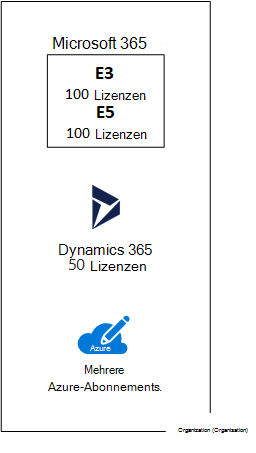

# Abonnements, Lizenzen, Konten und Mandanten für Microsoft-Cloud-Angebote

Microsoft stellt eine Hierarchie von Organisationen, Abonnements, Lizenzen und Benutzerkonten für die konsistente Verwendung von Identitäten und die Abrechnung über seine Cloudangebote hinweg bereit:
  
- Microsoft 365 und Microsoft Office 365
- Microsoft Azure
- Microsoft Dynamics 365

## Elemente der Hierarchie

Dies sind die Elemente der Hierarchie:
  
### Organization (Organisation)

Eine Organisation stellt eine Wirtschaftseinheit dar, die Microsoft-Cloudangebote verwendet und in der Regel von einem oder mehreren öffentlichen DNS-Domänennamen (Domain Name System) identifiziert wird, z. B. contoso.com. Die Organisation ist ein Container für Abonnements.
  
### Abonnements

Ein Abonnement ist eine Vereinbarung mit Microsoft zur Verwendung einer oder mehrerer Cloudplattformen oder -dienste, für die basierend auf einer Lizenzgebühr pro Benutzer oder einem cloudbasierten Ressourcenverbrauch Kosten anfallen. 

- Bei den SaaS-basierten (Software-as-a-Service) Cloudangeboten von Microsoft (Microsoft 365 und Dynamics 365) werden Lizenzgebühren pro Benutzer abgerechnet. 
- Bei den PaaS- und IaaS-Cloudangeboten (Platform-as-a-Service; Infrastructure-as-a-Service) von Microsoft (Azure) wird basierend auf dem Ressourcenverbrauch in der Cloud abgerechnet.
 
Sie können auch ein Testabonnement verwenden, das Abonnement läuft jedoch nach einem bestimmten Zeitraum oder einem bestimmten Betrag von Verbrauchsgebühren ab. Sie können ein Testabonnement in ein kostenpflichtiges Abonnement umwandeln.
  
Organisationen können mehrere Abonnements für die Cloudangebote von Microsoft haben. Abbildung 1 zeigt eine einzelne Organisation mit mehreren Microsoft 365-Abonnements, einem Dynamics 365-Abonnement und mehreren Azure-Abonnements.

**Abbildung 1: Beispiel für eine Organisation mit mehreren Abonnements**

  
### Lizenzen

Bei den SaaS-Cloudangeboten von Microsoft ermöglicht eine Lizenz einem bestimmten Benutzerkonto, die Dienste des Cloudangebots zu nutzen. Ihnen wird eine feste monatliche Gebühr als Teils Ihres Abonnements in Rechnung gestellt. Administratoren weisen Lizenzen einzelnen Benutzerkonten in dem Abonnement zu. Für das Beispiel in Abbildung 2 verfügt die Contoso Corporation über ein Microsoft 365 E5-Abonnement mit 100 Lizenzen, mit dem bis zu 100 einzelne Benutzerkonten die Features und Dienste von Microsoft 365 E5 nutzen können.
  
**Abbildung 2: Lizenzen innerhalb der SaaS-basierten Abonnements für eine Organisation**

>[!Note]
>Eine bewährte Methode für mehr Sicherheit ist die Verwendung von separaten Benutzerkonten, denen bestimmte Rollen für Verwaltungsfunktionen zugewiesen sind. Diesen dedizierten Administratorkonten muss keine Lizenz für die von ihnen verwalteten Clouddienste zugewiesen werden. Beispielsweise muss einem SharePoint-Dienstadministratorkonto keine Microsoft 365-Lizenz zugewiesen werden.
>

Bei PaaS-basierten Azure-Clouddiensten sind Softwarelizenzen in den Dienstpreis integriert.
  
Bei IaaS-basierten virtuellen Azure-Computern sind möglicherweise zusätzliche Lizenzen zur Nutzung der Software oder der Anwendung erforderlich, die auf einem virtuellen Computerabbild installiert ist. Einige virtuelle Computerabbilder weisen lizenzierte Versionen der installierten Software auf, und die Kosten sind in dem Minutenpreis für den Server enthalten. Beispiele hierfür sind die virtuellen Computerabbilder für SQL Server 2014 und SQL Server 2016. 
  
Einige virtuelle Computerabbilder verfügen über Testversionen von installierten Anwendungen benötigen zusätzliche Softwareanwendungslizenzen für die Verwendung über den Testzeitraum hinaus. Das virtuelle Computerabbild der Testversion von SharePoint Server 2016 enthält beispielsweise eine Testversion von SharePoint Server 2016 (vorinstalliert). Um SharePoint Server 2016 nach dem Ablaufdatum der Testversion weiter zu verwenden, müssen Sie eine Lizenz für SharePoint Server 2016 und Clientlizenzen von Microsoft erwerben. Diese Gebühren fallen unabhängig von dem Azure-Abonnement an, und der Minutenpreis für das Ausführen des virtuellen Computers tritt weiterhin zu.
  
### Benutzerkonten

Benutzerkonten für alle Microsoft-Cloudangebote werden in einem Azure AD-Mandanten (Azure AD) gespeichert, der Benutzerkonten und -gruppen enthält. Ein Azure AD-Mandant kann mit Ihren vorhandenen Active Directory Domain Services (AD DS)-Konten mithilfe von Azure AD Connect, einem Windows Server-basierten Dienst, synchronisiert werden. Dies wird als Verzeichnissynchronisierung bezeichnet.
  
Abbildung 3 zeigt ein Beispiel für mehrere Abonnements einer Organisation, die einen allgemeinen Azure AD-Mandanten verwendet, der die Konten der Organisation enthält.
  
**Abbildung 3: Mehrere Abonnements einer Organisation, die den gleichen Azure AD-Mandanten verwenden**

  
### Mandanten

Bei SaaS-Cloudangeboten ist der Mandant die regionale Stelle, an der sich die Server befinden, die Clouddienste bereitstellen. Die Contoso Corporation hat beispielsweise Europa als Region zum Hosten ihrer Microsoft 365-, EMS- und Dynamics 365-Mandanten für die 15.000 Mitarbeiter in der Pariser Zentrale festgelegt.
  
Azure PaaS-Dienste und in Azure IaaS gehostete VM-basierte Arbeitslasten können Mandanten in einem beliebigen Azure-Rechenzentrum auf der ganzen Welt haben. Sie geben das Azure-Rechenzentrum an, das als Standort bezeichnet wird, wenn Sie die Azure PaaS-App oder den Dienst bzw. das Element einer IaaS-IT-Arbeitslast erstellen.
  
Bei einem Azure AD-Mandanten handelt es sich um eine bestimmte Instanz von Azure AD, die Konten und Gruppen enthält. Kostenpflichtige oder Testabonnements von Microsoft 365 oder Dynamics 365 enthalten einen kostenlosen Azure AD-Mandanten. Dieser Azure AD-Mandant enthält keine anderen Azure-Dienste und ist nicht das gleiche wie ein Azure-Testabonnement oder ein kostenpflichtiges Azure-Abonnement.
  
### Zusammenfassung der Hierarchie

Es folgt eine kurze Wiederholung:
  
- Eine Organisation kann mehrere Abonnements haben.
    
  - Ein Abonnement kann mehrere Lizenzen haben.
    
  - Lizenzen können einzelnen Benutzerkonten zugewiesen werden.
    
  - Benutzerkonten werden in einem Azure AD-Mandanten gespeichert.
    
Im Folgenden finden Sie ein Beispiel für die Beziehung von Organisationen, Abonnements, Lizenzen und Benutzerkonten:
  
- Eine durch ihre öffentlichen Domänennamen identifizierte Organisation.
    
  - Ein Microsoft 365 E3-Abonnement mit Benutzerlizenzen.
    
    Ein Microsoft 365 E5-Abonnement mit Benutzerlizenzen.
    
    Ein Dynamics 365-Abonnement mit Benutzerlizenzen.
    
    Mehrere Azure-Abonnements.
    
  - Die Benutzerkonten der Organisation in einem gemeinsamen Azure AD-Mandanten.
    
Mehrere Abonnements für Cloudangebote von Microsoft können denselben Azure AD-Mandanten verwenden, der als gemeinsamer Identitätsanbieter fungiert. Ein zentraler Azure AD-Mandant, der die synchronisierten Konten Ihrer lokalen AD DS enthält, stellt eine cloudbasierte IDaaS (Identity-as-a-Service) für Ihre Organisation bereit. 
  
**Abbildung 4: Synchronisierte lokale Konten und IDaaS für eine Organisation**

  
In Abbildung 4 wird gezeigt, wie ein gemeinsamer Azure AD-Mandant von Microsoft-SaaS-Cloudangeboten, Azure PaaS-Apps und virtuellen Computern in Azure IaaS verwendet wird, die Azure AD-Domänendienste verwenden. Die lokale AD DS-Gesamtstruktur wird mithilfe von Azure AD Connect mit dem Azure AD-Mandanten synchronisiert.
  
## Kombinieren von Abonnements für mehrere Microsoft-Cloudangebote

Die folgende Tabelle beschreibt, wie Sie mehrere Microsoft-Cloudangebote basierend auf dem Vorhandensein eines Abonnement für einen Typ von Cloudangebot (die Bezeichnungen laufen in der ersten Spalte nach unten) und dem Hinzufügen eines Abonnements für ein anderes Cloudangebot (von links nach rechts) kombinieren können.
  
||**Microsoft 365**|**Azure**|**Dynamics 365**|
|:-----|:-----|:-----|:-----|:-----|
|**Microsoft 365**   |NA    |Sie fügen ein Azure-Abonnement zu Ihrer Organisation aus dem Azure-Portal hinzu.    |Sie fügen ein Dynamics 365-Abonnement zu Ihrer Organisation aus dem Microsoft 365 Admin Center hinzu.    |
|**Azure**   |Sie fügen ein Microsoft 365-Abonnement zu Ihrer Organisation hinzu.    |NA    |Sie fügen ein Dynamics 365-Abonnement zu Ihrer Organisation hinzu.    |
|**Dynamics 365**   |Sie fügen ein Microsoft 365-Abonnement zu Ihrer Organisation hinzu.    |Sie fügen ein Azure-Abonnement zu Ihrer Organisation aus dem Azure-Portal hinzu.    |NA    |
   
Eine einfache Möglichkeit zum Hinzufügen von Abonnements zu Ihrer Organisation für Microsoft SaaS-basierte Dienste erfolgt über das Admin Center:
  
1. Melden Sie sich mit Ihrem globalen Administratorkonto beim Microsoft 365 Admin Center ([https://admin.microsoft.com](https://admin.microsoft.com)) an.
    
2. Klicken Sie im linken Navigationsbereich der **Admin Center**-Startseite auf **Abrechnung** und dann auf **Dienste kaufen**.
    
3. Erwerben Sie auf der Seite **Dienste kaufen** Ihre neuen Abonnements.
    
Das Admin Center ordnet die Organisation und den Azure AD-Mandanten Ihres Microsoft 365-Abonnements den neuen Abonnements für SaaS-basierte Cloudangebote zu.
  
So fügen Sie ein Azure-Abonnement mit derselben Organisation und demselben Azure AD-Mandanten wie das Microsoft 365-Abonnement hinzu:
  
1. Melden Sie sich mit Ihrem globalen Microsoft 365-Administratorkonto beim Azure-Portal ([https://portal.azure.com](https://portal.azure.com)) an.
    
2. Klicken Sie im linken Navigationsbereich auf **Abonnements** und dann auf **Hinzufügen**.
    
3. Wählen Sie auf der Seite **Abonnement hinzufügen** ein Angebot aus, und schließen Sie die Bezahlung und die Vereinbarung ab.
    
Wenn Sie die Abonnements für Azure und Microsoft 365 einzeln erworben haben und den Microsoft 365 Azure AD-Mandanten von Ihrem Azure-Abonnement aus aufrufen möchten, finden Sie entsprechende Anweisungen unter [Hinzufügen eines vorhandenen Azure-Abonnements zu Ihrem Azure Active Directory-Mandanten](/azure/active-directory/fundamentals/active-directory-how-subscriptions-associated-directory).
 
## Siehe auch

[Illustrationen zu Microsoft Cloud für Enterprise-Architekten](../solutions/cloud-architecture-models.md)
  
[Architekturmodelle für SharePoint, Exchange, Skype for Business und Lync](architectural-models-for-sharepoint-exchange-skype-for-business-and-lync.md)
  
[Hybridlösungen](hybrid-solutions.md)

## Nächster Schritt

[Bewerten der Microsoft 365-Netzwerkkonnektivität](assessing-network-connectivity.md)
