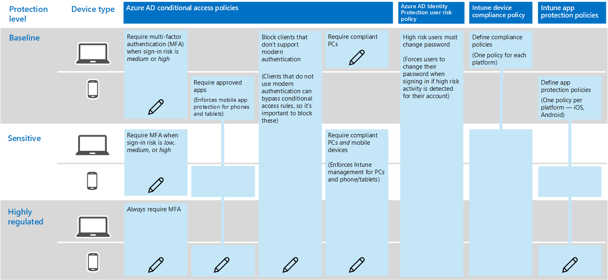

# Richtlinien Empfehlungen für das Sichern von teamchats,-Gruppen und-Dateien

In diesem Artikel wird beschrieben, wie Sie die empfohlenen Identitäts-und Gerätezugriffs Richtlinien implementieren, um Microsoft Teams-Chats, Gruppen und Inhalte wie Dateien und Kalender zu schützen. Dieser Leitfaden basiert auf den [allgemeinen Richtlinien für Identitäts-und Geräte Zugriff](identity-access-policies.md)mit zusätzlichen Informationen, die für Teams spezifisch sind. Da Teams in unsere anderen Produkte integriert werden, finden Sie weitere Informationen unter [Richtlinien Empfehlungen zum Sichern von SharePoint-Websites und-Dateien](sharepoint-file-access-policies.md) und [Richtlinien Empfehlungen zum Sichern von e-Mails](secure-email-recommended-policies.md).

Diese Empfehlungen basieren auf drei verschiedenen Ebenen der Sicherheit und des Schutzes für Teams, die basierend auf der Granularität Ihrer Anforderungen angewendet werden können: Baseline, sensibel und stark reguliert. Weitere Informationen zu diesen Sicherheitsebenen und zu den empfohlenen Clientbetriebssystemen, auf die diese Empfehlungen verweisen, finden Sie in den [Konfigurationen für Identitäts-und Geräte Zugriff](microsoft-365-policies-configurations.md).

In diesem Artikel werden zusätzliche spezifische Empfehlungen für die Bereitstellung von Teams aufgeführt, um bestimmte Authentifizierungs Bedingungen, einschließlich für Benutzer außerhalb Ihrer Organisation, zu behandeln, und Sie müssen diesen Leitfaden für eine vollständige Sicherheitserfahrung befolgen.

## Erste Schritte mit Microsoft Teams vor anderen abhängigen Diensten

Sie müssen abhängige Dienste nicht für den Einstieg in Microsoft Teams aktivieren. Diese werden alle ' einfach funktionieren '. Sie müssen jedoch bereit sein, Folgendes zu verwalten:

- Office 365-Gruppen
- SharePoint-Teamwebsites
- OneDrive for Business
- Postfächer
- Stream Videos and Planner Plans (wenn diese Dienste aktiviert sind)

## Aktualisieren allgemeiner Richtlinien für die Einbeziehung von Teams

Das folgende Diagramm veranschaulicht die empfohlenen Richtlinien für den Schutz von Chat, Gruppen und Inhalten in Microsoft Teams. Das Bleistiftsymbol gibt an, welche Richtlinien erneut besucht werden müssen, um sicherzustellen, dass Teams und abhängige Dienste in der Zuweisung von Cloud-Apps enthalten sind.

Hierbei handelt es sich um die abhängigen Dienste, die in die Zuweisung von Cloud-Apps für Teams einbezogen werden sollen:

- Microsoft Teams
- SharePoint Online und OneDrive for Business
- Exchange Online
- Skype for Business Online
- Microsoft-Datenstrom (Besprechungsaufzeichnungen)
- Microsoft Planner (planerische Aufgaben und Plandaten)

In der folgenden Tabelle sind die Richtlinien aufgeführt, die erneut besucht werden müssen, sowie Links zu den einzelnen Richtlinien in [allgemeinen Identitäts-und Gerätezugriffs Richtlinien](identity-access-policies.md), die eine breitere Regelsatz für alle Office-Anwendungen aufweisen.

|Schutzebene|Richtlinien|Weitere Informationen für die Implementierung von Teams|
|:---------------|:-------|:----------------|
|**Basisplan**|[MFA erforderlich, wenn das Anmelde Risiko *Mittel* groß oder *hoch* ist](identity-access-policies.md#require-mfa-based-on-sign-in-risk)|Stellen Sie sicher, dass Microsoft Teams und abhängige Dienste in der Liste der Apps enthalten sind. Microsoft Teams verfügt über Gastzugriff und Regeln für den externen Zugriff, die Sie später in diesem Artikel erfahren sollten.|
|        |[Sperrt Clients, die moderne Authentifizierung nicht unterstützen](identity-access-policies.md#block-clients-that-dont-support-modern-authentication)|Einbeziehen von Teams und abhängigen Diensten in die Zuweisung von Cloud-apps.|
|        |[Benutzer mit hohem Risiko müssen das Kennwort ändern](identity-access-policies.md#high-risk-users-must-change-password)|Zwingt Teams-Benutzer, Ihr Kennwort zu ändern, wenn Sie sich anmelden, wenn hochriskante Aktivitäten für Ihr Konto erkannt werden. Stellen Sie sicher, dass Microsoft Teams und abhängige Dienste in der Liste der Apps enthalten sind.|
|        |[Definieren von App-Schutzrichtlinien](identity-access-policies.md#define-app-protection-policies)|Stellen Sie sicher, dass Microsoft Teams und abhängige Dienste in der Liste der Apps enthalten sind. Aktualisieren Sie die Richtlinie für jede Plattform (Ios, Android, Windows).|
|        |[Genehmigte apps erfordern](identity-access-policies.md#require-approved-apps)|Schließen Sie Teams und abhängige Dienste in diese Richtlinie ein.|
|        |[Definieren von Geräte Konformitätsrichtlinien](identity-access-policies.md#define-device-compliance-policies)|Schließen Sie Teams und abhängige Dienste in diese Richtlinie ein.|
|        |[Kompatible PCs erforderlich](identity-access-policies.md#require-compliant-pcs-but-not-compliant-phones-and-tablets)|Schließen Sie Teams und abhängige Dienste in diese Richtlinie ein.|
|**Vertraulich**|[MFA erforderlich, wenn das Anmelde Risiko *niedrig*, *Mittel* oder *hoch* ist](identity-access-policies.md#require-mfa-based-on-sign-in-risk)|Microsoft Teams verfügt über Gastzugriff und Regeln für den externen Zugriff, die Sie später in diesem Artikel erfahren sollten. Schließen Sie Teams und abhängige Dienste in diese Richtlinie ein.|
|         |[Erfordern von kompatiblen PCs *und* mobilen Geräten](identity-access-policies.md#require-compliant-pcs-and-mobile-devices)|Schließen Sie Teams und abhängige Dienste in diese Richtlinie ein.|
|**Streng geregelt**|[*Immer* MFA erforderlich](identity-access-policies.md#require-mfa-based-on-sign-in-risk)|Unabhängig von der Benutzeridentität wird MFA von Ihrer Organisation verwendet. Schließen Sie Teams und abhängige Dienste in diese Richtlinie ein.
| | |

## Architektur der Teams-abhängigen Dienste

Als Referenz zeigt das folgende Diagramm die Dienste, auf denen Teams basiert. Weitere Informationen und weitere Illustrationen finden Sie unter [Microsoft Teams und verwandte Produktivitätsdienste in Microsoft 365 für IT-Architekten](https://docs.microsoft.com/en-us/office365/enterprise/microsoft-cloud-it-architecture-resources#microsoft-teams-and-related-productivity-services-in-microsoft-365-for-it-architects).

## Aktivieren von Gast-und externem Zugriff für Teams

In Azure AD sind Gast-und externe Benutzer identisch. Der Benutzertyp für diese beiden Typen ist Gast. Gastbenutzer sind B2B-Benutzer. Microsoft Teams unterscheidet zwischen Gastbenutzern und externen Benutzern in der app. Zwar ist es wichtig zu verstehen, wie diese in Microsoft Teams behandelt werden, aber beide Benutzertypen sind in Azure AD B2B-Benutzer, und die empfohlenen Richtlinien für B2B-Benutzer gelten für beide.

### Gastzugriff in Microsoft Teams

Zusätzlich zu den Richtlinien für Benutzer, die sich innerhalb Ihres Unternehmens oder Ihrer Organisation befinden, können Administratoren den Gastzugriff aktivieren, um Personen, die sich außerhalb Ihres Unternehmens oder Ihrer Organisation befinden, für den Zugriff auf Microsoft Teams-Ressourcen zu ermöglichen und mit zu interagieren. interne Personen für Dinge wie Gruppenunterhaltungen, Chats und Besprechungen. Weitere Informationen zum Gastzugriff finden Sie unter folgendem Link: [Teams Gastzugriff](https://docs.microsoft.com/en-us/microsoftteams/guest-access)

### Externer Zugriff in Microsoft Teams

Der externe Zugriff ist manchmal mit Gastzugriff verwechselt, daher ist es wichtig zu beachten, dass diese beiden nicht internen Zugriffsmechanismen tatsächlich ganz unterschiedlich sind. Während Gastzugriff auf Benutzerebene erfolgt (Sie fügen jeweils jeweils einen Benutzer hinzu), ermöglicht ein Administrator den externen Zugriff, sodass Sie alle Benutzer einer externen Domäne gleichzeitig zu Microsoft Teams hinzufügen können. Diese externen Benutzer haben jedoch weniger Zugriff und Funktionalität als eine Person, die über Gastzugriff hinzugefügt wurde. Externe Benutzer können über Microsoft Teams mit ihren internen Benutzern chatten.

Weitere Informationen zum externen Zugriff und dazu, wie Sie ihn bei Bedarf implementieren können, finden Sie unter [Manage External Access in Microsoft Teams](https://docs.microsoft.com/en-us/microsoftteams/manage-external-access) .

## Teams-Richtlinien

Außerhalb der oben aufgeführten allgemeinen Richtlinien gibt es Teams-spezifische Richtlinien, die für die Verwaltung verschiedener Teams-Funktionen konfiguriert werden können und sollten.

### Richtlinien für Teams und Kanäle

Teams und Kanäle sind zwei häufig verwendete Elemente in Microsoft Teams, und es gibt Richtlinien, die Sie einführen können, um zu steuern, was Benutzer bei der Verwendung von Teams und Kanälen tun können und was nicht. Sie können zwar ein globales Team erstellen, aber wenn Ihre Organisation 5000 oder weniger Benutzer hat, ist es wahrscheinlich hilfreich, kleinere Teams und Kanäle für bestimmte Zwecke im Einklang mit Ihren organisatorischen Anforderungen zu haben.

Es empfiehlt sich, die Standardrichtlinie zu ändern oder benutzerdefinierte Richtlinien zu erstellen, und weitere Informationen zum Verwalten von Richtlinien finden Sie unter diesem Link: [Verwalten von Teams-Richtlinien in Microsoft Teams](https://docs.microsoft.com/en-us/microsoftteams/teams-policies).

### Messaging Richtlinien

Messaging oder Chat können auch über die standardmäßige globale Richtlinie oder durch benutzerdefinierte Richtlinien verwaltet werden, was dazu beitragen kann, dass Ihre Benutzer miteinander auf eine Weise kommunizieren, die für Ihre Organisation geeignet ist. Diese Informationen können unter [Managing Messaging Policies in Teams](https://docs.microsoft.com/en-us/microsoftteams/messaging-policies-in-teams)überprüft werden.

### Besprechungsrichtlinien

Keine Besprechung von Teams wäre ohne Planung und Implementierung von Richtlinien in Teams-Besprechungen abgeschlossen. Besprechungen stellen eine wesentliche Komponente von Teams dar und ermöglichen es den Benutzern, viele Benutzer gleichzeitig formell zu treffen und vorzustellen, sowie Inhalte für die Besprechung freizugeben. Das Festlegen der richtigen Richtlinien für Ihre Organisation in Besprechungen ist unerlässlich.

Weitere Informationen finden Sie [unter Manage Meeting Policies in Teams](https://docs.microsoft.com/en-us/microsoftteams/meeting-policies-in-teams) .

### Richtlinien für App-Berechtigungen

Mit Microsoft Teams können Sie auch apps an verschiedenen Orten wie Kanälen oder persönlichen Chats verwenden. Wenn Sie Richtlinien dazu haben, welche apps hinzugefügt und verwendet werden können, und wo dies erforderlich ist, ist dies für die Verwaltung einer inhaltsreichen Umgebung unerlässlich, die auch sicher ist.

Weitere Informationen zu app-Berechtigungsrichtlinien finden Sie [unter Verwalten von App-Berechtigungsrichtlinien in Microsoft Teams](https://docs.microsoft.com/en-us/microsoftteams/teams-app-permission-policies).
