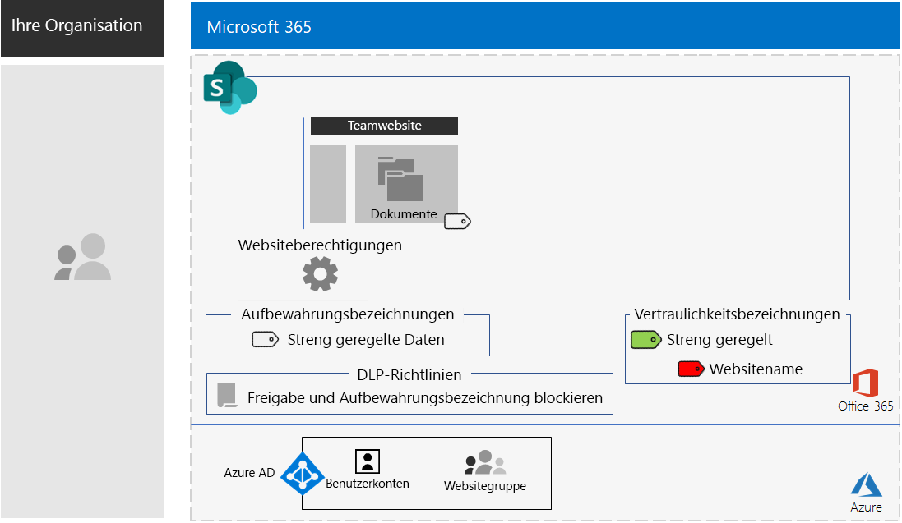
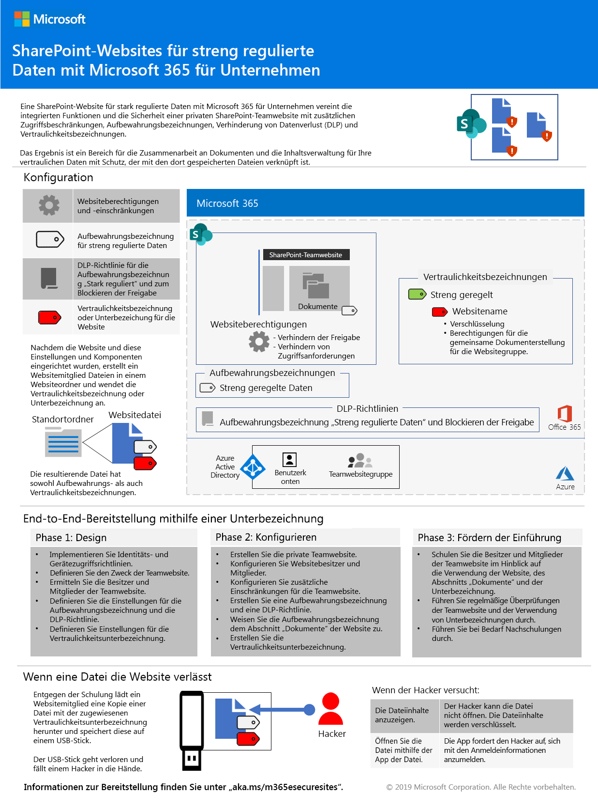
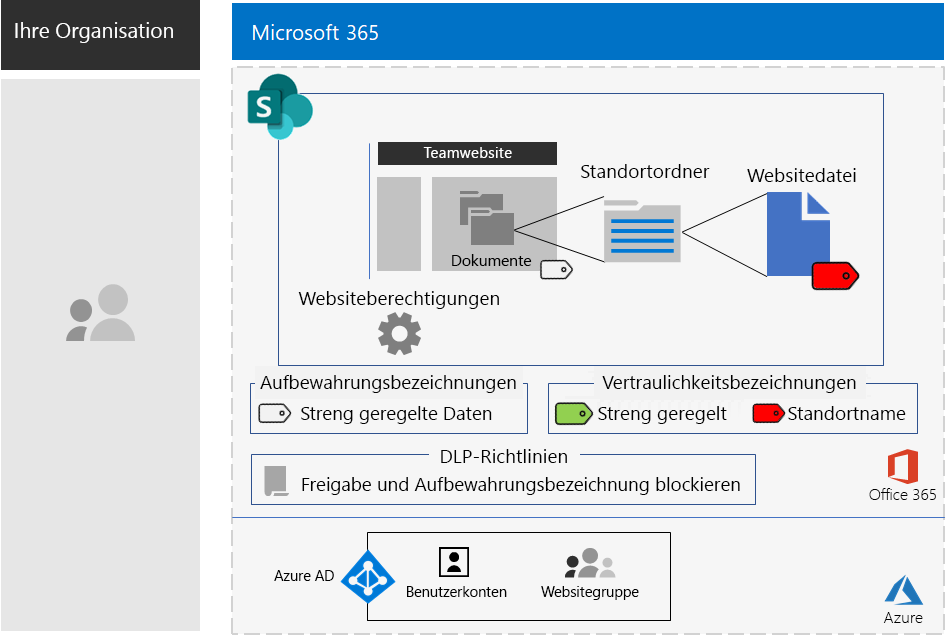

# SharePoint-Websites für streng regulierte Daten

*Dieses Szenario gilt für die Versionen E3 und E5 von Microsoft 365 Enterprise.*

Microsoft 365 Enterprise umfasst eine vollständige Suite cloudbasierter Dienste, damit Sie streng regulierte Daten in Dateien erstellen, speichern, schützen und verwalten können. Dazu gehören folgende Daten:

- Daten, die regionalen Vorschriften unterliegen.
- Die wertvollsten Daten für Ihre Organisation, z. B. Geschäftsgeheimnisse, Informationen zu Finanzen oder Personalwesen und die Organisationsstrategie.

>[!Note]
> Ein ähnliches Szenario mit Microsoft Teams finden Sie [hier](secure-teams-highly-regulated-data-scenario.md).
>

Für ein cloudbasiertes Microsoft 365 Enterprise-Szenario, das diese Geschäftsanforderung erfüllt, müssen Sie:

- Dateien (Dokumente, Folienstapel, Kalkulationstabellen usw.) in einer SharePoint-Teamwebsite speichern.
- Die Website sperren, um Folgendes zu verhindern:
  - Zugriff für Benutzer, die nicht Mitglied der Office 365-Gruppe für die Website sind.
  - Dass Mitglieder der Website anderen Personen Zugriff gewähren.
  - Dass Nicht-Mitglieder der Website Zugriff auf die Website anfordern.
- Konfigurieren Sie eine Office 365-Aufbewahrungsbezeichnung für Ihre SharePoint-Websites als Standardmethode, um Benutzer am Senden von Dateien an Ziele außerhalb der Organisation hindern.
- Verschlüsseln Sie die besonders sensiblen Dateien der Website mit einer an die Dateien gebundenen Verschlüsselung.
- Fügen Sie den besonders sensiblen Dateien Berechtigungen hinzu, sodass zum Öffnen der Datei auch dann gültige Anmeldeinformationen eines Benutzerkontos mit Berechtigung erforderlich sind, wenn diese für Personen außerhalb der Website freigegeben werden.

In der folgenden Tabelle sind die Anforderungen dieses Szenarios einem Feature von Microsoft 365 Enterprise zugeordnet.

|||
|:-------|:-----|
| **Anforderung** | **Microsoft 365 Enterprise-Feature** |
| Speichern von Dateien | SharePoint-Teamwebsites |
| Sperren der Website | Office 365-Gruppen und SharePoint-Teamwebsiteberechtigungen |
| Zuordnen von Bezeichnungen zu den Dateien der Website | Office 365-Aufbewahrungsbezeichnungen |
| Verhindern, dass Benutzer Dateien außerhalb der Organisation senden | Richtlinien zur Verhinderung von Datenverlust in Office 365 |
| Verschlüsseln aller Dateien der Website | Office 365-Vertraulichkeitsbezeichnungen oder -unterbezeichnungen |
| Hinzufügen von Berechtigungen zu den Dateien der Website | Office 365-Vertraulichkeitsbezeichnungen oder -unterbezeichnungen |
|||

Hier sehen Sie eine Beispielkonfiguration für eine sichere SharePoint-Website.

Dieses Szenario erfordert, dass Sie Folgendes bereits bereitgestellt haben:

- Die Phase [Identität](identity-infrastructure.md) und die Schritte 1 und 2 der Phase [Informationsschutz](infoprotect-infrastructure.md) der Foundation-Infrastruktur. 
- [SharePoint](sharepoint-online-onedrive-workload.md).

Die folgenden Phasen führen Sie schrittweise durch den Entwurf, die Konfiguration und das Fördern der Einführung für SharePoint-Websites für streng regulierte Daten.

 Eine einseitige Zusammenfassung dieses Szenarios finden Sie auf dem [Poster für SharePoint-Websites für streng regulierte Daten](../media/teams-sharepoint-online-sites-highly-regulated-data/SharePointSitesHighlyRegulatedData.pdf).

Sie können dieses Poster auch im [PDF](https://github.com/MicrosoftDocs/microsoft-365-docs/raw/public/microsoft-365/enterprise/media/teams-sharepoint-online-sites-highly-regulated-data/SharePointSitesHighlyRegulatedData.pdf)- oder [PowerPoint](https://github.com/MicrosoftDocs/microsoft-365-docs/raw/public/microsoft-365/enterprise/media/teams-sharepoint-online-sites-highly-regulated-data/SharePoint-Sites-Highly-Regulated-Data.pptx)-Format herunterladen und in den Formaten "Brief", "Legal" oder "Tabloid" (27,94 x 43,18 cm) ausdrucken.

## Voraussetzungen für den Identitäts- und Gerätezugriff

Um den Zugriff auf die SharePoint-Website zu schützen, stellen Sie sicher, dass Sie [Identitäts- und Gerätezugriffsrichtlinien](identity-access-policies.md) und die [empfohlenen SharePoint-Zugriffsrichtlinien](sharepoint-file-access-policies.md) konfiguriert haben.

## Phase 1: Entwurf

Wenn Sie eine SharePoint-Website für stark regulierte Daten erstellen möchten, müssen Sie zuerst deren Zweck bestimmen. So benötigt die Abteilung "Forschung und Entwicklung" eines Fertigungsunternehmens beispielsweise eine SharePoint-Website zum Speichern der aktuellen Designspezifikationen für bestehende Produkte und einen Ort für die Zusammenarbeit an neuen Produkten. Nur Mitglieder der Abteilung "Forschung und Entwicklung" und ausgewählte Führungskräfte dürfen auf die Website zugreifen.

Dieser Zweck unterstützt die Ermittlung wichtiger Konfigurationselemente, z. B.:

- Die Office 365-Aufbewahrungsbezeichnung, die dem Dokumententeil der Website zugewiesen werden soll, und DLP-Richtlinien für die Bezeichnung
- Die Einstellungen einer Office 365-Vertraulichkeitsunterbezeichnung, die Benutzer auf streng vertrauliche Dateien anwenden, die auf der Website gespeichert sind

Nach der Ermittlung werden diese Einstellungen zur Konfiguration der Website in Phase 2 verwendet. 

### Schritt 1: Office 365-Aufbewahrungsbezeichnungen und DLP-Richtlinien

Wenn Office 365-Aufbewahrungsbezeichnungen auf den Dokumententeil einer SharePoint-Teamwebsite angewendet werden, bieten diese eine Standardmethode zum Klassifizieren aller Dateien, die auf der Website gespeichert sind.
 
Für SharePoint-Websites für streng regulierte Daten müssen Sie ermitteln, welche Office 365-Aufbewahrungsbezeichnung verwendet werden soll.

Die Entwurfsaspekte für Office 365-Bezeichnungen finden Sie unter [Office 365-Klassifizierung und -Bezeichnungen](https://docs.microsoft.com/office365/securitycompliance/secure-sharepoint-online-sites-and-files#office-365-retention-labels).

Um vertrauliche Informationen zu schützen und ihre versehentliche oder absichtliche Veröffentlichung zu verhindern, verwenden Sie die DLP-Richtlinien. Weitere Informationen finden Sie in dieser [Übersicht](https://docs.microsoft.com/office365/securitycompliance/data-loss-prevention-policies).

Für SharePoint-Websites müssen Sie eine DLP-Richtlinie für die Office 365-Aufbewahrungsbezeichnung konfigurieren, die der Website zugewiesen ist, um zu verhindern, dass Benutzer Dateien für externe Benutzer freigeben. 

### Schritt 2: Ihre Office 365-Vertraulichkeitsunterbezeichnung

Um für Ihre besonders sensiblen Dateien Verschlüsselung und eine Reihe von Berechtigungen bereitzustellen, müssen Benutzer eine Office 365-Vertraulichkeitsbezeichnung oder -unterbezeichnung anwenden. Eine Unterbezeichnung ist einer vorhandenen Bezeichnung untergeordnet. 

Verwenden Sie eine Vertraulichkeitsbezeichnung, wenn Sie nur eine kleine Anzahl von Bezeichnungen für die globale Nutzung und für einzelne private Teams benötigen. Verwenden Sie eine Vertraulichkeitsunterbezeichnung, wenn Sie über eine große Anzahl von Bezeichnungen verfügen oder Bezeichnungen für sichere Websites unter ihrer streng regulierten Bezeichnung organisieren möchten. 

Die Einstellungen der angewendeten Bezeichnung oder Unterbezeichnung sind an die Datei gebunden. Auch wenn eine Datei die Website verlässt, kann sie nur von authentifizierten Benutzerkonten mit entsprechenden Berechtigungen geöffnet werden.

### Entwurfsergebnisse

Sie haben Folgendes bestimmt:

- Die entsprechende Office 365 Aufbewahrungsbezeichnung und die DLP-Richtlinie, die dieser Bezeichnung zugeordnet ist
- Die Einstellungen der Office 365-Unterbezeichnung, die Verschlüsselung und Berechtigungen umfassen

## Phase 2: Konfigurieren

In dieser Phase implementieren Sie die in Phase 1 ermittelten Einstellungen, um eine SharePoint-Website für streng regulierte Daten zu erstellen.

### Schritt 1: Erstellen einer privaten SharePoint-Teamwebsite mit Besitzern und Mitgliedern der entsprechenden Office 365-Gruppe

Folgen Sie [diesen Anweisungen]( https://support.office.com/article/create-a-site-in-sharepoint-online-4d1e11bf-8ddc-499d-b889-2b48d10b1ce8), um eine private SharePoint-Teamwebsite zu erstellen.

### Schritt 2: Konfigurieren zusätzlicher Berechtigungseinstellungen für die SharePoint-Teamwebsite

Konfigurieren Sie diese Berechtigungseinstellungen auf der SharePoint-Website.

1. Klicken Sie in der Symbolleiste auf das Symbol "Einstellungen" und anschließend auf **Websiteberechtigungen**.
2. Klicken Sie im Bereich **Websiteberechtigungen** unter **Freigabeeinstellungen** auf **Freigabeeinstellungen ändern**.
3. Wählen Sie unter **Freigabeberechtigungen** die Option **Nur Websitebesitzer können Dateien, Ordner und die Website teilen** aus.
4. Deaktivieren Sie **Zugriffsanforderungen zulassen**, und klicken Sie dann auf **Speichern**.

Bei diesen Einstellungen ist die Möglichkeit, dass Websitegruppenmitglieder die Website mit anderen Mitgliedern oder Nichtmitgliedern teilen, um den Zugriff auf die Website anzufordern, deaktiviert.

### Schritt 3: Konfigurieren der Website für eine Office 365-Aufbewahrungsbezeichnung

Verwenden Sie die Anweisungen unter [Schützen von SharePoint-Dateien mit Office 365-Bezeichnungen und Verhindern von Datenverlust](https://docs.microsoft.com/office365/enterprise/protect-sharepoint-online-files-with-office-365-labels-and-dlp), um Folgendes zu tun:

1. Erstellen und Veröffentlichen einer Aufbewahrungsbezeichnung für stark regulierte Daten (sofern erforderlich).
2. Konfigurieren der Website für die in Schritt 1 erstellte Aufbewahrungsbezeichnung.
3. Erstellen einer DLP-Richtlinie für stark regulierte Daten, die die in Schritt 2 erstellte Aufbewahrungsbezeichnung verwendet und Benutzer am Senden von Dateien an Ziele außerhalb der Organisation hindert

#### Schritt 4: Erstellen einer Office 365-Vertraulichkeitsunterbezeichnung für die Website

Im Gegensatz zu einer Vertraulichkeitsbezeichnung für streng regulierte Daten, die von jedem auf eine beliebige Datei angewendet werden kann, benötigt eine sichere Website eine eigene Unterbezeichnung, damit für Dateien, denen diese Unterbezeichnung zugeordnet ist, Folgendes gilt:

- Die Dateien werden verschlüsselt, und die Verschlüsselung ist an die Dateien gebunden.
- Die Dateien enthalten benutzerdefinierte Berechtigungen, sodass sie nur von Mitgliedern der Websitegruppe geöffnet werden können.

Um diese zusätzliche Sicherheitsstufe für die auf der Website gespeicherten Dateien zu erreichen, müssen Sie eine neue Vertraulichkeitsbezeichnung oder Unterbezeichnung der allgemeinen Bezeichnung für stark regulierte Dateien konfigurieren. Diese wird nur Gruppenmitgliedern der Website in der Liste der Unterbezeichnungen für die Bezeichnung "Hochgradig reguliert" angezeigt.

Verwenden Sie die [hier](https://docs.microsoft.com/microsoft-365/compliance/encryption-sensitivity-labels) aufgeführten Anweisungen, um eine Bezeichnung oder Unterbezeichnung der verwendeten Bezeichnung für stark regulierte Dateien mit den folgenden Einstellungen zu konfigurieren:

- Zur einfachen Zuordnung der Bezeichnung oder Unterbezeichnung zu einer Datei enthält der Name der Bezeichnung oder Unterbezeichnung den Namen der Website.
- Die Verschlüsselung ist aktiviert.
- Die Websitegruppe verfügt über Berechtigungen für die gemeinsame Dokumenterstellung.

### Konfigurationsergebnisse

Sie haben Folgendes konfiguriert:

- Restriktivere Berechtigungseinstellungen auf der SharePoint-Website
- Eine Office 365-Aufbewahrungsbezeichnung, die dem Dokumententeil der SharePoint-Website zugewiesen ist
- Eine DLP-Richtlinie für die Office 365-Aufbewahrungsbezeichnung
- Eine Office 365-Vertraulichkeitsbezeichnung oder -unterbezeichnung, die Benutzer auf die auf der Website gespeicherten besonders sensiblen Dateien anwenden können. Die Vertraulichkeitsbezeichnung oder -unterbezeichnung verschlüsselt die Datei und erlaubt nur Mitgliedern der Teamwebsitegruppe den Zugriff für die gemeinsame Dokumenterstellung 

Hier ist die resultierende Konfiguration, die eine Unterbezeichnung der Vertraulichkeitsbezeichnung verwendet.

In diesem Beispiel hat ein Benutzer die Unterbezeichnung auf eine auf der Website gespeicherte Datei angewendet.

## Phase 3: Fördern der Benutzerakzeptanz

Eine SharePoint-Website für stark regulierte Daten kann diese Daten nur schützen, wenn Sie konsequent für die Speicherung und den Zugriff auf vertrauliche Dateien verwendet wird. Dies ist die schwierigste Phase, da sie davon abhängt, dass Benutzer ihre Gewohnheiten und Einstellungen ändern. 

Beispielsweise müssen Angestellte, die vertrauliche Dateien bisher auf USB-Laufwerken oder auf persönlichen cloudbasierten Speicherlösungen gespeichert hatten, diese nun ausschließlich in einer SharePoint-Website für streng regulierte Daten speichern.

### Schritt 1: Schulen der Benutzer

Schulen Sie nach Abschluss der Konfiguration die Gruppe von Benutzern, die Mitglied der Website sind:

- Vermitteln Sie ihnen, wie wichtig es ist, die neue Website zu verwenden, um wertvolle Dateien zu schützen, und welche Auswirkungen ein Verlust streng regulierter Daten hat, z. B. rechtliche Konsequenzen, Bußgelder oder Verlust des Wettbewerbsvorteils.
- Erläutern Sie, wie auf die Website und ihre Dateien zugegriffen wird.
- Erklären Sie, wie neue Dateien auf der Website erstellt und neue, lokal gespeicherte Dateien hochgeladen werden.
- Veranschaulichen Sie, wie durch die DLP-Richtlinie verhindert wird, dass Dateien extern freigegeben werden.
- Erklären Sie, wie die besonders sensiblen Dateien mit der Bezeichnung oder Unterbezeichnung für die Website gekennzeichnet werden.
- Veranschaulichen Sie, wie die Bezeichnung oder Unterbezeichnung eine Datei schützt, auch wenn die Website verlässt.

Diese Schulung sollte praktische Übungen umfassen, damit die Benutzer diese Vorgänge und deren Ergebnisse ausprobieren können.

### Schritt 2: Durchführen regelmäßiger Verwendungs- und Dateiprüfungen

In den Wochen nach der Schulung kann der SharePoint-Administrator für die SharePoint-Website Folgendes tun:

- Die Verwendung für die Website analysieren und dies mit den Erwartungen vergleichen.
- Sicherstellen, dass streng vertrauliche Dateien korrekt mit der Vertraulichkeitsbezeichnung oder -unterbezeichnung gekennzeichnet wurden.

  Sie können sehen, welchen Dateien eine Bezeichnung zugeordnet ist, indem Sie einen Ordner in SharePoint anzeigen und über die Option **Spalten ein-/ausblenden** > **Spalte hinzufügen** die Spalte **Vertraulichkeit** hinzufügen.

Ihre Benutzer bei Bedarf erneut schulen.

### Ergebnisse der Benutzerakzeptanz

Stark regulierte Dateien werden ausschließlich auf SharePoint-Websites für stark regulierte Daten gespeichert, und die besonders sensiblen Dateien weisen die Vertraulichkeitsbezeichnung oder -unterbezeichnung für die Website auf.

## Verwendung einer SharePoint-Website für stark regulierte Daten in der Contoso Corporation

Die Contoso Corporation ist ein fiktiver, aber repräsentativer globaler Mischkonzern. Erfahren Sie, wie Contoso die Einführung einer [sicheren SharePoint-Website](contoso-sharepoint-online-site-for-highly-confidential-assets.md) für seine Forschungsteams in Paris, Moskau, New York, Peking (Beijing) und Bengaluru (Bangalore) konzipiert, konfiguriert und dann vorangetrieben hat. 

## Siehe auch

[Teams für streng regulierte Daten](secure-teams-highly-regulated-data-scenario.md)

[Microsoft 365 Enterprise-Arbeitslasten und -Szenarien](deploy-workloads.md)

[Microsoft 365-Produktivitätsbibliothek](https://aka.ms/productivitylibrary) (https://aka.ms/productivitylibrary)

[Bereitstellungshandbuch](deploy-microsoft-365-enterprise.md)
