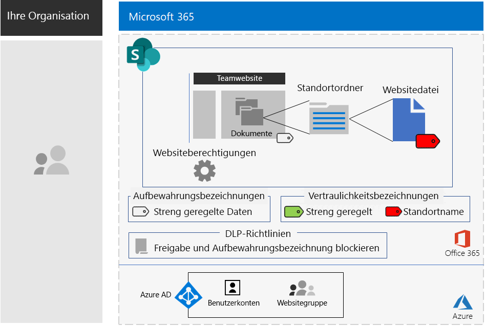

# SharePoint-Websites für streng regulierte DatenSharePoint sites for highly regulated data

*Dieses Szenario gilt für die Versionen E3 und E5 von Microsoft 365 Enterprise.**This scenario applies to both the E3 and E5 versions of Microsoft 365 Enterprise*

Microsoft 365 Enterprise umfasst eine vollständige Suite cloudbasierter Dienste, damit Sie streng regulierte Daten in Dateien erstellen, speichern, schützen und verwalten können. Dazu gehören folgende Daten:Microsoft 365 Enterprise includes a full suite of cloud-based services so that you can create, store, and secure your highly regulated data stored in files. This includes data that is:

- Daten, die regionalen Vorschriften unterliegen.Subject to regional regulations.
- Die wertvollsten Daten für Ihre Organisation, z. B. Geschäftsgeheimnisse, Informationen zu Finanzen oder Personalwesen und die Organisationsstrategie.The most valuable data for your organization, such as trade secrets, financial or human resources information, and organization strategy.

>[!Note]
> Ein ähnliches Szenario mit Microsoft Teams ist in der Entwicklung.A similar scenario using Microsoft Teams is in development.
>

Für ein cloudbasiertes Microsoft 365 Enterprise-Szenario, das diese Geschäftsanforderung erfüllt, müssen Sie:A Microsoft 365 Enterprise cloud-based scenario that meets this business need requires that you:

- Dateien (Dokumente, Folienstapel, Kalkulationstabellen usw.) in einer SharePoint-Teamwebsite speichern.Store files (documents, slide decks, spreadsheets, etc.) in a SharePoint team site.
- Die Website sperren, um Folgendes zu verhindern:Lock down the site to prevent:
  - Zugriff für Benutzer, die nicht Mitglied der Office 365-Gruppe für die Website sind.Access to users who are not members of the Office 365 group for the site.
  - Dass Mitglieder der Website anderen Personen Zugriff gewähren.Members of the site from granting access to others.
  - Dass Nicht-Mitglieder der Website Zugriff auf die Website anfordern.Non-members of the site from requesting access to the site.
- Konfigurieren Sie eine Office 365-Aufbewahrungsbezeichnung für Ihre SharePoint-Websites als Standardmethode, um Benutzer am Senden von Dateien an Ziele außerhalb der Organisation hindern.Configure an Office 365 retention label for your SharePoint sites as a default way to block users from sending files outside the organization.
- Verschlüsseln Sie die besonders sensiblen Dateien der Website mit einer an die Dateien gebundenen Verschlüsselung.Encrypt the most sensitive files of the site with encryption that travels with the file.
- Fügen Sie den besonders sensiblen Dateien Berechtigungen hinzu, sodass zum Öffnen der Datei auch dann gültige Anmeldeinformationen eines Benutzerkontos mit Berechtigung erforderlich sind, wenn diese für Personen außerhalb der Website freigegeben werden.Add permissions to the most sensitive files so that if even if they get shared outside of the site, opening the file still requires the valid credentials of a user account that has permission.

In der folgenden Tabelle sind die Anforderungen dieses Szenarios einem Feature von Microsoft 365 Enterprise zugeordnet.The following table maps the requirements of this scenario to a feature of Microsoft 365 Enterprise.

|||
|:-------|:-----|
| **Anforderung****Requirement** | **Microsoft 365 Enterprise-Feature****Microsoft 365 Enterprise feature** |
| Speichern von DateienStore files | SharePoint-TeamwebsitesSharePoint team sites |
| Sperren der WebsiteLock down the site | Azure Active Directory (Azure AD)-Gruppen und SharePoint-TeamwebsiteberechtigungenAzure Active Directory (Azure AD) groups and SharePoint team site permissions |
| Zuordnen von Bezeichnungen zu den Dateien der WebsiteLabel the files of the site | Office 365-AufbewahrungsbezeichnungenOffice 365 retention labels |
| Verhindern, dass Benutzer Dateien außerhalb der Organisation sendenBlock users when sending files outside the organization | Richtlinien zur Verhinderung von Datenverlust in Office 365Data Loss Prevention (DLP) policies in Office 365 |
| Verschlüsseln aller Dateien der WebsiteEncrypt all of the files of the site | Office 365-VertraulichkeitsbezeichnungenOffice 365 sensitivity sublabels |
| Hinzufügen von Berechtigungen zu den Dateien der WebsiteAdd permissions to the files of the site | Office 365-VertraulichkeitsbezeichnungenOffice 365 sensitivity sublabels |
|||

Hier sehen Sie die Konfiguration für eine sichere SharePoint-Website.Here is the configuration for a secure SharePoint site.

Dieses Szenario erfordert, dass Sie Folgendes bereits bereitgestellt haben:This scenario requires that you have already deployed:

- Die Phase [Identität](identity-infrastructure.md) und die Schritte 1 und 2 der Phase [Informationsschutz](infoprotect-infrastructure.md) der Foundation-Infrastruktur.The [Identity](identity-infrastructure.md) phase and steps 1 and 2 of the [Information protection](infoprotect-infrastructure.md) phase of the foundation infrastructure. 
- [SharePoint](sharepoint-online-onedrive-workload.md).[SharePoint](sharepoint-online-onedrive-workload.md).

Die folgenden Phasen führen Sie schrittweise durch den Entwurf, die Konfiguration und das Fördern der Einführung für SharePoint-Websites für streng regulierte Daten.The following phases step you through designing, configuring, and driving adoption for SharePoint sites for highly regulated data.

Um zu erfahren, wie die Contoso Corporation, ein fiktives, aber repräsentatives multinationales Unternehmen, eine SharePoint-Website für seine Forschungsteams entwickelt hat, sehen Sie sich die folgende [Beispielkonfiguration](contoso-sharepoint-online-site-for-highly-confidential-assets.md) an.To see how the Contoso Corporation, a fictional but representative multi-national organization, designed a SharePoint site for its research teams, see this [example configuration](contoso-sharepoint-online-site-for-highly-confidential-assets.md).

## Voraussetzungen für den Identitäts- und GerätezugriffIdentity and device access prerequisites

Um den Zugriff auf die SharePoint-Website zu schützen, stellen Sie sicher, dass Sie [Identitäts- und Gerätezugriffsrichtlinien](identity-access-policies.md) und die [empfohlenen SharePoint-Zugriffsrichtlinien](sharepoint-file-access-policies.md) konfiguriert haben.To protect access to the SharePoint site, ensure that you have configured [identity and device access policies](identity-access-policies.md) and the [recommended SharePoint access policies](sharepoint-file-access-policies.md).

## Phase 1: EntwurfPhase 1: Design

Wenn Sie eine SharePoint-Website für stark regulierte Daten erstellen möchten, müssen Sie zuerst deren Zweck bestimmen.To create a SharePoint site for highly regulated data, you must first identify its purpose. So benötigt die Abteilung "Forschung und Entwicklung" eines Fertigungsunternehmens beispielsweise eine SharePoint-Website zum Speichern der aktuellen Designspezifikationen für bestehende Produkte und einen Ort für die Zusammenarbeit an neuen Produkten.For example, the research and development department of a manufacturing organization needs a SharePoint site to store current design specifications for existing products and a place to collaborate on new products. Nur Mitglieder der Abteilung "Forschung und Entwicklung" und ausgewählte Führungskräfte dürfen auf die Website zugreifen.Only members of the Research & Development department and selected executives will be allowed to access the site.

Dieser Zweck unterstützt die Ermittlung wichtiger Konfigurationselemente, z. B.:That purpose will drive the determination of essential configuration items such as:

- Die Office 365-Aufbewahrungsbezeichnung, die dem Dokumententeil der Website zugewiesen werden soll, und DLP-Richtlinien für die BezeichnungThe Office 365 retention label to assign to the Documents portion of the site and DLP policies for the label
- Die Einstellungen einer Office 365-Vertraulichkeitsunterbezeichnung, die Benutzer auf streng vertrauliche Dateien anwenden, die auf der Website gespeichert sindThe settings of an Office 365 sensitivity sublabel that users apply to highly sensitive files stored in the site

Nach der Ermittlung werden diese Einstellungen zur Konfiguration der Website in Phase 2 verwendet.Once determined, you use these settings to configure the site in Phase 2. 

### Schritt 1: Office 365-Aufbewahrungsbezeichnungen und DLP-RichtlinienStep 1 Office 365 retention labels and DLP policies

Wenn Office 365-Aufbewahrungsbezeichnungen auf den Dokumententeil einer SharePoint-Teamwebsite angewendet werden, bieten diese eine Standardmethode zum Klassifizieren aller Dateien, die auf der Website gespeichert sind.When applied to the Documents portion of a SharePoint team site, Office 365 retention labels provide a default method of classifying all files stored on the site.
 
Für SharePoint-Websites für streng regulierte Daten müssen Sie ermitteln, welche Office 365-Aufbewahrungsbezeichnung verwendet werden soll.For SharePoint sites for highly regulated data, you need to determine which Office 365 retention label to use.

Die Entwurfsaspekte für Office 365-Bezeichnungen finden Sie unter [Office 365-Klassifizierung und -Bezeichnungen](https://docs.microsoft.com/office365/securitycompliance/secure-sharepoint-online-sites-and-files#office-365-retention-labels).For the design considerations of Office 365 labels, see [Office 365 classification and labels](https://docs.microsoft.com/office365/securitycompliance/secure-sharepoint-online-sites-and-files#office-365-retention-labels).

Um vertrauliche Informationen zu schützen und ihre versehentliche oder absichtliche Veröffentlichung zu verhindern, verwenden Sie die DLP-Richtlinien. Weitere Informationen finden Sie in dieser [Übersicht](https://docs.microsoft.com/office365/securitycompliance/data-loss-prevention-policies).To protect sensitive information and prevent its accidental or intentional disclosure, you use DLP policies. For more information, see this [overview](https://docs.microsoft.com/office365/securitycompliance/data-loss-prevention-policies).

Für SharePoint-Websites müssen Sie eine DLP-Richtlinie für die Office 365-Aufbewahrungsbezeichnung konfigurieren, die der Website zugewiesen ist, um zu verhindern, dass Benutzer Dateien für externe Benutzer freigeben.For SharePoint sites, you must configure a DLP policy for the Office 365 retention label assigned to the site to block users when they attempt to share files with external users. 

### Schritt 2: Ihre Office 365-VertraulichkeitsunterbezeichnungStep 2: Your Office 365 sensitivity sublabel

Um für Ihre besonders sensiblen Dateien Verschlüsselung und eine Reihe von Berechtigungen bereitzustellen, müssen Benutzer eine Office 365-Vertraulichkeitsunterbezeichnung anwenden.To provide encryption and a set of permissions to your most sensitive files, users must apply an Office 365 sensitivity sublabel.

Eine Unterbezeichnung ist einer vorhandenen Bezeichnung untergeordnet.A sublabel exists under an existing label. Sie können z. B. unter der Bezeichnung "Hochgradig reguliert" eine Unterbezeichnung "Forschung und Entwicklung" erstellen.For example, you can create a Research & Development sublabel under the Highly Regulated label. Bei SharePoint-Websites für stark regulierte Daten konfigurieren Sie die Berechtigungen so, dass eine Datei, an die die Unterbezeichnung angefügt ist, nur von Websitemitgliedern geöffnet und geändert werden kann.For SharePoint sites for highly regulated data, you configure the permissions so that only site members can open and change the file to which the sublabel is attached.

Die Einstellungen der angewendeten Unterbezeichnung sind an die Datei gebunden.The settings of the applied sublabel travel with the file. Auch wenn eine Datei die Website verlässt, kann sie nur von authentifizierten Benutzerkonten mit entsprechenden Berechtigungen geöffnet werden.Even if it is leaked outside the site, only authenticated user accounts that have permissions can open it.

### EntwurfsergebnisseDesign results

Sie haben Folgendes bestimmt:You have determined the following:

- Die entsprechende Office 365 Aufbewahrungsbezeichnung und die DLP-Richtlinie, die dieser Bezeichnung zugeordnet istThe appropriate Office 365 retention label and the DLP policy that is associated with the label
- Die Einstellungen der Office 365-Unterbezeichnung, die Verschlüsselung und Berechtigungen umfassenThe settings of the Office 365 sensitivity sublabel that include encryption and permissions

## Phase 2: KonfigurierenPhase 2: Configure

In dieser Phase implementieren Sie die in Phase 1 ermittelten Einstellungen, um eine SharePoint-Website für streng regulierte Daten zu erstellen.In this phase, you take the settings determined in Phase 1 and implement them to create a SharePoint site for highly regulated data.

### Schritt 1: Erstellen einer privaten SharePoint-Teamwebsite mit Besitzern und Mitgliedern der entsprechenden Office 365-GruppeStep 1: Create a private SharePoint team site with owners and members of the corresponding Office 365 group

Folgen Sie [diesen Anweisungen]( https://support.office.com/article/create-a-site-in-sharepoint-online-4d1e11bf-8ddc-499d-b889-2b48d10b1ce8), um eine private SharePoint-Teamwebsite zu erstellen.Follow [these instructions]( https://support.office.com/article/create-a-site-in-sharepoint-online-4d1e11bf-8ddc-499d-b889-2b48d10b1ce8) to create a private SharePoint team site.

### Schritt 2: Konfigurieren zusätzlicher Berechtigungseinstellungen für die SharePoint-TeamwebsiteStep 2: Configure additional permissions settings for the SharePoint team site

Konfigurieren Sie diese Berechtigungseinstellungen auf der SharePoint-Website.From the SharePoint site, configure these permission settings.

1.  Klicken Sie in der Symbolleiste auf das Symbol „Einstellungen“ und anschließend auf **Websiteberechtigungen**.In the tool bar, click the settings icon, and then click **Site permissions**.
2.  Klicken Sie im Bereich **Websiteberechtigungen** auf **Erweiterte Berechtigungseinstellungen**.In the **Site permissions** pane, click **Advanced permissions settings**.
3.  Klicken Sie auf der neuen Registerkarte **Berechtigungen** in Ihrem Browser auf **Einstellungen für Zugriffsrechteanforderungen**.On the new **Permissions** tab of your browser, click **Access Request Settings**.
4.  Deaktivieren Sie im Dialogfeld **Einstellungen für Zugriffsrechteanforderungen** die Optionen **Mitgliedern das Freigeben der Website sowie einzelner Dateien und Ordner erlauben** und **Zugriffsanforderungen zulassen** (sodass alle drei Kontrollkästchen deaktiviert sind), und klicken Sie dann auf **OK**.In the **Access Requests Settings** dialog box, clear **Allow member to share the site and individual files and folders** and **Allow access requests** (so that all three check boxes are cleared), and then click **OK**.

Bei diesen Einstellungen ist die Möglichkeit, dass Websitegruppenmitglieder die Website mit anderen Mitgliedern oder Nichtmitgliedern teilen, um den Zugriff auf die Website anzufordern, deaktiviert.With these settings, the ability for site group members to share the site with other members or for non-members to request access to the site is disabled.

### Schritt 3: Konfigurieren der Website für eine Office 365-AufbewahrungsbezeichnungStep 3: Configure the site for an Office 365 retention label

Verwenden Sie die Anweisungen unter [Schützen von SharePoint-Dateien mit Office 365-Bezeichnungen und Verhindern von Datenverlust](https://docs.microsoft.com/office365/enterprise/protect-sharepoint-online-files-with-office-365-labels-and-dlp), um Folgendes zu tun:Use the instructions in [Protect SharePoint files with Office 365 labels and DLP](https://docs.microsoft.com/office365/enterprise/protect-sharepoint-online-files-with-office-365-labels-and-dlp) to:

1. Erstellen und Veröffentlichen einer Aufbewahrungsbezeichnung für stark regulierte Daten (sofern erforderlich).Create and publish a retention label for highly regulated data (if needed).
2. Konfigurieren der Website für die in Schritt 1 erstellte Aufbewahrungsbezeichnung.Configure the site for the retention label created in step 1.
3. Erstellen einer DLP-Richtlinie für stark regulierte Daten, die die in Schritt 2 erstellte Aufbewahrungsbezeichnung verwendet und Benutzer am Senden von Dateien an Ziele außerhalb der Organisation hindertCreate a DLP policy for highly regulated data that uses the retention label created in step 2 and blocks users from sending files outside the organization

#### Schritt 4: Erstellen einer Office 365-Vertraulichkeitsunterbezeichnung für die WebsiteStep 4: Create an Office 365 sensitivity sublabel for the site

Im Gegensatz zu einer Vertraulichkeitsbezeichnung für streng regulierte Daten, die von jedem auf eine beliebige Datei angewendet werden kann, benötigt eine sichere Website eine eigene Unterbezeichnung, damit für Dateien, denen diese Unterbezeichnung zugeordnet ist, Folgendes gilt:Unlike a sensitivity label for highly regulated data that anyone can apply to any file, a secure site needs its own sublabel so that files with the sublabel assigned:

- Die Dateien werden verschlüsselt, und die Verschlüsselung ist an die Dateien gebunden.Are encrypted and the encryption travels with the file.
-   Die Dateien enthalten benutzerdefinierte Berechtigungen, sodass sie nur von Mitgliedern der Websitegruppe geöffnet werden können.Contain custom permissions so that only members of the site group can open it.

Um diese zusätzliche Sicherheitsstufe für die auf der Website gespeicherten Dateien zu erreichen, müssen Sie eine neue Vertraulichkeitsbezeichnung konfigurieren, bei der es sich um eine Unterbezeichnung der allgemeinen Bezeichnung für stark regulierten Dateien handelt.To accomplish this additional level of security for files stored in the site, you must configure a new sensitivity label that is a sublabel of the general label for highly regulated files. Diese wird nur Gruppenmitgliedern der Website in der Liste der Unterbezeichnungen für die Bezeichnung "Hochgradig reguliert" angezeigt.Only group members for the site will see it in the list of sublabels for the highly regulated label.

Verwenden Sie die [hier](https://docs.microsoft.com/microsoft-365/compliance/encryption-sensitivity-labels) aufgeführten Anweisungen, um eine Unterbezeichnungen der verwendeten Bezeichnung für stark regulierte Dateien mit den folgenden Einstellungen zu konfigurieren:Use the instructions [here](https://docs.microsoft.com/microsoft-365/compliance/encryption-sensitivity-labels) to configure a sublabel of the label you are using for highly regulated files with the following settings:

- Zur einfachen Zuordnung der Unterbezeichnung zu einer Datei enthält der Name der Unterbezeichnung den Namen der Website.The name of the sublabel contains the name of the site for easy association when assign the sublabel to a file.
- Die Verschlüsselung ist aktiviert.Encryption is enabled.
- Die Websitegruppe verfügt über Berechtigungen für die gemeinsame Dokumenterstellung.The site group has Co-Author permissions.

### KonfigurationsergebnisseConfiguration results

Sie haben Folgendes konfiguriert:You have configured the following:

- Restriktivere Berechtigungseinstellungen auf der SharePoint-WebsiteMore restrictive permission settings on the SharePoint site
- Eine Office 365-Aufbewahrungsbezeichnung, die dem Dokumententeil der SharePoint-Website zugewiesen istAn Office 365 retention label assigned to the Documents portion of the SharePoint site
- Eine DLP-Richtlinie für die Office 365-AufbewahrungsbezeichnungA DLP policy for the Office 365 retention label
- Eine Office 365-Vertraulichkeitsunterbezeichnung, die Benutzer auf die auf der Website gespeicherten besonders sensiblen Dateien anwenden können. Die Vertraulichkeitsunterbezeichnung verschlüsselt die Datei und erlaubt nur Mitgliedern der Teamwebsitegruppe den Zugriff für die gemeinsame DokumenterstellungAn Office 365 sensitivity sublabel that users can apply to the most sensitive files stored in the site that encrypts the file and only allows Co-Author access for members of the team site group 

Nachfolgend sehen Sie die daraus resultierende Konfiguration.Here is the resulting configuration.

In diesem Beispiel hat ein Benutzer die Vertraulichkeitsunterbezeichnung auf eine auf der Website gespeicherte Datei angewendet.Here is an example of a user that has applied the sensitivity sublabel to a file stored in the site.

## Phase 3: Fördern der BenutzerakzeptanzPhase 3: Drive user adoption

Eine SharePoint-Website für stark regulierte Daten kann diese Daten nur schützen, wenn Sie konsequent für die Speicherung und den Zugriff auf vertrauliche Dateien verwendet wird.A SharePoint site for highly regulated data can only protect that data if it is consistently used for storage and access of sensitive files. Dies ist die schwierigste Phase, da sie davon abhängt, dass Benutzer ihre Gewohnheiten und Einstellungen ändern.This is the hardest phase because it relies on users changing their habits and preferences. 

Beispielsweise müssen Angestellte, die vertrauliche Dateien bisher auf USB-Laufwerken oder auf persönlichen cloudbasierten Speicherlösungen gespeichert hatten, diese nun ausschließlich in einer SharePoint-Website für streng regulierte Daten speichern.For example, employees that are used to storing sensitive files on USB drives or on personal cloud-based storage solutions will now have to store them exclusively in a SharePoint site for highly regulated data.

### Schritt 1: Schulen der BenutzerStep 1: Train your users

Schulen Sie nach Abschluss der Konfiguration die Gruppe von Benutzern, die Mitglied der Websitezugriffsgruppen sind:After completing your configuration, train the set of users who are members of the site access groups:

- Vermitteln Sie ihnen, wie wichtig es ist, die neue Website zu verwenden, um wertvolle Dateien zu schützen, und welche Auswirkungen ein Verlust streng regulierter Daten hat, z. B. rechtliche Konsequenzen, Bußgelder oder Verlust des Wettbewerbsvorteils.On the importance of using the new site to protect valuable files and the consequences of a highly regulated data leak, such as legal ramifications, regulatory fines, ransomware, or loss of competitive advantage.
- Erläutern Sie, wie auf die Website und ihre Dateien zugegriffen wird.How to access the site and its files.
- Erklären Sie, wie neue Dateien auf der Website erstellt und neue, lokal gespeicherte Dateien hochgeladen werden.How to create new files on the site and upload new files stored locally.
- Veranschaulichen Sie, wie durch die DLP-Richtlinie verhindert wird, dass Dateien extern freigegeben werden.How the DLP policy blocks them from sharing files externally.
- Erklären Sie, wie die besonders sensiblen Dateien mit der Unterbezeichnung für die Website gekennzeichnet werden.How to label the most sensitive files with the sublabel for the site.
- Veranschaulichen Sie, wie die Unterbezeichnung eine Datei schützt, auch wenn die Website verlässt.How the sublabel protects a file even when it is leaked off the site.

Diese Schulung sollte praktische Übungen umfassen, damit die Benutzer diese Vorgänge und deren Ergebnisse ausprobieren können.This training should include hands-on exercises so that the users can experience these operations and their results.

### Schritt 2: Durchführen regelmäßiger Verwendungs- und DateiprüfungenStep 2: Conduct periodic reviews of usage and files

In den Wochen nach der Schulung kann der SharePoint-Administrator für die SharePoint-Website Folgendes tun:In the weeks after training, the SharePoint administrator for the SharePoint site can:

- Die Verwendung für die Website analysieren und dies mit den Erwartungen vergleichen.Analyze usage for the site and compare it with usage expectations.
- Sicherstellen, dass streng vertrauliche Dateien korrekt mit der Vertraulichkeitsbezeichnung gekennzeichnet wurden.Verify that highly sensitive files have been properly labeled with the sensitivity sublabel.

Ihre Benutzer bei Bedarf erneut schulen.Retrain your users as needed.

### Ergebnisse der BenutzerakzeptanzUser adoption results

Stark regulierte Dateien werden ausschließlich auf SharePoint-Websites für stark regulierte Daten gespeichert, und die besonders sensiblen Dateien weisen die Vertraulichkeitsunterbezeichnung für die Website auf.Highly regulated files are stored exclusively on SharePoint sites for highly regulated data and the most sensitive files have the sensitivity sublabel for the site applied.

## Bereitstellen von Microsoft 365 Enterprise für die Contoso CorporationHow the Contoso Corporation deployed Microsoft 365 Enterprise

Die Contoso Corporation ist ein fiktiver, aber repräsentativer globaler Mischkonzern im Bereich Fertigung mit Hauptsitz in Paris.The Contoso Corporation is a fictional but representative global manufacturing conglomerate with its headquarters in Paris, France. Erfahren Sie, wie Contoso die Einführung einer [sicheren SharePoint-Website](contoso-sharepoint-online-site-for-highly-confidential-assets.md) für seine Forschungsteams in Paris, Moskau, New York, Peking (Beijing) und Bengaluru (Bangalore) konzipiert, konfiguriert und dann vorangetrieben hat.See how Contoso designed, configured, and then drove the adoption of a [secure SharePoint site](contoso-sharepoint-online-site-for-highly-confidential-assets.md) for their research teams in Paris, Moscow, New York, Beijing, and Bangalore. 

## Siehe auchSee also

[BereitstellungshandbuchDeployment guide](deploy-microsoft-365-enterprise.md)

[TestumgebungsanleitungenTest lab guides](m365-enterprise-test-lab-guides.md)

