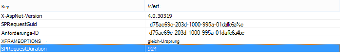

# Verwenden des Inhaltssuchwebteils anstelle des Inhaltsabfragewebteils zur Verbesserung der Leistung in SharePoint Online

In diesem Artikel wird beschrieben, wie Sie die Leistung steigern, indem sie das Inhaltsabfragewebteil durch das Inhaltssuchwebteil in SharePoint Server 2013 und SharePoint Online ersetzt.
  
Eines der leistungsstärksten neuen Features von SharePoint Server 2013 und SharePoint Online ist das Web part für die Inhaltssuche (Content Search Web Part, CSWP). Dieses Webteil verwendet den Suchindex, um schnell Ergebnisse abzurufen, die dem Benutzer angezeigt werden. Verwenden Sie das Web part für die Inhaltssuche anstelle des Inhaltsabfragewebteils (Content Query Web Part, CQWP) auf Ihren Seiten, um die Leistung für Ihre Benutzer zu verbessern.
  
Die Verwendung eines Inhaltssuchwebteils über ein Inhaltsabfragewebteil führt fast immer zu einer deutlich besseren Seitenladeleistung auf SharePoint Online. Es gibt ein wenig zusätzliche Konfiguration, um die richtige Abfrage zu erhalten, aber die Vorteile sind verbesserte Leistung und zufriedenere Benutzer.
  
## Vergleichen des Leistungsgewinns, den Sie durch die Verwendung des Inhaltssuchwebteils anstelle des Inhaltsabfragewebteils erzielen

Die folgenden Beispiele zeigen die relativen Leistungsgewinne, die Sie erhalten können, wenn Sie ein Inhaltssuchwebteil anstelle eines Inhaltsabfragewebteils verwenden. Die Effekte sind mit einer komplexen Websitestruktur und sehr breiten Inhaltsabfragen offensichtlicher.
  
Diese Beispielwebsite hat die folgenden Merkmale:
  
- 8 Ebenen von Unterwebsites.
    
- Listet mithilfe eines benutzerdefinierten Inhaltstyps "Obst" auf.
    
- Im Web part ist die Inhaltsabfrage breit und gibt alle Elemente mit dem Inhaltstyp "fruit" zurück.
    
- Das Beispiel verwendet nur 50 Elemente auf den 8 Websites. Die Auswirkungen werden für Websites mit mehr Inhalt noch stärker.
    
Hier sehen Sie einen Screenshot der Ergebnisse des Inhaltsabfragewebteils.
  

  
Verwenden Sie in Internet Explorer die Registerkarte **Netzwerk** der F12-Entwicklertools, um die Details für den Antwortheader zu sehen. Im folgenden Screenshot beträgt der Wert für **die SPRequestDuration** für diese Seitenlast 924 Millisekunden. 
  

  
 **SPRequestDuration** gibt an, wie viel Arbeit auf dem Server zum Vorbereiten der Seite erledigt wird. Das Wechseln von Inhalten nach Abfrage Webparts Inhaltssuche Webparts die Zeit für das Rendern der Seite erheblich reduziert. Im Gegensatz dazu hat eine Seite mit einem entsprechenden Inhaltssuchwebteil, das dieselbe Anzahl von Ergebnissen zurück gibt, einen **SPRequestDuration-Wert** von 106 Millisekunden, wie in diesem Screenshot gezeigt: 
  

  
## Hinzufügen eines Inhaltssuchwebteils in SharePoint Online

Das Hinzufügen eines Inhaltssuchwebteils ähnelt einem regulären Web part für Inhaltsabfragen. Weitere Informationen finden Sie im Abschnitt *"Add a Content Search Web Part"* unter [Configure a Content Search Web Part in SharePoint](https://support.office.com/article/Configure-a-Content-Search-Web-Part-in-SharePoint-0dc16de1-dbe4-462b-babb-bf8338c36c9a).
  
## Erstellen der richtigen Suchabfrage für Ihr Inhaltssuchwebteil

Nachdem Sie ein Web part für die Inhaltssuche hinzugefügt haben, können Sie die Suche verfeinern und die gesuchten Elemente zurückgeben. Ausführliche Anweisungen dazu finden Sie im Abschnitt "Anzeigen von Inhalten durch Konfigurieren einer erweiterten Abfrage in einem Inhaltssuchwebteil" unter [Configure a Content Search Web Part in SharePoint](https://support.office.com/article/Configure-a-Content-Search-Web-Part-in-SharePoint-0dc16de1-dbe4-462b-babb-bf8338c36c9a). 
  
## Tool zum Erstellen und Testen von Abfragen

Ein Tool zum Erstellen und Testen komplexer Abfragen finden Sie im [Suchabfragetool auf](https://sp2013searchtool.codeplex.com/) Codeplex. 
  

