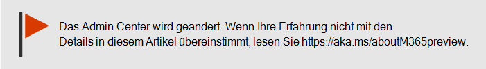
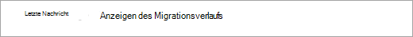
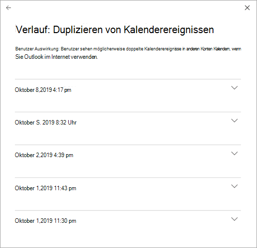

# Überprüfen des Microsoft 365 DienstzustandsHow to check Microsoft 365 service health

Sie können den Integritätszustand Ihrer Microsoft-Dienste, einschließlich Office im Web, Yammer, Microsoft Dynamics CRM und Clouddiensten für die Verwaltung mobiler Geräte, auf der Seite Dienstinte health im [Microsoft 365 Admin Center anzeigen.](https://go.microsoft.com/fwlink/p/?linkid=2024339) You can view the health of your Microsoft services, including Office on the web, Yammer, Microsoft Dynamics CRM, and mobile device management cloud services, on the **Service health** page in the [Microsoft 365 admin center](https://go.microsoft.com/fwlink/p/?linkid=2024339). Wenn bei einem Clouddienst Probleme auftreten, können Sie den Dienststatus überprüfen, um festzustellen, ob es sich um ein bekanntes Problem handelt, für das bereits an einer Lösung gearbeitet wird, bevor Sie den Support anrufen oder Zeit für die Problembehandlung aufwenden.If you are experiencing problems with a cloud service, you can check the service health to determine whether this is a known issue with a resolution in progress before you call support or spend time troubleshooting.

Wenn Sie sich nicht beim Admin Center anmelden  können, können Sie die Dienststatusseite verwenden, um nach bekannten Problemen zu suchen, die die Anmeldung bei Ihrem Mandanten verhindern.If you are unable to sign in to the admin center, you can use the [service status page](https://status.office365.com) to check for known issues preventing you from logging into your tenant.  Melden Sie sich auch an, um uns [auf @MSFT365status](https://twitter.com/MSFT365Status) Twitter zu folgen, um Informationen zu bestimmten Ereignissen zu erhalten.Also sign up to follow us at [@MSFT365status](https://twitter.com/MSFT365Status) on Twitter to see information on certain events.

  
### Überprüfen des DienststatusHow to check service health

1. Wechseln Sie zum Microsoft 365 Admin Center unter [https://admin.microsoft.com](https://go.microsoft.com/fwlink/p/?linkid=2024339) , und melden Sie sich mit einem Administratorkonto an.Go to the Microsoft 365 admin center at [https://admin.microsoft.com](https://go.microsoft.com/fwlink/p/?linkid=2024339), and sign in with an admin account.

    > [!NOTE]
    > Personen, denen die Administratorrolle globaler Administrator oder Dienstsupport zugewiesen ist, können den Dienstzustand anzeigen.People who are assigned the global admin or service support admin role can view service health. Damit Exchange-, SharePoint- und Skype for Business-Administratoren den Dienststatus anzeigen können, muss ihnen auch die Rolle des Dienstadministrators zugewiesen sein.To allow Exchange, SharePoint, and Skype for Business admins to view service health, they must also be assigned the Service admin role. Weitere Informationen zu Rollen, die den Dienststatus anzeigen können, finden Sie unter [Informationen zu Administratorrollen](../admin/add-users/about-admin-roles.md?preserve-view=true&view=o365-worldwide#commonly-used-microsoft-365-admin-center-roles).For more information about roles that can view service health, see [About admin roles](../admin/add-users/about-admin-roles.md?preserve-view=true&view=o365-worldwide#commonly-used-microsoft-365-admin-center-roles).
  
2. Wenn Sie das neue Admin Center  nicht verwenden, wählen Sie auf der Startseite in der oberen rechten Ecke den Umschalter Neues **Admin Center** ausprobieren aus.If you are not using the new admin center, on the **Home** page, select the **Try the new admin center** toggle in the upper-right corner.

3. Zum Anzeigen des Dienststatus wechseln Sie im Admin Center zu **Status** > **Dienststatus**, oder wählen Sie auf dem **Startdashboard** die Karte **Dienststatus** aus.To view service health, in the admin center, go to **Health** > **Service health**, or select the **Service health** card on the **Home dashboard**. Die Dashboardkarte gibt an, ob ein Problem mit einem aktiven Dienst vorliegt, und stellt einen Link zur Seite mit Details zum **Dienststatus** bereit.The dashboard card indicates whether there is an active service issue and links to the detailed **Service health** page.
  
4. Der Status der einzelnen Clouddienste wird auf der Seite **Dienstatus** in einem Tabellenformat angezeigt.On the **Service health** page, the health state of each cloud service is shown in a table format.

   

Auf der Registerkarte **Alle Dienste** (Standardansicht) werden alle Dienste und ihr aktueller Status angezeigt.The **All services** tab (the default view) shows all services and their current health state. Ein Symbol und die Spalte **Status** geben den Status jedes Diensts an.An icon and the **Status** column indicate the state of each service. 

Wenn Sie die Ansicht nach Diensten filtern möchten, die aktuell einen Vorfall aufweisen, wählen Sie die Registerkarte **Vorfälle** oben auf der Seite aus.To filter your view to services currently experiencing an incident, select the **Incidents** tab at the top of the page. Bei Auswahl der Registerkarte **Empfehlungen** werden nur Dienste angezeigt, für die derzeit eine Empfehlung angegeben ist.Selecting the **Advisories** tab will show only services that currently have an advisory posted. 

Auf der Registerkarte **Verlauf** wird der Verlauf von Vorfällen und Empfehlungen angezeigt, die aufgelöst wurden.The **History** tab shows the history of incidents and advisories that have been resolved.

Wenn ein Problem mit einem Microsoft 365-Dienst auftritt und es nicht auf  der Seite Dienstintehzustand aufgeführt wird, teilen Sie uns dies mit, indem Sie Ein Problem melden auswählen und das kurze Formular ausfüllen.If you're experiencing an issue with a Microsoft 365 service and you don’t see it listed on the **Service health** page, tell us about it by selecting **Report an issue**, and completing the short form. Wir sehen uns verwandte Daten und Berichte aus anderen Organisationen an, um zu sehen, wie weit das Problem verbreitet ist und ob es von unserem Dienst stammt.We’ll look at related data and reports from other organizations to see how widespread the issue is, and if it originated with our service. Wenn dies der Fall ist, fügen wir sie  als neuen Vorfall oder eine Empfehlung auf der Seite Dienstintegte hinzu, auf der Sie die Lösung nachverfolgen können.If it did, we’ll add it as a new incident or advisory on the **Service health** page, where you can track its resolution. Wenn sie nicht innerhalb von ca. 30 Minuten in der Liste angezeigt wird, wenden Sie sich an den Support, um das Problem zu beheben.If you don’t see it appear on the list within about 30 minutes, consider contacting support to resolve the issue.

Wenn Sie Ihre Ansicht anpassen möchten, welche Dienste im Dashboard angezeigt werden, wählen Sie Einstellungen Benutzerdefinierte Ansicht aus, und aktivieren Sie die Kontrollkästchen für die Dienste, die Sie aus der Ansicht Dienstintehashboard  >  filtern möchten.To customize your view of which services show up on the dashboard, select **Preferences** > **Custom view**,  and clear the check boxes for the services you want to filter out of your Service health dashboard view. Stellen Sie sicher, dass das Kontrollkästchen für jeden Dienst aktiviert ist, den Sie überwachen möchten.Make sure that the check box is selected for each service that you want to monitor.    

Um sich für E-Mail-Benachrichtigungen über neue Vorfälle zu registrieren, die sich auf Ihren Mandanten und Statusänderungen für einen aktiven Vorfall auswirken, wählen Sie Einstellungen E-Mail aus, klicken Sie auf Dienst-Heathbenachrichtigungen senden in E-Mail, und geben Sie dann  >  an: To sign up for email notifications of new incidents that affect your tenant and status changes for an active incident, select **Preferences** > **Email**, click **Send me service heath notifications in email**, and then specify:

- Bis zu zwei E-Mail-Adressen.Up to two email addresses.
- Unabhängig davon, ob Sie Benachrichtigungen zu Vorfällen oder Ratgebern wünschenWhether you want notifications for incidents or advisories
- Die Dienste, für die Sie eine Benachrichtigung wünschenThe services for which you want notification

> [!NOTE]
> Jeder Administrator kann seine Einstellungen festlegen lassen, und der obige Grenzwert von zwei E-Mail-Adressen ist pro Administratorkonto festgelegt.Each admin can have their Preferences set and the above limit of two email address is per admin account.

> [!TIP]
> Sie können auch die [Microsoft 365 Admin-App](https://go.microsoft.com/fwlink/p/?linkid=627216) auf Ihrem mobilen Gerät verwenden, um den Dienstzustand anzuzeigen. Dies ist eine hervorragende Möglichkeit, um mit Pushbenachrichtigungen auf dem laufenden zu bleiben.You can also use the [Microsoft 365 Admin app](https://go.microsoft.com/fwlink/p/?linkid=627216) on your mobile device to view Service health, which is a great way to stay current with push notifications. 
  
### Anzeigen von Details des veröffentlichten DienststatusView details of posted service health

Wenn Sie in der Ansicht **Alle Dienste** den Dienststatus auswählen, wird eine Zusammenfassungsansicht der Empfehlungen oder Vorfälle angezeigt.On the **All services** view, selecting the service status will open a summary view of advisories or incidents.
  

Die Empfehlungs- oder Vorfallzusammenfassung enthält folgende Informationen:The advisory or incident summary provides the following information:

- **Titel**: Eine Zusammenfassung des Problems.**Title** - A summary of the problem.
- **Dienst**: Der Name des betroffenen Diensts.**Service** - The name of the affected service.
- **ID**: Ein numerischer Bezeichner für das Problem.**ID** - A numeric identifier for the problem.
- **Status**: Wie sich dieses Problem auf den Dienst auswirkt.**Status** - How this problem affects the service.
- **Startzeit**: Der Zeitpunkt, zu dem das Problem begann.**Start time** - The time when the issue started.
- **Letzte Aktualisierung**: Der Zeitpunkt der letzten Aktualisierung der Nachricht zum Dienststatus.**Last updated** - The last time that the service health message was updated. Wir veröffentlichen häufig Nachrichten, um Sie über die Fortschritte beim Anwenden einer Lösung zu informieren.We post frequent messages to let you know the progress that we're making in applying a solution.

Wählen Sie das Problem aus, um die Detailseite mit weiteren Informationen zum Problem anzuzeigen, einschließlich des [Verlaufs](#history) aller Nachrichten, die wir während unserer Arbeit an einer Lösung veröffentlicht haben.Select the issue title to see the issue detail page, which shows more information about the issue, including the [history](#history) of all messages posted while we work on a solution.

### Übersetzen von DienststatusdetailsTranslate service health details

Da Erläuterungen zum Dienststatus in Echtzeit veröffentlicht werden, sind sie nicht automatisch in Ihre Sprache übersetzt, und die Details eines Dienstereignisses sind nur in Englisch angegeben. Zum Übersetzen der Erläuterung führen Sie die folgenden Schritte aus: Because service health explanations are posted in real-time, they are not automatically translated to your language and the details of a service event are in English only. To translate the explanation, follow these steps:
  
1. Wechseln Sie zu [Translator](https://www.bing.com/translator/).Go to [Translator](https://www.bing.com/translator/).

2. Wählen Sie auf der Seite **Dienststatus** einen Vorfall oder eine Empfehlung aus. Kopieren Sie unter **Details anzeigen** den Text zum Problem.On the **Service health** page, select an incident or advisory. Under **Show details**, copy the text about the issue.

3. Fügen Sie den Text in Translator ein, und klicken Sie auf **Übersetzen**.In Translator, paste the text and choose **Translate**.

### DefinitionenDefinitions

Die meiste Zeit werden Dienste als fehlerfrei und ohne weitere Informationen angezeigt.Most of the time, services will appear as healthy with no further information. Wenn bei einem Dienst ein Problem vorliegt, wird das Problem entweder als eine Empfehlung oder als ein Vorfall angegeben, und der aktuelle Status wird angezeigt.When a service is having a problem, the issue is identified as either an advisory or an incident and shows a current status.
  
> [!TIP]
> Geplante Wartungsereignisse werden im Dienststatus nicht angezeigt.Planned maintenance events aren't shown in service health. Sie können geplante Wartungsereignisse verfolgen, indem Sie sich mit dem **Nachrichtencenter** auf dem neuesten Stand halten.You can track planned maintenance events by staying up to date with the **Message center**. Filtern Sie nach Nachrichten, für dieeine geplante Änderung als Kategorie angegeben ist, um herauszufinden, wann die Änderung stattfinden soll, welche Auswirkungen sie hat und wie Sie Vorbereitungen dafür treffen können.Filter to messages categorized as Plan for change to find out when the change is going to happen, its effect, and how to prepare for it. Weitere Informationen finden Sie unter [Nachrichtencenter in Microsoft 365.](https://support.office.com/article/38fb3333-bfcc-4340-a37b-deda509c2093)See [Message center in Microsoft 365](https://support.office.com/article/38fb3333-bfcc-4340-a37b-deda509c2093) for more details.
  
### Vorfälle und EmpfehlungenIncidents and advisories

| SymbolIcon | BeschreibungDescription |
|:-----|:-----|
||Wenn für einen Dienst eine Empfehlung angezeigt wird, wissen wir von einem Problem, das sich auf einige Benutzer auswirkt, doch ist der Dienst weiterhin verfügbar. Bei einer Empfehlung gibt es häufig eine Umgehung für das Problem und das Problem tritt ggf. nur zeitweilig auf oder ist in Hinsicht auf Umfang und Auswirkungen auf Benutzer eingeschränkt.If a service has an advisory shown, we are aware of a problem that is affecting some users, but the service is still available. In an advisory, there is often a workaround to the problem and the problem may be intermittent or is limited in scope and user impact.    |
||Wenn für einen Dienst ein aktiver Vorfall angezeigt wird, handelt es sich ein kritisches Problem und der Dienst oder eine wichtige Funktion des Diensts ist nicht verfügbar. Beispielsweise können Benutzer keine E-Mails senden und empfangen oder sich nicht anmelden. Vorfälle haben erkennbare Auswirkungen für die Benutzer. Tritt ein Vorfall ein, stellen wir Updates zur Untersuchung, Abhilfemaßnahmen und Lösungsbestätigungen im Dashboard zur Dienstintegrität bereit.If a service has an active incident shown, it's a critical issue and the service or a major function of the service is unavailable. For example, users may be unable to send and receive email or unable to sign-in. Incidents will have noticeable impact to users. When there is an incident in progress, we will provide updates regarding the investigation, mitigation efforts, and confirmation of resolution in the Service health dashboard.    |

### StatusdefinitionenStatus definitions

| StatusStatus | DefinitionDefinition |
|:-----|:-----|
|**Wird untersucht****Investigating** | Uns ist ein potenzielles Problem bekannt, und wir sammeln weitere Informationen dazu, was vor sich geht und welche Auswirkungen es hat.We're aware of a potential issue and are gathering more information about what's going on and the scope of impact. |
|**Dienstbeeinträchtigung****Service degradation** | Wir haben bestätigt, dass ein Problem vorliegt, das eine Auswirkung auf die Verwendung eines Diensts oder Features haben kann. Dieser Status wird möglicherweise angezeigt, wenn ein Dienst langsamer als gewöhnlich ausgeführt wird, zeitweilige Unterbrechungen auftreten oder ein Feature nicht funktioniert.We've confirmed that there is an issue that may affect use of a service or feature. You might see this status if a service is performing more slowly than usual, there are intermittent interruptions, or if a feature isn't working, for example. |
|**Dienstunterbrechung****Service interruption** | Dieser Status wird angezeigt, wenn wir feststellen, dass sich ein Problem auf den Zugriff der Benutzer auf den Dienst auswirkt. In diesem Fall ist das Problem schwerwiegend und kann konsistent reproduziert werden.You'll see this status if we determine that an issue affects the ability for users to access the service. In this case, the issue is significant and can be reproduced consistently. |
|**Dienst wird wiederhergestellt****Restoring service** | Die Ursache des Problems wurde erkannt, wir wissen, welche Behebungsmaßnahme zu ergreifen ist, und sind dabei, den Dienst wieder in einen fehlerfreien Zustand zu versetzen.The cause of the issue has been identified, we know what corrective action to take, and are in the process of bringing the service back to a healthy state. |
|**Erweiterte Wiederherstellung****Extended recovery** | Dieser Status gibt an, dass eine Behebungsmaßnahme durchgeführt wird, um den Dienst für die Mehrzahl der Benutzer wiederherzustellen, es dauert jedoch einige Zeit, bis alle betroffenen Systeme erreicht sind. Dieser Status wird möglicherweise auch angezeigt, wenn wir eine temporäre Korrektur vorgenommen haben, um die Auswirkungen zu verringern, während wir an der Bereitstellung einer dauerhaften Lösung arbeiten.This status indicates that corrective action is in progress to restore service to most users but will take some time to reach all the affected systems. You might also see this status if we've made a temporary fix to reduce impact while we wait to apply a permanent fix. |
|**Untersuchung angehalten****Investigation suspended** | Dieser Status wird angezeigt, wenn unsere detaillierte Untersuchung eines potenziellen Problems dazu führt, dass Kunden um Angabe zusätzlicher Informationen für eine weitere Untersuchung gebeten werden. Wenn Ihre Unterstützung erforderlich ist, informieren wir Sie, welche Daten oder Protokolle wir benötigen.If our detailed investigation of a potential issue results in a request for additional information from customers to allow us to investigate further, you'll see this status. If we need you to act, we'll let you know what data or logs we need. |
|**Dienst wiederhergestellt****Service restored** | Wir haben bestätigt, dass durch die Behebungsmaßnahme das zugrunde liegende Problem gelöst und der Dienst wieder in einen fehlerfreien Zustand versetzt wurde. Informationen zur Fehlerursache finden Sie unter den Problemdetails.We've confirmed that corrective action has resolved the underlying problem and the service has been restored to a healthy state. To find out what went wrong, view the issue details. |
|**Falsch positiv****False positive** | Nach einer detaillierten Untersuchung haben wir bestätigt, dass der Dienst fehlerfrei ist und wie entworfen ausgeführt wird.After a detailed investigation, we’ve confirmed the service is healthy and operating as designed. Es wurden keine Auswirkungen auf den Dienst festgestellt, oder die Ursache des Vorfalls stammte außerhalb des Diensts.No impact to the service was observed or the cause of the incident originated outside of the service. |
|**Vorfallnachsorgebericht veröffentlicht****Post-incident report published** | Wir haben für ein bestimmtes Problem einen Beitrag veröffentlicht, der Informationen zu den Ursachen sowie nächste Schritte umfasst, um sicherzustellen, dass ein ähnliches Problem nicht wieder auftritt.We’ve published a Post Incident Report for a specific issue that includes root cause information and next steps to ensure a similar issue doesn’t reoccur. |

### VerlaufHistory

Der Dienststatus zeigt den aktuellen Status sowie den Verlauf aller Empfehlungen und Vorfälle für Dienste, die Ihren Mandanten in den letzten 30 Tagen betroffen haben.Service health lets you look at current health status and view the history of any service advisories and incidents that have affected your tenant in the past 30 days. Zum Anzeigen des früheren Status aller Dienste wählen Sie auf der Seite mit den Problemdetails die Option **Verlauf anzeigen** aus.To view the past health of all services, select **View history** on the issue detail page.
  

  
Es wird eine Liste aller Nachrichten zum Dienststatus angezeigt, die im ausgewählten Zeitraum veröffentlicht wurden (siehe unten).A list of all service health messages posted in the selected timeframe is displayed, as shown below:
  

  
Erweitern Sie eine beliebige Zeile, um weitere Details zum Problem anzuzeigen.Expand any row to view more details about the issue.
  
Weitere Informationen zu unserer Verpflichtung zur Betriebszeit finden Sie unter [Transparente Vorgänge von Microsoft 365](/office365/servicedescriptions/office-365-platform-service-description/service-health-and-continuity).For more information about our commitment to uptime, see [Transparent operations from Microsoft 365](/office365/servicedescriptions/office-365-platform-service-description/service-health-and-continuity).

## Verwandte ThemenRelated topics

[Aktivitätsberichte im Microsoft 365 Admin Center](https://support.office.com/article/0d6dfb17-8582-4172-a9a9-aed798150263) 
 [Einstellungen für das Nachrichtencenter](../admin/manage/message-center.md?preserve-view=true&view=o365-worldwide#preferences)[Activity Reports in the Microsoft 365 admin center](https://support.office.com/article/0d6dfb17-8582-4172-a9a9-aed798150263)
[Message center Preferences](../admin/manage/message-center.md?preserve-view=true&view=o365-worldwide#preferences) 
[Überprüfen der Windows release health im Admin CenterHow to check Windows release health on admin center](https://docs.microsoft.com/windows/deployment/update/check-release-health)
