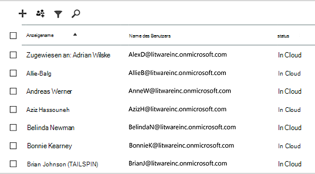
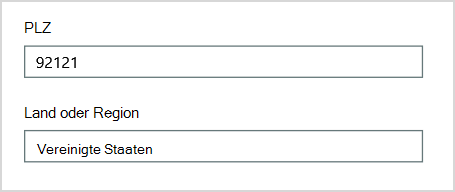
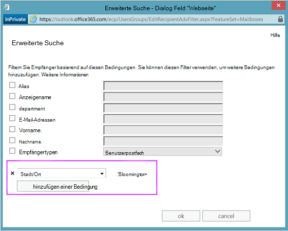
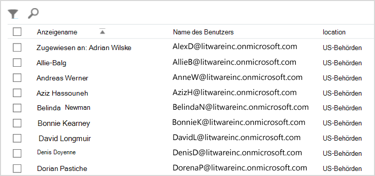
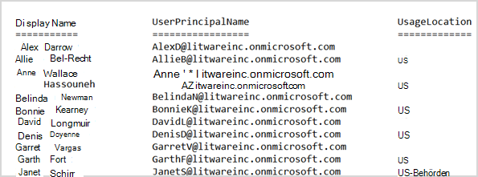

# <a name="why-you-need-to-use-powershell-for-microsoft-365"></a>Warum Sie PowerShell für Microsoft 365 verwenden müssen

*Dieser Artikel gilt sowohl für Microsoft 365 Enterprise als auch für Office 365 Enterprise.*

Mit dem Microsoft 365 Admin Center können Sie Ihre Microsoft 365 Benutzerkonten und Lizenzen verwalten. Sie können auch Ihre Microsoft 365 Dienste verwalten, z. B. Exchange Online, Teams und SharePoint Online. Wenn Sie stattdessen PowerShell zum Verwalten dieser Dienste verwenden, können Sie die Befehlszeilen- und Skriptsprachenumgebung für Geschwindigkeit, Automatisierung und zusätzliche Funktionen nutzen.

In diesem Artikel wird gezeigt, wie Sie PowerShell zum Verwalten von Microsoft 365 für Folgendes verwenden:

- Zeigen Sie zusätzliche Informationen an, die im Microsoft 365 Admin Center

- Konfigurieren von Features und Einstellungen, die nur mit PowerShell möglich sind

- Ausführen von Massenvorgängen

- Filtern von Daten

- Drucken oder Speichern von Daten

- Dienstübergreifende Verwaltung

Beachten Sie, dass PowerShell für Microsoft 365 eine Reihe von Modulen für Windows PowerShell ist, bei denen es sich um eine Befehlszeilenumgebung für Windows-basierte Dienste und Plattformen handelt. Diese Umgebung erstellt eine Befehlsshell-Sprache, die mit zusätzlichen Modulen erweitert werden kann. Es bietet eine Möglichkeit, einfache oder komplexe Befehle oder Skripts auszuführen. Nachdem Sie beispielsweise powerShell für Microsoft 365 Module installiert und eine Verbindung mit Ihrem Microsoft 365-Abonnement hergestellt haben, können Sie den folgenden Befehl ausführen, um alle Benutzerpostfächer für Microsoft Exchange Online aufzuführen:

```powershell
Get-Mailbox
```

Sie können auch die Liste der Postfächer mithilfe der Microsoft 365 Admin Center abrufen, aber das Zählen der Elemente in allen Listen für alle Websites für alle Ihre Web-Apps ist nicht einfach.

PowerShell für Microsoft 365 wurde entwickelt, um Sie beim Verwalten von Microsoft 365 zu unterstützen, nicht um die Microsoft 365 Admin Center zu ersetzen. Administratoren müssen PowerShell für Microsoft 365 verwenden können, da es einige Konfigurationsverfahren gibt, die nur über PowerShell für Microsoft 365 Befehle ausgeführt werden können. In diesen Fällen müssen Sie wissen, wie Sie:

- Installieren Sie powerShell für Microsoft 365 Module (nur einmal für jeden Administratorcomputer).

- Verbinden zu Ihrem Microsoft 365-Abonnement (einmal für jede PowerShell-Sitzung).

- Sammeln Sie die erforderlichen Informationen, um die erforderliche PowerShell für Microsoft 365 Befehle auszuführen.

- Führen Sie PowerShell für Microsoft 365 Befehle aus.

Nachdem Sie diese grundlegenden Fähigkeiten erlernen, müssen Sie Ihre Postfachbenutzer nicht mithilfe des Befehls **"Get-Mailbox"** auflisten. Sie müssen auch nicht verstehen, wie Sie einen neuen Befehl wie den zuvor erwähnten erstellen, um alle Elemente in allen Listen für alle Websites für alle Ihre Web-Apps zu zählen. Microsoft und die Community der Administratoren können Ihnen bei solchen Aufgaben bei Bedarf helfen.

## <a name="powershell-for-microsoft-365-can-reveal-information-that-you-cant-see-with-the-microsoft-365-admin-center"></a>PowerShell für Microsoft 365 kann Informationen offenlegen, die Sie mit dem Microsoft 365 Admin Center

Im Microsoft 365 Admin Center werden viele nützliche Informationen angezeigt. Es werden jedoch nicht alle möglichen Informationen angezeigt, die Microsoft 365 zu Benutzern, Lizenzen, Postfächern und Websites speichert. Hier ist ein Beispiel für *Benutzer und Gruppen* im Microsoft 365 Admin Center:



Diese Ansicht enthält die Informationen, die Sie in vielen Fällen benötigen. Es kann jedoch vorkommen, dass Sie mehr benötigen. Beispielsweise hängt Microsoft 365 Lizenzierung (und die Microsoft 365 Features, die einem Benutzer zur Verfügung stehen) teilweise vom geografischen Standort des Benutzers ab. Die Richtlinien und Features, die Sie auf einen Benutzer erweitern können, der in den Vereinigten Staaten ansässig ist, sind möglicherweise nicht dieselben wie die, die Sie auf einen Benutzer in Indien oder Belgien erweitern können. Führen Sie die folgenden Schritte im Microsoft 365 Admin Center aus, um den geografischen Standort eines Benutzers zu ermitteln:

1. Doppelklicken Sie auf den **Anzeigenamen** des Benutzers.

2. Wählen Sie im Anzeigebereich der Benutzereigenschaften **Details** aus.

3. Wählen Sie in der Detailanzeige **zusätzliche Details** aus.

4. Scrollen Sie, bis Sie die Überschrift **"Land" oder "Region"** finden:

     

5. Notieren Sie den Anzeigenamen des Benutzers auf einem Blatt Papier, oder kopieren ihn in Editor.

Sie müssen diese Vorgehensweise für jeden Benutzer wiederholen. Wenn Sie viele Benutzer haben, kann dieser Vorgang mühsam sein. Mit PowerShell für Microsoft 365 können Sie diese Informationen für alle Benutzer anzeigen, indem Sie den folgenden Befehl verwenden:

```powershell
Get-AzureADUser | Select DisplayName, UsageLocation
```


>[!Note]
>PowerShell Core unterstützt nicht das Microsoft Azure Active Directory-Modul für Windows PowerShell-Modul und Cmdlets, die *Msol* im Namen haben. Sie müssen diese Cmdlets über Windows PowerShell ausführen.
>

Hier ist ein Beispiel für die Ergebnisse:

```powershell
DisplayName                               UsageLocation
-----------                               -------------
Bonnie Kearney                            GB
Fabrice Canel                             BR
Brian Johnson (TAILSPIN)                  US
Anne Wallace                              US
Alex Darrow                               US
David Longmuir                            BR
```

Die Interpretation dieses PowerShell-Befehls lautet: Abrufen aller Benutzer im aktuellen Microsoft 365-Abonnement (**Get-AzureADUser**), zeigt jedoch nur den Namen und den Speicherort für jeden Benutzer an (**DisplayName, UsageLocation auswählen).**

Da PowerShell für Microsoft 365 eine Befehlsshell-Sprache unterstützt, können Sie die durch den Befehl **"Get-AzureADUser"** abgerufenen Informationen weiter bearbeiten. Vielleicht möchten Sie diese Benutzer z. B. nach ihrem Standort sortieren, alle brasilianischen Benutzer, alle Benutzer in den USA und so weiter gruppieren. Hier ist der Befehl:

```powershell
Get-AzureADUser | Select DisplayName, UsageLocation | Sort UsageLocation, DisplayName
```

Hier ist ein Beispiel für die Ergebnisse:

```powershell
DisplayName                                 UsageLocation
-----------                                 -------------
David Longmuir                              BR
Fabrice Canel                               BR
Bonnie Kearney                              GB
Alex Darrow                                 US
Anne Wallace                                US
Brian Johnson (TAILSPIN)                    US
```

Die Interpretation dieses PowerShell-Befehls lautet: Rufen Sie alle Benutzer im aktuellen Microsoft 365 Abonnement ab, zeigen Sie jedoch nur den Namen und den Speicherort für jeden Benutzer an und sortieren Sie sie zuerst nach ihrem Standort und dann nach ihrem Namen (**Sort UsageLocation, DisplayName**).

Sie können auch zusätzliche Filterung verwenden. Wenn Sie beispielsweise nur Informationen zu Benutzern in Brasilien anzeigen möchten, verwenden Sie den folgenden Befehl:

```powershell
Get-AzureADUser | Where {$_.UsageLocation -eq "BR"} | Select DisplayName, UsageLocation
```

Hier ist ein Beispiel für die Ergebnisse:

```powershell
DisplayName                                           UsageLocation
-----------                                           -------------
David Longmuir                                        BR
Fabrice Canel                                         BR
```

Die Interpretation dieses PowerShell-Befehls lautet: Abrufen aller Benutzer im aktuellen Microsoft 365-Abonnement, dessen Standort Brasilien ist (**Where {$ \_ . UsageLocation -eq "BR"}**) und dann den Namen und speicherort für jeden Benutzer anzeigen.

 **Hinweis zu großen Domänen**

Wenn Sie über eine große Domäne mit Tausenden von Benutzern verfügen, kann das Ausprobieren einiger beispiele, die in diesem Artikel gezeigt werden, zu Drosselung führen. Basierend auf Faktoren wie Rechenleistung und verfügbarer Netzwerkbandbreite versuchen Sie möglicherweise, zu viel gleichzeitig zu tun. Große Organisationen möchten einige dieser PowerShell-Vorgänge möglicherweise in zwei Befehle aufteilen.

Der folgende Befehl gibt beispielsweise alle Benutzerkonten zurück und zeigt den Namen und speicherort für jedes Konto an:

```powershell
Get-AzureADUser | Select DisplayName, UsageLocation
```

Das funktioniert auch gut bei kleineren Domänen. In einer großen Organisation möchten Sie diesen Vorgang jedoch möglicherweise in zwei Befehle aufteilen: einen Befehl zum Speichern der Benutzerkontoinformationen in einer Variablen und einen anderen, um die erforderlichen Informationen anzuzeigen. Hier ist ein Beispiel:

```powershell
$x = Get-AzureADUser
$x | Select DisplayName, UsageLocation
```

Die Interpretation dieser PowerShell-Befehle lautet:
1. Rufen Sie alle Benutzer im aktuellen Microsoft 365 Abonnement ab, und speichern Sie die Informationen in einer Variablen mit dem Namen $x (**$x = Get-AzureADUser**).
1.  Zeigt den Inhalt der Variablen *$x* an, enthält jedoch nur den Namen und speicherort für jeden Benutzer (**$x | Wählen Sie DisplayName, UsageLocation**).

## <a name="microsoft-365-has-features-that-you-can-only-configure-with-powershell-for-microsoft-365"></a>Microsoft 365 verfügt über Features, die Sie nur mit PowerShell für Microsoft 365

Die Microsoft 365 Admin Center soll den Zugriff auf allgemeine, nützliche Verwaltungsaufgaben ermöglichen, die für die meisten Umgebungen gelten. Mit anderen Worten, die Microsoft 365 Admin Center wurde so konzipiert, dass der typische Administrator die gängigsten Verwaltungsaufgaben ausführen kann. Es gibt jedoch einige Aufgaben, die im Admin Center nicht ausgeführt werden können.

Beispielsweise bietet das Skype for Business Online Admin Center einige Optionen zum Erstellen benutzerdefinierter Besprechungseinladungen:


Mit diesen Einstellungen können Sie Besprechungseinladungen eine gewisse persönliche Note und Professionalität verleihen. Es gibt jedoch mehr zu Besprechungskonfigurationseinstellungen als nur das Erstellen benutzerdefinierter Besprechungseinladungen. Besprechungen ermöglichen standardmäßig beispielsweise Folgendes:

- anonymen Benutzern, automatischen Zugang zu jeder Besprechung zu erhalten

- Teilnehmern, die Besprechung aufzuzeichnen.

- das Festlegen aller Benutzer in Ihrer Organisation als Referenten, wenn sie an der Besprechung teilnehmen.

Diese Einstellungen sind im Skype for Business Online Admin Center nicht verfügbar. Sie können sie über PowerShell für Microsoft 365 steuern. Hier ist ein Befehl, der diese drei Einstellungen deaktiviert:

```powershell
Set-CsMeetingConfiguration -AdmitAnonymousUsersByDefault $False -AllowConferenceRecording $False -DesignateAsPresenter "None"
```

> [!NOTE]
> Um diesen Befehl auszuführen, müssen Sie das [Skype for Business Online PowerShell-Modul](https://www.microsoft.com/download/details.aspx?id=39366)installieren.

Die Interpretation dieses PowerShell-Befehls lautet:

1. Deaktivieren Sie in den Einstellungen für neue Skype for Business Onlinebesprechungen (**Set-CsMeetingConfiguration**) die Automatische Teilnahme anonymer Benutzer an Besprechungen (**-AdmitAnonymousUsersByDefault $False**).
2.  Deaktivieren Sie die Möglichkeit, dass Teilnehmer Besprechungen aufzeichnen können (**-AllowConferenceRecording $False**).
3. Legen Sie nicht alle Benutzer aus Ihrer Organisation als Referenten fest (**-DesignateAsPresenter "None").**

Führen Sie den folgenden Befehl aus, um diese Standardeinstellungen wiederherzustellen (aktivieren Sie die Optionen):

```powershell
Set-CsMeetingConfiguration -AdmitAnonymousUsersByDefault $True -AllowConferenceRecording $True -DesignateAsPresenter "Company"
```

Es gibt auch andere ähnliche Szenarien, weshalb Administratoren wissen sollten, wie PowerShell für Microsoft 365 Befehle ausgeführt wird.

## <a name="powershell-for-microsoft-365-is-great-for-bulk-operations"></a>PowerShell für Microsoft 365 eignet sich hervorragend für Massenvorgänge

Visuelle Schnittstellen wie die Microsoft 365 Admin Center sind besonders nützlich, wenn Sie einen einzelnen Vorgang ausführen müssen. Wenn Sie beispielsweise ein Benutzerkonto deaktivieren müssen, können Sie das Admin Center verwenden, um ein Kontrollkästchen schnell zu finden und zu deaktivieren. Dies ist möglicherweise einfacher als das Ausführen eines ähnlichen Vorgangs in PowerShell.

Wenn Sie jedoch viele oder einige ausgewählte Dinge in einer großen Gruppe anderer Dinge ändern müssen, ist die Microsoft 365 Admin Center möglicherweise nicht das beste Tool. Angenommen, Sie müssen das Präfix auf Tausenden von Telefonnummern ändern oder den bestimmten Benutzer *Ken Myer* von allen SharePoint Online-Websites entfernen. Wie würden Sie dies im Microsoft 365 Admin Center tun?

Angenommen, Sie haben mehrere Hundert SharePoint Onlinewebsites, und Sie wissen nicht, bei welchen Ken Mof Mitglied ist. Sie müssten am Microsoft 365 Admin Center beginnen und dann dieses Verfahren für jeden Standort ausführen:

1. Wählen Sie die **URL** der Website aus.

2. Wählen Sie im **Feld "Websitesammlungseigenschaften"** den Link **"Websiteadresse"** aus, um die Website zu öffnen.

3. Wählen Sie auf der Website **"Freigeben"** aus.

4. Wählen Sie im Dialogfeld **"Freigeben"** den Link aus, der alle Benutzer anzeigt, die über Berechtigungen für die Website verfügen:

     

5. Wählen Sie im Dialogfeld **"Freigegeben mit"** die Option **"Erweitert"** aus.

6. Scrollen Sie in der Liste der Benutzer nach unten, suchen Und wählen Sie Ken Myer aus (vorausgesetzt, er hat Berechtigungen für die Website), und wählen Sie dann **"Benutzerberechtigungen entfernen" aus.**

Dies würde bei mehreren hundert Websites *sehr viel* Zeit in Anspruch nehmen.

Die Alternative besteht darin, den folgenden Befehl in PowerShell für Microsoft 365 auszuführen, um Ken Myer von allen Ihren Websites zu entfernen:

```powershell
Get-SPOSite | ForEach {Remove-SPOUser -Site $_.Url -LoginName "kenmyer@litwareinc.com"}
```

> [!NOTE]
> Für diesen Befehl müssen Sie das [SharePoint Online PowerShell-Modul](/powershell/sharepoint/sharepoint-online/connect-sharepoint-online?view=sharepoint-ps)installieren.

Die Interpretation dieses PowerShell-Befehls lautet: Rufen Sie alle SharePoint Websites im aktuellen Microsoft 365-Abonnement (**Get-SPOSite**) ab, und entfernen Sie für jede Website Ken Cmdlet aus der Liste der Benutzer, die darauf zugreifen können (**ForEach {Remove-SPOUser -Site $ \_ . Url -LoginName "kenmyer \@ litwareinc.com"}**).

Wir weisen Microsoft 365 an, Ken Doppelklick von jeder Website zu entfernen, einschließlich derer, auf die er keinen Zugriff hat. Die Ergebnisse zeigen daher Fehler für die Websites an, auf die er keinen Zugriff hat. Wir können eine zusätzliche Bedingung für diesen Befehl verwenden, um Ken Doppelklick nur von den Websites zu entfernen, die ihn in der Anmeldeliste haben. Die zurückgegebenen Fehler richten jedoch keinen Schaden an den Websites selbst an. Dieser Befehl kann einige Minuten dauern, bis er für Hunderte von Websites ausgeführt wird, anstatt stundenlang die Microsoft 365 Admin Center durchzuarbeiten.

Hier ist ein weiteres Beispiel für einen Massenvorgang. Verwenden Sie diesen Befehl, um allen Websites in der Organisation einen neuen SharePoint-Administrator *Hinzuzufügen:*

```powershell
Get-SPOSite | ForEach {Add-SPOUser -Site $_.Url -LoginName "bkearney@litwareinc.com" -Group "Members"}
```

Die Interpretation dieses PowerShell-Befehls lautet: Rufen Sie alle SharePoint Websites im aktuellen Microsoft 365-Abonnement ab, und gewähren Sie für jede Website den Zugriff auf Doppelklickie Keardrossel, indem Sie ihren Anmeldenamen der Gruppe "Mitglieder" der Website hinzufügen (**ForEach {Add-SPOUser -Site $ \_ . Url -LoginName "bkear dropdown \@ litwareinc.com" -Group "Members"}**).

## <a name="powershell-for-microsoft-365-is-great-at-filtering-data"></a>PowerShell für Microsoft 365 eignet sich hervorragend zum Filtern von Daten

Das Microsoft 365 Admin Center bietet verschiedene Möglichkeiten, Ihre Daten zu filtern, um eine gezielte Teilmenge von Informationen leicht zu finden. Mit Exchange können Sie beispielsweise leicht nach praktisch jeder Eigenschaft eines Benutzerpostfachs filtern. Im Folgenden finden Sie beispielsweise die Liste der Postfächer für alle Benutzer, die in Bloom york leben:



Im Exchange Admin Center können Sie auch Filterkriterien kombinieren. Beispielsweise können Sie die Postfächer für alle Personen finden, die in Bloomamento leben und in der Finanzabteilung arbeiten.

Es gibt jedoch Einschränkungen hinsichtlich der Möglichkeiten im Exchange Admin Center. Beispielsweise konnten Sie nicht so einfach die Postfächer von Personen finden, die in Bloomsinn *oder* San Mof leben, oder die Postfächer für alle Personen, die nicht in Bloom bloomton leben.

Sie können den folgenden PowerShell für Microsoft 365 Befehl verwenden, um eine Liste der Postfächer für alle Personen abzurufen, die in Bloomonston oder San Doppelklick leben:

```powershell
Get-User | Where {$_.RecipientTypeDetails -eq "UserMailbox&quot; -and ($_.City -eq &quot;San Diego&quot; -or $_.City -eq &quot;Bloomington")} | Select DisplayName, City
```

Hier ist ein Beispiel für die Ergebnisse:

```powershell
DisplayName                              City
-----------                              ----
Alex Darrow                              San Diego
Bonnie Kearney                           San Diego
Julian Isla                              Bloomington
Rob Young                                Bloomington
```

Die Interpretation dieses PowerShell-Befehls lautet: Rufen Sie alle Benutzer im aktuellen Microsoft 365-Abonnement ab, die ein Postfach in der Stadt San Doppelklick oder Bloomando haben (**Where {$ \_ . RecipientTypeDetails -eq "UserMailbox" -and ($ \_ . City -eq "San Maustaste" -or $ \_ . City -eq "Bloom australia")}**), und zeigen Sie dann den Namen und die Stadt für jedes Element an (**DisplayName, Ort auswählen).**

Und hier ist der Befehl zum Auflisten aller Postfächer für Personen, die überall mit Ausnahme von Bloomsinn leben:

```powershell
Get-User | Where {$_.RecipientTypeDetails -eq "UserMailbox" -and $_.City -ne "Bloomington"} | Select DisplayName, City
```

Hier ist ein Beispiel für die Ergebnisse:

```powershell
DisplayName                               City
-----------                               ----
MOD Administrator                         Redmond
Alex Darrow                               San Diego
Allie Bellew                              Bellevue
Anne Wallace                              Louisville
Aziz Hassouneh                            Cairo
Belinda Newman                            Charlotte
Bonnie Kearney                            San Diego
David Longmuir                            Waukesha
Denis Dehenne                             Birmingham
Garret Vargas                             Seattle
Garth Fort                                Tulsa
Janet Schorr                              Bellevue
```

Die Interpretation dieses PowerShell-Befehls lautet: Alle Benutzer im aktuellen Microsoft 365-Abonnement abrufen, die über ein Postfach verfügen, das sich nicht in der Stadt Bloom york befindet (**Where {$ \_ . RecipientTypeDetails -eq "UserMailbox" -and $ \_ . City -ne "Bloomington"}**), und zeigen Sie dann den Namen und die Stadt für jeden an.

### <a name="use-wildcards"></a>Verwenden von Platzhaltern

Sie können auch Platzhalterzeichen in Ihren PowerShell-Filtern verwenden, um einen Teil eines Namens abzugleichen. Angenommen, Sie suchen nach einem Benutzerkonto. Sie können sich nur daran erinnern, dass der Nachname des Benutzers *"Wieder"* oder vielleicht *"Henderson"* oder *"Doppelklicknson"* lautete.

Sie können diesen Benutzer im Microsoft 365 Admin Center nachverfolgen, indem Sie das Suchtool verwenden und drei verschiedene Suchvorgänge ausführen:

- Eine für  *Anderson*

- Eine für  *Henderson*

- Und eine für  *Jorgenson*

Da alle drei dieser Namen auf "son" enden, können Sie PowerShell anweisen, alle Benutzer anzuzeigen, deren Name auf "son" endet. Hier ist der Befehl:

```powershell
Get-User -Filter '{LastName -like "*son"}'
```

Die Interpretation dieses PowerShell-Befehls lautet: Alle Benutzer im aktuellen Microsoft 365-Abonnement abrufen, aber einen Filter verwenden, der nur die Benutzer auflistet, deren Nachnamen auf "son" enden (**-Filter '{LastName -like " \* son"}'**). Steht \* für einen beliebigen Satz von Zeichen, bei denen es sich um Buchstaben im Nachnamen des Benutzers handelt.

## <a name="powershell-for-microsoft-365-makes-it-easy-to-print-or-save-data"></a>PowerShell für Microsoft 365 erleichtert das Drucken oder Speichern von Daten

Mit dem Microsoft 365 Admin Center können Sie Datenlisten anzeigen. Hier ist ein Beispiel für das Skype for Business Online Admin Center, in dem eine Liste der Benutzer angezeigt wird, die für Skype for Business Online aktiviert wurden:



Um diese Informationen in einer Datei zu speichern, müssen Sie sie in ein Dokument oder Microsoft Excel Arbeitsblatt einfügen. In beiden Fällen ist möglicherweise eine zusätzliche Formatierung erforderlich. Darüber hinaus bietet die Microsoft 365 Admin Center keine Möglichkeit, die angezeigte Liste direkt zu drucken.

Glücklicherweise können Sie PowerShell verwenden, um die Liste nicht nur anzuzeigen, sondern in einer Datei zu speichern, die einfach in Excel importiert werden kann. Hier ist ein Beispielbefehl zum Speichern Skype for Business Onlinebenutzerdaten in einer CSV-Datei (Comma-separated values), die dann einfach als Tabelle in einem Excel Arbeitsblatt importiert werden kann:

```powershell
Get-CsOnlineUser | Select DisplayName, UserPrincipalName, UsageLocation | Export-Csv -Path "C:\Logs\SfBUsers.csv" -NoTypeInformation
```

Hier ist ein Beispiel für die Ergebnisse:


Die Interpretation dieses PowerShell-Befehls lautet: Abrufen aller Skype for Business Onlinebenutzer im aktuellen Microsoft 365-Abonnement (**Get-CsOnlineUser**); nur den Benutzernamen, UPN und Speicherort abrufen (**Select DisplayName, UserPrincipalName, UsageLocation**); und speichern Sie diese Informationen dann in einer CSV-Datei namens C: \\ Logs \\SfBUsers.csv (**Export-Csv -Path "C: \\ Logs \\SfBUsers.csv" -NoTypeInformation**).

Sie können diese Liste auch mithilfe von Optionen als XML-Datei oder HTML-Seite speichern. Tatsächlich können Sie mit zusätzlichen PowerShell-Befehlen die Datei direkt als Excel Datei mit beliebiger benutzerdefinierter Formatierung speichern.

Sie können auch die Ausgabe eines PowerShell-Befehls senden, der eine Liste direkt an den Standarddrucker in Windows anzeigt. Hier ist ein Beispielbefehl:

```powershell
Get-CsOnlineUser | Select DisplayName, UserPrincipalName, UsageLocation | Out-Printer
```

Das gedruckte Dokument sieht wie folgt aus:



Die Interpretation dieses PowerShell-Befehls lautet: Abrufen aller Skype for Business Onlinebenutzer im aktuellen Microsoft 365-Abonnement; nur den Benutzernamen, UPN und Speicherort abrufen; und senden Sie diese Informationen dann an den Standarddrucker Windows (**Out-Printer**).

Das gedruckte Dokument hat die gleiche einfache Formatierung wie die Anzeige im PowerShell-Befehlsfenster. Um eine Kopie zu erhalten, fügen Sie einfach **| Ausgabedrucker** bis zum Ende des Befehls.

## <a name="powershell-for-microsoft-365-lets-you-manage-across-server-products"></a>Mit PowerShell für Microsoft 365 können Sie serverübergreifende Produkte verwalten.

Die Komponenten, aus denen Microsoft 365 bestehen, sind für die Zusammenarbeit konzipiert. Angenommen, Sie fügen Microsoft 365 einen neuen Benutzer hinzu, und Geben Sie informationen wie abteilungs- und telefonnummer des Benutzers an. Diese Informationen sind dann verfügbar, wenn Sie auf die Informationen des Benutzers in einem der Microsoft 365 Dienste zugreifen: Skype for Business Online, Exchange oder SharePoint.

Hierbei handelt es sich um allgemeine Informationen, die für die ganze Produktsuite gleich sind. Produktspezifische Informationen, z. B. Informationen zum postfach Exchange eines Benutzers, sind in der Regel nicht in der gesamten Suite verfügbar. Beispielsweise sind Informationen darüber, ob das Postfach eines Benutzers aktiviert ist oder nicht, nur im Exchange Admin Center verfügbar.

Angenommen, Sie möchten einen Bericht erstellen, in dem die folgenden Informationen für alle Benutzer enthalten sind:

- Den Anzeigenamen des Benutzers

- Gibt an, ob der Benutzer für Microsoft 365 lizenziert ist.

- Ob das Exchange-Postfach des Benutzers aktiviert wurde

- Ob der Benutzer für Skype for Business Online aktiviert ist

Sie können einen solchen Bericht im Microsoft 365 Admin Center nicht einfach erstellen. Stattdessen müssten Sie ein separates Dokument erstellen, um die Informationen zu speichern, z. B. ein Excel Arbeitsblatt. Rufen Sie dann alle Benutzernamen und Lizenzierungsinformationen aus dem Microsoft 365 Admin Center ab, rufen Sie Postfachinformationen aus dem Exchange Admin Center ab, rufen Sie Skype for Business Onlineinformationen aus dem Skype for Business Online Admin Center ab, und kombinieren Sie dann diese Informationen.

Die Alternative besteht darin, ein PowerShell-Skript zu verwenden, um den Bericht für Sie zu kompilieren.

Das folgende Beispielskript ist komplizierter als die Befehle, die Sie bisher in diesem Artikel gesehen haben. Es zeigt jedoch das Potenzial der Verwendung von PowerShell zum Erstellen von Informationsansichten, die andernfalls nur schwer zu erhalten sind. Hier sehen Sie das Skript zum Kompilieren und Anzeigen der liste, die Sie benötigen:

```powershell
$x = Get-AzureADUser

foreach ($i in $x)
    {
      $y = Get-Mailbox -Identity $i.UserPrincipalName
      $i | Add-Member -MemberType NoteProperty -Name IsMailboxEnabled -Value $y.IsMailboxEnabled

      $y = Get-CsOnlineUser -Identity $i.UserPrincipalName
      $i | Add-Member -MemberType NoteProperty -Name EnabledForSfB -Value $y.Enabled
    }

$x | Select DisplayName, IsLicensed, IsMailboxEnabled, EnabledforSfB
```

Hier ist ein Beispiel für die Ergebnisse:

```powershell
DisplayName             IsLicensed   IsMailboxEnabled   EnabledForSfB
-----------             ----------   ----------------   --------------
Bonnie Kearney          True         True               True
Fabrice Canel           True         True               True
Brian Johnson           False        True               False
Anne Wallace            True         True               True
Alex Darrow             True         True               True
David Longmuir          True         True               True
Katy Jordan             False        True               False
Molly Dempsey           False        True               False
```

Die Interpretation dieses PowerShell-Skripts lautet:

1. Rufen Sie alle Benutzer im aktuellen Microsoft 365-Abonnement ab, und speichern Sie die Informationen in einer Variablen mit dem Namen *$x* (**$x = Get-AzureADUser**).
1. Starten Sie eine Schleife, die über alle Benutzer in der Variablen $x (**foreach ($i in $x)** ausgeführt wird.
1. Definieren Sie eine Variable mit dem Namen *$y* und speichern Sie die Postfachinformationen des Benutzers darin (**$y = Get-Mailbox -Identity $i.UserPrincipalName**).
1. Fügen Sie den Benutzerinformationen mit dem Namen *IsMailBoxEnabled* eine neue Eigenschaft hinzu. Legen Sie ihn auf den Wert der IsMailBoxEnabled-Eigenschaft des Postfachs des Benutzers fest (**$i | Add-Member -MemberType NoteProperty -Name IsMailboxEnabled -Value $y.IsMailboxEnabled**).
1. Definieren Sie eine Variable mit dem Namen *$y,* und speichern Sie die Skype for Business Onlineinformationen des Benutzers darin (**$y = Get-CsOnlineUser -Identity $i.UserPrincipalName**).
1. Fügen Sie den Benutzerinformationen mit dem Namen *EnabledForSfB* eine neue Eigenschaft hinzu. Legen Sie ihn auf den Wert der Enabled-Eigenschaft der Skype for Business Onlineinformationen des Benutzers fest (**$i | Add-Member -MemberType NoteProperty -Name EnabledForSfB -Value $y.Enabled**).
1. Zeigt die Liste der Benutzer an, enthält aber nur ihren Namen, ob sie lizenziert sind, und die beiden neuen Eigenschaften, die angeben, ob ihr Postfach aktiviert ist und ob sie für Skype for Business Online aktiviert sind (**$x | Select DisplayName, IsLicensed, IsMailboxEnabled, EnabledforSfB**).

## <a name="see-also"></a>Siehe auch

[Erste Schritte mit PowerShell für Microsoft 365](getting-started-with-microsoft-365-powershell.md)

[Verwalten von Microsoft 365-Benutzerkonten, -Lizenzen und -Gruppen mit PowerShell](manage-user-accounts-and-licenses-with-microsoft-365-powershell.md)

[Verwenden der Windows PowerShell zum Erstellen von Berichten in Microsoft 365](use-windows-powershell-to-create-reports-in-microsoft-365.md)