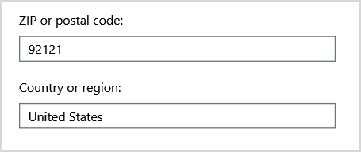

# <a name="why-you-need-to-use-powershell-for-microsoft-365"></a>Warum Sie PowerShell für Microsoft 365 verwenden müssen

*Dieser Artikel gilt sowohl für Microsoft 365 Enterprise als auch für Office 365 Enterprise.*

Mit dem Microsoft 365 Admin Center können Sie Ihre Microsoft 365 Benutzerkonten und Lizenzen verwalten. Sie können auch Ihre Microsoft 365, z. B. Exchange Online, Teams und SharePoint Online, verwalten. Wenn Sie stattdessen PowerShell zum Verwalten dieser Dienste verwenden, können Sie die Befehlszeilen- und Skriptsprachenumgebung für Geschwindigkeit, Automatisierung und zusätzliche Funktionen nutzen.
  
In diesem Artikel wird gezeigt, wie Sie PowerShell verwenden, um Microsoft 365 zu verwalten:
  
- Weitere Informationen, die sie im Admin Center nicht Microsoft 365 sehen können
    
- Konfigurieren von Features und Einstellungen nur mit PowerShell möglich
    
- Massenvorgänge
    
- Filtern von Daten
    
- Drucken oder Speichern von Daten
    
- Dienstübergreifend verwalten
    
Beachten Sie, dass PowerShell für Microsoft 365 eine Reihe von Modulen für Windows PowerShell ist, eine Befehlszeilenumgebung für Windows-basierte Dienste und Plattformen. In dieser Umgebung wird eine Befehlsshellsprache erstellt, die mit zusätzlichen Modulen erweitert werden kann. Es bietet eine Möglichkeit, einfache oder komplexe Befehle oder Skripts auszuführen. Nachdem Sie beispielsweise die PowerShell für Microsoft 365-Module installiert und eine Verbindung mit Ihrem Microsoft 365-Abonnement hergestellt haben, können Sie den folgenden Befehl ausführen, um alle Benutzerpostfächer für Microsoft Exchange Online:
  
```powershell
Get-Mailbox
```

Sie können die Liste der Postfächer auch über das Microsoft 365 Admin Center erhalten, aber das Zählen der Elemente in allen Listen für alle Websites für alle Ihre Web-Apps ist nicht einfach.
  
PowerShell für Microsoft 365 ist so konzipiert, dass Sie Microsoft 365 verwalten und nicht das Microsoft 365 ersetzen. Administratoren müssen PowerShell für Microsoft 365 verwenden können, da es einige Konfigurationsverfahren gibt, die nur über PowerShell für Microsoft 365 werden können. In diesen Fällen müssen Sie wissen, wie Sie:
  
- Installieren Sie die PowerShell für Microsoft 365 Module (nur einmal für jeden Administratorcomputer).
    
- Verbinden ihrem Microsoft 365 (einmal für jede PowerShell-Sitzung).
    
- Sammeln Sie die Informationen, die zum Ausführen der erforderlichen PowerShell für Microsoft 365 erforderlich sind.
    
- Führen Sie PowerShell für Microsoft 365 aus.
    
Nachdem Sie diese grundlegenden Kenntnisse gelernt haben, müssen Sie ihre Postfachbenutzer nicht mithilfe des **Befehls Get-Mailbox** auflisten. Sie müssen auch nicht verstehen, wie Sie einen neuen Befehl wie den zuvor genannten Befehl erstellen, um alle Elemente in allen Listen für alle Websites für alle Ihre Web-Apps zu zählen. Microsoft und die Community der Administratoren können Ihnen bei solchen Aufgaben bei Bedarf helfen.
  
## <a name="powershell-for-microsoft-365-can-reveal-information-that-you-cant-see-with-the-microsoft-365-admin-center"></a>PowerShell für Microsoft 365 kann Informationen preis geben, die Sie im Microsoft 365 Admin Center nicht sehen können

Im Microsoft 365 Admin Center werden viele nützliche Informationen angezeigt. Es werden jedoch nicht alle möglichen Informationen angezeigt, die Microsoft 365 Zu Benutzern, Lizenzen, Postfächern und Websites speichern. Hier ist ein Beispiel für *Benutzer und Gruppen* im Microsoft 365 Admin Center:
  

  
Diese Ansicht enthält die Informationen, die Sie in vielen Fällen benötigen. Es kann jedoch vorkommen, dass Sie mehr benötigen. Beispielsweise hängt Microsoft 365 Lizenzierung (und die Microsoft 365, die einem Benutzer zur Verfügung stehen) teilweise vom geografischen Standort des Benutzers ab. Die Richtlinien und Features, die Sie auf einen Benutzer erweitern können, der in den USA lebt, sind möglicherweise nicht mit denen identisch, die Sie auf einen Benutzer in Indien oder Belgien erweitern können. Führen Sie die folgenden Schritte im Microsoft 365 Admin Center aus, um den geografischen Standort eines Benutzers zu ermitteln:
  
1. Doppelklicken Sie auf den **Anzeigenamen** des Benutzers.
    
2. Wählen Sie im Anzeigebereich benutzereigenschaften Details **aus.**
    
3. Wählen Sie in der Detailanzeige weitere **Details aus.**
    
4. Scrollen Sie, bis Sie die Überschrift **Land oder Region finden:**
    
     
  
5. Notieren Sie den Anzeigenamen des Benutzers auf einem Blatt Papier, oder kopieren ihn in Editor.
    
Sie müssen diese Vorgehensweise für jeden Benutzer wiederholen. Wenn Sie über viele Benutzer verfügen, kann dieser Vorgang mühsam sein. Mit PowerShell für Microsoft 365 können Sie diese Informationen für alle Benutzer mithilfe des folgenden Befehls anzeigen:
  
```powershell
Get-AzureADUser | Select DisplayName, UsageLocation
```


>[!Note]
>PowerShell Core unterstützt nicht das Microsoft Azure Active Directory Modul für Windows PowerShell-Modul und Cmdlets, die *Msol* im Namen haben. Sie müssen diese Cmdlets von einem Windows PowerShell.
>

Hier ein Beispiel für die Ergebnisse:
  
```powershell
DisplayName                               UsageLocation
-----------                               -------------
Bonnie Kearney                            GB
Fabrice Canel                             BR
Brian Johnson (TAILSPIN)                  US
Anne Wallace                              US
Alex Darrow                               US
David Longmuir                            BR
```

Die Interpretation dieses PowerShell-Befehls ist: Alle Benutzer im aktuellen Microsoft 365-Abonnement (**Get-AzureADUser**) erhalten, aber nur den Namen und den Speicherort für jeden Benutzer anzeigen (**Select DisplayName, UsageLocation**).
  
Da PowerShell für Microsoft 365 eine Befehlsshellsprache unterstützt, können Sie die durch den **Befehl Get-AzureADUser erhaltenen Informationen** weiter bearbeiten. Vielleicht möchten Sie diese Benutzer beispielsweise nach ihrem Standort sortieren, indem Sie alle brasilianischen Benutzer, alle Benutzer in den Vereinigten Staaten und so weiter gruppieren. Hier ist der Befehl:
  
```powershell
Get-AzureADUser | Select DisplayName, UsageLocation | Sort UsageLocation, DisplayName
```

Hier ein Beispiel für die Ergebnisse:
  
```powershell
DisplayName                                 UsageLocation
-----------                                 -------------
David Longmuir                              BR
Fabrice Canel                               BR
Bonnie Kearney                              GB
Alex Darrow                                 US
Anne Wallace                                US
Brian Johnson (TAILSPIN)                    US
```

Die Interpretation dieses PowerShell-Befehls ist: Alle Benutzer im aktuellen Microsoft 365-Abonnement erhalten, aber nur den Namen und speicherort für jeden Benutzer anzeigen und zuerst nach dem Speicherort und dann nach dem Namen sortieren (**Sort UsageLocation, DisplayName**).
  
Sie können auch zusätzliche Filterung verwenden. Wenn Sie beispielsweise nur Informationen zu Benutzern in Brasilien anzeigen möchten, verwenden Sie den folgenden Befehl:
  
```powershell
Get-AzureADUser | Where {$_.UsageLocation -eq "BR"} | Select DisplayName, UsageLocation 
```

Hier ein Beispiel für die Ergebnisse:
  
```powershell
DisplayName                                           UsageLocation
-----------                                           -------------
David Longmuir                                        BR
Fabrice Canel                                         BR
```

Die Interpretation dieses PowerShell-Befehls lautet: Alle Benutzer im aktuellen Abonnement Microsoft 365, dessen Speicherort Brasilien ist (**Where {$ \_ . UsageLocation -eq "BR"}**) und dann den Namen und Speicherort für jeden Benutzer anzeigen.
  
 **Hinweis zu großen Domänen**
  
Wenn Sie über eine große Domäne mit Zehntausenden von Benutzern verfügen, kann das Ausprobieren einiger beispiele, die wir in diesem Artikel zeigen, zu Drosselung führen. Basierend auf Faktoren wie Rechenleistung und verfügbarer Netzwerkbandbreite versuchen Sie möglicherweise, gleichzeitig zu viel zu tun. Große Organisationen möchten einige dieser PowerShell-Vorgänge möglicherweise in zwei Befehle aufteilen.

Der folgende Befehl gibt z. B. alle Benutzerkonten zurück und zeigt den Namen und Speicherort für die einzelnen Benutzerkonten an:
  
```powershell
Get-AzureADUser | Select DisplayName, UsageLocation
```

Das funktioniert auch gut bei kleineren Domänen. In einer großen Organisation können Sie diesen Vorgang jedoch in zwei Befehle aufteilen: einen Befehl zum Speichern der Benutzerkontoinformationen in einer Variablen und einen anderen, um die erforderlichen Informationen anzuzeigen. Hier ist ein Beispiel:
  
```powershell
$x = Get-AzureADUser
$x | Select DisplayName, UsageLocation
```

Die Interpretation dieser Gruppe von PowerShell-Befehlen ist:
1. Alle Benutzer im aktuellen Abonnement Microsoft 365, und speichern Sie die Informationen in einer Variablen namens $x (**$x = Get-AzureADUser**).
1.  Zeigt den Inhalt der Variablen *$x* an, enthält jedoch nur den Namen und den Speicherort für jeden Benutzer (**$x | Wählen Sie DisplayName, UsageLocation** aus.
  
## <a name="microsoft-365-has-features-that-you-can-only-configure-with-powershell-for-microsoft-365"></a>Microsoft 365 verfügt über Features, die Sie nur mit PowerShell für Microsoft 365

Das Microsoft 365 Admin Center soll Zugriff auf allgemeine, nützliche Verwaltungsaufgaben bieten, die für die meisten Umgebungen gelten. Anders ausgedrückt: Das Microsoft 365 Admin Center wurde so konzipiert, dass der typische Administrator die gängigsten Verwaltungsaufgaben ausführen kann. Es gibt jedoch einige Aufgaben, die im Admin Center nicht ausgeführt werden können.
  
Beispielsweise bietet das Skype for Business Online Admin Center einige Optionen zum Erstellen benutzerdefinierter Besprechungseinladungen:
  

  
Mit diesen Einstellungen können Sie Besprechungseinladungen eine gewisse persönliche Note und Professionalität verleihen. Es gibt jedoch mehr für Besprechungskonfigurationseinstellungen, als einfach benutzerdefinierte Besprechungseinladungen zu erstellen. Besprechungen ermöglichen standardmäßig beispielsweise Folgendes:
  
- anonymen Benutzern, automatischen Zugang zu jeder Besprechung zu erhalten
    
- Teilnehmern, die Besprechung aufzuzeichnen.
    
- das Festlegen aller Benutzer in Ihrer Organisation als Referenten, wenn sie an der Besprechung teilnehmen.
    
Diese Einstellungen sind nicht im Skype for Business Online Admin Center verfügbar. Sie können sie über PowerShell für Microsoft 365. Hier ist ein Befehl, der diese drei Einstellungen deaktiviert:
  
```powershell
Set-CsMeetingConfiguration -AdmitAnonymousUsersByDefault $False -AllowConferenceRecording $False -DesignateAsPresenter "None"
```

> [!NOTE]
> Zum Ausführen dieses Befehls müssen Sie das Skype for Business [Online PowerShell Module installieren. ](https://www.microsoft.com/download/details.aspx?id=39366)
  
Die Interpretation dieses PowerShell-Befehls ist:
 
1. Deaktivieren Sie in den Einstellungen für neue Skype for Business Onlinebesprechungen (**Set-CsMeetingConfiguration**), anonymen Benutzern den automatischen Eingang zu Besprechungen zu ermöglichen (**-AdmitAnonymousUsersByDefault $False**).
2.  Deaktivieren Der Teilnehmer kann Besprechungen aufzeichnen (**-AllowConferenceRecording $False**).
3. Geben Sie nicht alle Benutzer aus Ihrer Organisation als Moderatoren an (**-DesignateAsPresenter "None"**).
  
Führen Sie diesen Befehl aus, um diese Standardeinstellungen wiederherzustellen (aktivieren Sie die Optionen):
  
```powershell
Set-CsMeetingConfiguration -AdmitAnonymousUsersByDefault $True -AllowConferenceRecording $True -DesignateAsPresenter "Company"
```

Es gibt auch andere ähnliche Szenarien, weshalb Administratoren wissen sollten, wie Sie PowerShell für Microsoft 365 ausführen.
  
## <a name="powershell-for-microsoft-365-is-great-for-bulk-operations"></a>PowerShell für Microsoft 365 ist ideal für Massenvorgänge

Visuelle Schnittstellen wie Microsoft 365 Admin Center sind am wertvollsten, wenn Sie über einen einzelnen Vorgang verfügen. Wenn Sie beispielsweise ein Benutzerkonto deaktivieren müssen, können Sie das Admin Center verwenden, um ein Kontrollkästchen schnell zu finden und zu deaktivieren. Dies ist möglicherweise einfacher als das Ausführen eines ähnlichen Vorgangs in PowerShell.
  
Wenn Sie jedoch viele dinge oder einige ausgewählte Dinge innerhalb einer großen Reihe anderer Dinge ändern müssen, ist das Microsoft 365 Admin Center möglicherweise nicht das beste Tool. Nehmen wir beispielsweise an, Sie müssen das Präfix für Tausende von Telefonnummern ändern oder den bestimmten Benutzer *Ken Myer* von allen Ihren SharePoint entfernen. Wie würden Sie dies im Microsoft 365 tun?
  
Im letzten Beispiel sagen Sie, Sie haben mehrere hundert SharePoint Onlinewebsites, und Sie wissen nicht, bei welchen Ken Meyer mitglied ist. Sie müssen im admin center Microsoft 365 starten und dann dieses Verfahren für jede Website ausführen:
  
1. Wählen Sie die **URL** der Website aus.
    
2. Wählen Sie **im Feld Websitesammlungseigenschaften** den **Link Websiteadresse** aus, um die Website zu öffnen.
    
3. Wählen Sie auf der Website Freigeben **aus.**
    
4. Wählen Sie **im** Dialogfeld Freigeben den Link aus, der alle Benutzer mit Berechtigungen für die Website zeigt:
    
     
  
5. Wählen Sie **im Dialogfeld** Freigegeben mit die Option **Erweitert aus.**
    
6. Scrollen Sie in der Liste der Benutzer nach unten, suchen und wählen Sie Ken Myer aus (vorausgesetzt, er verfügt über Berechtigungen für die Website), und wählen Sie **dann Benutzerberechtigungen entfernen aus.**
    
Dies würde für *mehrere* hundert Websites sehr lange dauern.
  
Die Alternative besteht im Ausführen des folgenden Befehls in PowerShell, Microsoft 365 Ken Myer von allen Websites zu entfernen:
  
```powershell
Get-SPOSite | ForEach {Remove-SPOUser -Site $_.Url -LoginName "kenmyer@litwareinc.com"}
```

> [!NOTE]
> Dieser Befehl erfordert, dass Sie das [SharePoint Online PowerShell-Modul installieren.](/powershell/sharepoint/sharepoint-online/connect-sharepoint-online?view=sharepoint-ps) 
  
Die Interpretation dieses PowerShell-Befehls lautet: Alle SharePoint-Websites im aktuellen **Microsoft 365-Abonnement ( Get-SPOSite**) und für jede Website Ken Meyer aus der Liste der Benutzer entfernen, die darauf zugreifen können (**ForEach {Remove-SPOUser -Site $ \_ . Url -LoginName "kenmyer \@ litwareinc.com"}**).
  
Wir teilen Microsoft 365, Ken Meyer von jeder Website zu entfernen, einschließlich derjenigen, auf die er keinen Zugriff hat. Die Ergebnisse zeigen also Fehler für websites, auf die er keinen Zugriff hat. Wir können eine zusätzliche Bedingung für diesen Befehl verwenden, um Ken Meyer nur von den Websites zu entfernen, auf deren Anmeldeliste er sich befindet. Die zurückgegebenen Fehler verursachen jedoch keinen Schaden für die Websites selbst. Dieser Befehl kann einige Minuten dauern, bis er für Hunderte von Websites ausgeführt wird, anstatt stundenlang durch das Microsoft 365 Admin Center zu arbeiten.
  
Hier sehen Sie ein weiteres Beispiel für einen Massenvorgang. Verwenden Sie diesen Befehl, um *"Bonnie Kearney",* eine neue SharePoint, zu allen Websites in der Organisation hinzuzufügen:
  
```powershell
Get-SPOSite | ForEach {Add-SPOUser -Site $_.Url -LoginName "bkearney@litwareinc.com" -Group "Members"}
```

Die Interpretation dieses PowerShell-Befehls lautet: Alle SharePoint-Websites im aktuellen Microsoft 365-Abonnement erhalten und für jede Website Den Zugriff auf "Bonnie Kearney" zulassen, indem sie ihren Anmeldenamen der Gruppe Mitglieder der Website hinzufügen (**ForEach {Add-SPOUser -Site $ \_ . Url -LoginName "bkearney \@ litwareinc.com" -Group "Members"}**).
  
## <a name="powershell-for-microsoft-365-is-great-at-filtering-data"></a>PowerShell für Microsoft 365 ist beim Filtern von Daten großartig

Das Microsoft 365 Admin Center bietet verschiedene Möglichkeiten, Ihre Daten zu filtern, um eine gezielte Teilmenge von Informationen auf einfache Weise zu finden. Mit Exchange können Sie beispielsweise leicht nach praktisch jeder Eigenschaft eines Benutzerpostfachs filtern. Hier ist beispielsweise die Liste der Postfächer für alle Benutzer, die in bloomington leben:
  

  
Im Exchange Admin Center können Sie auch Filterkriterien kombinieren. Beispielsweise finden Sie die Postfächer für alle Personen, die in Bloomington leben und in der Finanzabteilung arbeiten.
  
Es gibt jedoch Einschränkungen hinsichtlich der Möglichkeiten im Exchange Admin Center. Beispielsweise konnten Sie nicht so einfach die Postfächer von Personen finden, die in *Bloomington* oder San Diego leben, oder die Postfächer für alle Personen, die nicht in Bloomington leben.
  
Sie können die folgende PowerShell für Microsoft 365 verwenden, um eine Liste der Postfächer für alle Personen zu erhalten, die in Bloomington oder San Diego leben:
  
```powershell
Get-User | Where {$_.RecipientTypeDetails -eq "UserMailbox&quot; -and ($_.City -eq &quot;San Diego&quot; -or $_.City -eq &quot;Bloomington")} | Select DisplayName, City
```

Hier ein Beispiel für die Ergebnisse:
  
```powershell
DisplayName                              City
-----------                              ----
Alex Darrow                              San Diego
Bonnie Kearney                           San Diego
Julian Isla                              Bloomington
Rob Young                                Bloomington
```

Die Interpretation dieses PowerShell-Befehls lautet: Get all the users in the current Microsoft 365 subscription who have a mailbox in the city of San Diego or Bloomington (**Where {$ \_ . RecipientTypeDetails -eq "UserMailbox" -and ($ \_ . City -eq "San Diego" -or $ \_ . City -eq "Bloomington")}**), und zeigen Sie dann den Namen und die Stadt für jede (**Select DisplayName, City**) an.
  
Und hier ist der Befehl zum Auflisten aller Postfächer für Personen, die an einem beliebigen Ort mit Ausnahme von Bloomington leben:
  
```powershell
Get-User | Where {$_.RecipientTypeDetails -eq "UserMailbox" -and $_.City -ne "Bloomington"} | Select DisplayName, City
```

Hier ein Beispiel für die Ergebnisse:
  
```powershell
DisplayName                               City
-----------                               ----
MOD Administrator                         Redmond
Alex Darrow                               San Diego
Allie Bellew                              Bellevue
Anne Wallace                              Louisville
Aziz Hassouneh                            Cairo
Belinda Newman                            Charlotte
Bonnie Kearney                            San Diego
David Longmuir                            Waukesha
Denis Dehenne                             Birmingham
Garret Vargas                             Seattle
Garth Fort                                Tulsa
Janet Schorr                              Bellevue
```

Die Interpretation dieses PowerShell-Befehls lautet: Get all the users in the current Microsoft 365 subscription who have a mailbox not located in the city of Bloomington (**Where {$ \_ . RecipientTypeDetails -eq "UserMailbox" -and $ \_ . City -ne "Bloomington"}**), und zeigen Sie dann den Namen und die Stadt für jeden an.
  
### <a name="use-wildcards"></a>Verwenden von Platzhaltern

Sie können auch Platzhalterzeichen in Ihren PowerShell-Filtern verwenden, um einen Teil eines Namens zu entsprechen. Angenommen, Sie suchen nach einem Benutzerkonto. Sie können sich nur daran erinnern, dass der Nachname des Benutzers *Anderson* oder *vielleicht Henderson* oder *Jorgenson war.*
  
Sie könnten diesen Benutzer im Microsoft 365 Admin Center nachverfolgen, indem Sie das Suchtool verwenden und drei verschiedene Suchen durchführen:
  
- Eine für  *Anderson* 
    
- Eine für  *Henderson* 
    
- Und eine für  *Jorgenson* 
    
Da alle drei namen in "son" enden, können Sie PowerShell mitteilen, dass alle Benutzer angezeigt werden, deren Name in "son" endet. Hier ist der Befehl:
  
```powershell
Get-User -Filter '{LastName -like "*son"}'
```

Die Interpretation dieses PowerShell-Befehls lautet: Alle Benutzer im aktuellen Microsoft 365-Abonnement erhalten, verwenden Sie jedoch einen Filter, der nur die Benutzer auflistet, deren Nachnamen in "son" enden (**-Filter '{LastName -like " \* son"}'**). Der steht für einen beliebigen Satz von Zeichen, bei denen es sich um Buchstaben \* im Nachnamen des Benutzers handelt.
  
## <a name="powershell-for-microsoft-365-makes-it-easy-to-print-or-save-data"></a>PowerShell für Microsoft 365 erleichtert das Drucken oder Speichern von Daten

Im Microsoft 365 Admin Center können Sie Listen mit Daten anzeigen. Hier ist ein Beispiel für das Skype for Business Online Admin Center, in dem eine Liste der Benutzer angezeigt wird, die für Skype for Business Online aktiviert wurden:
  

  
Um diese Informationen in einer Datei zu speichern, müssen Sie sie in ein Dokument oder ein Microsoft Excel einfügen. In beiden Fällen kann zusätzliche Formatierung erforderlich sein. Darüber hinaus bietet Microsoft 365 Admin Center keine Möglichkeit, die angezeigte Liste direkt zu drucken.
  
Glücklicherweise können Sie PowerShell verwenden, um die Liste nicht nur zu anzeigen, sondern sie in einer Datei zu speichern, die problemlos in die Datei importiert Excel. Im Folgenden finden Sie einen Beispielbefehl zum Speichern von Skype for Business Online-Benutzerdaten in einer CSV-Datei (Comma-separated values), die dann problemlos als Tabelle in einem arbeitsblatt Excel werden kann:
  
```powershell
Get-CsOnlineUser | Select DisplayName, UserPrincipalName, UsageLocation | Export-Csv -Path "C:\Logs\SfBUsers.csv" -NoTypeInformation
```

Hier ein Beispiel für die Ergebnisse:
  

  
Die Interpretation dieses PowerShell-Befehls ist: Alle Skype for Business Onlinebenutzer im aktuellen Microsoft 365 abonnement (**Get-CsOnlineUser**); nur den Benutzernamen, den UPN und den Speicherort abrufen (**Select DisplayName, UserPrincipalName, UsageLocation**); und speichern Sie diese Informationen dann in einer CSV-Datei namens C: \\ Logs \\SfBUsers.csv (**Export-Csv -Path "C: \\ Logs \\SfBUsers.csv" -NoTypeInformation**).
  
Sie können auch Optionen verwenden, um diese Liste als XML-Datei oder HTML-Seite zu speichern. Mit zusätzlichen PowerShell-Befehlen könnten Sie sie direkt als Excel datei mit beliebiger benutzerdefinierter Formatierung speichern.
  
Sie können auch die Ausgabe eines PowerShell-Befehls senden, der eine Liste direkt an den Standarddrucker in Windows. Hier ist ein Beispielbefehl:
  
```powershell
Get-CsOnlineUser | Select DisplayName, UserPrincipalName, UsageLocation | Out-Printer
```

Das gedruckte Dokument sieht wie folgt aus:
  

  
Die Interpretation dieses #A0 ist: Alle Benutzer Skype for Business #A1 im aktuellen #A1 Microsoft 365 erhalten. nur den Benutzernamen, den UPN und den Speicherort abrufen; und senden Sie diese Informationen dann an den Standarddrucker Windows (**Out-Printer**).
  
Das gedruckte Dokument hat dieselbe einfache Formatierung wie die Anzeige im PowerShell-Befehlsfenster. Um eine Kopie zu erhalten, fügen Sie einfach **| Out-Printer** bis zum Ende des Befehls.
  
## <a name="powershell-for-microsoft-365-lets-you-manage-across-server-products"></a>Mit PowerShell für Microsoft 365 können Sie serverübergreifend verwalten

Die Komponenten, aus Microsoft 365 sind für die Zusammenarbeit konzipiert. Angenommen, Sie fügen einen neuen Benutzer zu Microsoft 365 und geben informationen wie die Abteilung und Telefonnummer des Benutzers an. Diese Informationen sind dann verfügbar, wenn Sie auf die Informationen des Benutzers in einem der Microsoft 365-Dienste zugreifen: Skype for Business Online, Exchange oder SharePoint.
  
Hierbei handelt es sich um allgemeine Informationen, die für die ganze Produktsuite gleich sind. Produktspezifische Informationen, z. B. Informationen zum Postfach eines Exchange, sind in der Regel nicht in der gesamten Suite verfügbar. Beispielsweise sind Informationen darüber, ob das Postfach eines Benutzers aktiviert ist oder nicht, nur im Exchange Admin Center verfügbar.
  
Angenommen, Sie möchten einen Bericht erstellen, in dem die folgenden Informationen für alle Benutzer enthalten sind:
  
- Den Anzeigenamen des Benutzers
    
- Gibt an, ob der Benutzer für Microsoft 365
    
- Ob das Exchange-Postfach des Benutzers aktiviert wurde
    
- Ob der Benutzer für Skype for Business Online aktiviert ist
    
Sie können einen solchen Bericht nicht einfach im Microsoft 365 erstellen. Stattdessen müssten Sie ein separates Dokument erstellen, um die Informationen zu speichern, z. B. ein Excel Arbeitsblatt. Dann erhalten Sie alle Benutzernamen und Lizenzierungsinformationen aus dem Microsoft 365 Admin Center, erhalten Postfachinformationen aus dem Exchange Admin Center, erhalten Skype for Business Online-Informationen aus dem Skype for Business Online Admin Center, und kombinieren Sie diese Informationen.
  
Die Alternative besteht in der Verwendung eines PowerShell-Skripts, um den Bericht für Sie zu kompilieren.
  
Das folgende Beispielskript ist komplizierter als die Befehle, die Sie bisher in diesem Artikel gesehen haben. Es zeigt jedoch das Potenzial der Verwendung von PowerShell zum Erstellen von Informationsansichten, die andernfalls schwer zu erhalten sind. Hier ist das Skript zum Kompilieren und Anzeigen der benötigten Liste:
  
```powershell
$x = Get-AzureADUser

foreach ($i in $x)
    {
      $y = Get-Mailbox -Identity $i.UserPrincipalName
      $i | Add-Member -MemberType NoteProperty -Name IsMailboxEnabled -Value $y.IsMailboxEnabled

      $y = Get-CsOnlineUser -Identity $i.UserPrincipalName
      $i | Add-Member -MemberType NoteProperty -Name EnabledForSfB -Value $y.Enabled
    }

$x | Select DisplayName, IsLicensed, IsMailboxEnabled, EnabledforSfB
```

Hier ein Beispiel für die Ergebnisse:
  
```powershell
DisplayName             IsLicensed   IsMailboxEnabled   EnabledForSfB
-----------             ----------   ----------------   --------------
Bonnie Kearney          True         True               True
Fabrice Canel           True         True               True
Brian Johnson           False        True               False
Anne Wallace            True         True               True
Alex Darrow             True         True               True
David Longmuir          True         True               True
Katy Jordan             False        True               False
Molly Dempsey           False        True               False
```

Die Interpretation dieses PowerShell-Skripts ist:  

1. Alle Benutzer im aktuellen abonnement Microsoft 365 und speichern Sie die Informationen in einer Variablen namens *$x* (**$x = Get-AzureADUser**).
1. Starten Sie eine Schleife, die über alle Benutzer in der Variablen $x (**foreach ($i in $x) ausgeführt wird.**  
1. Definieren Sie eine Variable *namens $y* und speichern Sie die Postfachinformationen des Benutzers in dieser ( $y =**Get-Mailbox -Identity $i.UserPrincipalName**).
1. Fügen Sie den Benutzerinformationen mit dem Namen *IsMailBoxEnabled* eine neue Eigenschaft hinzu. Legen Sie ihn auf den Wert der IsMailBoxEnabled-Eigenschaft des Postfachs des Benutzers fest (**$i | Add-Member -MemberType NoteProperty -Name IsMailboxEnabled -Value $y.IsMailboxEnabled**).
1. Definieren Sie eine Variable *namens $y*, und speichern Sie die Skype for Business Onlineinformationen des Benutzers in dieser ( $y =**Get-CsOnlineUser -Identity $i.UserPrincipalName**).
1. Fügen Sie den Benutzerinformationen mit dem Namen *EnabledForSfB* eine neue Eigenschaft hinzu. Legen Sie ihn auf den Wert der Enabled-Eigenschaft der Skype for Business Online-Informationen des Benutzers fest (**$i | Add-Member -MemberType NoteProperty -Name EnabledForSfB -Value $y.Enabled**).
1. Zeigt die Liste der Benutzer an, enthält jedoch nur ihren Namen, ob sie lizenziert sind, und die beiden neuen Eigenschaften, die angeben, ob ihr Postfach aktiviert ist und ob sie für Skype for Business Online aktiviert sind (**$x | Wählen Sie DisplayName, IsLicensed, IsMailboxEnabled, EnabledforSfB** aus.
  
## <a name="see-also"></a>Siehe auch

[Erste Schritte mit PowerShell für Microsoft 365](getting-started-with-microsoft-365-powershell.md)
  
[Verwalten von Microsoft 365-Benutzerkonten, -Lizenzen und -Gruppen mit PowerShell](manage-user-accounts-and-licenses-with-microsoft-365-powershell.md)
  
[Verwenden der Windows PowerShell zum Erstellen von Berichten in Microsoft 365](use-windows-powershell-to-create-reports-in-microsoft-365.md)