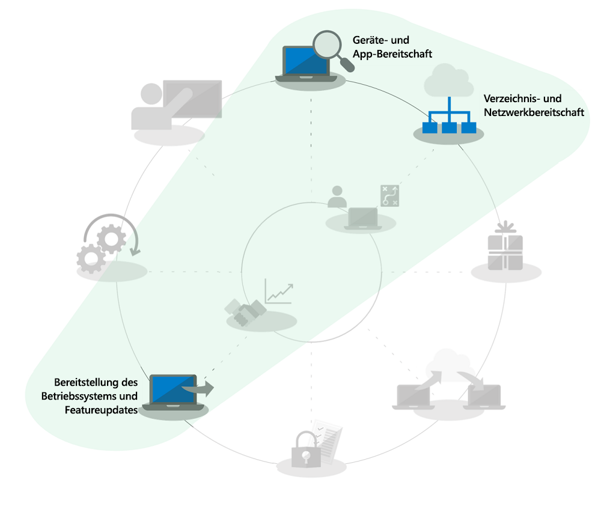
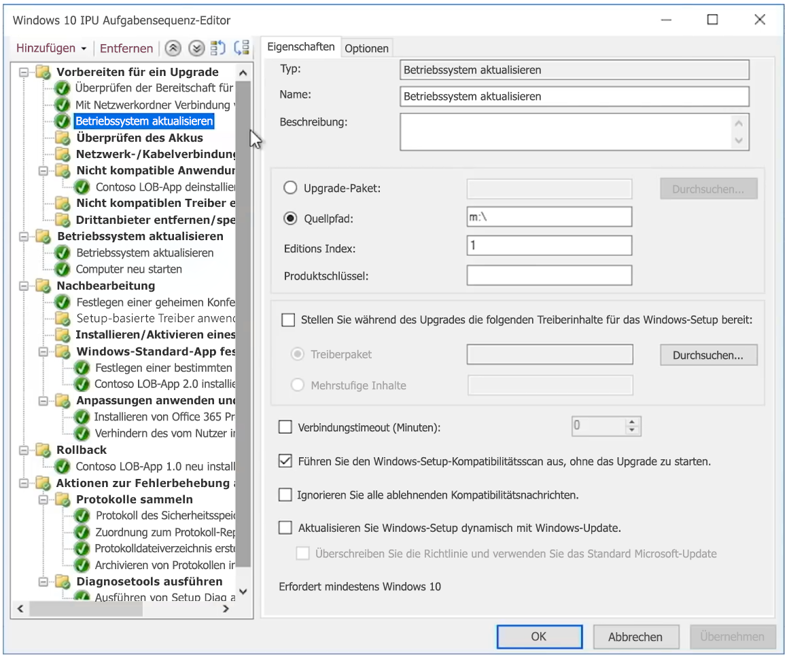

# In-Place-Upgrades von Windows 7 auf Windows 10 für große Organisationen

Ab dem 14. Januar 2020 werden Sicherheitsupdates oder Support für PCs unter Windows 7 nicht mehr bereitgestellt. Es bleiben nur wenige Monate Zeit, um von Windows 7 auf Windows 10 zu wechseln, gleichzeitig gilt es, mehrere Optionen bereitzustellen. Deshalb lautet eine häufige Frage in der IT-Community: "Was ist der schnellste Weg, um von Windows 7 auf Windows 10 zu wechseln?" Die kurze Antwort lautet, In-Place-Upgrades für bestehende PCs durchzuführen, wodurch der Fokus hinsichtlich verschiedener Aspekte des Desktopbereitstellungsprozesses reduziert werden kann.

Mithilfe von In-Place-Upgrades werden mehrere Desktopbereitstellungsprozesse erheblich in ihrem Umfang reduziert, insbesondere:

  - **Anwendungspaketerstellung** und die erneute Zustellung von erforderlichen Branchen-Apps: Diese werden einfach aus der Windows 7-Umgebung übernommen.

  - **Dateimigration** und grundlegende Benutzereinstellungen: Diese werden ebenfalls von der vorherigen Installation übernommen, wenn derselbe Benutzer das Gerät beibehält.

Die grau dargestellten Vorgänge in der Bereitstellungsprozess-Grafik sind keine Elemente, die Sie vollständig ignorieren können. Um Zeit zu sparen wird jedoch davon ausgegangen, dass Sie die Sicherheitskonfiguration übertragen und die Softwareupdateprozesse nach der Bereitstellung ändern werden. Darüber hinaus wird angenommen, dass die Schulung Ihrer Benutzer für die Windows-Komponente weitgehend zu Hause erfolgt ist, da seit 2012 auf einem Großteil der für den privaten Gebrauch gekauften Windows-Computer nicht Windows 7 vorinstalliert war und seit der Veröffentlichung von Windows 10 in 2015 die Mehrzahl der Windows 7 Home-Systeme auf Windows 10 aktualisiert worden ist.

## Zuverlässigkeit, Sicherheit und Skalierung von In-Place-Upgrades

In-Place-Upgrades auf Windows 10 sind ein zuverlässiger Ansatz zum Aktualisieren eines bestehenden Geräts unter Windows 7 oder höher auf Windows 10, ohne dass Dateimigrationen oder die Neuinstallation von Anwendungen erforderlich sind. Nach einem In-Place-Upgrade entsprechen die Dateien, Einstellungen und verfügbaren Apps des Benutzers jenen der vorherigen Windows 7-Installation. Vielleicht möchten Sie diese Gelegenheit nutzen, um bestehende Apps oder Einstellungen zu bereinigen, da es bis zum Ende des Supports für Windows 7 im Januar 2020 nicht mehr weit ist, sollte die knappe Zeit genutzt werden, um andere Optionen zu verfolgen. Upgrades funktionieren auch bei einem Wechsel von Like-to-Like-Architekturen (von 32-Bit zu 32-Bit oder von 64-Bit zu 64-Bit) und Like-to-Like-Editionen von Windows (von Professional zu Professional oder von Enterprise zu Enterprise).

Der Upgradeprozess sichert Ihre vorherige Windows-Installation standardmäßig als Teil des Upgrades, damit bei einem Upgradefehler oder falls ein Gerät oder eine Anwendung nach dem Upgrade nicht ordnungsgemäß funktionieren sollte, ein Rollback auf Windows 7 möglich ist. Bei aktualisierten PCs haben Sie standardmäßig 10 Tage Zeit, um bei Bedarf manuell einen Rollback auf Windows 7 einleiten zu können.

In-Place-Upgrades lassen sich mit Betriebssystem-Bereitstellungstools wie [System Center Configuration Manager](https://docs.microsoft.com/de-DE/sccm/osd/deploy-use/create-a-task-sequence-to-upgrade-an-operating-system) oder dem [Microsoft Deployment Toolkit](https://docs.microsoft.com/de-DE/windows/deployment/upgrade/upgrade-to-windows-10-with-the-microsoft-deployment-toolkit) automatisieren. In diesem Artikel werden die automatisierten Ansätze und Optimierungen. Er enthält außerdem Links zu verwandten Ressourcen für zusätzliche Hilfe.

## Aktualisieren einer kleinen Anzahl von Computern

Bei einem einzelnen oder einer geringen Anzahl Computer ist die manuelle Methode in der Regel die bessere Option gegenüber automatisierten Ansätzen. Sie finden die erforderliche Software und Lizenzen im [Microsoft Store](http://go.microsoft.com/fwlink/p/?LinkId=808282), bei anderen Software-Einzelhändlern oder im [Volume Licensing Service Center](https://www.microsoft.com/licensing/servicecenter/default.aspx), wenn Sie über eine Volumenlizenzierung verfügen. Eine detaillierte Anleitung zum Upgrade eines einzelnen PCs auf Windows 10 sowie zu Wiederherstellungsoptionen nach dem Upgrade finden Sie in der [schrittweisen Anleitung für das manuelle Upgrade von Windows 7 auf Windows 10](https://docs.microsoft.com/de-DE/microsoft-365/enterprise/windows-7-to-windows-10-upgrade).

## So führen Sie ein Upgrade vieler Computer durch

Wenn Sie Dutzende oder Tausende von Computern verwalten, empfiehlt es sich, In-Place-Upgrades mithilfe der Aufgabensequenz-Automatisierung mit System Center Configuration Manager oder dem Microsoft Deployment Toolkit durchzuführen. Der Vorgang ist in den meisten Situationen sehr zuverlässig, je nach Anzahl der PCs, die Sie upgraden, ist es trotzdem sinnvoll, über die erforderlichen Tests und Steuerelemente zu verfügen, um das Upgrade bei großen Umfängen zu sichern.

Dies bedeutet, dass Sie die Verzeichnisuntersuchung oder Aufgaben, die Azure Active Directory, Office und Branchen-App-Zustellung und Paketerstellung sowie der Migration von Benutzerdateien zugeordnet sind, überspringen können, da diese Elemente als Teil des Upgrades beibehalten werden und die Sicherheitsmaßnahmen zumindest übernommen werden sollten. Diese Bereiche können im Verlauf der Zeit erweitert werden.

Die Option für die Upgrade-Bereitstellung wird in [Bereitstellung des Betriebssystems und Featureupdates](http://www.aka.ms/mdd6) behandelt. Sie können zwar auf einfache Weise Skriptlösungen erstellen, durch die das Setup von Windows 10 mit minimaler oder gar keiner Interaktion eines Administrators automatisch ausgeführt wird, eine Aufgabensequenz bietet Ihnen jedoch eine genauere Kontrolle im Hinblick auf folgende Arbeitsgänge:

  - Durchführen von Überprüfungen vor der Bereitstellung

  - Verwalten des Laufwerk-Verschlüsselungszustands vor dem Upgrade

  - Deinstallieren von als problematisch bekannten Treibern und Apps vor dem Upgrade

  - Installieren zusätzlicher Treiber und Apps nach dem Upgrade

  - Verwalten des Laufwerk-Verschlüsselungszustands nach dem Upgrade

  - Wiederherstellen eines PCs auf einen früheren Status – wenn deinstallierte Apps oder Treiber neu installiert werden – im Falle eines fehlgeschlagenen Upgrades

  - Alle weiteren Konfigurationsaktionen, die Sie für einen verwendungsbereiten Status benötigen.

Zu den häufigsten Gründen, warum Upgrades möglicherweise nicht abgeschlossen werden oder nicht möglich sind, zählen etwa Probleme mit:

  - Veralteten Gerätetreibern

  - Drittanbieter-Datenträgerverschlüsselung

  - Codelösungen auf niedriger Stufe, z. B. Antischadsoftware, VPN oder Virtualisierung

Die Vorlagen für [Upgrade-Aufgabensequenzen](https://docs.microsoft.com/de-DE/sccm/osd/deploy-use/create-a-task-sequence-to-upgrade-an-operating-system) sind in System Center Configuration Manager (Current Branch) integriert und seit mehreren Versionen verfügbar. Die Technologie von System Center Configuration Manager wurde bei aktuellen Versionen erheblich verbessert, um den Prozess noch effizienter zu gestalten im Hinblick auf die Ermittlung der Kompatibilität von Geräten und Office, die Reduzierung des Netzwerkdatenverkehrs und die Konfiguration neuer Optionen wie etwa OneDrive Backup. Sehen Sie sich diese [Microsoft Mechanics-Präsentation](https://youtu.be/CYRnAmCD7ls) an, um mehr über die neuesten Updates für die System Center Configuration Manager-BS-Bereitstellung zu erfahren.

Wenn Sie System Center Configuration Manager nicht verwenden, können Sie mithilfe des Microsoft Deployment Toolkits Aufgabensequenzen für die Aktualisierungsbereitstellung erstellen und ausführen.

## Upgrades durch vorabzwischengespeicherte Aufgabensequenzen

Clients können mithilfe des [Features „vorgeschalteter Cache“ (pre-cache, Vorabzwischenspeicherung)](https://docs.microsoft.com/de-DE/sccm/osd/deploy-use/create-a-task-sequence-to-upgrade-an-operating-system#configure-pre-cache-content) für Bereitstellungsaufgabensequenzen in Configuration Manager relevante Paketinhalte des BS-Upgrades herunterladen, bevor die Aufgabensequenz das Betriebssystem aktualisiert. Bisher wurde durch das Initiieren der Aufgabensequenz der Download von Paketinhalten gestartet. Vorabzwischengespeicherte Inhalte bieten Clients zudem die Möglichkeit, nur das jeweils zutreffende BS-Upgrade-Paket sowie alle anderen referenzierten Inhalte herunterzuladen, sobald die Bereitstellung empfangen wird.

Vorabzwischengespeicherte Aufgabensequenzen in Kombination mit Kompatibilitätsüberprüfungen

Zusätzlich zur Zeiteinsparung für den Pakete-Download können Sie das Upgrade-Paket vorabzwischenspeichern und mithilfe von Windows Setup bestimmen, ob das In-Place-Upgrade erfolgreich war, bevor Sie das eigentliche Windows-Upgrade ausführen. Die folgende Befehlszeilensyntax kann verwendet werden, um eine Kompatibilitätsüberprüfung im Hintergrund auszuführen und zu ermitteln, ob Windows Setup das Gerät als für das Upgrade bereit bewertet.

Die Protokolle werden dann an den festgelegten Server-Pfad gesendet, während Windows Setup selbst dem Benutzer nicht angezeigt wird und ohne Benutzerinteraktion geschlossen wird.

Die Ergebnisse der Protokolle selbst lauten folgendermaßen:

1.  Wenn von Windows Setup keine Kompatibilitätsprobleme gefunden wurden und der PC allen Anforderungen entspricht, wird MOSETUP\_E\_COMPAT\_SCANONLY (0xC1900210) zurückgegeben.

2.  Wenn von Windows Setup Kompatibilitätsprobleme gefunden wurden, wie etwa Apps, die als nicht kompatibel bekannt sind, wird MOSETUP\_E\_COMPAT\_INSTALLREQ\_BLOCK (0xC1900208) zurückgegeben.

3.  Wenn Windows Setup feststellt, dass der PC nicht für Windows 10 geeignet ist, wird MOSETUP\_E\_COMPAT\_SYSREQ\_BLOCK (0xC1900200) zurückgegeben.

4.  Wenn Windows Setup feststellt, dass der PC nicht über genügend freien Speicherplatz für die Installation verfügt, wird MOSETUP\_E\_INSTALLDISKSPACE\_BLOCK (0xC190020E) zurückgegeben.

Nachdem Sie vorabzwischengespeicherte Sequenzen mit Kompatibilitätsüberprüfungen für eine große Anzahl von PCs in einer Sammlung bereitgestellt haben, können Sie mit der Analyse der Protokolldateien für die Gerätebereitschaft beginnen. Hinsichtlich der oben aufgeführten Ausgaben kann auf \#1 (0xC1900210) mit "bereit für die Bereitstellung" und \#4 (0xC190020E) durch das Freigeben von Speicherplatz reagiert werden. Diesbezüglich sollten Sie beim Löschen vorsichtig sein. Windows Update Cleanup, Papierkorb und temporäre Dateien sind jedoch gute Ausgangspunkte, und in vielen Fällen wird hier genügend Speicherplatz für das erfolgreiche Upgrade frei. Sie können die Kompatibilitätsprüfung so oft ausführen, bis der PC als für das In-Place-Upgrade bereit eingestuft wird. Weitere Informationen zu den Windows Setup-Befehlszeilenoptionen finden Sie unter <https://aka.ms/setupswitches>.

## [Bereitstellungscenter für Desktop](https://aka.ms/howtoshift)
