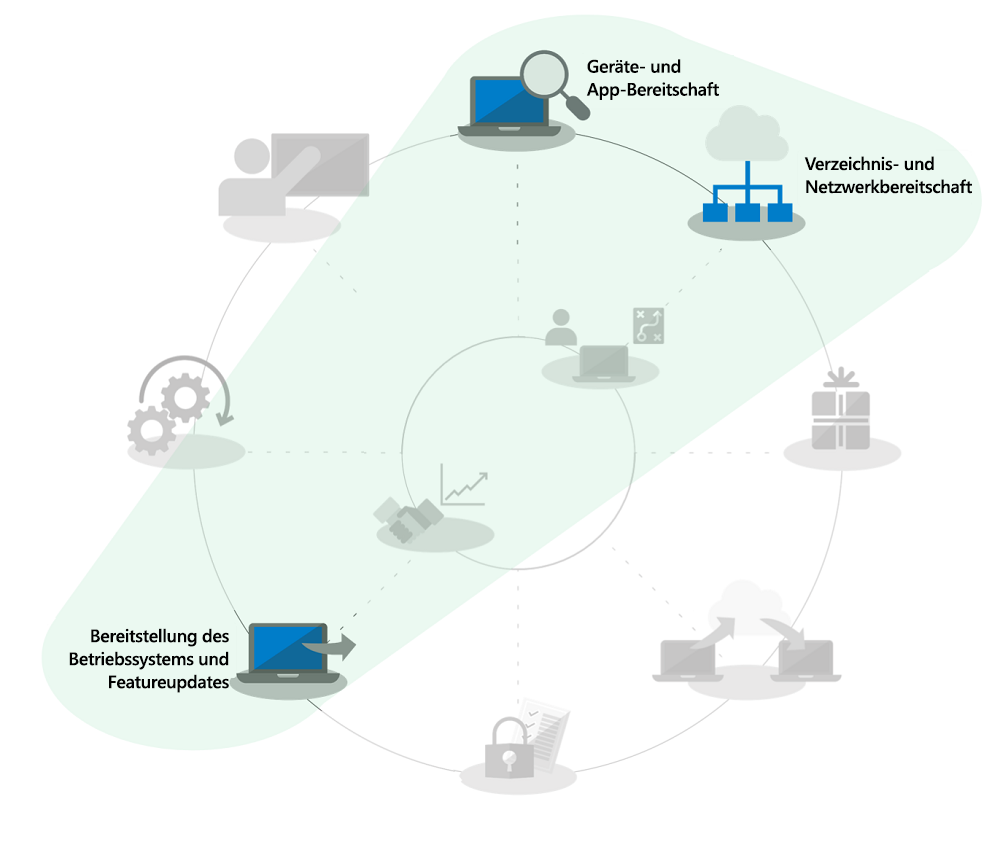
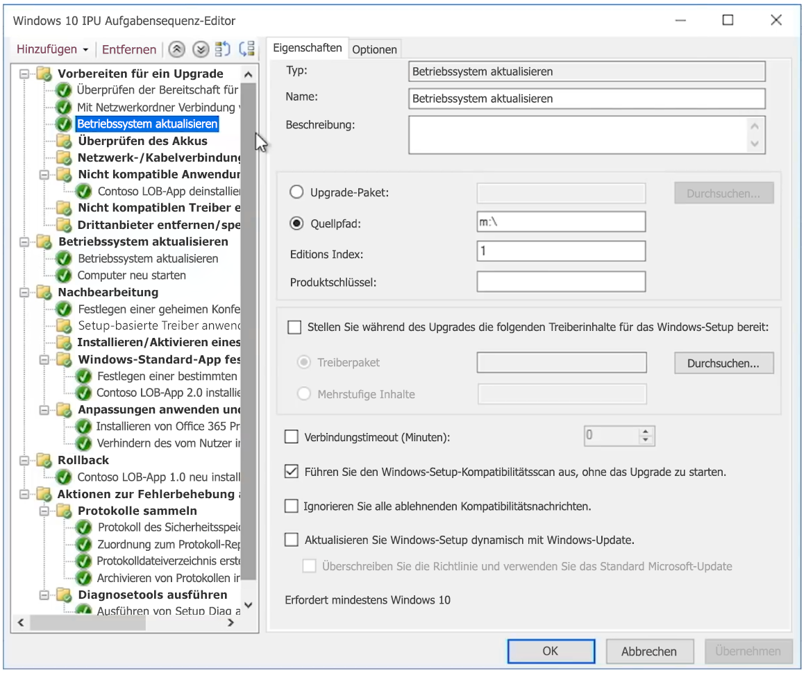

# In-Place-Upgrades von Windows 7 auf Windows 10 für große OrganisationenWindows 7 to Windows 10 automated in-place upgrades for large organizations

Ab dem 14. Januar 2020 werden Sicherheitsupdates oder Support für PCs unter Windows 7 nicht mehr bereitgestellt.Starting January 14, 2020, security updates or support for PCs running Windows 7 will no longer be provided. Es bleiben nur wenige Monate Zeit, um von Windows 7 auf Windows 10 zu wechseln, gleichzeitig gilt es, mehrere Optionen bereitzustellen. Deshalb lautet eine häufige Frage in der IT-Community: "Was ist der schnellste Weg, um von Windows 7 auf Windows 10 zu wechseln?"With just a months left to shift from Windows 7 to Windows 10 and multiple options to deploy, a common question in the IT community is, “What’s the fastest way to move from Windows 7 to Windows 10?” Die kurze Antwort lautet, In-Place-Upgrades für bestehende PCs durchzuführen, wodurch der Fokus hinsichtlich verschiedener Aspekte des Desktopbereitstellungsprozesses reduziert werden kann.The short answer is to perform in-place upgrades for existing PCs and in doing that you can reduce focus on several aspects of the desktop deployment process.

Mithilfe von In-Place-Upgrades werden mehrere Desktopbereitstellungsprozesse erheblich in ihrem Umfang reduziert, insbesondere:Using in-place upgrades, several desktop deployment processes get reduced dramatically in scope, especially:

  - **Anwendungspaketerstellung** und die erneute Zustellung von erforderlichen Branchen-Apps: Diese werden einfach aus der Windows 7-Umgebung übernommen.**Application packaging** and redelivery of required line-of-business apps – these are simply carried forward from the Windows 7 environment

  - **Dateimigration** und grundlegende Benutzereinstellungen: Diese werden ebenfalls von der vorherigen Installation übernommen, wenn derselbe Benutzer das Gerät beibehält.**File migration** and basic user settings – these are also carried forward from the previous install when the same user retains the device

Die grau dargestellten Vorgänge in der Bereitstellungsprozess-Grafik sind keine Elemente, die Sie vollständig ignorieren können. Um Zeit zu sparen wird jedoch davon ausgegangen, dass Sie die Sicherheitskonfiguration übertragen und die Softwareupdateprozesse nach der Bereitstellung ändern werden. Darüber hinaus wird angenommen, dass die Schulung Ihrer Benutzer für die Windows-Komponente weitgehend zu Hause erfolgt ist, da seit 2012 auf einem Großteil der für den privaten Gebrauch gekauften Windows-Computer nicht Windows 7 vorinstalliert war und seit der Veröffentlichung von Windows 10 in 2015 die Mehrzahl der Windows 7 Home-Systeme auf Windows 10 aktualisiert worden ist.The grayed-out tasks in the deployment process wheel graphic above are not items that you can completely ignore, but to save time this assumes that you’ll bring forward your security configuration, change software update processes post-deployment, and we’ll assume that your user training for the Windows component has largely happened at home for your users, as privately purchased Windows computers since 2012 for most part have not had Windows 7 pre-loaded and since the release of Windows 10 in 2015, the majority of Windows 7 home systems have also been upgraded to Windows 10.

## Zuverlässigkeit, Sicherheit und Skalierung von In-Place-UpgradesIn-place upgrade reliability, safeguards, and scale

In-Place-Upgrades auf Windows 10 sind ein zuverlässiger Ansatz zum Aktualisieren eines bestehenden Geräts unter Windows 7 oder höher auf Windows 10, ohne dass Dateimigrationen oder die Neuinstallation von Anwendungen erforderlich sind.In-place upgrades to Windows 10 are a reliable approach for moving an existing device running Windows 7 or newer to Windows 10, without requiring file migration or application reinstallation. Nach einem In-Place-Upgrade entsprechen die Dateien, Einstellungen und verfügbaren Apps des Benutzers jenen der vorherigen Windows 7-Installation.After an in-place upgrade, the user’s files, settings and available apps are consistent with their previous Windows 7 installation. Vielleicht möchten Sie diese Gelegenheit nutzen, um bestehende Apps oder Einstellungen zu bereinigen, da es bis zum Ende des Supports für Windows 7 im Januar 2020 nicht mehr weit ist, sollte die knappe Zeit genutzt werden, um andere Optionen zu verfolgen.While you might want to take this opportunity to clean-up existing apps or settings, realistically as we get closer to the Windows 7 end of support date in January 2020, time is running out to pursue other options. Upgrades funktionieren auch bei einem Wechsel von Like-to-Like-Architekturen (von 32-Bit zu 32-Bit oder von 64-Bit zu 64-Bit) und Like-to-Like-Editionen von Windows (von Professional zu Professional oder von Enterprise zu Enterprise).Upgrades also work when moving from like-to-like architectures (32-bit to 32-bit or 64-bit to 64-bit) and like-to-like editions of Windows (Professional to Pro or Enterprise to Enterprise).

Der Upgradeprozess sichert Ihre vorherige Windows-Installation standardmäßig als Teil des Upgrades, damit bei einem Upgradefehler oder falls ein Gerät oder eine Anwendung nach dem Upgrade nicht ordnungsgemäß funktionieren sollte, ein Rollback auf Windows 7 möglich ist.The upgrade process by default backs-up your previous Windows installation as part of upgrade, so that in the event of an upgrade failure or if a device or application doesn’t function properly post-upgrade, the computer can roll back to Windows 7. Bei aktualisierten PCs haben Sie standardmäßig 10 Tage Zeit, um bei Bedarf manuell einen Rollback auf Windows 7 einleiten zu können.Upgraded PCs by default have 10 days so you can manually initiate a roll back to Windows 7 if necessary.

In-Place-Upgrades lassen sich mit Betriebssystem-Bereitstellungstools wie [Microsoft Endpoint Configuration Manager](https://docs.microsoft.com/configmgr/osd/deploy-use/create-a-task-sequence-to-upgrade-an-operating-system) oder dem [Microsoft Deployment Toolkit](https://docs.microsoft.com/windows/deployment/upgrade/upgrade-to-windows-10-with-the-microsoft-deployment-toolkit) automatisieren.In-place upgrades can be automated using operating system deployment tools like [Microsoft Endpoint Configuration Manager](https://docs.microsoft.com/configmgr/osd/deploy-use/create-a-task-sequence-to-upgrade-an-operating-system) or the [Microsoft Deployment Toolkit](https://docs.microsoft.com/windows/deployment/upgrade/upgrade-to-windows-10-with-the-microsoft-deployment-toolkit). In diesem Artikel werden die automatisierten Ansätze und Optimierungen. Er enthält außerdem Links zu verwandten Ressourcen für zusätzliche Hilfe.This article highlights the automated approaches and optimizations along with links to related resources for additional help.

## Aktualisieren einer kleinen Anzahl von ComputernUpgrading a small number of computers

Bei einem einzelnen oder einer geringen Anzahl Computer ist die manuelle Methode in der Regel die bessere Option gegenüber automatisierten Ansätzen.For a single computer or a handful of computers, the manual approach to upgrade is usually the best option compared to more automated approaches. Sie finden die erforderliche Software und Lizenzen im [Microsoft Store](https://go.microsoft.com/fwlink/p/?LinkId=808282), bei anderen Software-Einzelhändlern oder im [Volume Licensing Service Center](https://www.microsoft.com/licensing/servicecenter/default.aspx), wenn Sie über eine Volumenlizenzierung verfügen.You can find the necessary software and licenses at the [Microsoft Store](https://go.microsoft.com/fwlink/p/?LinkId=808282), other software retailers, or at the [Volume Licensing Service Center](https://www.microsoft.com/licensing/servicecenter/default.aspx) if you have volume licensing. Eine detaillierte Anleitung zum Upgrade eines einzelnen PCs auf Windows 10 sowie zu Wiederherstellungsoptionen nach dem Upgrade finden Sie in der [schrittweisen Anleitung für das manuelle Upgrade von Windows 7 auf Windows 10](https://docs.microsoft.com/microsoft-365/enterprise/windows-7-to-windows-10-upgrade).For detailed guidance to upgrade a single PC to Windows 10 as well as post-upgrade restore options, see the [Windows 7 to Windows 10 manual upgrade step-by-step guide](https://docs.microsoft.com/microsoft-365/enterprise/windows-7-to-windows-10-upgrade).

## So führen Sie ein Upgrade vieler Computer durchHow to upgrade many computers

Wenn Sie Dutzende oder Tausende von Computern verwalten, empfiehlt es sich, In-Place-Upgrades mithilfe der Tasksequenz-Automatisierung mit Microsoft Endpoint Configuration Manager oder dem Microsoft Deployment Toolkit durchzuführen.If you manage dozens or thousands of computers, then your best option is to perform in-place upgrades using task sequence automation with Microsoft Endpoint Configuration Manager or the Microsoft Deployment Toolkit. Der Vorgang ist in den meisten Situationen sehr zuverlässig, je nach Anzahl der PCs, die Sie upgraden, ist es trotzdem sinnvoll, über die erforderlichen Tests und Steuerelemente zu verfügen, um das Upgrade bei großen Umfängen zu sichern.While the process is very reliable in most situations, depending on the number of PCs you are upgrading, it still makes sense to have the necessary testing and controls in place to ensure success at scale.

Dies bedeutet, dass Sie die Verzeichnisuntersuchung oder Aufgaben, die Azure Active Directory, Office und Branchen-App-Zustellung und Paketerstellung sowie der Migration von Benutzerdateien zugeordnet sind, überspringen können, da diese Elemente als Teil des Upgrades beibehalten werden und die Sicherheitsmaßnahmen zumindest übernommen werden sollten.This means that you may skip directory readiness or tasks associated with Azure Active Directory, Office and line of business app delivery and packaging and user file migration since those aspects are retained as part of upgrade, and security should be at minimum carried forward. Diese Bereiche können im Verlauf der Zeit erweitert werden.These areas can all be enhanced over time.

Die Option für die Upgrade-Bereitstellung wird in [Bereitstellung des Betriebssystems und Featureupdates](https://www.aka.ms/mdd6) behandelt. Sie können zwar auf einfache Weise Skriptlösungen erstellen, durch die das Setup von Windows 10 mit minimaler oder gar keiner Interaktion eines Administrators automatisch ausgeführt wird, eine Aufgabensequenz bietet Ihnen jedoch eine genauere Kontrolle im Hinblick auf folgende Arbeitsgänge:The upgrade deployment option is covered in [OS Deployment and Feature Updates](https://www.aka.ms/mdd6) and although you can easily build scripted solutions that will run Windows 10 setup in an automated way with minimal or no admin interaction, a task sequence will give you more granular control to:

  - Durchführen von Überprüfungen vor der BereitstellungPerform pre-deployment checks,

  - Verwalten des Laufwerk-Verschlüsselungszustands vor dem UpgradeManage drive encryption state pre-upgrade,

  - Deinstallieren von als problematisch bekannten Treibern und Apps vor dem UpgradeUninstall known problematic drivers and apps pre-upgrade,

  - Installieren zusätzlicher Treiber und Apps nach dem UpgradeInstall additional drivers and apps post-upgrade,

  - Verwalten des Laufwerk-Verschlüsselungszustands nach dem UpgradeManage drive encryption state post-upgrade,

  - Wiederherstellen eines PCs auf einen früheren Status – wenn deinstallierte Apps oder Treiber neu installiert werden – im Falle eines fehlgeschlagenen UpgradesRestore a PC to a previous state – where uninstalled apps or drivers are reinstalled – in the event of a failed upgrade,

  - Alle weiteren Konfigurationsaktionen, die Sie für einen verwendungsbereiten Status benötigen.Along with anything else you need to configure to achieve a business ready state

Zu den häufigsten Gründen, warum Upgrades möglicherweise nicht abgeschlossen werden oder nicht möglich sind, zählen etwa Probleme mit:The most common reasons upgrades may not complete or are not possible include challenges with:

  - Veralteten GerätetreibernOutdated device drivers

  - Drittanbieter-Datenträgerverschlüsselung3rd party disk encryption

  - Codelösungen auf niedriger Stufe, z. B. Antischadsoftware, VPN oder VirtualisierungLow level code solutions, such as anti-malware, VPN or virtualization

Die Vorlagen für [Upgrade-Tasksequenzen](https://docs.microsoft.com/configmgr/osd/deploy-use/create-a-task-sequence-to-upgrade-an-operating-system) sind in Microsoft Endpoint Configuration Manager (Current Branch) integriert und seit mehreren Versionen verfügbar.[Upgrade task sequence](https://docs.microsoft.com/configmgr/osd/deploy-use/create-a-task-sequence-to-upgrade-an-operating-system) templates are built into Microsoft Endpoint Configuration Manager (current branch) and have been available for several releases. Die Technologie von Configuration Manager wurde bei aktuellen Versionen erheblich verbessert, um den Prozess noch effizienter zu gestalten im Hinblick auf die Ermittlung der Kompatibilität von Geräten und Office, die Reduzierung des Netzwerkdatenverkehrs und die Konfiguration neuer Optionen wie etwa OneDrive Backup.In recent releases, there have been significant technology enhancements to Configuration Manager that make the process even more efficient for determining device and Office compatibility readiness, reducing network traffic, and configuring new options such as OneDrive backup. Sehen Sie sich diese [Microsoft Mechanics-Präsentation](https://youtu.be/CYRnAmCD7ls) an, um mehr über die neuesten Updates für die Configuration Manager-BS-Bereitstellung zu erfahren.Watch this [Microsoft Mechanics show](https://youtu.be/CYRnAmCD7ls) to learn more about recent updates to Configuration Manager OS deployment.

Wenn Sie Microsoft Endpoint Configuration Manager nicht verwenden, können Sie mithilfe des Microsoft Deployment Toolkits Tasksequenzen für die Upgradebereitstellung erstellen und ausführen.If you do not use Microsoft Endpoint Configuration Manager, you can use the Microsoft Deployment Toolkit to build and execute upgrade deployment task sequences.

## Upgrades durch vorabzwischengespeicherte AufgabensequenzenPre-cache task sequence upgrades

Clients können mithilfe des [Features „vorgeschalteter Cache“ (pre-cache, Vorabzwischenspeicherung)](https://docs.microsoft.com/configmgr/osd/deploy-use/create-a-task-sequence-to-upgrade-an-operating-system#configure-pre-cache-content) für Bereitstellungsaufgabensequenzen in Configuration Manager relevante Paketinhalte des BS-Upgrades herunterladen, bevor die Aufgabensequenz das Betriebssystem aktualisiert.The [pre-cache option](https://docs.microsoft.com/configmgr/osd/deploy-use/create-a-task-sequence-to-upgrade-an-operating-system#configure-pre-cache-content) for Configuration Manager deployment task sequence allows clients to download relevant OS upgrade package content before the task sequence upgrades the operating system. Bisher wurde durch das Initiieren der Aufgabensequenz der Download von Paketinhalten gestartet.Previously, initiating the task sequence would initiate the download of package content. Vorabzwischengespeicherte Inhalte bieten Clients zudem die Möglichkeit, nur das jeweils zutreffende BS-Upgrade-Paket sowie alle anderen referenzierten Inhalte herunterzuladen, sobald die Bereitstellung empfangen wird.Pre-cache content also gives you the option for the client to only download the applicable OS upgrade package and all other referenced content as soon as it receives the deployment.

Vorabzwischengespeicherte Aufgabensequenzen in Kombination mit KompatibilitätsüberprüfungenPre-cache task sequences combined with compatibility scans

Zusätzlich zur Zeiteinsparung für den Pakete-Download können Sie das Upgrade-Paket vorabzwischenspeichern und mithilfe von Windows Setup bestimmen, ob das In-Place-Upgrade erfolgreich war, bevor Sie das eigentliche Windows-Upgrade ausführen.In addition to saving time for the package download, you can pre-cache the upgrade package and use Windows setup to assess whether the in-place upgrade will succeed prior to executing the actual Windows upgrade. Die folgende Befehlszeilensyntax kann verwendet werden, um eine Kompatibilitätsüberprüfung im Hintergrund auszuführen und zu ermitteln, ob Windows Setup das Gerät als für das Upgrade bereit bewertet.The following command line syntax can be used to silently execute a compatibility scan and find out whether or not Windows Setup assesses the device as ready for upgrade.

Die Protokolle werden dann an den festgelegten Server-Pfad gesendet, während Windows Setup selbst dem Benutzer nicht angezeigt wird und ohne Benutzerinteraktion geschlossen wird.Logs will then be sent to your defined server path and Windows Setup will not show itself to the user and close without user interaction.

Die Ergebnisse der Protokolle selbst lauten folgendermaßen:The results of the logs themselves will be:

1.  Wenn von Windows Setup keine Kompatibilitätsprobleme gefunden wurden und der PC allen Anforderungen entspricht, wird MOSETUP\_E\_COMPAT\_SCANONLY (0xC1900210) zurückgegeben.If Setup does not find any compatibility issue and the PC appears to meet all requirements, it will return MOSETUP\_E\_COMPAT\_SCANONLY (0xC1900210)

2.  Wenn von Windows Setup Kompatibilitätsprobleme gefunden wurden, wie etwa Apps, die als nicht kompatibel bekannt sind, wird MOSETUP\_E\_COMPAT\_INSTALLREQ\_BLOCK (0xC1900208) zurückgegeben.If Setup finds actionable compatibility issues, like apps known incompatible, it will return MOSETUP\_E\_COMPAT\_INSTALLREQ\_BLOCK (0xC1900208)

3.  Wenn Windows Setup feststellt, dass der PC nicht für Windows 10 geeignet ist, wird MOSETUP\_E\_COMPAT\_SYSREQ\_BLOCK (0xC1900200) zurückgegeben.If Setup finds the PC is not eligible for Windows 10, it will return MOSETUP\_E\_COMPAT\_SYSREQ\_BLOCK (0xC1900200)

4.  Wenn Windows Setup feststellt, dass der PC nicht über genügend freien Speicherplatz für die Installation verfügt, wird MOSETUP\_E\_INSTALLDISKSPACE\_BLOCK (0xC190020E) zurückgegeben.If Setup finds that PC does not have enough free space to install, it will return MOSETUP\_E\_INSTALLDISKSPACE\_BLOCK (0xC190020E)

Nachdem Sie vorabzwischengespeicherte Sequenzen mit Kompatibilitätsüberprüfungen für eine große Anzahl von PCs in einer Sammlung bereitgestellt haben, können Sie mit der Analyse der Protokolldateien für die Gerätebereitschaft beginnen.Once you’ve deployed pre-cache sequences with compatibility scans to a large number of PCs in a collection, you can begin to parse the log files for device readiness. Hinsichtlich der oben aufgeführten Ausgaben kann auf \#1 (0xC1900210) mit "bereit für die Bereitstellung" und \#4 (0xC190020E) durch das Freigeben von Speicherplatz reagiert werden.Using the outputs listed above, \#1 (0xC1900210) can be actioned as “ready to deploy” and \#4 (0xC190020E) can be actioned by freeing up disk space. Diesbezüglich sollten Sie beim Löschen vorsichtig sein. Windows Update Cleanup, Papierkorb und temporäre Dateien sind jedoch gute Ausgangspunkte, und in vielen Fällen wird hier genügend Speicherplatz für das erfolgreiche Upgrade frei.Here, you’ll want to be careful about what to delete, but Windows Update Cleanup, Recycle Bin, and Temporary Files are places to start and many cases will provide enough space for the upgrade to succeed. Sie können die Kompatibilitätsprüfung so oft ausführen, bis der PC als für das In-Place-Upgrade bereit eingestuft wird.Can you run the compat scan as often as needed until the PC is found ready for the in-place upgrade. Weitere Informationen zu den Windows Setup-Befehlszeilenoptionen finden Sie unter <https://aka.ms/setupswitches>.You can find more information about Windows Setup command line options at <https://aka.ms/setupswitches>

## [Bereitstellungscenter für DesktopDesktop Deployment Center](https://aka.ms/howtoshift)
