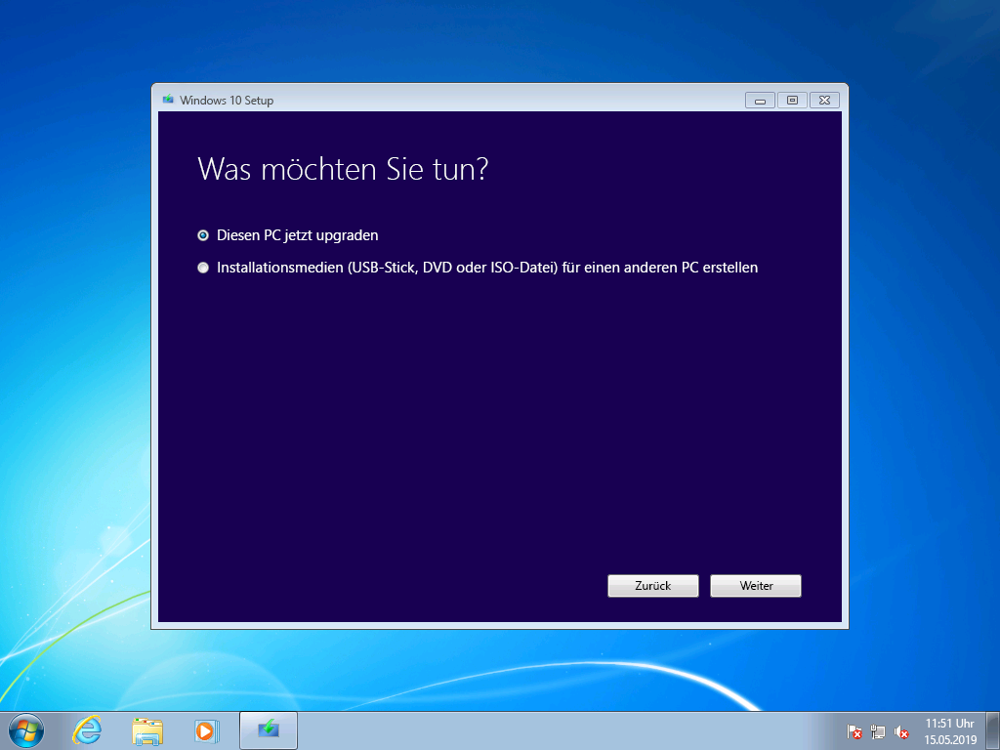
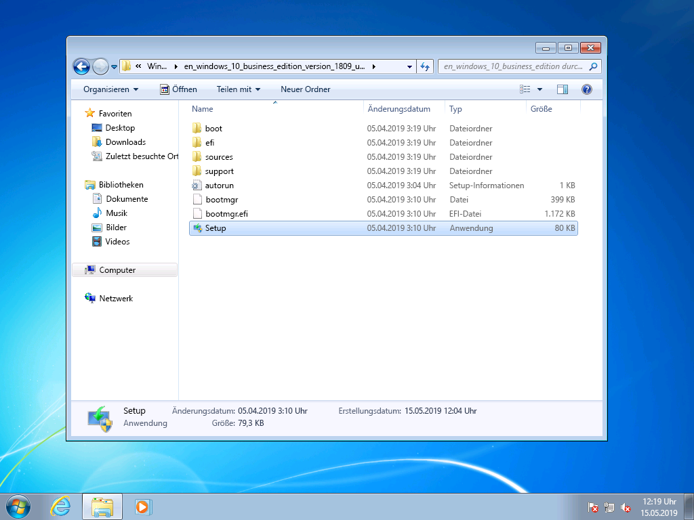
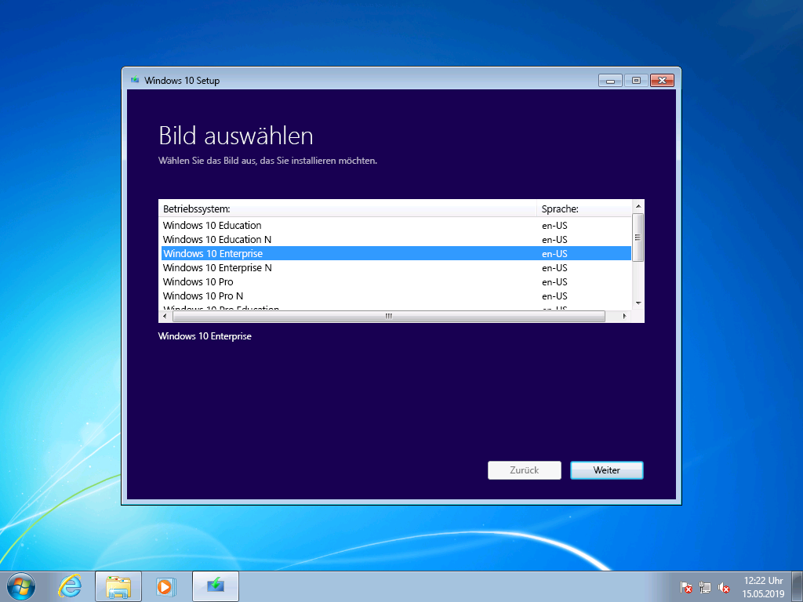
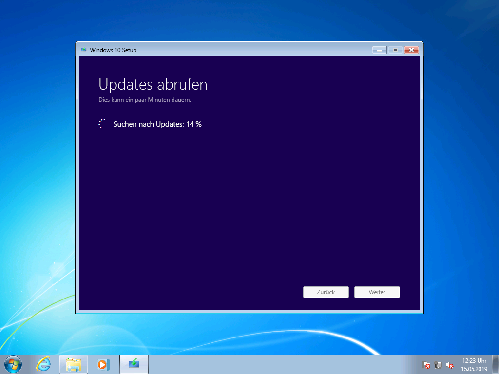
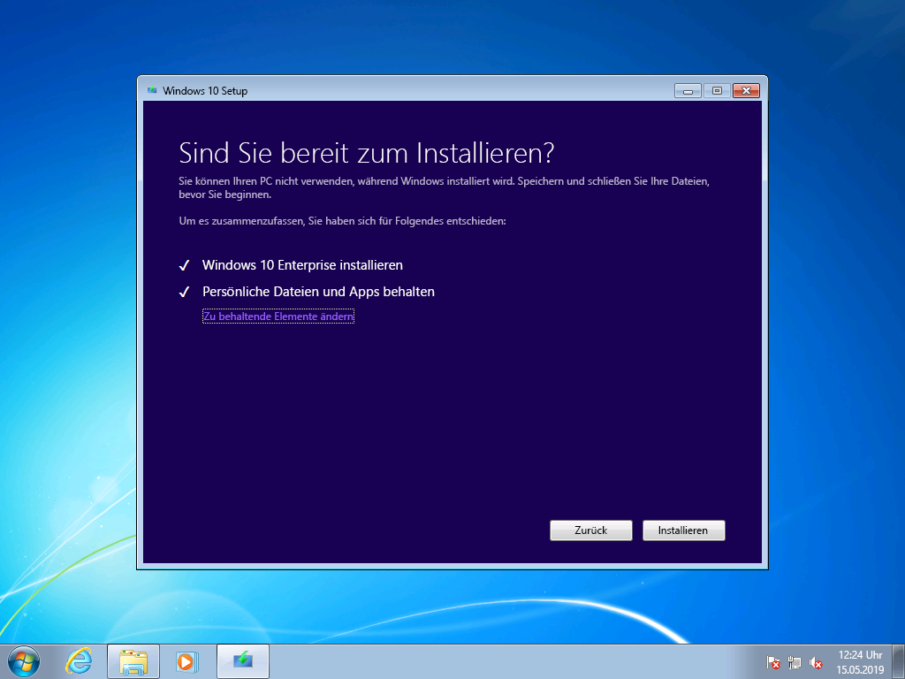
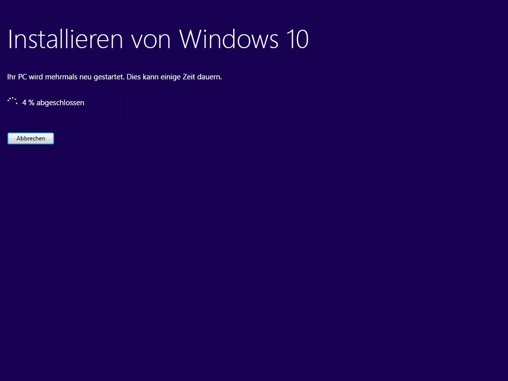
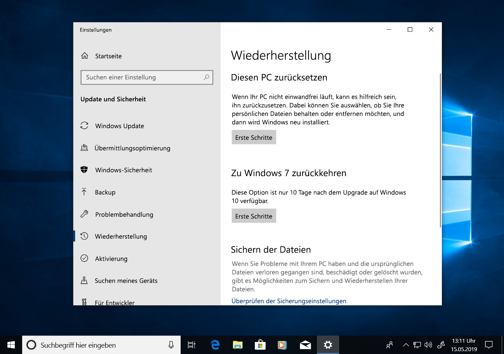
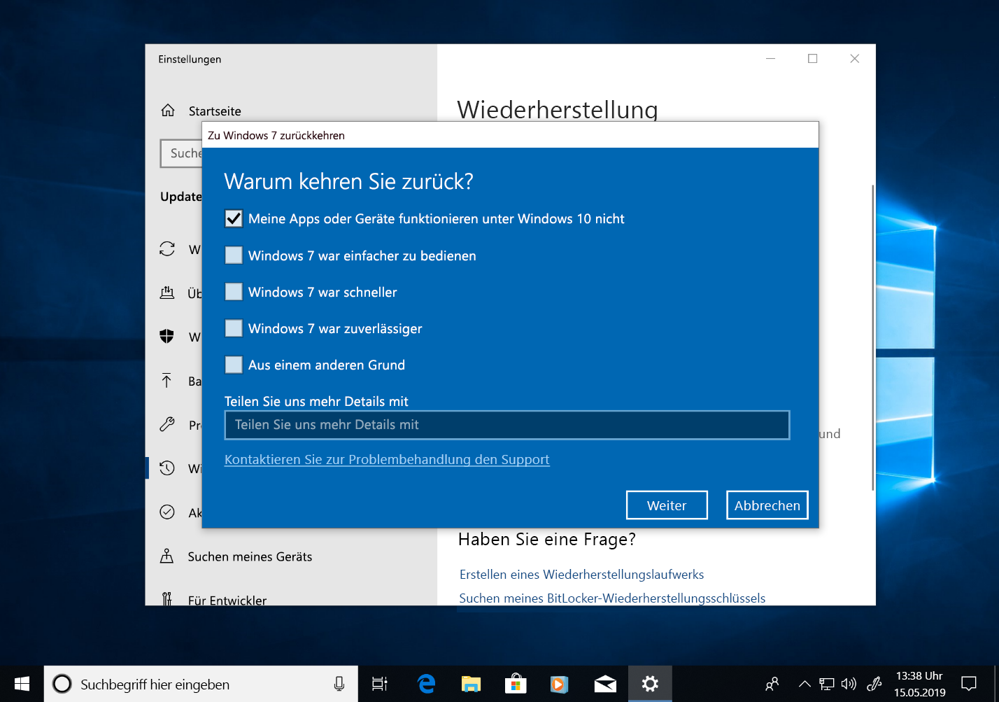

# Schrittweise Anleitung für ein manuelles Upgrade von Windows 7 auf Windows 10Windows 7 to Windows 10 manual upgrade step-by-step guide

In diesem Artikel wird beschrieben, wie Sie ein manuelles Upgrade eines Windows 7 Enterprise-PCs auf Windows 10 Enterprise durchführen.This article describes the process to manually upgrade a Windows 7 Enterprise PC to Windows 10 Enterprise. Bei anderen Windows 7-Editionen wie Home und Professional ist der Vorgang sehr ähnlich, Sie haben aber zusätzlich die Möglichkeit, ein direktes Upgrade mit dem Medienerstellungstool durchzuführen.For other Windows 7 editions, such as Home and Professional, the process is very similar, but you also have the option to upgrade directly using the media creation tool. Upgrades beliebiger Editionen von Windows 7 auf Windows 10 erfordern einen gültigen Product Key und eine passende oder höhere Edition von Windows. Windows 7 Professional kann z. B. auf Windows 10 Pro aktualisiert werden, jedoch nicht auf Windows 10 Home.Upgrades for any edition of Windows 7 to Windows 10 will require a valid product key and matching or higher edition of Windows, for example Windows 7 Professional can upgrade to Windows 10 Pro, but cannot be upgraded to Windows 10 Home. Windows 7 Ultimate muss auf Windows 10 Pro aktualisiert werden.Windows 7 Ultimate will need to be upgraded to Windows 10 Pro.

## Windows 10-Upgrades mit dem Medienerstellungstool oder ISO-DateienWindows 10 upgrades using the media creation tool or ISO files

Mit dem [Medienerstellungstool](https://www.microsoft.com/software-download/windows10ISO) können Sie ein direktes Upgrade auf Windows 10 durchführen oder Windows 10 als ISO-Datei herunterladen.You can upgrade to Windows 10 directly using the [media creation tool](https://www.microsoft.com/software-download/windows10ISO) or use it to download Windows 10 as an ISO file. Sie müssen vermerken, ob es sich bei dem aktuellen System um die 32-Bit- oder die 64-Bit-Version handelt, und die Standardsprache und Edition von Windows 7 (z. B. Home, Professional oder Enterprise) angeben.You’ll need to note whether your current system is 32 or 64-bit, your system’s default language and edition of Windows 7 (e.g. Home, Professional, or Enterprise). Unter Windows 7 befinden sich diese Informationen in der Systemsteuerung unter "System und Sicherheit" \> "System".In Windows 7, this information is located in the Control Panel \> System and Security \> System. Das Medienerstellungstool unterstützt Windows 10 Enterprise nicht für Upgrades, das Erstellen von Installationsmedien oder das Herunterladen von ISO-Dateien.The media creation tool does not support Windows 10 Enterprise for upgrades, creating installation media or downloading ISO files. Windows 10 Enterprise ist erforderlich, wenn Sie ein Upgrade von Windows 7 Enterprise durchführen.Windows 10 Enterprise is required if you are upgrading from Windows 7 Enterprise.

Wenn Sie ein Upgrade von Windows 7 Enterprise auf Windows 10 Enterprise durchführen, müssen Sie die ISO-Datei für Ihre Sprache und Architektur (32-Bit oder 64-Bit) aus dem [Volume Licensing Service Center](https://www.microsoft.com/licensing/servicecenter/default.aspx) herunterladen.When upgrading from Windows 7 Enterprise to Windows 10 Enterprise, you’ll need to download the ISO file for your language and architecture (32-bit or 64-bit) from the [Volume Licensing Service Center](https://www.microsoft.com/licensing/servicecenter/default.aspx).

Wenn Sie das Upgrade mit einer ISO-Datei durchführen möchten, müssen Sie die Dateien innerhalb des ISO entweder in Ihr lokales Dateisystem oder auf ein Wechseldatenträger extrahieren oder die ISO-Datei auf eine DVD brennen.If you plan to perform the upgrade using an ISO file, you will need to extract the files within the ISO to either your local file system, to a removable drive, or you can burn the ISO file to a DVD. Sie können die Installationsdateien im ISO mithilfe eines Windows 8- oder neueren PCs extrahieren und diese Dateien auf einem USB-Wechselmedium speichern oder eine Anwendung wie [7zip](https://www.7-zip.org/) verwenden, um den Inhalt der ISO-Datei in einen Ordner auf Ihrem lokalen Laufwerk in Windows 7 zu extrahieren.You can extract the installation files within the ISO using a Windows 8 or newer PC and save these files to removable USB storage or use an application such as [7zip](https://www.7-zip.org/) to extract the contents of your ISO file to a folder on your local drive within Windows 7.

Sobald die Installationsmedien unter Windows 7 verfügbar sind, können Sie das Upgrade initiieren, indem Sie "setup.exe" ausführen (siehe unten).Once you have the install media available in Windows 7, you can initiate the upgrade by running setup.exe as shown below.

**Wichtiger Hinweis: Bei einem direkten Upgrade, bei dem Anwendungen und Ihre Daten zu Window 10 migriert werden, müssen Sie den Vorgang aus einer laufenden Windows 7-Sitzung heraus initiieren. Beim Starten von Installationsmedien von einer DVD oder einem USB-Laufwerk wird keine Option zum Beibehalten Ihrer Apps und Dateien angezeigt. Stattdessen wird eine Neuinstallation von Windows 10 durchgeführt.****Important tip: For an in-place upgrade where applications and your data are migrated to Window 10, you’ll need to initiate the process from within a running Windows 7 session. Booting to install media from a DVD or USB drive will not give you the option to keep your apps and files, instead it will perform a clean install of Windows 10.**

In Windows 10 Setup werden Sie durch den Installationsvorgang geleitet, und im ersten Bildschirm wird eine Option zum Herunterladen von Updates, Treibern und optionalen Features bereitgestellt.Within Windows 10 Setup, you will be guided through the installation process and the first screen provides an option to download updates, drivers and optional features. Dies empfiehlt sich, um ein erfolgreiches Upgrade zu gewährleisten.This is recommended to help ensure success with the upgrade

Sobald die Updates installiert wurden, wechselt Windows 10 Setup zur nächsten Phase: Auswählen des Images.Once updates have been applied, Windows 10 Setup will move to the next phase, Select Image. Hier müssen Sie Ihre Edition von Windows auswählen.Here, you will need to select your edition of Windows. In diesem Fall können Sie, da auf dem PC Windows 7 Enterprise installiert ist, Windows 10 Enterprise auswählen.In this case, since the PC has Windows 7 Enterprise installed, you would select Windows 10 Enterprise.

Im nächsten Bildschirm in Windows 10 Setup werden relevante Hinweise und die geltenden Lizenzbedingungen angezeigt.In the next screen in Windows 10 Setup, you’re presented with applicable notices and license terms. Sobald Sie die Hinweise und Bedingungen gelesen und nachvollzogen haben, klicken Sie auf "Annehmen", um den Vorgang fortzusetzen, oder "Ablehnen", um ihn abzubrechen.Once you have read and understand the notices and terms, click “Accept” to continue or “Decline” to cancel.

Windows 10 Setup wird nun nach weiteren Updates suchen.Now Windows 10 Setup will look for additional updates.

Nach Abschluss des Vorgangs ist Windows 10 Setup für die Installation bereit. Standardmäßig ist Windows 10 Setup so konfiguriert, dass Windows 10 installiert wird und Ihre persönlichen Dateien und installierten Apps beibehalten werden.Once complete, Windows 10 Setup is ready to install and by default is configured to install Windows 10 and keep your personal files and apps installed. Dies ist die empfohlene Option.This is the recommended option. Wenn Sie auf "Ändern der zu behaltenden Elemente" klicken, werden weitere Optionen angezeigt.By clicking, “Change what to keep,” you’ll find additional options. Klicken Sie andernfalls auf "Installieren".Otherwise, click “Install.”

Wenn Sie "Ändern der zu behaltenden Elemente" auswählen, werden die folgenden Optionen angezeigt:If you select “Change what to keep”, you’ll be presented with these options:

Mit "Nur persönliche Dateien behalten" werden Ihre installierten Apps oder Einstellungen nicht von Windows 7 auf Windows 10 übertragen.“Keep personal files only” will not move your installed apps or settings from Windows 7 to Windows 10. Stattdessen werden nur Ihre Dateien und Benutzerkonten nur nach Windows übertragen.Instead it will only move your files and user accounts to Windows. Apps müssen bei dieser Option später erneut installiert werden.Apps will need to be reinstalled later with this option. Verwenden Sie diese Option nur, wenn Sie sicher sind, dass Sie die Apps, die Sie nach der Installation von Windows benötigen, neu installieren und konfigurieren können. Andernfalls sollten Sie die Standardoption "Persönliche Dateien und Apps behalten" verwenden.Only use this option if you are confident you can reinstall and configure the apps you will need after Windows is installed, otherwise stick with the default “Keep personal files and apps” option.

"Nichts" löscht Ihre Dateien, Apps und Einstellungen und führt eine Neuinstallation von Windows durch.“Nothing” will delete your files, apps and settings and perform a clean install of Windows. Verwenden Sie diese Option nur, wenn Sie die Daten, die Sie behalten möchten, zuvor gesichert haben und Sie Ihre Apps neu installieren können.Use this option only if you have previously backed up the data you want to keep and you are able to reinstall your apps.

Anschließend wird Windows 10 Setup erneut Updates abrufen, basierend auf den im vorherigen Bildschirm ausgewählten Optionen.Now Windows 10 Setup will get updates again based on what you selected in the previous screen.

Jetzt wird Windows 10 installiert. Dieser Vorgang dauert mehrere Minuten. Wenn Sie ausgewählt haben, dass Sie Ihre persönlichen Dateien und Apps behalten möchten, finden Sie diese an den gleichen Dateispeicherorten wieder, und Ihre Apps sind nun unter Windows 10 verfügbar.Now Windows 10 will install for several minutes and if you chose to keep your personal files and apps, everything will be in the same file locations and your apps will now be available in Windows 10.

## 

## Wiederherstellung in Windows 10Recovery in Windows 10

Nach der Installation von Windows 10 können Sie mit der Wiederherstellungsoption in Windows 10 bis zu 10 Tage lang zu Windows 7 zurückwechseln.After Windows 10 is installed, the Recovery option in Windows 10 gives you up to 10 days to go back to Windows 7. Dies ist nützlich, wenn ein Gerät oder eine App auf Ihrem System nicht ordnungsgemäß funktioniert und Sie zur vorherigen Windows 7-Installation zurückkehren müssen.This is useful if a device or app on your system does not function properly and you need to go back to your previous Windows 7 installation. Nach 10 Tagen wird standardmäßig der von Ihren Windows 7-Wiederherstellungsdateien auf Ihrer Festplatte belegte Speicherplatz von Windows 10 freigegeben, und die Dateien der vorherigen Installation werden gelöscht.After 10 days, by default Windows 10 will free up the space consumed by your Windows 7 recovery files on your hard drive and delete files from the previous installation. Zwar wurde Windows 7 nach dieser Zeit gelöscht, und Sie können Windows 7 nicht wiederherstellen, aber Ihre Apps und persönlichen Dateien bleiben unter Windows 10 erhalten.Although Windows 7 after this time is deleted and you won’t be able to revert Windows 7, your apps and personal files will remain in Windows 10.

Um den Vorgang zum Wiederherstellen von Windows 7 zu starten, navigieren Sie zu "Einstellungen" \> "Update und Sicherheit" \> "Wiederherstellung".To start the Go back to Windows 7 process, navigate to Settings \> Update & Security \> Recovery. Wählen Sie unter "Zu Windows 7 zurückkehren " die Option "Erste Schritte" aus.Under Go back to Windows 7, select “Get started.”

Jetzt fragt Windows 10, warum Sie zurückkehren möchten.Now, Windows 10 will ask why you are going back. Wenn es einen technischen Grund gibt, ist es nützlich, diesen anzugeben. Dies hilft bei der Behebung möglicher Probleme und sorgt dafür, dass andere Personen von Ihrer Erfahrung profitieren können.If there is a technical reason, this is useful to fill out in order to help drive resolution and ensure others can benefit from your experience.

In vielen Fällen gibt es Updates für Ihre Version von Windows 10, die technische Probleme möglicherweise lösen.In many cases, your version of Windows 10 will have had updates issued, which may resolve technical issues. Es empfiehlt sich, nach Updates zu suchen. Nachdem Sie Updates gefunden und installiert haben, sollten Sie überprüfen, ob die aufgetretenen Probleme dadurch behoben wurden.It is encouraged that you check for updates and if found and installed, then check if that fixes the problems you have experienced.

Wenn die Probleme durch die Updates nicht behoben wurden und Sie zur vorherigen Windows 7-Installation zurückkehren müssen, kann es sein, dass anschließend einige Apps neu installiert werden müssen – z. B. Apps, die unter Windows 10 installiert wurden. Unter Umständen gehen auch einige Einstellungen verloren.If the updates do not resolve issues and you do need to revert to your previous installation of Windows 7, there is a chance that some apps will need to be reinstalled – such as any app that installed during the time you were running Windows 10 – and some settings may be lost. Wichtig: Dateien und Dokumente, die Sie während der Verwendung von Windows 10 lokal gespeichert haben, bleiben erhalten und stehen auch unter Windows 7 weiter zur Verfügung.Importantly, files and docs you’ve saved locally while using Windows 10 will remain and be available for you once you’re back in Windows 7. 

Bevor Sie beginnen, stellen Sie sicher, dass Sie über ein lokales oder ein Domänenkonto und das entsprechende Kennwort aus der vorherigen Windows 7-Installation verfügen.Before you get started, make sure you have a local or domain account and password ready from the previous Windows 7 installation.

Nun können Sie den Vorgang initiieren, um zu Windows 7 zurückzukehren.From here you can initiate the process to go back to Windows 7. Nach ein paar Minuten wird Ihr PC wieder unter Windows 7 – mit der gleichen Oberfläche wie vor dem Upgrade auf Windows 10 – gestartet.After a few minutes, your PC will boot back into Windows 7 with the same experience prior to upgrading to Windows 10.

## Zu Windows 10 auf einem neuen PC wechselnMoving to Windows 10 on a new PC

Eine weitere empfohlene Option besteht darin, Windows 10 auf einen neuen PC zu übertragen.Another recommended option is to move to Windows 10 on a new PC. Wenn Sie dies bevorzugen, können Sie Ihre Dateien von Ihrem alten Computer übertragen. Dazu können Sie die [OneDrive](https://support.office.com/article/b5e918be-0fd4-4095-98da-bceed57f8e0c?ocid=MoveToWindows10)-Sicherung oder die in [Windows integrierte Sicherung und Wiederherstellung](https://support.microsoft.com/help/4469209?ocid=MoveToWindows10) verwenden, die Übertragung manuell mithilfe eines [externen Speichergeräts](https://support.microsoft.com/help/4465814/windows-7-move-files-off-pc-with-an-external-storage-device?ocid=MoveToWindows10) durchführen oder Tools wie PCmover Express von Laplink verwenden.If this is your preference, you can transfer your files from your old computer using [OneDrive](https://support.office.com/article/b5e918be-0fd4-4095-98da-bceed57f8e0c?ocid=MoveToWindows10) backup, [Backup and Restore built into Windows](https://support.microsoft.com/help/4469209?ocid=MoveToWindows10), manually using an [external storage device](https://support.microsoft.com/help/4465814/windows-7-move-files-off-pc-with-an-external-storage-device?ocid=MoveToWindows10), or tools like Laplink’s PCmover Express. Bei jeder dieser Optionen müssen Sie trotzdem alle erforderlichen Anwendungen, die nicht in Windows 10 enthalten sind, erneut installieren.With any of these options, you will still need to re-install any required applications not included with Windows 10. Weitere Informationen zu Ihren Optionen für den manuellen Wechsel von einem vorhandenen PC mit Windows 7 zu einem neuen PC mit Windows 10 finden Sie unter [Wechseln zu einem Windows 10-PC](https://support.microsoft.com/help/4229823?ocid=MoveToWindows10) im Windows-Support.To learn more about your options for manually moving from an existing PC running Windows 7 to a new PC with Windows 10, see [Moving to a Windows 10 PC](https://support.microsoft.com/help/4229823?ocid=MoveToWindows10) in Windows Support.

## [Bereitstellungscenter für DesktopDesktop Deployment Center](https://aka.ms/howtoshift)
