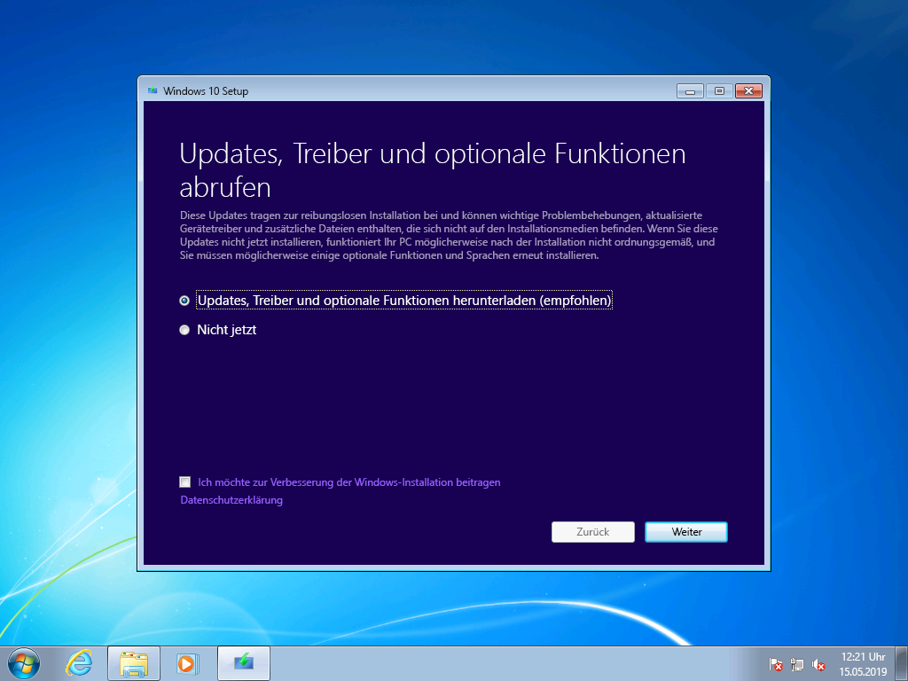
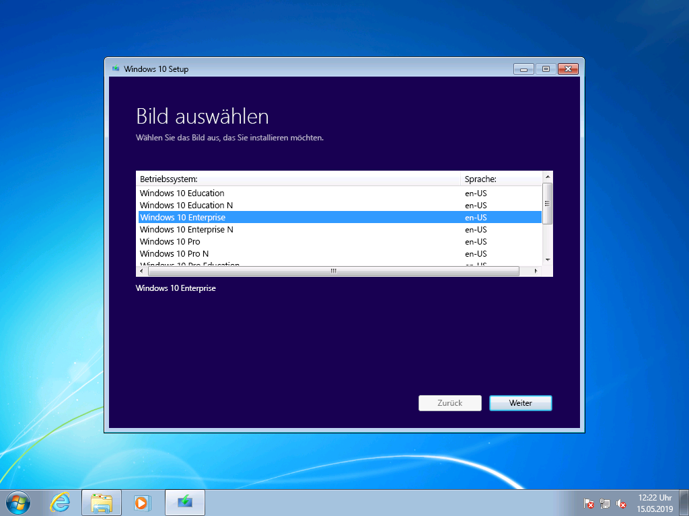
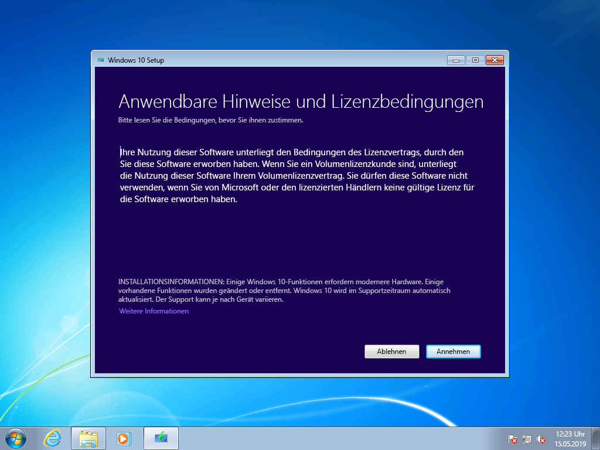
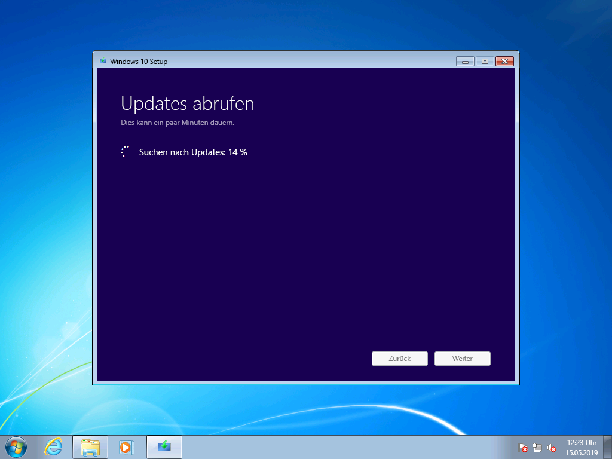
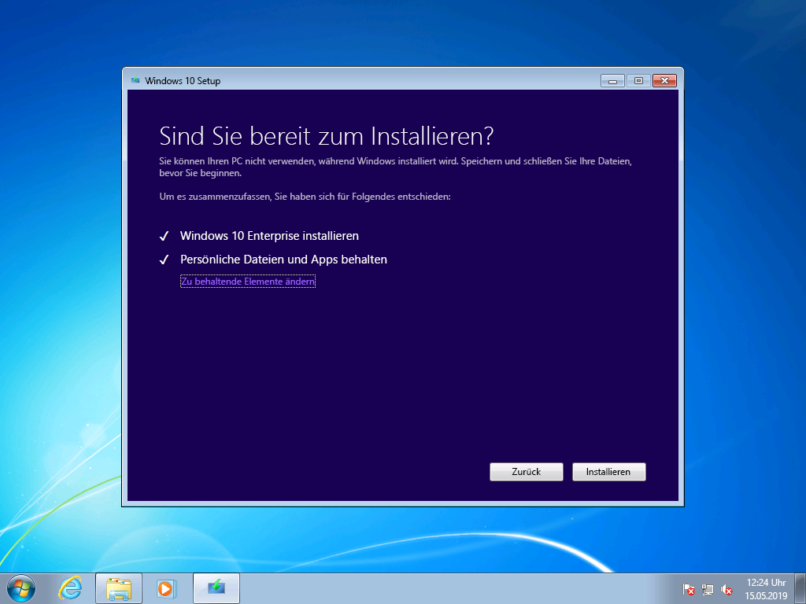
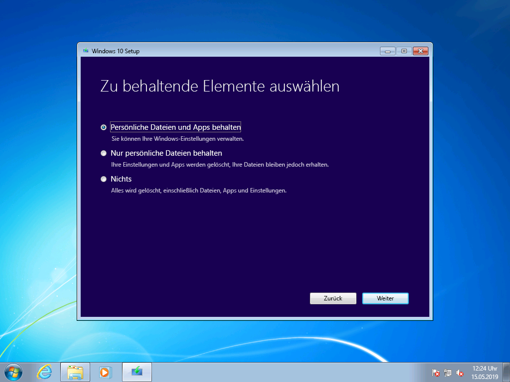
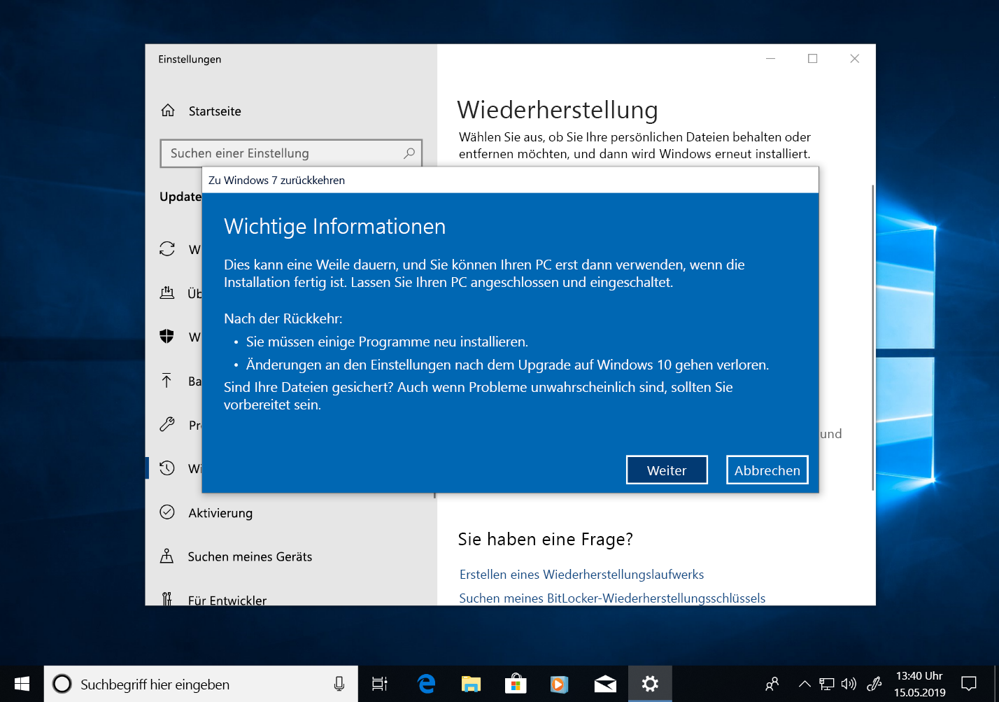
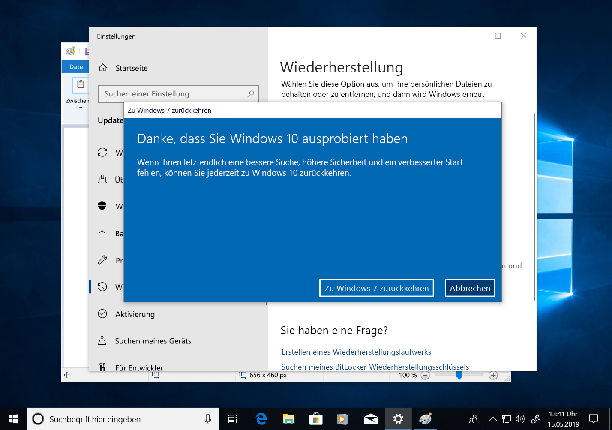

# Schrittweise Anleitung für ein manuelles Upgrade von Windows 7 auf Windows 10

In diesem Artikel wird beschrieben, wie Sie ein manuelles Upgrade eines Windows 7 Enterprise-PCs auf Windows 10 Enterprise durchführen. Bei anderen Windows 7-Editionen wie Home und Professional ist der Vorgang sehr ähnlich, Sie haben aber zusätzlich die Möglichkeit, ein direktes Upgrade mit dem Medienerstellungstool durchzuführen. Upgrades beliebiger Editionen von Windows 7 auf Windows 10 erfordern einen gültigen Product Key und eine passende oder höhere Edition von Windows. Windows 7 Professional kann z. B. auf Windows 10 Pro aktualisiert werden, jedoch nicht auf Windows 10 Home. Windows 7 Ultimate muss auf Windows 10 Pro aktualisiert werden.

## Windows 10-Upgrades mit dem Medienerstellungstool oder ISO-Dateien

Mit dem [Medienerstellungstool](https://www.microsoft.com/en-us/software-download/windows10ISO) können Sie ein direktes Upgrade auf Windows 10 durchführen oder Windows 10 als ISO-Datei herunterladen. Sie müssen vermerken, ob es sich bei dem aktuellen System um die 32-Bit- oder die 64-Bit-Version handelt, und die Standardsprache und Edition von Windows 7 (z. B. Home, Professional oder Enterprise) angeben. Unter Windows 7 befinden sich diese Informationen in der Systemsteuerung unter "System und Sicherheit" \> "System". Das Medienerstellungstool unterstützt Windows 10 Enterprise nicht für Upgrades, das Erstellen von Installationsmedien oder das Herunterladen von ISO-Dateien. Windows 10 Enterprise ist erforderlich, wenn Sie ein Upgrade von Windows 7 Enterprise durchführen.

Wenn Sie ein Upgrade von Windows 7 Enterprise auf Windows 10 Enterprise durchführen, müssen Sie die ISO-Datei für Ihre Sprache und Architektur (32-Bit oder 64-Bit) aus dem [Volume Licensing Service Center](https://www.microsoft.com/licensing/servicecenter/default.aspx) herunterladen.

Wenn Sie das Upgrade mit einer ISO-Datei durchführen möchten, müssen Sie die Dateien innerhalb des ISO entweder in Ihr lokales Dateisystem oder auf ein Wechseldatenträger extrahieren oder die ISO-Datei auf eine DVD brennen. Sie können die Installationsdateien im ISO mithilfe eines Windows 8- oder neueren PCs extrahieren und diese Dateien auf einem USB-Wechselmedium speichern oder eine Anwendung wie [7zip](https://www.7-zip.org/) verwenden, um den Inhalt der ISO-Datei in einen Ordner auf Ihrem lokalen Laufwerk in Windows 7 zu extrahieren.

Sobald die Installationsmedien unter Windows 7 verfügbar sind, können Sie das Upgrade initiieren, indem Sie "setup.exe" ausführen (siehe unten).

**Wichtiger Hinweis: Bei einem direkten Upgrade, bei dem Anwendungen und Ihre Daten zu Window 10 migriert werden, müssen Sie den Vorgang aus einer laufenden Windows 7-Sitzung heraus initiieren. Beim Starten von Installationsmedien von einer DVD oder einem USB-Laufwerk wird keine Option zum Beibehalten Ihrer Apps und Dateien angezeigt. Stattdessen wird eine Neuinstallation von Windows 10 durchgeführt.**

In Windows 10 Setup werden Sie durch den Installationsvorgang geleitet, und im ersten Bildschirm wird eine Option zum Herunterladen von Updates, Treibern und optionalen Features bereitgestellt. Dies empfiehlt sich, um ein erfolgreiches Upgrade zu gewährleisten.

Sobald die Updates installiert wurden, wechselt Windows 10 Setup zur nächsten Phase: Auswählen des Images. Hier müssen Sie Ihre Edition von Windows auswählen. In diesem Fall können Sie, da auf dem PC Windows 7 Enterprise installiert ist, Windows 10 Enterprise auswählen.

Im nächsten Bildschirm in Windows 10 Setup werden relevante Hinweise und die geltenden Lizenzbedingungen angezeigt. Sobald Sie die Hinweise und Bedingungen gelesen und nachvollzogen haben, klicken Sie auf "Annehmen", um den Vorgang fortzusetzen, oder "Ablehnen", um ihn abzubrechen.

Windows 10 Setup wird nun nach weiteren Updates suchen.

Nach Abschluss des Vorgangs ist Windows 10 Setup für die Installation bereit. Standardmäßig ist Windows 10 Setup so konfiguriert, dass Windows 10 installiert wird und Ihre persönlichen Dateien und installierten Apps beibehalten werden. Dies ist die empfohlene Option. Wenn Sie auf "Ändern der zu behaltenden Elemente" klicken, werden weitere Optionen angezeigt. Klicken Sie andernfalls auf "Installieren".

Wenn Sie "Ändern der zu behaltenden Elemente" auswählen, werden die folgenden Optionen angezeigt:

Mit "Nur persönliche Dateien behalten" werden Ihre installierten Apps oder Einstellungen nicht von Windows 7 auf Windows 10 übertragen. Stattdessen werden nur Ihre Dateien und Benutzerkonten nur nach Windows übertragen. Apps müssen bei dieser Option später erneut installiert werden. Verwenden Sie diese Option nur, wenn Sie sicher sind, dass Sie die Apps, die Sie nach der Installation von Windows benötigen, neu installieren und konfigurieren können. Andernfalls sollten Sie die Standardoption "Persönliche Dateien und Apps behalten" verwenden.

"Nichts" löscht Ihre Dateien, Apps und Einstellungen und führt eine Neuinstallation von Windows durch. Verwenden Sie diese Option nur, wenn Sie die Daten, die Sie behalten möchten, zuvor gesichert haben und Sie Ihre Apps neu installieren können.

Anschließend wird Windows 10 Setup erneut Updates abrufen, basierend auf den im vorherigen Bildschirm ausgewählten Optionen.

Jetzt wird Windows 10 installiert. Dieser Vorgang dauert mehrere Minuten. Wenn Sie ausgewählt haben, dass Sie Ihre persönlichen Dateien und Apps behalten möchten, finden Sie diese an den gleichen Dateispeicherorten wieder, und Ihre Apps sind nun unter Windows 10 verfügbar.

## 

## Wiederherstellung in Windows 10

Nach der Installation von Windows 10 können Sie mit der Wiederherstellungsoption in Windows 10 bis zu 10 Tage lang zu Windows 7 zurückwechseln. Dies ist nützlich, wenn ein Gerät oder eine App auf Ihrem System nicht ordnungsgemäß funktioniert und Sie zur vorherigen Windows 7-Installation zurückkehren müssen. Nach 10 Tagen wird standardmäßig der von Ihren Windows 7-Wiederherstellungsdateien auf Ihrer Festplatte belegte Speicherplatz von Windows 10 freigegeben, und die Dateien der vorherigen Installation werden gelöscht. Zwar wurde Windows 7 nach dieser Zeit gelöscht, und Sie können Windows 7 nicht wiederherstellen, aber Ihre Apps und persönlichen Dateien bleiben unter Windows 10 erhalten.

Um den Vorgang zum Wiederherstellen von Windows 7 zu starten, navigieren Sie zu "Einstellungen" \> "Update und Sicherheit" \> "Wiederherstellung". Wählen Sie unter "Zu Windows 7 zurückkehren " die Option "Erste Schritte" aus.

Jetzt fragt Windows 10, warum Sie zurückkehren möchten. Wenn es einen technischen Grund gibt, ist es nützlich, diesen anzugeben. Dies hilft bei der Behebung möglicher Probleme und sorgt dafür, dass andere Personen von Ihrer Erfahrung profitieren können.

In vielen Fällen gibt es Updates für Ihre Version von Windows 10, die technische Probleme möglicherweise lösen. Es empfiehlt sich, nach Updates zu suchen. Nachdem Sie Updates gefunden und installiert haben, sollten Sie überprüfen, ob die aufgetretenen Probleme dadurch behoben wurden.

Wenn die Probleme durch die Updates nicht behoben wurden und Sie zur vorherigen Windows 7-Installation zurückkehren müssen, kann es sein, dass anschließend einige Apps neu installiert werden müssen – z. B. Apps, die unter Windows 10 installiert wurden. Unter Umständen gehen auch einige Einstellungen verloren. Wichtig: Dateien und Dokumente, die Sie während der Verwendung von Windows 10 lokal gespeichert haben, bleiben erhalten und stehen auch unter Windows 7 weiter zur Verfügung. 

Bevor Sie beginnen, stellen Sie sicher, dass Sie über ein lokales oder ein Domänenkonto und das entsprechende Kennwort aus der vorherigen Windows 7-Installation verfügen.

Nun können Sie den Vorgang initiieren, um zu Windows 7 zurückzukehren. Nach ein paar Minuten wird Ihr PC wieder unter Windows 7 – mit der gleichen Oberfläche wie vor dem Upgrade auf Windows 10 – gestartet.

## Zu Windows 10 auf einem neuen PC wechseln

Eine weitere empfohlene Option besteht darin, Windows 10 auf einen neuen PC zu übertragen. Wenn Sie dies bevorzugen, können Sie Ihre Dateien von Ihrem alten Computer übertragen. Dazu können Sie die [OneDrive](https://support.office.com/article/b5e918be-0fd4-4095-98da-bceed57f8e0c?ocid=MoveToWindows10)-Sicherung oder die [in Windows integrierte Sicherung und Wiederherstellung](https://support.microsoft.com/help/4469209?ocid=MoveToWindows10) verwenden, die Übertragung manuell mithilfe eines [externen Speichergeräts](https://support.microsoft.com/en-us/help/4465814/windows-7-move-files-off-pc-with-an-external-storage-device?ocid=MoveToWindows10) durchführen oder Tools wie [PCmover Express von Laplink](https://www.microsoft.com/en-us/windows/transfer-your-data) verwenden. Bei jeder dieser Optionen müssen Sie trotzdem alle erforderlichen Anwendungen, die nicht in Windows 10 enthalten sind, erneut installieren. Weitere Informationen zu Ihren Optionen für den manuellen Wechsel von einem vorhandenen PC mit Windows 7 zu einem neuen PC mit Windows 10 finden Sie unter [Wechseln zu einem Windows 10-PC](https://support.microsoft.com/en-us/help/4229823?ocid=MoveToWindows10) im Windows-Support.

## [Bereitstellungscenter für Desktop](https://aka.ms/howtoshift)