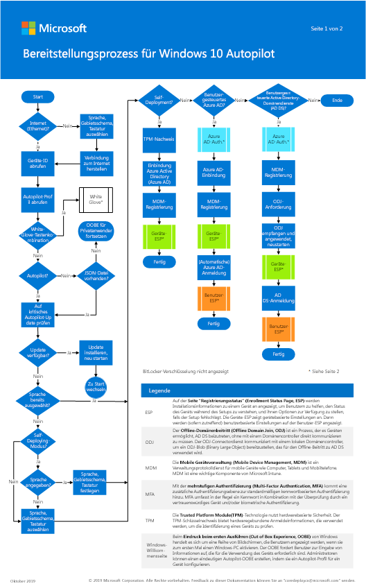

# Schritt 3: Bereitstellen von Windows 10 Enterprise für neue Geräte mittels Windows Autopilot

*Dieser Abschnitt gilt für die Versionen E3 und E5 von Microsoft 365 Enterprise.*

Nutzen Sie zur Anpassung von neuen, vorkonfigurierten Windows 10-PCs den Windows Autopilot, um für Ihre Organisation ein neues, bereits konfiguriertes System mit Apps und Einstellungen bereitzustellen. Es müssen keine Images implementiert, keine Treiber installiert und keine Infrastruktur verwaltet werden. Die Benutzer können den Bereitstellungsprozess unabhängig durchlaufen, ohne ihren IT-Administrator konsultieren zu müssen.

Mit Windows Autopilot können Sie neue, vorkonfigurierte Windows 10-Geräte einrichten und einsatzbereit machen. Weitere Einzelheiten zu Windows Autopilot, inklusive Vorteilen und Szenarien von Windows Autopilot finden Sie unter [Übersicht über Windows Autopilot](https://docs.microsoft.com/windows/deployment/windows-Autopilot/windows-10-Autopilot). Die nachfolgenden Abschnitte erläutern die Einrichtung neuer Geräte.

## Das Poster des Windows Autopilot-Bereitstellungsprozesses

Das Poster von Windows Autopilot ist zwei Seiten im Portraitmodus (11 x 17). Klicken Sie auf das Bild unten, um eine PDF in Ihrem Browser anzuzeigen. 

Sie können dieses Poster auch in [PDF-](https://github.com/MicrosoftDocs/windows-itpro-docs/raw/public/windows/deployment/media/Windows10AutopilotFlowchart.pdf) oder [Visio-](https://github.com/MicrosoftDocs/windows-itpro-docs/raw/public/windows/deployment/media/Windows10Autopilotflowchart.vsdx) Format herunterladen.

## Abschnitt 1: Starten der Windows Autopilot-Bereitstellung
Siehe [Übersicht über Windows Autopilot](https://docs.microsoft.com/windows/deployment/windows-Autopilot/windows-10-Autopilot), um:

1. mehr über Windows Autopilot zu erfahren und die erforderlichen Schritte zur Bereitstellung auszuführen. Diese umfassen:
    - **Geräteregistrierung und Anpassung der Windows-Willkommensseite**

        Um Geräte zu registrieren, benötigen Sie deren Hardware-ID. Wir arbeiten aktiv mit verschiedenen Hardwareanbietern zusammen, damit diese Ihnen die erforderlichen Informationen zukommen lassen können, oder diese in Ihrem Namen hochladen. Sie haben zudem die Möglichkeit, diese Informationen selbst mittels eines PowerShell-Skripts zu erfassen, das eine CSV-Datei mit der Hardware-ID des Geräts generiert.

        Sobald Geräte registriert sind, stehen Anpassungsmöglichkeiten der Windows-Willkommensseite zur Verfügung, die Sie konfigurieren können, einschließlich Überspringen der Datenschutzeinstellungen und EULA.

    - **Unternehmensbranding für die Windows-Willkommensseite**

        Dies ermöglicht Ihnen ein Branding hinzuzufügen, das auf der Windows-Willkommensseite angezeigt wird.

    - **Automatische MDM-Registrierung in Microsoft Intune**
        
        Die automatische Registrierung ermöglicht Benutzern ihre Windows 10-Geräte bei Intune zu registrieren, wenn sie ihre Geräte mit Azure AD verbinden. Um sich zu registrieren, müssen Benutzer ihr Arbeitskonto ihren privaten Geräten hinzufügen oder geschäftliche Geräte mit Azure AD verbinden. Im Hintergrund wird das Gerät zudem für die Verwaltung über Intune registriert.

    - **Von Windows Autopilot genutzte Netzwerkkonnektivität mit Clouddiensten**

        Das Programm Windows Autopilot Deployment verwendet eine Reihe von Clouddiensten, um die Produktivität Ihrer Geräte zu gewährleisten. Auf diese Dienste muss über Geräte zugegriffen werden können, die als Windows Autopilot-Geräte registriert sind. 

    - **Auf den Geräten muss Windows 10, Version 1703 oder höher vorinstalliert sein**

2. Erfahren Sie mehr über das Programm Windows Autopilot Deployment, und wählen Sie dieses für Ihre Organisation. Sie können aus diesen Bereitstellungsprogrammen wählen:
    - **Microsoft Store für Unternehmen**
    - **Microsoft Intune**
    - **Partner Center**

## Abschnitt 2: Einrichten eines Windows 10-Geräts für Microsoft 365
Bevor Sie Windows-Geräte für Microsoft 365-Benutzer einrichten können, müssen Sie sicherstellen, dass auf allen Windows-Geräten Windows 10, Version 1703 (Creators Update) oder höher installiert ist.

Nachdem alle Windows-Geräte in Ihrer Organisation entweder auf Windows 10 Creators Update aktualisiert wurden oder bereits Windows 10 Creators Update ausführen, können Sie diese Geräte der Azure Active Directory Ihrer Organisation hinzufügen.

### Einrichten von neuen oder neu aktualisierten Windows 10-Geräten
Führen Sie diese Schritte aus, um ein Gerät mit Windows 10-Willkommensseite auf einem neuen Gerät mit Windows 10 Creators Update (oder höher) oder auf einem Gerät einzurichten, das auf Windows 10 Creators Update (oder höher) aktualisiert wurde, dessen Vorkonfiguration jedoch noch nicht initialisiert wurde.

1. Wenn Sie kein WLAN-Netzwerk konfiguriert haben, stellen Sie sicher, dass Sie das Gerät über eine Kabel- oder Ethernet-Verbindung mit dem Internet verbinden.
2. Durchlaufen Sie die Einrichtung für Windows-Geräte. Auf einem neuen oder zurückgesetzten Gerät beginnt die Einrichtung mit dem Bildschirm **Beginnen wir mit Ihrer Region. Ist dies korrekt?**.
3. Durchlaufen Sie die Einrichtung für Windows 10-Geräte, bis Ihnen die Seite **Wie möchten Sie einrichten?** angezeigt wird. Wählen Sie dort **Für eine Organisation einrichten**.
4. Melden Sie sich mit Ihrem Microsoft 365-Benutzerkonto und -Kennwort an. Je nach Einstellungen für das Benutzerkennwort, müssen Sie dieses gegebenenfalls aktualisieren. 
5. Beenden Sie die Einrichtung für Windows 10-Geräte.

Nachdem Sie fertig sind, wird sich das Gerät mit dem Azure AD Ihrer Organisation verbinden.

### Einrichten eines Geräts, das die initiale Einrichtung bereits abgeschlossen hat
Wenn auf Ihrem Gerät Windows 10 Creators Update (oder höher) installiert ist und es bereits die initiale Einrichtung durchlaufen hat, gehen Sie folgendermaßen vor.

1. Klicken Sie auf dem Windows-PC des Benutzers, auf dem Windows 10, Version 1703 (Creators Update) ausgeführt wird, auf das **Windows**-Logo, und wählen Sie anschließend das Symbol **Einstellungen** aus.
2. Klicken Sie unter **Einstellungen** auf **Konten**.
3. Klicken Sie auf der Seite **Ihre Infos** auf **Auf Arbeits-, Schul- oder Unikonto zugreifen** > **Verbinden**.
4. Klicken Sie im Dialogfeld **Geschäfts-, Schul- oder Unikonto einrichten** auf **Alternative Aktionen**, und wählen Sie dort **Dieses Gerät in Azure Active Directory einbinden**.
5. Geben Sie auf der Seite **Bitte melden Sie sich an** Ihr Arbeits-, Schul- oder Unikonto ein, und klicken Sie anschließend auf **Weiter**.
6. Geben Sie auf der Seite **Kennwort eingeben** Ihr Kennwort ein, und klicken Sie anschließend auf **Anmelden**.
7. Stellen Sie auf der Seite **Vergewissern Sie sich, dass dies Ihr Unternehmen ist** sicher, dass alle Daten korrekt sind, und klicken Sie anschließend auf **Teilnehmen**.
8. Klicken Sie auf der Seite **Fertig!** auf **Fertig**.

Nachdem Sie fertig sind, wird der Benutzer mit dem Azure AD Ihrer Organisation verbunden.

### Stellen Sie sicher, dass das Gerät mit Azure AD verbunden ist
Gehen Sie folgendermaßen vor, um den Synchronisierungsstatus des Geräts mit Azure AD zu überprüfen. Verwenden Sie anschließend Ihr Microsoft 365-Konto auf dem Gerät. 

1. Öffnen Sie die **Einstellungen**.
2. Wählen Sie auf der Seite **Auf Arbeits-, Schul- oder Unikonto zugreifen** den Bereich **Verbinden mit<organization name> **, um **Informationen** zu den Schaltflächen anzuzeigen, und klicken Sie anschließend auf **Trennen**.
3. Wählen Sie **Informationen**, um Ihren Synchronisierungsstatus abzurufen.
4. Wählen Sie auf der Seite **Synchronisierungsstatus** **Synchronisieren** aus, um die Verwaltungsrichtlinien für Mobilgeräte auf Ihrem PC zu erhalten.
5. Um Ihr Microsoft 365-Konto zu verwenden, klicken Sie zunächst auf die Windows-**Start**-Schaltfläche, klicken Sie anschließend mit der rechten Maustaste auf das Bild Ihres aktuellen Kontos, und wählen Sie Konto **Wechseln** aus.
6. Melden Sie sich mit der E-Mail-Adresse und dem Kennwort Ihrer Organisation an.

Wenn bei der Verwendung von Windows 10 in einer Unternehmensumgebung Probleme auftreten, konsultieren Sie die [wichtigsten Microsoft-Support-Lösungen für am häufigsten auftretenden Probleme](https://docs.microsoft.com/windows/client-management/windows-10-support-solutions). Diese Ressourcen umfassen KB-Artikel, Updates und Bibliotheksartikel.

Als Zwischenprüfung können Sie sich die [Beendigungskriterien](windows10-exit-criteria.md#crit-windows10-step3) für diesen Schritt anschauen.

## Nächster Schritt

|||
|:-------|:-----|
|| [Überwachen der Geräteintegrität und der Compliance](windows10-enable-windows-analytics.md) |
