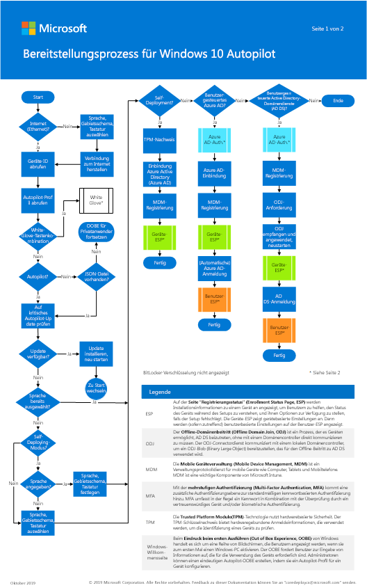

# Schritt 3: Bereitstellen von Windows 10 Enterprise für neue Geräte mittels Windows AutopilotStep 3: Deploy Windows 10 Enterprise for new devices with Windows Autopilot

*Dieser Abschnitt gilt für die Versionen E3 und E5 von Microsoft 365 Enterprise.**This article applies to both the E3 and E5 versions of Microsoft 365 Enterprise*

Nutzen Sie zur Anpassung von neuen, vorkonfigurierten Windows 10-PCs den Windows Autopilot, um für Ihre Organisation ein neues, bereits konfiguriertes System mit Apps und Einstellungen bereitzustellen. Es müssen keine Images implementiert, keine Treiber installiert und keine Infrastruktur verwaltet werden. Die Benutzer können den Bereitstellungsprozess unabhängig durchlaufen, ohne ihren IT-Administrator konsultieren zu müssen.If you have new Windows 10 PCs, you can use Windows Autopilot to customize the out-of-box-experience (OOBE) for your organization and deploy a new system with apps and settings already configured. There are no images to deploy, no drivers to inject, and no infrastructure to manage. Users can go through the deployment process independently, without the need consult their IT administrator.

Mit Windows Autopilot können Sie neue, vorkonfigurierte Windows 10-Geräte einrichten und einsatzbereit machen. Weitere Einzelheiten zu Windows Autopilot, inklusive Vorteilen und Szenarien von Windows Autopilot finden Sie unter [Übersicht über Windows Autopilot](https://docs.microsoft.com/windows/deployment/windows-Autopilot/windows-10-Autopilot). Die nachfolgenden Abschnitte erläutern die Einrichtung neuer Geräte.You can set up and pre-configure new Windows 10 devices and get them ready for productive use using Windows Autopilot. To learn more about Windows Autopilot, including benefits and Windows Autopilot scenarios, see [Overview of Windows Autopilot](https://docs.microsoft.com/windows/deployment/windows-Autopilot/windows-10-Autopilot). When ready, follow these parts to start setting up new devices.

## Das Poster des Windows Autopilot-BereitstellungsprozessesThe Windows Autopilot deployment process poster

Das Poster von Windows Autopilot ist zwei Seiten im Portraitmodus (11 x 17).The Windows Autopilot poster is two pages in portrait mode (11x17). Klicken Sie auf das Bild unten, um eine PDF in Ihrem Browser anzuzeigen.Click the image below to view a PDF in your browser. 

Sie können dieses Poster auch in [PDF-](https://github.com/MicrosoftDocs/windows-itpro-docs/raw/public/windows/deployment/media/Windows10AutopilotFlowchart.pdf) oder [Visio-](https://github.com/MicrosoftDocs/windows-itpro-docs/raw/public/windows/deployment/media/Windows10Autopilotflowchart.vsdx) Format herunterladen.You can also download this poster in [PDF](https://github.com/MicrosoftDocs/windows-itpro-docs/raw/public/windows/deployment/media/Windows10AutopilotFlowchart.pdf) or [Visio](https://github.com/MicrosoftDocs/windows-itpro-docs/raw/public/windows/deployment/media/Windows10Autopilotflowchart.vsdx) format.

## Abschnitt 1: Starten der Windows Autopilot-BereitstellungPart 1: Start Windows Autopilot deployment
Siehe [Übersicht über Windows Autopilot](https://docs.microsoft.com/windows/deployment/windows-Autopilot/windows-10-Autopilot), um:See [Overview of Windows Autopilot](https://docs.microsoft.com/windows/deployment/windows-Autopilot/windows-10-Autopilot) to:

1. mehr über Windows Autopilot zu erfahren und die erforderlichen Schritte zur Bereitstellung auszuführen. Diese umfassen:Learn about and complete the prerequisites for Windows Autopilot deployment. The prerequisites include:
    - **Geräteregistrierung und Anpassung der Windows-Willkommensseite****Device registration and OOBE customization**

        Um Geräte zu registrieren, benötigen Sie deren Hardware-ID. Wir arbeiten aktiv mit verschiedenen Hardwareanbietern zusammen, damit diese Ihnen die erforderlichen Informationen zukommen lassen können, oder diese in Ihrem Namen hochladen. Sie haben zudem die Möglichkeit, diese Informationen selbst mittels eines PowerShell-Skripts zu erfassen, das eine CSV-Datei mit der Hardware-ID des Geräts generiert.To register devices, you need to acquire their hardware ID and register it. We are actively working with various hardware vendors to enable them to provide the required information to you, or upload it on your behalf. You also have the option to capture this information by yourself using a PowerShell script that generates a .csv file with the device's hardware ID.

        Sobald Geräte registriert sind, stehen Anpassungsmöglichkeiten der Windows-Willkommensseite zur Verfügung, die Sie konfigurieren können, einschließlich Überspringen der Datenschutzeinstellungen und EULA.Once devices are registered, there are OOBE customization options that you can configure including skipping privacy settings and EULA.

    - **Unternehmensbranding für die Windows-Willkommensseite****Company branding for OOBE**

        Dies ermöglicht Ihnen ein Branding hinzuzufügen, das auf der Windows-Willkommensseite angezeigt wird.This allows you to add branding to appear during device OOBE.

    - **Automatische MDM-Registrierung in Microsoft Intune****MDM auto-enrollment in Microsoft Intune**
        
        Die automatische Registrierung ermöglicht Benutzern ihre Windows 10-Geräte bei Intune zu registrieren, wenn sie ihre Geräte mit Azure AD verbinden. Um sich zu registrieren, müssen Benutzer ihr Arbeitskonto ihren privaten Geräten hinzufügen oder geschäftliche Geräte mit Azure AD verbinden. Im Hintergrund wird das Gerät zudem für die Verwaltung über Intune registriert.Automatic enrollment lets users enroll their Windows 10 devices in Intune for device management when they connect their devices to Azure AD. To enroll, users add their work account to their personally-owned devices or join corporate-owned devices to Azure AD. In the background, the device is also enrolled for management with Intune.

    - **Von Windows Autopilot genutzte Netzwerkkonnektivität mit Clouddiensten****Network connectivity to cloud services used by Windows Autopilot**

        Das Programm Windows Autopilot Deployment verwendet eine Reihe von Clouddiensten, um die Produktivität Ihrer Geräte zu gewährleisten. Auf diese Dienste muss über Geräte zugegriffen werden können, die als Windows Autopilot-Geräte registriert sind.The Windows Autopilot Deployment Program uses a number of cloud services to get your devices to a productive state and these services must be accessible from devices registered as Windows Autopilot devices. 

    - **Auf den Geräten muss Windows 10, Version 1703 oder höher vorinstalliert sein****Devices must be pre-installed with Windows 10, version 1703 or later**

2. Erfahren Sie mehr über das Programm Windows Autopilot Deployment, und wählen Sie dieses für Ihre Organisation. Sie können aus diesen Bereitstellungsprogrammen wählen:Learn about and select the Windows Autopilot Deployment Program for your organization. You can select from these deployment programs:
    - **Microsoft Store für Unternehmen****Microsoft Store for Business**
    - **Microsoft Intune****Microsoft Intune**
    - **Partner Center****Partner Center**

## Abschnitt 2: Einrichten eines Windows 10-Geräts für Microsoft 365Part 2: Set up a Windows 10 device for Microsoft 365
Bevor Sie Windows-Geräte für Microsoft 365-Benutzer einrichten können, müssen Sie sicherstellen, dass auf allen Windows-Geräten Windows 10, Version 1703 (Creators Update) oder höher installiert ist.Before you can set up Windows devices for Microsoft 365 users, make sure all the Windows devices are running Windows 10, version 1703 (Creators Update) or later.

Nachdem alle Windows-Geräte in Ihrer Organisation entweder auf Windows 10 Creators Update aktualisiert wurden oder bereits Windows 10 Creators Update ausführen, können Sie diese Geräte der Azure Active Directory Ihrer Organisation hinzufügen.After all Windows devices in your organization have either been upgraded to Windows 10 Creators Update or are already running Windows 10 Creators Update, you can join these devices to your organization’s Azure Active Directory.

### Einrichten von neuen oder neu aktualisierten Windows 10-GerätenSet up a brand new or newly-upgraded Windows 10 device
Führen Sie diese Schritte aus, um ein Gerät mit Windows 10-Willkommensseite auf einem neuen Gerät mit Windows 10 Creators Update (oder höher) oder auf einem Gerät einzurichten, das auf Windows 10 Creators Update (oder höher) aktualisiert wurde, dessen Vorkonfiguration jedoch noch nicht initialisiert wurde.Follow these steps to set up a device using the Windows 10 OOBE on a brand new device running Windows 10 Creators Update (or later) or on a device that was upgrade to Windows 10 Creators Update (or later) but has not gone through out-of-box setup.

1. Wenn Sie kein WLAN-Netzwerk konfiguriert haben, stellen Sie sicher, dass Sie das Gerät über eine Kabel- oder Ethernet-Verbindung mit dem Internet verbinden.If you don't have a wireless network configured, make sure you connect the device to the internet through a wired or Ethernet connection.
2. Durchlaufen Sie die Einrichtung für Windows-Geräte. Auf einem neuen oder zurückgesetzten Gerät beginnt die Einrichtung mit dem Bildschirm **Beginnen wir mit Ihrer Region. Ist dies korrekt?**.Go through the Windows device setup experience. On a new or reset device, the setup experience starts with the **Let's start with region. Is this right?** screen.
3. Durchlaufen Sie die Einrichtung für Windows 10-Geräte, bis Ihnen die Seite **Wie möchten Sie einrichten?** angezeigt wird. Wählen Sie dort **Für eine Organisation einrichten**.Go through Windows 10 device setup until you get to the **How would you like to set up?** page. Here, select **Set up for an organization**.
4. Melden Sie sich mit Ihrem Microsoft 365-Benutzerkonto und -Kennwort an. Je nach Einstellungen für das Benutzerkennwort, müssen Sie dieses gegebenenfalls aktualisieren.Sign in using the Microsoft 365 user's account and password. Depending on the user password setting, you may be prompted to update the password. 
5. Beenden Sie die Einrichtung für Windows 10-Geräte.Finish Windows 10 device setup.

Nachdem Sie fertig sind, wird sich das Gerät mit dem Azure AD Ihrer Organisation verbinden.After you’re done, the device will be connected to your organization’s Azure AD.

### Einrichten eines Geräts, das die initiale Einrichtung bereits abgeschlossen hatSet up a device that has already completed out-of-box setup
Wenn auf Ihrem Gerät Windows 10 Creators Update (oder höher) installiert ist und es bereits die initiale Einrichtung durchlaufen hat, gehen Sie folgendermaßen vor.If your device has Windows 10 Creators Update (or later) and has already gone through the out-of-box setup, follow these steps.

1. Klicken Sie auf dem Windows-PC des Benutzers, auf dem Windows 10, Version 1703 (Creators Update) ausgeführt wird, auf das **Windows**-Logo, und wählen Sie anschließend das Symbol **Einstellungen** aus.On your user's Windows PC that is running Windows 10, version 1703 (Creators Update), select the **Windows** logo, and then select the **Settings** icon.
2. Klicken Sie unter **Einstellungen** auf **Konten**.In **Settings**, go to **Accounts**.
3. Klicken Sie auf der Seite **Ihre Infos** auf **Auf Arbeits-, Schul- oder Unikonto zugreifen** > **Verbinden**.On the **Your info** page, select **Access work or school** > **Connect**.
4. Klicken Sie im Dialogfeld **Geschäfts-, Schul- oder Unikonto einrichten** auf **Alternative Aktionen**, und wählen Sie dort **Dieses Gerät in Azure Active Directory einbinden**.On the **Set up a work or school account** dialog, under **Alternate actions**, select **Join this device to Azure Active Directory**.
5. Geben Sie auf der Seite **Bitte melden Sie sich an** Ihr Arbeits-, Schul- oder Unikonto ein, und klicken Sie anschließend auf **Weiter**.On the **Let's get you signed in** page, enter your work or school account, and select **Next**.
6. Geben Sie auf der Seite **Kennwort eingeben** Ihr Kennwort ein, und klicken Sie anschließend auf **Anmelden**.On the **Enter password** page, enter your password, and select **Sign in**.
7. Stellen Sie auf der Seite **Vergewissern Sie sich, dass dies Ihr Unternehmen ist** sicher, dass alle Daten korrekt sind, und klicken Sie anschließend auf **Teilnehmen**.On the **Make sure this is your organization** page, verify that the information is correct, and select **Join**.
8. Klicken Sie auf der Seite **Fertig!** auf **Fertig**.On the **You're all set!** page, select **Done**.

Nachdem Sie fertig sind, wird der Benutzer mit dem Azure AD Ihrer Organisation verbunden.After you're done, the user will be connected to your organization's Azure AD.

### Stellen Sie sicher, dass das Gerät mit Azure AD verbunden istVerify the device is connected to Azure AD
Gehen Sie folgendermaßen vor, um den Synchronisierungsstatus des Geräts mit Azure AD zu überprüfen. Verwenden Sie anschließend Ihr Microsoft 365-Konto auf dem Gerät.Follow these steps to verify the device’s sync status with Azure AD, and then start using your Microsoft 365 account on the device. 

1. Öffnen Sie die **Einstellungen**.Open **Settings**.
2. Wählen Sie auf der Seite **Auf Arbeits-, Schul- oder Unikonto zugreifen** den Bereich \*\*Verbinden mit<organization name> \*\*, um **Informationen** zu den Schaltflächen anzuzeigen, und klicken Sie anschließend auf **Trennen**.On the **Access work or school** page, select the **Connected to <organization name>** area to expose the buttons **Info** and **Disconnect**.
3. Wählen Sie **Informationen**, um Ihren Synchronisierungsstatus abzurufen.Select **Info** to get your synchronization status.
4. Wählen Sie auf der Seite **Synchronisierungsstatus** **Synchronisieren** aus, um die Verwaltungsrichtlinien für Mobilgeräte auf Ihrem PC zu erhalten.On the **Sync status** page, select **Sync** to get the latest mobile device management policies onto the PC.
5. Um Ihr Microsoft 365-Konto zu verwenden, klicken Sie zunächst auf die Windows-**Start**-Schaltfläche, klicken Sie anschließend mit der rechten Maustaste auf das Bild Ihres aktuellen Kontos, und wählen Sie Konto **Wechseln** aus.To start using the Microsoft 365 account, go to the Windows **Start** button, right-click your current account picture and then select **Switch** account.
6. Melden Sie sich mit der E-Mail-Adresse und dem Kennwort Ihrer Organisation an.Sign in by using your organization email and password.

Wenn bei der Verwendung von Windows 10 in einer Unternehmensumgebung Probleme auftreten, konsultieren Sie die [wichtigsten Microsoft-Support-Lösungen für am häufigsten auftretenden Probleme](https://docs.microsoft.com/windows/client-management/windows-10-support-solutions). Diese Ressourcen umfassen KB-Artikel, Updates und Bibliotheksartikel.If you experience issues when using Windows 10 in an enterprise environment, you can consult [top Microsoft Support solutions for the most common issues](https://docs.microsoft.com/windows/client-management/windows-10-support-solutions). These resources include KB articles, updates, and library articles.

Als Zwischenprüfung können Sie sich die [Beendigungskriterien](windows10-exit-criteria.md#crit-windows10-step3) für diesen Schritt anschauen.As an interim checkpoint, you can see the [exit criteria](windows10-exit-criteria.md#crit-windows10-step3) corresponding to this step.

## Nächster SchrittNext step

|||
|:-------|:-----|
|| [Überwachen der Geräteintegrität und der ComplianceMonitor device health and compliance](windows10-enable-windows-analytics.md) |
