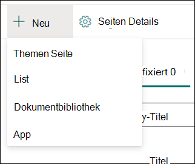
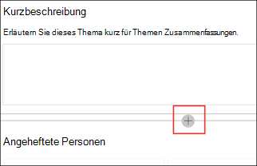

# Erstellen eines neuen Themas (Vorschau)Create a new topic (Preview)

> [!Note] 
> Der Inhalt dieses Artikels ist für Project Cortex Private Preview vorgesehen.The content in this article is for Project Cortex Private Preview. [Erfahren Sie mehr über Project Cortex](https://aka.ms/projectcortex).[Find out more about Project Cortex](https://aka.ms/projectcortex).

In "Themenerfahrungen" können Sie ein neues Thema erstellen, wenn eines nicht durch Indizierung gefunden wurde oder wenn die KI-Technologie nicht genügend Nachweise gefunden hat, um es als Thema zu finden.In Topic Experiences, you can create a new topic if one was not discovered through indexing or if the AI technology did not find enough evidence to establish it as a topic.

## AnforderungenRequirements

Um ein neues Thema zu erstellen, müssen Sie:To create a new topic, you need to:
- Sie verfügen über eine Topic Experiences-Lizenz.Have a Topic Experiences license.
- Sie verfügen über Berechtigungen für [**Personen, die Themen erstellen oder bearbeiten können.**](https://docs.microsoft.com/microsoft-365/knowledge/topic-experiences-user-permissions)Have permissions to [**Who can create or edit topics**](https://docs.microsoft.com/microsoft-365/knowledge/topic-experiences-user-permissions). Wissensadministratoren können Benutzern diese Berechtigung in den Themeneinstellungen des Knowledge Network erteilen.Knowledge admins can give users this permission in the Knowledge Network topic permissions settings. 

> [!Note] 
> Benutzer, die über die Berechtigung zum Verwalten von Themen im Themencenter (Knowledge Manager) verfügen, verfügen bereits über Berechtigungen zum Erstellen und Bearbeiten von Themen.Users who have permission to manage topics in the Topic center (knowledge managers) already have permissions to create and edit topics.

## So erstellen Sie ein neues Thema:To create a new topic:

1. Wählen Sie auf der Seite "Themencenter" **"Neu"** und dann **"Themenseite" aus.**On the Topic center page, select **New**, then select **Topic Page**. Wenn die Option "Neu" im Themencenter nicht angezeigt wird, verfügen Sie möglicherweise nicht über die erforderlichen Berechtigungen. If you are not able to see the **New** option in the Topic Center, you may not have the required permissions.

    

2. Auf der Seite "Neues Thema" können Sie die Informationen zur neuen Themenvorlage ausfüllen:On the new topic page, you can fill in the information on the new topic template:

    - Geben Sie **im Abschnitt "Name dieses Themas"** den Namen des neuen Themas ein.In the **Name this topic** section, type the name of the new topic.
    
    - Geben Sie **im Abschnitt "Alternative** Namen" Namen oder Akronyme ein, die auch zum Verweisen auf das Thema verwendet werden.In the **Alternate names** section, type names or acronyms that are also used to refer to the topic.
    
    - Geben Sie **im Abschnitt "Kurzbeschreibung"** eine beschreibung des Themas mit einem oder zwei Sätzen ein.In the **Short description** section, type a one or two sentence description of the topic. Dieser Text wird für die zugeordnete Themenkarte verwendet.This text will be used for the associated topic card.
    
    - Geben Sie **im** Abschnitt "Personen" die Namen der Experten für das Thema ein.In the **People** section, type the names of subject matter experts for the topic. Personen, die Sie manuell zum Thema hinzufügen, werden auf der Themenseite als **angeheftet angezeigt.**People you manually add to the topic will display in the topic page as **Pinned people**.
    
    - Wählen Sie **im Abschnitt "Dateien** und **Seiten"** "Hinzufügen" aus, und auf der nächsten Seite können Sie zugeordnete #A0 oder SharePoint #A1 auswählen.In the **Files and pages** section, select **Add** and then on the next page you can select associated OneDrive files or SharePoint Online pages.
    
    - Wählen Sie **im Abschnitt "Websites"** die Option **"Hinzufügen" aus.**In the **Sites** section, select **Add**. Wählen Sie  **im angezeigten** Bereich "Websites" die Websites aus, die dem Thema zugeordnet sind.In the  **Sites** pane that displays, select the sites that are associated to the topic.

    
    
3. Wenn Sie der Seite weitere Komponenten hinzufügen müssen, z. B. Text, Bilder, Webparts, Links usw., wählen Sie das Zeichenbereichssymbol in der Mitte der Seite aus, um sie zu suchen und hinzuzufügen.If you need to add other components to the page, such as text, images, web parts, links, etc., select the canvas icon in the middle of the page to locate and add them.

    

4. Wenn Sie fertig sind, wählen Sie **"Veröffentlichen"** aus, um die Themenseite zu veröffentlichen.When you are done, select **Publish** to publish the topic page. Veröffentlichte Themenseiten werden auf der Registerkarte **"Seiten"** angezeigt.Published topic pages will display in the **Pages** tab.

Nachdem Sie den Artikel veröffentlicht haben, werden der Name des Themas, der alternative Name, die Beschreibung und angeheftete Personen allen lizenzierten Benutzern angezeigt, die den Artikel anzeigen.After you publish the article, the topic name, alternate name, description, and pinned people will display to all licensed users who view the article. Dateien, Seiten und Websites werden nur dann auf der Themenseite angezeigt, wenn der Viewer über Office 365-Berechtigungen für das Element verfügt.Files, pages, and sites will only appear in the topic page if the viewer has Office 365 permissions to the item. 

Die neue Themenseite besteht aus Webparts, die Überkenntnisse des *Wissensnetzwerks haben.*The new topic page is made up of web parts that are *knowledge network aware*. Dies bedeutet, dass die Informationen in diesen Webparts mit Vorschlägen aktualisiert werden, um die Seite für Benutzer nützlicher zu machen, wenn ai weitere Informationen zu diesem Thema sammelt.This means that as AI gathers more information on the topic, the information in these web parts will be updated with suggestions to make the page more useful to users.

## Weitere Informationen:See also

  

