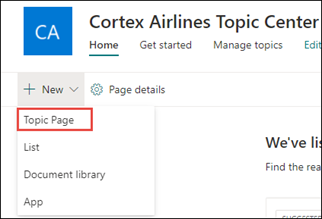

# Ein neues Thema erstellen 

In Themen von "Viva" können Sie ein neues Thema erstellen, wenn ein Thema nicht durch Indizierung erkannt wird oder wenn die KI-Technologie nicht genügend Nachweise für die Einrichtung als Thema gefunden hat.

> [!Note] 
> Während die Informationen in einem Thema, das von AI gesammelt wird, sicherheitsbeschnitten [sind,](topic-experiences-security-trimming.md)beachten Sie, dass die Themenbeschreibung und Personeninformationen in einem manuell erstellten Thema für alle Benutzer sichtbar sind, die über die Berechtigung zum Anzeigen des Themas verfügen. 

## Anforderungen

Zum Erstellen eines neuen Themas müssen Sie:
- Verfügen Sie über eine Lizenz für "Viva Topics".
- Haben Sie Berechtigungen für [**Die Personen, die Themen erstellen oder bearbeiten können.**](https://docs.microsoft.com/microsoft-365/knowledge/topic-experiences-user-permissions) Knowledge admins can give users this permission in the Viva Topics topic permissions settings. 

> [!Note] 
> Benutzer, die über die Berechtigung zum Verwalten von Themen im Themencenter (Wissensmanager) verfügen, verfügen bereits über Berechtigungen zum Erstellen und Bearbeiten von Themen.

## So erstellen Sie ein Thema

Sie können ein neues Thema an zwei Speicherorten erstellen:

- Startseite des Themencenters: Jeder  lizenzierte Benutzer mit der Berechtigung "Wer kann Themen erstellen oder <b></b> bearbeiten" (Mitwirkende) kann ein neues Thema im Themencenter erstellen, indem er das Menü Neu und die Seite Thema <b>auswählt.</b>  

       

- Seite "Themen verwalten": Jeder lizenzierte Benutzer, der über die Berechtigung **"Wer** kann Themen verwalten" verfügt (Wissensmanager), kann ein neues Thema auf der Seite Themen verwalten im Themencenter erstellen, indem er neue <b>Themenseite aus wählt.</b>  

       

### So erstellen Sie ein neues Thema:

1. Wählen Sie die Option zum Erstellen einer neuen Themenseite im Menüband auf der Seite Themen verwalten aus.

2.   Geben Sie **im Abschnitt Dieses Thema** benennen den Namen des neuen Themas ein.

       

3. Geben Sie <b>im Abschnitt</b> Alternative Namen alle anderen Namen ein, auf die das Thema möglicherweise verwiesen wird. 

       
4. Geben Sie <b>im Abschnitt</b> Beschreibung einige Sätze ein, die das Thema beschreiben. 

     

4. Im Abschnitt <b>Angeheftet personen</b> können Sie eine Person "anheften", um sie als Experten für Das Thema zu zeigen. Geben Sie zunächst ihren Namen oder <b></b> ihre E-Mail-Adresse in das Feld Neuen Benutzer hinzufügen ein, und wählen Sie dann den Benutzer aus, den Sie in den Suchergebnissen hinzufügen möchten. Sie können sie auch "entpin" entfernen, indem Sie auf der Benutzerkarte das Symbol Aus der Liste entfernen auswählen. <b></b> Sie können die Person auch ziehen, um die Reihenfolge zu ändern, in der die Liste der Personen angezeigt wird.
 
     

5. Im Abschnitt <b>Angeheftete Dateien</b> und Seiten können Sie eine Datei oder Eine SharePoint-Websiteseite hinzufügen oder anheften, die dem Thema zugeordnet ist.

    
 
    Um eine neue Datei hinzuzufügen, wählen Sie <b>Hinzufügen</b>aus, wählen Sie die SharePoint-Website aus Ihren Häufigen oder gefolgten Websites aus, und wählen Sie dann die Datei aus der Dokumentbibliothek der Website aus.

    Sie können auch die Option <b>Von einem Link verwenden,</b> um eine Datei oder Seite hinzuzufügen, indem Sie die URL angeben. 

    > [!Note] 
    > Dateien und Seiten, die Sie hinzufügen, müssen sich im gleichen Microsoft 365-Mandanten befinden. Wenn Sie einen Link zu einer externen Ressource im Thema hinzufügen möchten, können Sie ihn über das Zeichenbereichsymbol in Schritt 8 hinzufügen.

6.  Im <b>Abschnitt Verwandte Websites</b> werden Websites mit Informationen zum Thema angezeigt. 

     

    Sie können eine verwandte Website hinzufügen, indem Sie <b>Hinzufügen</b> auswählen und dann entweder nach der Website suchen oder sie in Ihrer Liste der häufigen oder zuletzt verwendeten Websites auswählen. 
    
     

7. Der <b>Abschnitt Verwandte Themen</b> zeigt Verbindungen zwischen Themen. Sie können eine Verbindung zu einem <b></b> anderen Thema hinzufügen, indem Sie die Schaltfläche Verbinden mit einem verwandten Thema auswählen und dann den Namen des verwandten Themas eingeben und aus den Suchergebnissen auswählen. 

      

    Anschließend können Sie eine Beschreibung der Beziehung zwischen den Themen geben und Aktualisieren <b>auswählen.</b> 

     

   Das verwandte Thema, das Sie hinzugefügt haben, wird als verbundenes Thema angezeigt.

     

   Wählen Sie zum Entfernen eines verwandten Themas das Zu entfernende Thema aus, und wählen Sie dann das <b>Symbol Thema entfernen</b> aus. 
 
      

   Wählen Sie dann <b>Entfernen aus.</b> 

     
     
 

8. Sie können der Seite auch statische Elemente hinzufügen (z. B. Text, Bilder oder Links), indem Sie das Zeichenbereichsymbol auswählen, das Sie unter der kurzen Beschreibung finden. Durch Die Auswahl wird die SharePoint-Toolbox geöffnet, aus der Sie das Element auswählen können, das Sie der Seite hinzufügen möchten.

     

9. Wählen **Sie Veröffentlichen** aus, um Ihre Änderungen zu speichern. 

Nachdem Sie die Seite veröffentlicht haben, werden der Themenname, der alternative Name, die Beschreibung und angeheftet personen allen lizenzierten Benutzern angezeigt, die das Thema anzeigen. Bestimmte Dateien, Seiten und Websites werden nur auf der Themenseite angezeigt, wenn der Viewer über Office 365-Berechtigungen für das Element verfügt. 

## Weitere Informationen:

  

