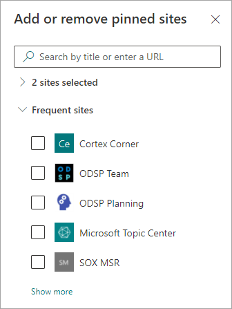
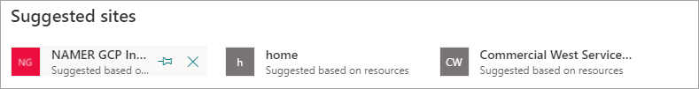

# Bearbeiten eines vorhandenen Themas in Microsoft Viva TopicsEdit an existing topic in Microsoft Viva Topics 

 

> [!VIDEO https://www.microsoft.com/videoplayer/embed/RE4LA4n]  

 

In Viva Topics können Sie ein vorhandenes Thema bearbeiten.In Viva Topics, you can edit an existing topic. Möglicherweise müssen Sie dies tun, wenn Sie eine vorhandene Themenseite korrigieren oder zusätzliche Informationen hinzufügen möchten.You might need to do this if you want to correct or add additional information to an existing topic page. 

> [!Note] 
> Während Die Informationen in einem thema, das von KI gesammelt wird, [auf Sicherheit gekürzt](topic-experiences-security-trimming.md)werden, sind die Themenbeschreibung und Personeninformationen, die Sie manuell hinzufügen, wenn Sie ein vorhandenes Thema bearbeiten, für alle Benutzer sichtbar, die über Berechtigungen zum Anzeigen von Themen verfügen.While information in a topic that is gathered by AI is [security trimmed](topic-experiences-security-trimming.md), the topic description and people information that you manually add when editing an existing topic is visible to all users who have permissions to view topics. 

## AnforderungenRequirements

Zum Bearbeiten eines vorhandenen Themas müssen Sie Folgendes ausführen:To edit an existing topic, you need to:
- Über eine Viva Topics-Lizenz verfügen.Have a Viva Topics license.
- Verfügen über Berechtigungen zum [Erstellen oder Bearbeiten von Themen.](./topic-experiences-user-permissions.md)Have permissions to [create or edit topics](./topic-experiences-user-permissions.md). Wissensadministratoren können Benutzern diese Berechtigung in den Berechtigungseinstellungen von Viva Topics erteilen.Knowledge admins can give users this permission in the Viva Topics topic permissions settings. 

> [!Note] 
> Benutzer, die über die Berechtigung zum Verwalten von Themen im Themencenter (Wissensmanager) verfügen, verfügen bereits über Berechtigungen zum Erstellen und Bearbeiten von Themen.Users who have permission to manage topics in the topic center (knowledge managers) already have permissions to create and edit topics.

## So bearbeiten Sie eine ThemenseiteHow to edit a topic page

Benutzer mit dem Wer können die Berechtigung *"Themen" erstellen oder bearbeiten,* indem sie die Themenseite über eine Themenmarkierung öffnen und dann die Schaltfläche **"Bearbeiten"** oben rechts auf der Themenseite auswählen.Users who have the *Who can create or edit topics* permission can edit a topic by opening the topic page from a topic highlight, and then selecting the **Edit** button on the top right of the topic page. Die Themenseite kann auch über die Themencenter-Startseite geöffnet werden, auf der Sie alle Themen finden, mit denen Sie eine Verbindung haben.The topic page can also be opened from the topic center home page where you can find all the topics that you have a connection to.

      

Wissensmanager können Themen auch direkt über die Seite **"Themen verwalten"** bearbeiten, indem sie das Thema auswählen und dann auf der Symbolleiste **"Bearbeiten"** auswählen.Knowledge managers can also edit topics directly from the **Manage topics** page by selecting the topic, and then selecting **Edit** in the toolbar.

   

### So bearbeiten Sie eine ThemenseiteTo edit a topic page

1. Wählen Sie auf der Themenseite **"Bearbeiten"** aus.On the topic page, select **Edit**. So können Sie bei Bedarf Änderungen an der Themenseite vornehmen.This lets you make changes as needed to the topic page.

     

2. Geben Sie im Abschnitt **"Alternative Namen"** alle anderen Namen ein, auf die das Thema verweist.In the **Alternate names** section, type any other names that the topic might be referred to. 

    

3. Geben Sie im Abschnitt **Beschreibung** ein paar Sätze ein, die das Thema beschreiben.In the **Description** section, type a couple of sentences that describes the topic. Oder aktualisieren Sie bei Bedarf eine bereits vorhandene Beschreibung.Or if a description already exists, update it if needed.

     

4. Sie können im Abschnitt **Angeheftete Personen** eine Person „anpinnen“, um zu zeigen, dass sie eine Verbindung zum Thema hat (beispielsweise ein Besitzer einer verbundenen Ressource).In the **Pinned people** section, you can "pin" a person to show them as having a connection the topic (for example, an owner of a connected resource). Geben Sie zunächst den Namen oder die E-Mail-Adresse in das Feld **"Neuen Benutzer hinzufügen" ein,** und wählen Sie dann den Benutzer aus, den Sie in den Suchergebnissen hinzufügen möchten.Begin by typing their name or email address in the **Add a new user** box, and then selecting the user you want to add from the search results. Sie können sie auch "lösen", indem Sie auf der Benutzerkarte das Symbol **"Aus Liste entfernen"** auswählen.You can also "unpin" them by selecting the **Remove from list** icon on the user card.
 
     

    Der Abschnitt **Vorgeschlagene Personen** zeigt Benutzer, von denen KI glaubt, dass sie mit dem Thema verbunden sein könnten, basierend auf ihren Verbindungen zu Ressourcen über das Thema.The **Suggested people** section shows users that AI thinks might be connected to the topic from their connection to resources about the topic. Sie können ihren Status von Vorgeschlagen auf Angeheftet ändern, indem Sie das Stecknadel-Symbol auf der Benutzerkarte auswählen.You can change their status from Suggested to Pinned by selecting the pin icon on the user card.

   

5. Im Abschnitt **Angeheftete Dateien und Seiten** können Sie eine Datei oder SharePoint-Webseite, die mit dem Thema verknüpft ist, hinzufügen oder "anheften".In the **Pinned files and pages** section, you can add or "pin" a file or SharePoint site page that is associated to the topic.

   
 
    Wenn Sie eine neue Datei hinzufügen möchten, wählen Sie **"Hinzufügen"** aus, wählen Sie die SharePoint Website aus Ihren Häufigen oder Gefolgten Websites aus, und wählen Sie dann die Datei aus der Dokumentbibliothek der Website aus.To add a new file, select **Add**, select the SharePoint site from your Frequent or Followed sites, and then select the file from the site's document library.

    Sie können auch die Option **Von einem Link** verwenden, um eine Datei oder Seite hinzuzufügen, indem Sie die URL angeben.You can also use the **From a link** option to add a file or page by providing the URL. 

   > [!Note] 
   > Dateien und Seiten, die Sie hinzufügen, müssen sich im selben Microsoft 365 Mandanten befinden.Files and pages that you add must be located within the same Microsoft 365 tenant. Wenn Sie einen Link zu einer externen Ressource im Thema hinzufügen möchten, können Sie ihn über das Canvas-Symbol in Schritt 9 hinzufügen.If you want to add a link to an external resource in the topic, you can add it through the canvas icon in step 9.

6. Im Abschnitt **"Vorgeschlagene Dateien und Seiten"** werden Dateien und Seiten angezeigt, die AI vorschlägt, dem Thema zugeordnet zu werden.The **Suggested files and pages** section shows files and pages that AI suggests to be associated to the topic.

   

    Sie können eine vorgeschlagene Datei oder Seite in eine angehefteten Datei oder Seite ändern, indem Sie das Stecknadel-Symbol auswählen.You can change a suggested file or page to a pinned file or page by selecting the pinned icon.

7.  Im Abschnitt **"Angeheftete Websites"** können Sie eine Website hinzufügen oder "anheften", die dem Thema zugeordnet ist.In the **Pinned sites** section, you can add or “pin” a site that is associated to the topic. 

    

    Um eine neue Website hinzuzufügen, wählen Sie **"Hinzufügen"** aus, und suchen Sie dann entweder nach der Website, oder wählen Sie sie aus der Liste der häufigen oder zuletzt verwendeten Websites aus.To add a new site, select **Add** and then either search for the site, or select it from your list of Frequent or Recent sites.
    
    

8. Der Abschnitt **"Vorgeschlagene Websites"** zeigt die Websites, die AI vorschlägt, dem Thema zugeordnet zu werden.The **Suggested sites** section shows the sites that AI suggests to be associated to the topic. 

     

    Sie können eine vorgeschlagene Website in eine angeheftete Website ändern, indem Sie das angeheftete Symbol auswählen.You can change a suggested site to a pinned site by selecting the pinned icon.

<!---

7.  The <b>Related sites</b> section shows sites that have information about the topic. 

     

    You can add a related site by selecting <b>Add</b> and then either searching for the site, or selecting it from your list of Frequent or Recent sites. 
    
     

8. The <b>Related topics</b> section shows connections that exists between topics. You can add a connection to a different topic by selecting the <b>Connect to a related topic</b> button, and then typing the name of the related topic, and selecting it from the search results. 

      

    You can then give a description of how the topics are related, and select <b>Update</b>. 

     

   The related topic you added will display as a connected topic.

     

   To remove a related topic, select the topic you want to remove, then select the <b>Remove topic</b> icon. 
 
      

   Then select <b>Remove</b>. 

     

--->

9. Sie können auch statische Elemente zur Seite hinzufügen (Text, Bilder, Links usw.), indem Sie das Symbol „Kollaborationsbereich“ auswählen, das unterhalb der Kurzbeschreibung zu finden ist.You can also add static items to the page — such as text, images, or links - by selecting the canvas icon, which you can find below the short description. Wenn Sie es auswählen, wird die SharePoint Toolbox geöffnet, aus der Sie das Element auswählen können, das Sie der Seite hinzufügen möchten.Selecting it will open the SharePoint toolbox from which you can choose the item you want to add to the page.

   

10. Wählen Sie **Veröffentlichen** oder **Erneut veröffentlichen** aus, um Ihre Änderungen zu speichern.Select **Publish** or **Republish** to save your changes. **Eine erneute Veröffentlichung** ist Ihre verfügbare Option, wenn das Thema zuvor veröffentlicht wurde.**Republish** will be your available option if the topic has been published previously.

