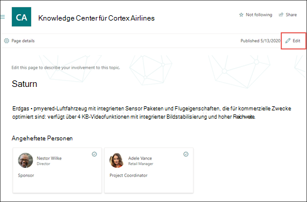

# Bearbeiten eines vorhandenen Themas (Vorschau)Edit an existing topic (Preview)

> [!Note] 
> Der Inhalt dieses Artikels ist für Project Cortex private Preview.The content in this article is for Project Cortex Private Preview. [Erfahren Sie mehr über Project Cortex](https://aka.ms/projectcortex).[Find out more about Project Cortex](https://aka.ms/projectcortex).

In Themen Erfahrungen können Sie ein vorhandenes Thema bearbeiten.In Topic experiences, you can edit an existing topic. Dies ist möglicherweise erforderlich, wenn Sie eine vorhandene Themen Seite korrigieren oder zusätzliche Informationen hinzufügen möchten.You may need to do this if you want to correct or add additional information to an existing topic page. 

## AnforderungenRequirements

Um ein vorhandenes Thema zu bearbeiten, müssen Sie Folgendes tun:To edit an existing topic, you need to:
- Lassen Sie sich eine Lizenz für ein Thema erleben.Have a Topic Experiences license.
- Verfügen über Berechtigungen für [**Personen, die Themen erstellen oder bearbeiten können**](https://docs.microsoft.com/microsoft-365/knowledge/topic-experiences-user-permissions).Have permissions to [**Who can create or edit topics**](https://docs.microsoft.com/microsoft-365/knowledge/topic-experiences-user-permissions). Wissens-Admins können Benutzern diese Berechtigung im Thema Berechtigungseinstellungen für das Knowledge Network erteilen.Knowledge admins can give users this permission in the Knowledge Network topic permissions settings. 

> [!Note] 
> Benutzer, die über die Berechtigung zum Verwalten von Themen im Themen Center (Knowledge Managers) verfügen, verfügen bereits über Berechtigungen zum Erstellen und Bearbeiten von Themen.Users who have permission to manage topics in the Topic center (knowledge managers) already have permissions to create and edit topics.

## Bearbeiten einer Themen SeiteEdit a topic page

Wenn Sie über Berechtigungen zum Bearbeiten einer Themen Seite verfügen, können Sie nach dem Öffnen des Themas **Bearbeiten** oben rechts auf der Seite sehen.If you have permissions to edit a topic page, after opening the topic, you will be able to see **Edit** on the top right of the page.

      

1. Wählen Sie auf der Seite Thema die Option **Bearbeiten** aus.On the topic page, select **Edit**.

2. Nehmen Sie die erforderlichen Änderungen an der Seite vor.Make the changes you need to the page. Dies umfasst Aktualisierungen für die folgenden Felder:This includes updates to the following fields:

    -  Alternative NamenAlternate names
    -  BeschreibungDescription
    -  Angeheftete PersonenPinned people
    -  Dateien und SeitenFiles and pages
    -  WebsitesSites

    Sie können der Seite auch statische Elemente hinzufügen, beispielsweise Text, Bilder oder Links, indem Sie das Canvas-Symbol auswählen.You can also add static items to the page—such as text, images, or links by selecting the canvas icon.

3. Wählen Sie **erneut veröffentlichen** aus, um die Änderungen zu speichern.Select **Republish** to save your changes.

## Weitere Informationen:See also

  

