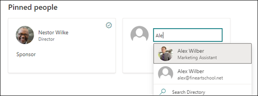

# Bearbeiten eines vorhandenen Themas 

 

> [!VIDEO https://www.microsoft.com/videoplayer/embed/RE4LA4n]  

 

In "Themen von Topics" können Sie ein vorhandenes Thema bearbeiten. Möglicherweise müssen Sie dies tun, wenn Sie eine vorhandene Themenseite korrigieren oder zusätzliche Informationen hinzufügen möchten. 

> [!Note] 
> Während die Informationen in einem Thema, das von AI gesammelt wird, aus Sicherheitsgründen gekürzt [werden,](topic-experiences-security-trimming.md)beachten Sie, dass die Themenbeschreibung und Personeninformationen, die Sie beim Bearbeiten eines vorhandenen Themas manuell hinzufügen, für alle Benutzer sichtbar sind, die über die Berechtigung zum Anzeigen von Themen verfügen. 

## Anforderungen

Um ein vorhandenes Thema zu bearbeiten, müssen Sie:
- Sie verfügen über eine Lizenz für "Topics".
- Sie verfügen über Berechtigungen für [**Personen, die Themen erstellen oder bearbeiten können.**](https://docs.microsoft.com/microsoft-365/knowledge/topic-experiences-user-permissions) Wissensadministratoren können Benutzern diese Berechtigung in den Themen "Themen" erteilen. 

> [!Note] 
> Benutzer, die über die Berechtigung zum Verwalten von Themen im Themencenter (Knowledge Manager) verfügen, verfügen bereits über Berechtigungen zum Erstellen und Bearbeiten von Themen.

## Bearbeiten einer Themenseite

Benutzer mit  der Berechtigung "Wer kann Themen erstellen oder bearbeiten" können ein Thema bearbeiten, <b></b> indem sie die Themenseite über eine Themenauswahl öffnen und dann oben rechts auf der Themenseite die Schaltfläche "Bearbeiten" auswählen. Die Themenseite kann auch über die Startseite des Themencenters geöffnet werden, auf der Sie alle Themen finden können, zu denen Sie eine Verbindung haben.

      

Wissensmanager können Themen auch direkt auf der Seite "Themen verwalten" bearbeiten, indem sie das Thema auswählen und dann <b>auf</b> der Symbolleiste "Bearbeiten" auswählen.

      

### So bearbeiten Sie eine Themenseite

1. Wählen Sie auf der Themenseite **"Bearbeiten" aus.** Auf diese Weise können Sie bei Bedarf Änderungen an der Themenseite vornehmen.

       

2. Geben Sie <b>im Abschnitt "Alternative</b> Namen" alle anderen Namen ein, auf die das Thema möglicherweise verwiesen wird. 

       
3. Geben Sie <b>im Abschnitt</b> "Beschreibung" einige Sätze ein, die das Thema beschreiben. Wenn bereits eine Beschreibung vorhanden ist, aktualisieren Sie sie bei Bedarf.

     

4. Im Abschnitt <b>"Angeheftierte</b> Personen" können Sie eine Person "anheften", um sie als Experten für das Thema zu zeigen. Geben Sie zunächst ihren Namen oder <b></b> ihre E-Mail-Adresse in das Feld "Neuen Benutzer hinzufügen" ein, und wählen Sie dann den Benutzer aus den Suchergebnissen aus, den Sie hinzufügen möchten. Sie können sie auch "entfernen", indem Sie auf der Benutzerkarte das Symbol "Aus Liste entfernen" auswählen. <b></b>
 
     

    Der <b>Abschnitt "Vorgeschlagene</b> Personen" zeigt Benutzern, dass AI der Meinung ist, dass es sich bei dem Thema von der Verbindung zu Ressourcen zu diesem Thema als Experten für das Thema halten könnte. Sie können den Status von "Vorgeschlagen" in "Angeheftet" ändern, indem Sie auf der Benutzerkarte das Symbol "Anheften" auswählen.

    

5. Im Abschnitt <b>"Angeheftierte</b> Dateien und Seiten" können Sie eine Datei oder eine SharePoint-Websiteseite, die dem Thema zugeordnet ist, hinzufügen oder "anheften".

    
 
    Wenn Sie eine neue Datei hinzufügen möchten, wählen Sie "Hinzufügen" <b>aus,</b>wählen Sie die SharePoint-Website aus Ihren Websites mit häufigen oder gefolgten Websites aus, und wählen Sie dann die Datei aus der Dokumentbibliothek der Website aus.

    Sie können auch die Linkoption <b>"Von"</b> verwenden, um eine Datei oder Seite hinzuzufügen, indem Sie die URL angeben. 

   > [!Note] 
   > Dateien und Seiten, die Sie hinzufügen, müssen sich im selben Microsoft 365-Mandanten befinden. Wenn Sie einen Link zu einer externen Ressource im Thema hinzufügen möchten, können Sie ihn über das Zeichenbereichssymbol in Schritt 9 hinzufügen.

6. Im <b>Abschnitt "Vorgeschlagene Dateien und Seiten"</b> werden Dateien und Seiten angezeigt, die ai vorschlägt, dem Thema zugeordnet zu werden.

    

    Sie können eine vorgeschlagene Datei oder Seite in eine angeheftet Datei oder Seite ändern, indem Sie das angeheftet Symbol auswählen.

7.  Im <b>Abschnitt "Verwandte Websites"</b> werden Websites mit Informationen zu diesem Thema angezeigt. 

     

    Sie können eine verwandte <b></b> Website hinzufügen, indem Sie "Hinzufügen" auswählen und dann entweder nach der Website suchen oder sie aus der Liste der häufig verwendeten oder zuletzt verwendeten Websites auswählen. 
    
     

8. Im <b>Abschnitt "Verwandte Themen"</b> werden Verbindungen zwischen Themen angezeigt. Sie können eine Verbindung zu einem <b></b> anderen Thema hinzufügen, indem Sie die Schaltfläche "Mit einem verwandten Thema verbinden" auswählen, dann den Namen des verwandten Themas eingeben und in den Suchergebnissen auswählen. 

      

    Sie können dann eine Beschreibung der Beziehung zwischen den Themen geben und Aktualisieren <b>auswählen.</b> 

     

   Das verwandte Thema, das Sie hinzugefügt haben, wird als verbundenes Thema angezeigt.

     

   Um ein verwandtes Thema zu entfernen, wählen Sie das zu entfernende Thema aus, und wählen Sie dann das Symbol "Thema <b>entfernen"</b> aus. 
 
      

   Wählen Sie dann <b>"Entfernen" aus.</b> 

     

9. Sie können der Seite auch statische Elemente hinzufügen, z. B. Text, Bilder oder Links, indem Sie das Zeichenbereichssymbol auswählen, das Sie unterhalb der Kurzbeschreibung finden. Wenn Sie es auswählen, wird die SharePoint-Toolbox geöffnet, aus der Sie das Element auswählen können, das Sie der Seite hinzufügen möchten.

     

10. Wählen **Sie "Veröffentlichen"** oder **"Erneut veröffentlichen"** aus, um Ihre Änderungen zu speichern. **Die Veröffentlichung ist** ihre verfügbare Option, wenn das Thema bereits veröffentlicht wurde.

## Weitere Informationen:

  

