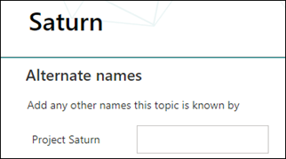

# Bearbeiten eines vorhandenen ThemasEdit an existing topic 

 

> [!VIDEO https://www.microsoft.com/videoplayer/embed/RE4LA4n]  

 

In "Themen zu Thema" können Sie ein vorhandenes Thema bearbeiten.In Viva Topics, you can edit an existing topic. Möglicherweise müssen Sie dies tun, wenn Sie eine vorhandene Themenseite korrigieren oder zusätzliche Informationen hinzufügen möchten.You may need to do this if you want to correct or add additional information to an existing topic page. 

> [!Note] 
> Während die Informationen in einem Thema, das von AI gesammelt wird, aus Sicherheitsgründen gekürzt [werden,](topic-experiences-security-trimming.md)beachten Sie, dass Informationen, die Sie beim Bearbeiten eines vorhandenen Themas manuell hinzufügen, für alle Benutzer sichtbar sind, die über Berechtigungen zum Anzeigen von Themen verfügen.While information in a topic that is gathered by AI is [security trimmed](topic-experiences-security-trimming.md), note that information that you manually add when editing an existing topic is visible to all users who have permissions to view topics. 

## AnforderungenRequirements

Um ein vorhandenes Thema zu bearbeiten, müssen Sie:To edit an existing topic, you need to:
- Sie verfügen über eine Lizenz für "Topics".Have a Viva Topics license.
- Sie verfügen über Berechtigungen für [**Personen, die Themen erstellen oder bearbeiten können.**](https://docs.microsoft.com/microsoft-365/knowledge/topic-experiences-user-permissions)Have permissions to [**Who can create or edit topics**](https://docs.microsoft.com/microsoft-365/knowledge/topic-experiences-user-permissions). Wissensadministratoren können Benutzern diese Berechtigung in den Themen "Themen" erteilen.Knowledge admins can give users this permission in the Viva Topics topic permissions settings. 

> [!Note] 
> Benutzer, die über die Berechtigung zum Verwalten von Themen im Themencenter (Knowledge Manager) verfügen, verfügen bereits über Berechtigungen zum Erstellen und Bearbeiten von Themen.Users who have permission to manage topics in the Topic center (knowledge managers) already have permissions to create and edit topics.

## Bearbeiten einer ThemenseiteHow to edit a topic page

Benutzer mit  der Berechtigung "Wer kann Themen erstellen oder bearbeiten" können ein Thema bearbeiten, <b></b> indem sie die Themenseite in einer Themenauswahl öffnen und dann oben rechts auf der Themenseite die Schaltfläche "Bearbeiten" auswählen.Users who have the **Who can create or edit topics** permission can edit a topic by opening the topic page from a topic highlight, and then selecting the <b>Edit</b> button on the top right of the topic page. Die Themenseite kann auch über die Startseite des Themencenters geöffnet werden, auf der Sie alle Themen finden können, zu denen Sie eine Verbindung haben.The topic page can also be opened from the topic center home page where you can find all the topics that you have a connection to.

      

Wissensmanager können Themen auch direkt auf der Seite "Themen verwalten" bearbeiten, indem sie das Thema auswählen und dann <b>auf</b> der Symbolleiste "Bearbeiten" auswählen.Knowledge managers can also edit topics directly from the Manage Topics page by selecting the topic, and then selecting <b>Edit</b> in the toolbar.

      

### So bearbeiten Sie eine ThemenseiteTo edit a topic page

1. Wählen Sie auf der Themenseite **"Bearbeiten" aus.**On the topic page, select **Edit**. Auf diese Weise können Sie bei Bedarf Änderungen an der Themenseite vornehmen.This allows you to make changes as you need to the topic page.

       

2. Geben Sie <b>im Abschnitt "Alternative</b> Namen" alle anderen Namen ein, auf die das Thema möglicherweise verwiesen wird.In the <b>Alternate Names</b> section, type any other names that the topic might be referred to. 

       
3. Geben Sie <b>im Abschnitt</b> "Beschreibung" einige Sätze ein, die das Thema beschreiben.In the <b>Description</b> section, type a couple of sentences that describes the topic. Wenn bereits eine Beschreibung vorhanden ist, aktualisieren Sie sie bei Bedarf.Or if a description already exists, update it if needed.

     

4. Im Abschnitt <b>"Angeheftierte</b> Personen" können Sie eine Person "anheften", um sie als Experten für das Thema zu zeigen.In the <b>Pinned people</b> section, you can "pin" a person to show them as a subject matter expert on the topic. Geben Sie zunächst ihren Namen oder <b></b> ihre E-Mail-Adresse in das Feld "Neuen Benutzer hinzufügen" ein, und wählen Sie dann den Benutzer aus den Suchergebnissen aus, den Sie hinzufügen möchten.Begin by typing their name or email address in the <b>Add a new user</b> box, and then selecting the user you want to add from the search results. Sie können sie auch "entfernen", indem Sie auf der Benutzerkarte das Symbol "Aus Liste entfernen" auswählen. <b></b>You can also "unpin" them by selecting the <b>Remove from list</b> icon on the user card.
 
     

    Der <b>Abschnitt "Vorgeschlagene</b> Personen" zeigt Benutzern, dass AI der Meinung ist, dass es sich bei dem Thema von der Verbindung zu Ressourcen zu diesem Thema als Experten für das Thema halten könnte.The <b>Suggested people</b> section shows users that AI thinks might be subject matter experts on the topic from their connection to resources about the topic. Sie können den Status von "Vorgeschlagen" in "Angeheftet" ändern, indem Sie auf der Benutzerkarte das Symbol "Anheften" auswählen.You can change their status from Suggested to Pinned by selecting the pin icon on the user card.

    

5. Im Abschnitt <b>"Angeheftierte</b> Dateien und Seiten" können Sie eine Datei oder eine SharePoint-Websiteseite, die dem Thema zugeordnet ist, hinzufügen oder "anheften".In the <b>Pinned files and pages</b> section, you can add or "pin" a file or SharePoint site page that is associated to the topic.

    
 
    Wenn Sie eine neue Datei hinzufügen möchten, wählen Sie "Hinzufügen" <b>aus,</b>wählen Sie die SharePoint-Website aus Ihren Websites mit häufigen oder gefolgten Websites aus, und wählen Sie dann die Datei aus der Dokumentbibliothek der Website aus.To add a new file, select <b>Add</b>, select the SharePoint site from your Frequent or Followed sites, and then select the file from the site's document library.

    Sie können auch die Linkoption <b>"Von"</b> verwenden, um eine Datei oder Seite hinzuzufügen, indem Sie die URL angeben.You can also use the <b>From a link</b> option to add a file or page by providing the URL. 

6. Im <b>Abschnitt "Vorgeschlagene Dateien und Seiten"</b> werden Dateien und Seiten angezeigt, die ai vorschlägt, dem Thema zugeordnet zu werden.The <b>Suggested files and pages</b> section shows files and pages that AI suggests to be associated to the topic.

    

    Sie können eine vorgeschlagene Datei oder Seite an eine angeheftet Datei oder Seite erstellen, indem Sie das angeheftet Symbol auswählen.You can make a suggested file or page to a pinned file or page by selecting the pinned icon.

7.  Im <b>Abschnitt "Verwandte Websites"</b> werden Websites mit Informationen zum Thema angezeigt.The <b>Related sites</b> section shows sites that have information about the topic. 

     

    Sie können eine verwandte <b></b> Website hinzufügen, indem Sie "Hinzufügen" auswählen und dann entweder nach der Website suchen oder sie in der Liste der häufig verwendeten oder zuletzt verwendeten Websites auswählen.You can add a related site by selecting <b>Add</b> and then either searching for the site, or selecting it from your list of Frequent or Recent sites. 
    
     

8. Im <b>Abschnitt "Verwandte Themen"</b> werden Verbindungen zwischen Themen angezeigt.The <b>Related topics</b> section shows connections that exists between topics. Sie können eine Verbindung zu einem <b></b> anderen Thema hinzufügen, indem Sie die Schaltfläche "Mit einem verwandten Thema verbinden" auswählen, dann den Namen des verwandten Themas eingeben und in den Suchergebnissen auswählen.You can add a connection to a different topic by selecting the <b>Connect to a related topic</b> button, and then typing the name of the related topic, and selecting it from the search results. 

      

    Sie können dann eine Beschreibung der Beziehung zwischen den Themen geben und Aktualisieren <b>auswählen.</b>You can then give a description of how the topics are related, and select <b>Update</b>. 

     

   Das verwandte Thema, das Sie hinzugefügt haben, wird als verbundenes Thema angezeigt.The related topic you added will display as a connected topic.

     

9. Sie können der Seite auch statische Elemente hinzufügen, z. B. Text, Bilder oder Links, indem Sie das Zeichenbereichssymbol auswählen, das Sie unterhalb der Kurzbeschreibung finden.You can also add static items to the page — such as text, images, or links - by selecting the canvas icon, which you can find below the short description. Wenn Sie es auswählen, wird die SharePoint-Toolbox geöffnet, aus der Sie das Element auswählen können, das Sie der Seite hinzufügen möchten.Selecting it will open the SharePoint toolbox from which you can choose the item you want to add to the page.

     

10. Wählen **Sie "Veröffentlichen"** oder **"Erneut veröffentlichen"** aus, um Ihre Änderungen zu speichern.Select **Publish** or **Republish** to save your changes. **Die Veröffentlichung ist** ihre verfügbare Option, wenn das Thema bereits veröffentlicht wurde.**Republish** will be your available option if the topic has been published previously.

## Weitere Informationen:See also

  

