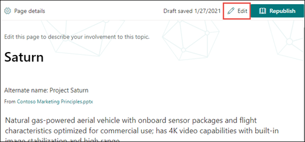

# Bearbeiten eines vorhandenen Themas in Microsoft Viva TopicsEdit an existing topic in Microsoft Viva Topics 

 

> [!VIDEO https://www.microsoft.com/videoplayer/embed/RE4LA4n]  

 

In Themen von "Viva" können Sie ein vorhandenes Thema bearbeiten.In Viva Topics, you can edit an existing topic. Möglicherweise müssen Sie dies tun, wenn Sie einer vorhandenen Themenseite zusätzliche Informationen korrigieren oder hinzufügen möchten.You may need to do this if you want to correct or add additional information to an existing topic page. 

> [!Note] 
> Während die Informationen in einem Thema, das von AI gesammelt wird, sicherheitsbeschnitten [sind,](topic-experiences-security-trimming.md)beachten Sie, dass die Themenbeschreibung und Personeninformationen, die Sie beim Bearbeiten eines vorhandenen Themas manuell hinzufügen, für alle Benutzer sichtbar sind, die über Berechtigungen zum Anzeigen von Themen verfügen.While information in a topic that is gathered by AI is [security trimmed](topic-experiences-security-trimming.md), note that topic description and people information that you manually add when editing an existing topic is visible to all users who have permissions to view topics. 

## AnforderungenRequirements

Zum Bearbeiten eines vorhandenen Themas müssen Sie:To edit an existing topic, you need to:
- Verfügen Sie über eine Lizenz für "Viva Topics".Have a Viva Topics license.
- Haben Sie Berechtigungen für [**Die Personen, die Themen erstellen oder bearbeiten können.**](./topic-experiences-user-permissions.md)Have permissions to [**Who can create or edit topics**](./topic-experiences-user-permissions.md). Knowledge admins can give users this permission in the Viva Topics topic permissions settings.Knowledge admins can give users this permission in the Viva Topics topic permissions settings. 

> [!Note] 
> Benutzer, die über die Berechtigung zum Verwalten von Themen im Topic Center (Knowledge Manager) verfügen, verfügen bereits über Berechtigungen zum Erstellen und Bearbeiten von Themen.Users who have permission to manage topics in the Topic center (knowledge managers) already have permissions to create and edit topics.

## Bearbeiten einer ThemenseiteHow to edit a topic page

Benutzer, die über die Berechtigung **"Wer** kann Themen erstellen oder bearbeiten" verfügen, können <b></b> ein Thema bearbeiten, indem sie die Themenseite in einer Themen hervorhebung öffnen und dann die Schaltfläche Bearbeiten oben rechts auf der Themenseite auswählen.Users who have the **Who can create or edit topics** permission can edit a topic by opening the topic page from a topic highlight, and then selecting the <b>Edit</b> button on the top right of the topic page. Die Themenseite kann auch über die Startseite des Themencenters geöffnet werden, auf der Sie alle Themen finden, zu denen Sie eine Verbindung haben.The topic page can also be opened from the topic center home page where you can find all the topics that you have a connection to.

      

Wissensmanager können Themen auch direkt auf der Seite Themen verwalten bearbeiten, indem Sie das Thema auswählen und dann <b>auf</b> der Symbolleiste Bearbeiten auswählen.Knowledge managers can also edit topics directly from the Manage Topics page by selecting the topic, and then selecting <b>Edit</b> in the toolbar.

      

### So bearbeiten Sie eine ThemenseiteTo edit a topic page

1. Wählen Sie auf der Themenseite Bearbeiten **aus.**On the topic page, select **Edit**. Auf diese Weise können Sie bei Bedarf Änderungen an der Themenseite vornehmen.This lets you make changes as needed to the topic page.

       

2. Geben Sie <b>im Abschnitt</b> Alternative Namen alle anderen Namen ein, auf die das Thema möglicherweise verwiesen wird.In the <b>Alternate Names</b> section, type any other names that the topic might be referred to. 

       
3. Geben Sie <b>im Abschnitt</b> Beschreibung einige Sätze ein, die das Thema beschreiben.In the <b>Description</b> section, type a couple of sentences that describes the topic. Wenn bereits eine Beschreibung vorhanden ist, aktualisieren Sie sie bei Bedarf.Or if a description already exists, update it if needed.

     

4. Im Abschnitt <b>Angeheftet personen</b> können Sie eine Person "anheften", um zu zeigen, dass sie eine Verbindung zum Thema hat (z. B. ein Besitzer einer verbundenen Ressource).In the <b>Pinned people</b> section, you can "pin" a person to show them as having a connection the topic (for example, an owner of a connected resource). Geben Sie zunächst ihren Namen oder <b></b> ihre E-Mail-Adresse in das Feld Neuen Benutzer hinzufügen ein, und wählen Sie dann den Benutzer aus, den Sie aus den Suchergebnissen hinzufügen möchten.Begin by typing their name or email address in the <b>Add a new user</b> box, and then selecting the user you want to add from the search results. Sie können sie auch "entpin" entfernen, indem Sie auf der Benutzerkarte das Symbol Aus der Liste entfernen auswählen. <b></b>You can also "unpin" them by selecting the <b>Remove from list</b> icon on the user card.
 
     

    Im <b>Abschnitt Vorgeschlagene Personen</b> werden Benutzer angezeigt, die davon aus sind, dass AI über ihre Verbindung zu Ressourcen zu diesem Thema mit dem Thema verbunden sein könnte.The <b>Suggested people</b> section shows users that AI thinks might be connected to the topic from their connection to resources about the topic. Sie können den Status von Vorgeschlagen in Angeheftet ändern, indem Sie das Pinsymbol auf der Benutzerkarte auswählen.You can change their status from Suggested to Pinned by selecting the pin icon on the user card.

    

5. Im Abschnitt <b>Angeheftete Dateien</b> und Seiten können Sie eine Datei oder Eine SharePoint-Websiteseite hinzufügen oder anheften, die dem Thema zugeordnet ist.In the <b>Pinned files and pages</b> section, you can add or "pin" a file or SharePoint site page that is associated to the topic.

    
 
    Um eine neue Datei hinzuzufügen, wählen Sie <b>Hinzufügen</b>aus, wählen Sie die SharePoint-Website aus Ihren Häufigen oder gefolgten Websites aus, und wählen Sie dann die Datei aus der Dokumentbibliothek der Website aus.To add a new file, select <b>Add</b>, select the SharePoint site from your Frequent or Followed sites, and then select the file from the site's document library.

    Sie können auch die Option <b>Von einem Link verwenden,</b> um eine Datei oder Seite hinzuzufügen, indem Sie die URL angeben.You can also use the <b>From a link</b> option to add a file or page by providing the URL. 

   > [!Note] 
   > Dateien und Seiten, die Sie hinzufügen, müssen sich im gleichen Microsoft 365-Mandanten befinden.Files and pages that you add must be located within the same Microsoft 365 tenant. Wenn Sie einen Link zu einer externen Ressource im Thema hinzufügen möchten, können Sie ihn über das Zeichenbereichsymbol in Schritt 9 hinzufügen.If you want to add a link to an external resource in the topic, you can add it through the canvas icon in step 9.

6. Im <b>Abschnitt Vorgeschlagene Dateien und Seiten</b> werden Dateien und Seiten angezeigt, die ai vorschlägt, dem Thema zugeordnet zu werden.The <b>Suggested files and pages</b> section shows files and pages that AI suggests to be associated to the topic.

    

    Sie können eine vorgeschlagene Datei oder Seite in eine angeheftet Datei oder Seite ändern, indem Sie das angeheftet Symbol auswählen.You can change a suggested file or page to a pinned file or page by selecting the pinned icon.

7.  Im <b>Abschnitt Verwandte Websites</b> werden Websites mit Informationen zum Thema angezeigt.The <b>Related sites</b> section shows sites that have information about the topic. 

     

    Sie können eine verwandte Website hinzufügen, indem Sie <b>Hinzufügen</b> auswählen und dann entweder nach der Website suchen oder sie in Ihrer Liste der häufigen oder zuletzt verwendeten Websites auswählen.You can add a related site by selecting <b>Add</b> and then either searching for the site, or selecting it from your list of Frequent or Recent sites. 
    
     

8. Der <b>Abschnitt Verwandte Themen</b> zeigt Verbindungen zwischen Themen.The <b>Related topics</b> section shows connections that exists between topics. Sie können eine Verbindung zu einem <b></b> anderen Thema hinzufügen, indem Sie die Schaltfläche Verbinden mit einem verwandten Thema auswählen und dann den Namen des verwandten Themas eingeben und aus den Suchergebnissen auswählen.You can add a connection to a different topic by selecting the <b>Connect to a related topic</b> button, and then typing the name of the related topic, and selecting it from the search results. 

      

    Anschließend können Sie eine Beschreibung der Beziehung zwischen den Themen geben und Aktualisieren <b>auswählen.</b>You can then give a description of how the topics are related, and select <b>Update</b>. 

     

   Das verwandte Thema, das Sie hinzugefügt haben, wird als verbundenes Thema angezeigt.The related topic you added will display as a connected topic.

     

   Wählen Sie zum Entfernen eines verwandten Themas das Zu entfernende Thema aus, und wählen Sie dann das <b>Symbol Thema entfernen</b> aus.To remove a related topic, select the topic you want to remove, then select the <b>Remove topic</b> icon. 
 
      

   Wählen Sie dann <b>Entfernen aus.</b>Then select <b>Remove</b>. 

     

9. Sie können der Seite auch statische Elemente hinzufügen , z. B. Text, Bilder oder Links, indem Sie das Zeichenbereichsymbol auswählen, das Sie unterhalb der kurzen Beschreibung finden.You can also add static items to the page — such as text, images, or links - by selecting the canvas icon, which you can find below the short description. Durch Die Auswahl wird die SharePoint-Toolbox geöffnet, aus der Sie das Element auswählen können, das Sie der Seite hinzufügen möchten.Selecting it will open the SharePoint toolbox from which you can choose the item you want to add to the page.

     

10. Wählen **Sie Veröffentlichen** oder Erneut veröffentlichen **aus,** um Ihre Änderungen zu speichern.Select **Publish** or **Republish** to save your changes. **Die Veröffentlichung ist** ihre verfügbare Option, wenn das Thema bereits veröffentlicht wurde.**Republish** will be your available option if the topic has been published previously.

## Weitere Informationen:See also

