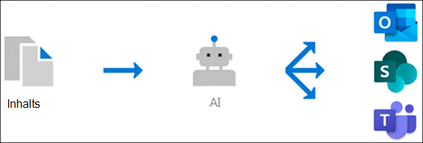

# Knowledge Management 0verview (Vorschau)

> [!Note] 
> Der Inhalt dieses Artikels ist für Project Cortex private Preview. [Erfahren Sie mehr über Project Cortex](https://aka.ms/projectcortex) 

Knowledge Management verwendet Microsoft AI-Technologie, Microsoft 365, forschen, suchen und andere Komponenten und Dienste, um ein Wissensnetzwerk in Ihrer Microsoft 365-Umgebung zu erstellen. 

      

Ziel ist es, Benutzern Informationen in apps, die Sie täglich verwenden, wie Outlook, Microsoft Teams und SharePoint, zu liefern.

Beispielsweise können Benutzer unbekannte Begriffe in Ihren e-Mails, SharePoint-Websites oder in Microsoft Teams-Unterhaltungen sehen, über die Sie mehr erfahren möchten. Das Knowledge Management verwendet AI automatisch, um nach diesen **Themen**zu suchen und diese zu identifizieren, und kompiliert Informationen dazu, beispielsweise eine kurze Beschreibung, Sachverständige für das Thema sowie Websites, Dateien und Seiten, die damit zusammenhängen. Sie können auswählen, dass die Themen Informationen bei Bedarf aktualisiert werden. Anschließend können Sie die Themen den Benutzern zur Verfügung stellen, was bedeutet, dass der Text für jede Instanz des Themas, die in apps wie Outlook, Microsoft Teams und SharePoint angezeigt wird, hervorgehoben wird. Benutzer können das Thema auswählen, um weitere Informationen über das Thema Details zu erhalten.

## Thema Ermittlung

Knowledge Management verwendet Microsoft AI-Technologie, um nach **Themen** in Ihrer Office 365 Umgebung zu suchen.

Ein Thema ist ein Ausdruck oder ein Begriff, der organisatorisch bedeutsam oder wichtig ist. Es hat eine spezifische Bedeutung für die Organisation und verfügt über Ressourcen, die dazu beitragen können, dass die Benutzer verstehen, was Sie sind, und weitere Informationen dazu finden.

Wenn ein Thema ermittelt wird, wird eine **Thema-Seite** dafür erstellt, die Informationen enthält, die über die Themen Ermittlung gesammelt wurden, beispielsweise:

- Eine kurze Beschreibung des Themas.
- Benutzer, die sich möglicherweise mit dem Thema vertraut sind.
- Dateien, Seiten und Websites im Zusammenhang mit dem Thema.

## Thema Verwaltung

Die Themen Verwaltung erfolgt im **Themen Center**Ihrer Organisation. Die Themen Center-Website wird während des Setups erstellt und dient als Ihr Wissenszentrum für Ihre Organisation. Sie enthält eine Liste aller Themen, die in Ihrer Umgebung ermittelt wurden, sowie alle Thema Seiten, die für diese Themen erstellt wurden. 

Benutzer, denen die richtigen Berechtigungen bereitgestellt werden, können im Themen Center folgende Aufgaben ausführen:

- Bestätigen oder ablehnen von Themen, die in Ihrem Mandanten ermittelt wurden.
- Erstellen Sie bei Bedarf neue Themen manuell (beispielsweise, wenn nicht genügend Informationen bereitgestellt wurden, um Sie über AI zu entdecken).
- Bearbeiten vorhandener Themenseiten. 

Weitere Informationen finden Sie unter [work with Topic im Topic Center](work-with-topics.md) .  

## Administrator Steuerelemente

Mit Administrator Steuerelementen im Microsoft 365 Admin Center können Sie Ihr Wissensnetzwerk verwalten. Sie ermöglichen einem Microsoft 365 Global-oder SharePoint-Administrator Folgendes:

- Steuern Sie, welche Benutzer in Ihrer Organisation Themen in Ihren Client-Apps oder in SharePoint-Suchergebnissen anzeigen dürfen.
- Steuern Sie, welche SharePoint-Websites gecrawlt werden sollen, um nach Themen zu suchen.
- Konfigurieren Sie die Themen Ermittlung, um bestimmte Begriffe auszuschließen, die kein Thema sein sollen.
- Steuern Sie, welche Benutzer Themen im Themen Center bestätigen oder ablehnen können.
- Steuern Sie, welche Benutzer Themen im Themen Center erstellen und bearbeiten können.

Weitere Informationen finden Sie unter [Manage Your Knowledge Network](manage-knowledge-network.md) . 

## Thema Kuration

AI arbeitet kontinuierlich daran, Ihnen Vorschläge zur Verbesserung ihrer Themen zur Verfügung zu stellen, wenn Änderungen in Ihrer Umgebung stattfinden.

Benutzer, denen Sie den Zugriff ermöglichen, um Themen in ihrer täglichen Arbeit anzuzeigen, können Vorschläge zur Verbesserung der Inhalte machen. Wenn ein Benutzer beispielsweise die Themen Seite anzeigt und Informationen sieht, die falsch sind oder hinzugefügt werden müssen, kann ein Link auf der Themen Seite eine Anforderung zum Aktualisieren der Informationen übermitteln.

Darüber hinaus können Benutzer mit den entsprechenden Berechtigungen Elemente wie Microsoft Teams-Unterhaltungen markieren, die für ein Thema relevant sind, und Sie zu einem bestimmten Thema hinzufügen.

## Siehe auch
[Einrichten der Wissensverwaltung](set-up-knowledge-network.md) 
[Themen Center (Übersicht)](topic-center-overview.md)
