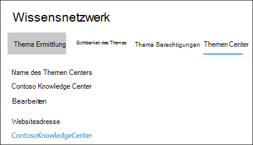
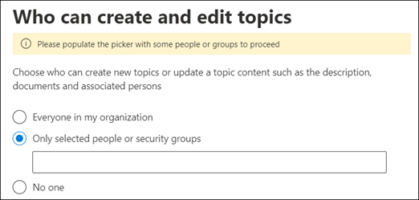
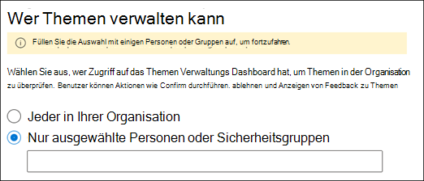
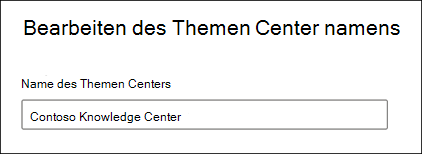

# Verwalten Ihres Wissens Verwaltungsnetzwerks (Vorschau)

> [!Note] 
> Der Inhalt dieses Artikels ist für Project Cortex private Preview. [Erfahren Sie mehr über Project Cortex](https://aka.ms/projectcortex).

Nachdem Sie das [Knowledge Management eingerichtet](set-up-knowledge-network.md)haben, kann ein Administrator zu jeder Zeit Anpassungen an Ihren Konfigurationseinstellungen über das Microsoft 365 Admin Center vornehmen.

Beispielsweise müssen Sie die Einstellungen für Folgendes anpassen:
- Hinzufügen von neuen SharePoint-Quellen zu Minen Themen.
- Ändern der Benutzer, die auf Themen zugreifen können
- Ändern Sie, welche Benutzerberechtigungen für Aufgaben im Themen Center haben.
- Ändern des Namens Ihres Themen Centers

## Anforderungen 
Sie müssen über globale Administrator-oder SharePoint-Administratorberechtigungen verfügen, um auf das Microsoft 365 Admin Center zugreifen und organisatorische Wissens Aufgaben verwalten zu können.

## So greifen Sie auf Wissens Verwaltungseinstellungen zu:

1. Wählen Sie im Microsoft 365 Admin Center die Option **Setup**aus, und zeigen Sie dann den Abschnitt **organisatorisches Wissen** an.
2. Klicken Sie im Abschnitt **organisatorisches Wissen** auf **Personen mit Wissen verbinden**. 

      

3. Wählen Sie auf der Seite mit den **Informationen zum Benutzer verbinden** die Option **Manage** aus, um den Bereich **Wissensnetzwerk Einstellungen** zu öffnen. 

      

## Ändern, wie das Wissensnetzwerk Themen finden kann

Wählen Sie die Registerkarte **Thema Ermittlung** aus, wenn Sie Ihre Auswahlmöglichkeiten für SharePoint-Themen Quellen aktualisieren möchten. Mit dieser Einstellung können Sie die SharePoint-Websites in Ihrem Mandanten auswählen, die durchforstet und für Themen abgebaut werden.

1. Wählen Sie auf der Registerkarte **Thema Discovery** unter **SharePoint-Themen Quellen auswählen**die Option **Bearbeiten**aus.
2. Wählen Sie auf der Seite **SharePoint-Themen Quellen auswählen** aus, welche SharePoint-Websites während der Ermittlung als Quellen für Ihre Themen gecrawlt werden sollen. Dies umfasst Folgendes: 
    a. **Alle Websites**: alle SharePoint-Websites in Ihrem Mandanten. Dadurch werden aktuelle und zukünftige Websites erfasst. 
    b. **Alle, außer ausgewählte Websites**: Geben Sie die Namen der Websites ein, die Sie ausschließen möchten.  Sie können auch eine Liste der Websites hochladen, für die Sie die Ermittlung deaktivieren möchten. In der Zukunft erstellte Websites werden als Quellen für die Themen Ermittlung hinzugefügt.  
    c. **Nur ausgewählte Websites**: Geben Sie die Namen der Websites ein, die Sie einschließen möchten. Sie können auch eine Liste der Websites hochladen. In der Zukunft erstellte Websites werden nicht als Quellen für die Themen Ermittlung einbezogen.  

      
   
    Wenn Sie über eine Reihe von Websites verfügen, die Sie ausschließen möchten (wenn Sie **Alle auswählen, außer ausgewählte Websites**) oder einbeziehen (wenn Sie **nur ausgewählte Websites**ausgewählt haben), können Sie eine CSV-Datei mit den Websitenamen und-URLs hochladen. Sie können die Option **Download Site Template. CSV** auswählen, wenn Sie die CSV-Vorlagendatei verwenden möchten.

3. Wählen Sie **Speichern** aus.

##  Ändern der Personen, die Themen in Ihrer Organisation anzeigen können

Wählen Sie die Registerkarte **Thema Ermittlung** aus, wenn Sie aktualisieren möchten, wer in Ihrer Organisation entdeckte Themen in Suchergebnissen sehen kann und wann Themen in Inhalten wie SharePoint-Seiten hervorgehoben werden.

1. Wählen Sie auf der Registerkarte **Thema Discovery** unter **wer Themen im Wissensnetzwerk anzeigen kann die**Option **Bearbeiten**aus.
2. Auf der Seite " **Wer kann Themen auf der Wissensnetzwerk Seite sehen** " wählen Sie aus, wer Zugriff auf Themen Details haben soll, wie beispielsweise hervorgehobene Themen, Themenkarten, Themen Antworten auf der Suche und Themenseiten. Sie können Folgendes auswählen: 
    a. **Jeder in Ihrer Organisation** 
    b. **Nur ausgewählte Personen oder Sicherheitsgruppen** 
    c. **Niemand** 

       
3. Wählen Sie **Speichern** aus.  
 
> [!Note] 
> Während Sie mit dieser Einstellung einen beliebigen Benutzer in Ihrer Organisation auswählen können, können nur Benutzer, denen Lizenzen für Wissensmanagement zugewiesen sind, Themen anzeigen.

## Ändern der Berechtigungen für Aufgaben im Themen Center

Wählen Sie die Registerkarte **Thema Berechtigungen** aus, wenn Sie aktualisieren möchten, wer über Berechtigungen für Folgendes auf der Seite "Themen Center" verfügt:

- Die Benutzer können Themen erstellen und bearbeiten: Erstellen Sie neue Themen, die während der Suche nicht gefunden wurden, oder bearbeiten Sie vorhandene Themenseiten Details.
- Welche Benutzer Themen verwalten können: bestätigen oder ablehnen erkannter Themen.

So aktualisieren Sie die Benutzer, die Berechtigungen zum Erstellen und Bearbeiten von Themen haben:

1. Wählen Sie auf der Registerkarte **Thema Berechtigungen** unter **Wer kann Themen erstellen und bearbeiten**aus die Option **Bearbeiten**aus. 
2. Auf der Seite für die **Erstellung und Bearbeitung von Themen** können Sie Folgendes auswählen: 
    a. **Jeder in Ihrer Organisation** 
    b. **Nur ausgewählte Personen oder Sicherheitsgruppen** 

       

3. Wählen Sie **Speichern** aus. 

So aktualisieren Sie, wer über Berechtigungen zum Verwalten von Themen verfügt:

1. Wählen Sie auf der Registerkarte **Thema Berechtigungen** unter **Benutzer können Themen verwalten die**Option **Bearbeiten**aus. 
2. Auf der Seite **Themen, die Themen verwalten können** , können Sie Folgendes auswählen: 
    a. **Jeder in Ihrer Organisation** 
    b. **Ausgewählte Personen oder Sicherheitsgruppen** 

       

3. Wählen Sie **Speichern** aus. 

##  Aktualisieren des Namens des Themen Centers

Wählen Sie die Registerkarte **Topic Center** aus, wenn Sie den Namen Ihres Themen Centers aktualisieren möchten. 

1. Wählen Sie auf der Registerkarte **Themen Center** unter **Name des Themas**" **Bearbeiten**" aus.
2. Geben Sie auf der Seite **Themen Center Namen bearbeiten** im Feld **Themen Center Name** den neuen Namen für Ihr Themen Center ein.
3. Wählen Sie **Speichern** aus.

       

## Siehe auch

  

