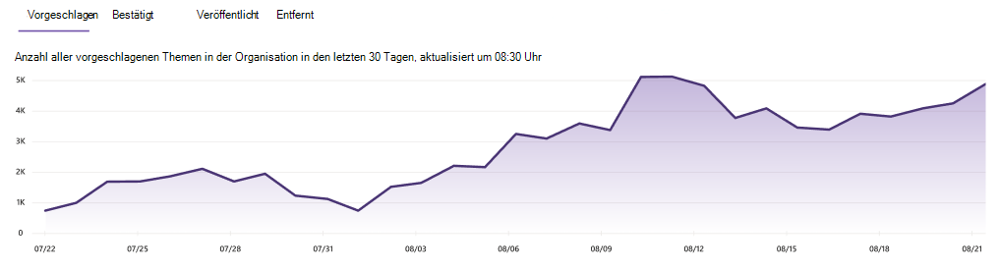

# Verwalten von Themen im Themencenter in Microsoft Viva TopicsManage topics in the topic center in Microsoft Viva Topics

 

> [!VIDEO https://www.microsoft.com/videoplayer/embed/RE4LxDx]  

 

Im Themencenter "Viva Topics" kann  ein Wissensmanager die Seite Themen verwalten anzeigen, um Themen zu überprüfen, die in den Quellstandorten identifiziert wurden, wie von Ihrem Wissensadministrator angegeben.In the Viva Topics topic center, a knowledge manager can view the **Manage topics** page to review topics that have been identified in the source locations as specified by your knowledge admin.  

     

## ThemenphasenTopic stages

Wissensmanager helfen dabei, ermittelte Themen durch die verschiedenen Lebenszyklusphasen des Themas zu führen: **Vorgeschlagen**, **Bestätigt**, **Veröffentlicht** und **Entfernt**.Knowledge managers help to guide discovered topics through the various topic lifecycle stages: **Suggested**, **Confirmed**, **Published**, and **Removed**.

    

- **Vorgeschlagen**: Ein Thema wurde von KI identifiziert und verfügt über genügend unterstützende Ressourcen, Verbindungen und Eigenschaften.**Suggested**: A topic has been identified by AI and has enough supporting resources, connections, and properties. (Diese werden in der Benutzeroberfläche **als vorgeschlagenes** Thema gekennzeichnet.)(These are marked as a **Suggested Topic** in the UI.)

- **Bestätigt**: Ein Thema, das von AI erkannt und überprüft wurde.**Confirmed**: A topic that has been discovered by AI and has been validated. Die Themenüberprüfung erfolgt, wenn eine der beiden:Topic validation occurs when either:

   - Ein Knowledge Manager bestätigt ein Thema.A knowledge manager confirms a topic. Ein Knowledge Manager [bestätigt ein Thema auf](manage-topics.md#confirmed-topics) der Seite Themen **verwalten.**A knowledge manager [confirms a topic](manage-topics.md#confirmed-topics) on the **Manage topics** page.

   - Mehrere Benutzer bestätigen ein Thema.Multiple users confirm a topic. Es muss ein Netz von zwei positiven Stimmen von Benutzern sein, die mit dem Feedbackmechanismus auf der Themenkarte abgestimmt haben.There must be a net of two positive votes received from users who voted using the feedback mechanism on the topic card. Wenn beispielsweise ein Benutzer für ein bestimmtes Thema positiv und ein Benutzer für ein bestimmtes Thema negativ stimmte, benötigen Sie noch zwei weitere positive Stimmen, damit das Thema bestätigt wird.For example, if one user voted positive and one user voted negative for a particular topic, you would still need two more positive votes for the topic to be confirmed.
 
- **Veröffentlicht**: Ein Thema, das kuratiert wurde.**Published**: A topic that has been curated. Manuelle Bearbeitungen wurden vorgenommen, um die Qualität zu verbessern, oder sie wurden von einem Benutzer erstellt.Manual edits have been made to improve its quality, or it has been created by a user.

- **Entfernt:** Ein Thema, das abgelehnt wurde und für die Betrachter nicht mehr sichtbar ist.**Removed**: A topic that has been rejected and will no longer be visible to viewers. Ein Thema kann in einem beliebigen Zustand entfernt werden (vorgeschlagen, bestätigt oder veröffentlicht).A topic can be removed in any state (suggested, confirmed, or published). Das Entfernen von Themen erfolgt, wenn eine der beiden:Topic removal occurs when either:

   - Ein Knowledge Manager entfernt ein Thema.A knowledge manager removes a topic. Ein Knowledge Manager entfernt ein Thema auf der Seite **Themen** verwalten.A knowledge manager removes a topic on the **Manage topics** page.

   - Mehrere Benutzer geben negative Stimmen mit dem Feedbackmechanismus auf der Themenkarte ab.Multiple users cast negative votes using the feedback mechanism on the topic card. Damit ein Thema entfernt werden kann, muss ein Netz von zwei negativen Stimmen von Benutzern empfangen werden.For a topic to be removed, there must be a net of two negative votes received from users. Wenn beispielsweise ein Benutzer negativ und ein Benutzer für ein bestimmtes Thema positiv stimmte, benötigen Sie noch zwei negative Stimmen, damit das Thema entfernt werden kann.For example, if one user voted negative and one user voted positive for a particular topic, you would still need two more negative votes for the topic to be removed.

  Wenn ein veröffentlichtes Thema entfernt wird, muss die Seite mit den kuratierten Details manuell über die Seitenbibliothek des Themencenters gelöscht werden.When a published topic is removed, the page with the curated details will need to be deleted manually through the Pages Library of the topic center.

> [!Note] 
> Auf der Seite Themen **verwalten** kann jeder Wissensmanager nur Themen anzeigen, in denen er Zugriff auf die zugrunde liegenden Dateien und Seiten hat, die mit dem Thema verbunden sind.On the **Manage topics** page, each knowledge manager will only be able to see topics where they have access to the underlying files and pages connected to the topic. Diese Berechtigungstrimmerung wird in der Liste der Themen angezeigt, die auf den Registerkarten **Vorgeschlagen,** **Bestätigt,** Veröffentlicht **und** **Entfernt angezeigt** werden.This permission trimming will be reflected in the list of topics that appear in the **Suggested**, **Confirmed**, **Published**, and **Removed** tabs. Die Anzahl der Themen zeigt jedoch unabhängig von berechtigungen die Gesamtzahlen in der Organisation an.The topic counts, however, show the total counts in the organization regardless of permissions.

## AnforderungenRequirements

Zum Verwalten von Themen im Themencenter müssen Sie:To manage topics in the topic center, you need to:
- Über eine Viva Topics-Lizenz verfügen.Have a Viva Topics license.

- Verfügen Sie über [**Wer, die Themen verwalten**](./topic-experiences-user-permissions.md) können.Have the [**Who can manage topics**](./topic-experiences-user-permissions.md) permission. Wissensadministratoren können Benutzern diese Berechtigung in den Berechtigungseinstellungen von Viva Topics erteilen.Knowledge admins can give users this permission in the Viva Topics topic permissions settings. 

Sie können die Seite  Themen verwalten im Themencenter nur anzeigen, wenn Sie über die Berechtigung Wer **Themen verwalten** verfügen.You will not be able to view the **Manage topics** page in the topic center unless you have the **Who can manage topics** permission.

Im Themencenter kann ein Wissensmanager Themen überprüfen, die an den von Ihnen angegebenen Quellstandorten identifiziert wurden, und diese entweder bestätigen oder entfernen.In the topic center, a knowledge manager can review topics that have been identified in the source locations you specified, and can either confirm or remove them. Ein Knowledge Manager kann auch neue Themenseiten erstellen und veröffentlichen, wenn sie nicht in der Themensuche gefunden wurden, oder vorhandene Bearbeiten, wenn sie aktualisiert werden müssen.A knowledge manager can also create and publish new topic pages if one was not found in topic discovery, or edit existing ones if they need to be updated.

## Überprüfen der vorgeschlagenen ThemenReview suggested topics

Auf der **Seite Themen verwalten** werden Themen, die in den angegebenen Quellstandorten SharePoint gefunden wurden, auf der Registerkarte **Vorgeschlagen** aufgeführt. Bei Bedarf kann ein Wissensmanager unbestätigte Themen überprüfen und diese bestätigen oder entfernen.On the **Manage topics** page, topics that were discovered in your specified SharePoint source locations will be listed on the **Suggested** tab. If needed, a knowledge manager can review unconfirmed topics and choose to confirm or remove them.

    

So überprüfen Sie ein vorgeschlagenes Thema:To review a suggested topic:

1. Wählen Sie **auf der Seite** Themen verwalten die Registerkarte Vorgeschlagen aus, und wählen Sie dann das Thema aus, um die Themenseite zu öffnen. On the **Manage topics** page, select the **Suggested** tab, and then select the topic to open the topic page.

2. Überprüfen Sie auf der Themenseite die Themenseite, und wählen Sie **Bearbeiten** aus, wenn Sie Änderungen an der Seite vornehmen müssen.On the topic page, review the topic page, and select **Edit** if you need to make any changes to the page. Wenn Sie alle Bearbeitungen veröffentlichen, wird dieses Thema auf die Registerkarte **Veröffentlicht** verschieben.Publishing any edits will move this topic to the **Published** tab.

3. Nachdem Sie das Thema überprüft haben, wechseln Sie zurück zur Seite **Themen** verwalten.After reviewing the topic, go back to the **Manage topics** page. Für das ausgewählte Thema können Sie folgendes tun:For the selected topic, you can:

   - Das Kontrollkästchen aktivieren, um das Thema zu bestätigen.Select the check mark to confirm the topic.
    
   - Wählen Sie **das x** aus, wenn Sie das Thema entfernen möchten.Select the **x** if you want to remove the topic.

    Bestätigte Themen werden aus der **Vorgeschlagenen** Liste entfernt und werden nun in der **Liste Bestätigt** angezeigt.Confirmed topics will be removed from the **Suggested** list and will now display in the **Confirmed** list.

    Entfernte Themen werden aus der **Vorgeschlagenen** Liste entfernt und werden nun auf der Registerkarte **Entfernt** angezeigt.Removed topics will be removed from the **Suggested** list and will now display in the **Removed** tab.

### QualitätsergebnisQuality score

Jedem Thema, das auf **der** Seite Vorgeschlagene Themen angezeigt wird, wird eine Qualitätsnote zugewiesen.Each topic that appears on the **Suggested** topics page has a quality score assigned to it. Die Qualitätskontrolle spiegelt die Informationsmenge wider, die dem durchschnittlichen Benutzer für die Informationen zu diesem Thema angezeigt wird, und dabei zu berücksichtigen, dass für jeden Benutzer aufgrund der Berechtigungen, die er möglicherweise für die Informationen in einem Thema hat, mehr oder weniger Informationen angezeigt werden.The quality score is a reflection of the amount of information that the average user will see for the information on the topic, keeping in mind that each user might see more or less information because of the permissions they might or might not have on the information in a topic. 

Die Qualitätsnote kann einen Einblick in die Themen mit den meisten Informationen bieten und hilfreich sein, um Themen zu finden, die möglicherweise manuell bearbeitet werden müssen.The quality score can help give insight to the topics with the most information and can be useful for finding topics that may need to be manually edited. Beispielsweise kann ein Thema mit einer niedrigeren Qualitätsnote das Ergebnis davon sein, dass einige Benutzer nicht über SharePoint Berechtigungen für relevante Dateien oder Websites verfügen, die AI in das Thema aufgenommen hat.For example, a topic with a lower quality score might be the result of some users not having SharePoint permissions to pertinent files or sites that AI has included in the topic. Ein Mitwirkender kann dann das Thema bearbeiten, um die Informationen (falls zutreffend) aufzunehmen, die dann für alle Benutzer, die das Thema anzeigen können, sichtbar sind.A contributor could then edit the topic to include the information (when appropriate), which will then be viewable to all users who can view the topic.

### EindrückeImpressions

In **der Spalte** Impressionen wird angezeigt, wie oft ein Thema endbenutzern angezeigt wurde.The **Impressions** column displays the number of times a topic has been shown to end users. Dies umfasst Ansichten über Themenantwortkarten in der Suche und über Themenhighlights.This includes views through topic answer cards in search and through topic highlights. Es spiegelt nicht das Klicken auf diese Themen wider, sondern das Thema wurde angezeigt.It does not reflect the click-through on these topics, but that the topic has been displayed. Die **Spalte Impressionen** wird für Themen auf den  Registerkarten **Vorgeschlagen,** **Bestätigt,** Veröffentlicht und Entfernt auf der Seite **Themen verwalten** angezeigt.The **Impressions** column will show for topics in the **Suggested**, **Confirmed**, **Published**, and **Removed** tabs on the **Manage topics** page.

## Bestätigte ThemenConfirmed topics

Auf  der Seite Themen verwalten werden Themen, die in Ihren angegebenen SharePoint-Quellstandorten entdeckt wurden und von einem Knowledge Manager oder "crowdsourced" bestätigt wurden, der von zwei oder mehr Personen (Ausgleich negativer Benutzerstimmen gegen positive Benutzerstimmen) durch den Kartenfeedbackmechanismus bestätigt wurde, auf der Registerkarte **Bestätigt** aufgeführt. Bei Bedarf kann ein Benutzer mit berechtigungen zum Verwalten von Themen bestätigte Themen überprüfen und ablehnen.On the **Manage topics** page, topics that were discovered in your specified SharePoint source locations and have been confirmed by a knowledge manager or "crowdsourced" confirmed by a net two or more people (balancing negative user votes against positive user votes) through the card feedback mechanism will be listed in the **Confirmed** tab. If needed, a user with permissions to manage topics can review confirmed topics and choose to reject them.

So überprüfen Sie ein bestätigtes Thema:To review a confirmed topic:

1. Wählen Sie auf der Registerkarte **Bestätigt** das Thema aus, um die Themenseite zu öffnen.On the **Confirmed** tab, select the topic to open the topic page.

2. Überprüfen Sie auf der Themenseite die Themenseite, und wählen Sie **Bearbeiten** aus, wenn Sie Änderungen an der Seite vornehmen müssen.On the topic page, review the topic page, and select **Edit** if you need to make any changes to the page.

Beachten Sie, dass Sie ein bestätigtes Thema weiterhin ablehnen können.Note that you can still choose to reject a confirmed topic. Wechseln Sie dazu auf der Registerkarte  Bestätigt zum ausgewählten Thema, und wählen Sie **das x** aus, wenn Sie das Thema ablehnen möchten.To do this, go to the selected topic on the **Confirmed** tab, and select the **x** if you want to reject the topic.

## Veröffentlichte ThemenPublished topics

Veröffentlichte Themen wurden bearbeitet, sodass immer bestimmte Informationen angezeigt werden, die auf die Seite stoßen.Published topics have been edited so that specific information will always appear to whoever encounters the page. Auch manuell erstellte Themen werden hier aufgeführt.Manually created topics are listed here as well.

   

## Dashboard für die Anzahl von ThemenTopic count dashboard

In diesem Diagramm in der Dashboardansicht können Sie die Anzahl der Themen in Ihrem Themencenter für Themen von "Viva Topics" anzeigen.This chart in the dashboard view lets you see the number of topics in your Viva Topics topic center. Das Diagramm zeigt die Themenanzahlen pro Themenlebenszyklusphase und zeigt auch, wie die Themenanzahl im Laufe der Zeit trendiert ist.The chart shows the topic counts per topic lifecycle stage and also shows how topic counts have trended over time. Wissensmanager können die Rate, mit der neue Themen von AI entdeckt werden, und die Rate, mit der Themen vom Knowledge Manager oder von Benutzeraktionen bestätigt oder veröffentlicht werden, visuell überwachen.Knowledge managers can visually monitor the rate at which new topics are being discovered by AI and the rate at which topics are getting confirmed or published by the knowledge manager or user actions.

Wissensmanagern wird möglicherweise eine andere Anzahl von Themen  in der Liste der Themen auf der Seite Themen verwalten als im Dashboard angezeigt.Knowledge managers might see a different count of topics represented in the list of topics on the **Manage topics** page than they see in the dashboard. Dies liegt daran, dass ein Knowledge Manager möglicherweise nicht auf alle Themen zugreifen kann.This is because a knowledge manager might not have access to all topics. Die in der Dashboardansicht angezeigte Anzahl wird vor dem Anwenden der Berechtigungstrimmerung verwendet.The count presented in the dashboard view is taken before applying permission-trimming. 

   
