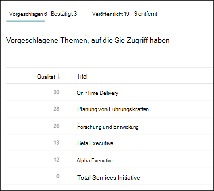
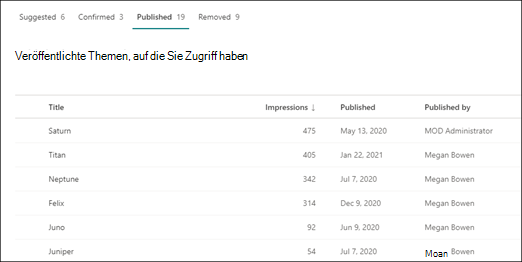

# Verwalten von Themen im Themencenter in Microsoft Viva Topics

 

> [!VIDEO https://www.microsoft.com/videoplayer/embed/RE4LxDx]  

 

Im Themencenter "Viva Topics" kann  ein Wissensmanager die Seite Themen verwalten anzeigen, um Themen zu überprüfen, die in den Quellstandorten identifiziert wurden, wie von Ihrem Wissensadministrator angegeben.  

     

## Themenphasen

Wissensmanager helfen dabei, ermittelte Themen durch die verschiedenen Lebenszyklusphasen des Themas zu führen: **Vorgeschlagen**, **Bestätigt**, **Veröffentlicht** und **Entfernt**.

    

- **Vorgeschlagen**: Ein Thema wurde von KI identifiziert und verfügt über genügend unterstützende Ressourcen, Verbindungen und Eigenschaften. (Diese werden in der Benutzeroberfläche **als vorgeschlagenes** Thema gekennzeichnet.)

- **Bestätigt**: Ein Thema, das von AI erkannt und überprüft wurde. Die Themenüberprüfung erfolgt, wenn eine der beiden:

   - Ein Knowledge Manager bestätigt ein Thema. Ein Knowledge Manager [bestätigt ein Thema auf](manage-topics.md#confirmed-topics) der Seite Themen **verwalten.**

   - Mehrere Benutzer bestätigen ein Thema. Es muss ein Netz von zwei positiven Stimmen von Benutzern sein, die mit dem Feedbackmechanismus auf der Themenkarte abgestimmt haben. Wenn beispielsweise ein Benutzer für ein bestimmtes Thema positiv und ein Benutzer für ein bestimmtes Thema negativ stimmte, benötigen Sie noch zwei weitere positive Stimmen, damit das Thema bestätigt wird.
 
- **Veröffentlicht**: Ein Thema, das kuratiert wurde. Manuelle Bearbeitungen wurden vorgenommen, um die Qualität zu verbessern, oder sie wurden von einem Benutzer erstellt.

- **Entfernt:** Ein Thema, das abgelehnt wurde und für die Betrachter nicht mehr sichtbar ist. Ein Thema kann in einem beliebigen Zustand entfernt werden (vorgeschlagen, bestätigt oder veröffentlicht). Das Entfernen von Themen erfolgt, wenn eine der beiden:

   - Ein Knowledge Manager entfernt ein Thema. Ein Knowledge Manager entfernt ein Thema auf der Seite **Themen** verwalten.

   - Mehrere Benutzer geben negative Stimmen mit dem Feedbackmechanismus auf der Themenkarte ab. Damit ein Thema entfernt werden kann, muss ein Netz von zwei negativen Stimmen von Benutzern empfangen werden. Wenn beispielsweise ein Benutzer negativ und ein Benutzer für ein bestimmtes Thema positiv stimmte, benötigen Sie noch zwei negative Stimmen, damit das Thema entfernt werden kann.

  Wenn ein veröffentlichtes Thema entfernt wird, muss die Seite mit den kuratierten Details manuell über die Seitenbibliothek des Themencenters gelöscht werden.

> [!Note] 
> Auf der Seite Themen **verwalten** kann jeder Wissensmanager nur Themen anzeigen, in denen er Zugriff auf die zugrunde liegenden Dateien und Seiten hat, die mit dem Thema verbunden sind. Diese Berechtigungstrimmerung wird in der Liste der Themen angezeigt, die auf den Registerkarten **Vorgeschlagen,** **Bestätigt,** Veröffentlicht **und** **Entfernt angezeigt** werden. Die Anzahl der Themen zeigt jedoch unabhängig von berechtigungen die Gesamtzahlen in der Organisation an.

## Anforderungen

Zum Verwalten von Themen im Themencenter müssen Sie:
- Über eine Viva Topics-Lizenz verfügen.

- Verfügen Sie über [**Wer, die Themen verwalten**](./topic-experiences-user-permissions.md) können. Wissensadministratoren können Benutzern diese Berechtigung in den Berechtigungseinstellungen von Viva Topics erteilen. 

Sie können die Seite  Themen verwalten im Themencenter nur anzeigen, wenn Sie über die Berechtigung Wer **Themen verwalten** verfügen.

Im Themencenter kann ein Wissensmanager Themen überprüfen, die an den von Ihnen angegebenen Quellstandorten identifiziert wurden, und diese entweder bestätigen oder entfernen. Ein Knowledge Manager kann auch neue Themenseiten erstellen und veröffentlichen, wenn sie nicht in der Themensuche gefunden wurden, oder vorhandene Bearbeiten, wenn sie aktualisiert werden müssen.

## Überprüfen der vorgeschlagenen Themen

Auf der **Seite Themen verwalten** werden Themen, die in den angegebenen Quellstandorten SharePoint gefunden wurden, auf der Registerkarte **Vorgeschlagen** aufgeführt. Bei Bedarf kann ein Wissensmanager unbestätigte Themen überprüfen und diese bestätigen oder entfernen.

    

So überprüfen Sie ein vorgeschlagenes Thema:

1. Wählen Sie **auf der Seite** Themen verwalten die Registerkarte Vorgeschlagen aus, und wählen Sie dann das Thema aus, um die Themenseite zu öffnen. 

2. Überprüfen Sie auf der Themenseite die Themenseite, und wählen Sie **Bearbeiten** aus, wenn Sie Änderungen an der Seite vornehmen müssen. Wenn Sie alle Bearbeitungen veröffentlichen, wird dieses Thema auf die Registerkarte **Veröffentlicht** verschieben.

3. Nachdem Sie das Thema überprüft haben, wechseln Sie zurück zur Seite **Themen** verwalten. Für das ausgewählte Thema können Sie:

   - Aktivieren Sie das Häkchen, um das Thema zu bestätigen.
    
   - Wählen Sie **das x** aus, wenn Sie das Thema entfernen möchten.

    Bestätigte Themen werden aus der **Vorgeschlagenen** Liste entfernt und werden nun in der **Liste Bestätigt** angezeigt.

    Entfernte Themen werden aus der **Vorgeschlagenen** Liste entfernt und werden nun auf der Registerkarte **Entfernt** angezeigt.

### Qualitätsergebnis

Jedem Thema, das auf **der** Seite Vorgeschlagene Themen angezeigt wird, wird eine Qualitätsnote zugewiesen. Die Qualitätskontrolle spiegelt die Informationsmenge wider, die dem durchschnittlichen Benutzer für die Informationen zu diesem Thema angezeigt wird, und dabei zu berücksichtigen, dass für jeden Benutzer aufgrund der Berechtigungen, die er möglicherweise für die Informationen in einem Thema hat, mehr oder weniger Informationen angezeigt werden. 

Die Qualitätsnote kann einen Einblick in die Themen mit den meisten Informationen bieten und hilfreich sein, um Themen zu finden, die möglicherweise manuell bearbeitet werden müssen. Beispielsweise kann ein Thema mit einer niedrigeren Qualitätsnote das Ergebnis davon sein, dass einige Benutzer nicht über SharePoint Berechtigungen für relevante Dateien oder Websites verfügen, die AI in das Thema aufgenommen hat. Ein Mitwirkender kann dann das Thema bearbeiten, um die Informationen (falls zutreffend) aufzunehmen, die dann für alle Benutzer, die das Thema anzeigen können, sichtbar sind.

### Eindrücke

In **der Spalte** Impressionen wird angezeigt, wie oft ein Thema endbenutzern angezeigt wurde. Dies umfasst Ansichten über Themenantwortkarten in der Suche und über Themenhighlights. Es spiegelt nicht das Klicken auf diese Themen wider, sondern das Thema wurde angezeigt. Die **Spalte Impressionen** wird für Themen auf den  Registerkarten **Vorgeschlagen,** **Bestätigt,** Veröffentlicht und Entfernt auf der Seite **Themen verwalten** angezeigt.

## Bestätigte Themen

Auf  der Seite Themen verwalten werden Themen, die in Ihren angegebenen SharePoint-Quellstandorten entdeckt wurden und von einem Knowledge Manager oder "crowdsourced" bestätigt wurden, der von zwei oder mehr Personen (Ausgleich negativer Benutzerstimmen gegen positive Benutzerstimmen) durch den Kartenfeedbackmechanismus bestätigt wurde, auf der Registerkarte **Bestätigt** aufgeführt. Bei Bedarf kann ein Benutzer mit berechtigungen zum Verwalten von Themen bestätigte Themen überprüfen und ablehnen.

So überprüfen Sie ein bestätigtes Thema:

1. Wählen Sie auf der Registerkarte **Bestätigt** das Thema aus, um die Themenseite zu öffnen.

2. Überprüfen Sie auf der Themenseite die Themenseite, und wählen Sie **Bearbeiten** aus, wenn Sie Änderungen an der Seite vornehmen müssen.

Beachten Sie, dass Sie ein bestätigtes Thema weiterhin ablehnen können. Wechseln Sie dazu auf der Registerkarte  Bestätigt zum ausgewählten Thema, und wählen Sie **das x** aus, wenn Sie das Thema ablehnen möchten.

## Veröffentlichte Themen

Veröffentlichte Themen wurden bearbeitet, sodass immer bestimmte Informationen angezeigt werden, die auf die Seite stoßen. Auch manuell erstellte Themen werden hier aufgeführt.

   
