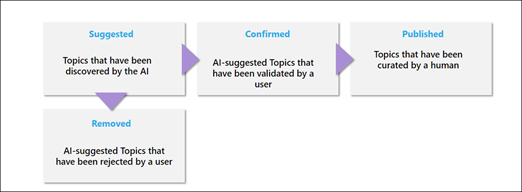

# Verwalten von Themen im ThemencenterManage topics in the Topic center 

 

> [!VIDEO https://www.microsoft.com/videoplayer/embed/RE4LxDx]  

 

Im Themencenter "Aktuelle Themen" kann  ein Knowledge Manager die Seite "Themen verwalten" anzeigen, um Themen zu überprüfen, die in den Von Ihrem Wissensadministrator angegebenen Speicherorten für die SharePoint-Quelle identifiziert wurden.In the Viva Topics Topic center, a knowledge manager can view the **Manage topics** page to review topics that have been identified in SharePoint source locations as specified by your knowledge admin.  

      

Knowledge Manager unterstützen Sie dabei, ermittelte Themen durch den Themenlebenszyklus zu führen, in dem folgende Themen enthalten sind:Knowledge managers help to guide discovered topics through the topic lifecycle in which topics are:

- Vorgeschlagen: Ein Thema wurde von AI identifiziert und verfügt über genügend unterstützende Ressourcen, Verbindungen und Eigenschaften.Suggested: A topic has been identified by AI and has enough supporting resources, connections, and properties.
- Bestätigt: Ein Thema, das von AI vorgeschlagen wurde, wird überprüft.Confirmed: A topic that has been suggested by AI is validated. Die Überprüfung erfolgt durch Bestätigung durch einen Knowledge Manager.Validation is done by confirmation from a knowledge manager. Darüber hinaus kann ein Thema bestätigt werden, wenn mindestens zwei Benutzer über die Feedbackfrage auf der Themenkarte positives Feedback geben.Additionally, a topic can be confirmed if at least two users give positive feedback through the feedback question on the topic card.
- Veröffentlicht: Ein bestätigtes Thema, das behandelt wurde: Es wurden manuelle Änderungen vorgenommen, um die Qualität zu verbessern.Published: A confirmed topic that has been curated: manual edits have been made to improve its quality.
- Entfernt: Ein Thema wird von einem Knowledge Manager abgelehnt und ist für Die Besucher nicht mehr sichtbar.Removed: A topic is rejected by a knowledge manager and will no longer be visible to viewers. Das Thema kann in einem beliebigen Status sein, wenn es entfernt wird (vorgeschlagen, bestätigt oder veröffentlicht).The topic can be in any state when it is removed (suggested, confirmed or published). Wenn ein veröffentlichtes Thema entfernt wird, muss die Seite mit den behandelten Details manuell über die Seitenbibliothek des Themencenters gelöscht werden.When a published topic is removed, the page with the curated details will need to be deleted manually through the Pages Library of the topic center.

      

> [!Note] 
> Auf der Seite "Themen verwalten" kann jeder Knowledge Manager nur Themen anzeigen, in denen er Zugriff auf die Dateien und Seiten des Themas hat.In the Manage Topics page, each knowledge manager will only be able to see topics where they have access to the files and pages of the topic. Dies wird in den Themen wider, die unter den Registerkarten "Vorgeschlagen", "Bestätigt", "Entfernt" und "Veröffentlicht" aufgeführt sind.This will be reflected in the topics that are listed under the Suggested, Confirmed, Removed, and Published tabs. Die Themenanzahl zeigt jedoch die Gesamtanzahl in der Organisation an.The topic counts, however, show the total counts in the organization.

## AnforderungenRequirements

Um Themen im Themencenter zu verwalten, müssen Sie:To manage topics in the Topic center, you need to:
- Sie verfügen über eine Lizenz für "Topics".Have a Viva Topics license.

- Die Berechtigung [**"Wer kann Themen verwalten"**](https://docs.microsoft.com/microsoft-365/knowledge/topic-experiences-user-permissions) haben.Have the [**Who can manage topics**](https://docs.microsoft.com/microsoft-365/knowledge/topic-experiences-user-permissions) permission. Wissensadministratoren können Benutzern diese Berechtigung in den Themen "Themen" erteilen.Knowledge admins can give users this permission in the Viva Topics topic permissions settings. 

Die Seite "Themen verwalten" kann nur dann im Themencenter angezeigt werden, wenn Sie über die Berechtigung "Wer kann Themen **verwalten"** verfügt.You will not be able to view the Manage Topics page in the Topic Center unless you have the **Who can manage topics** permission.

Im Themencenter kann ein Knowledge Manager Themen überprüfen, die an den von Ihnen angegebenen SharePoint-Quellstandorten identifiziert wurden, und diese entweder bestätigen oder ablehnen.In the topic center, a knowledge manager can review topics that have been identified in the SharePoint source locations you specified, and can either confirm or reject them. Ein Wissensmanager kann auch neue Themenseiten erstellen und veröffentlichen, wenn diese bei der Themenermittlung nicht gefunden wurden, oder vorhandene bearbeiten, wenn sie aktualisiert werden müssen.A knowledge manager can also create and publish new topic pages if one was not found in topic discovery, or edit existing ones if they need to be updated.

## Überprüfen der vorgeschlagenen ThemenReview suggested topics

Auf der Seite "Themen im Themencenter verwalten" werden Themen, die in den angegebenen Speicherorten für die SharePoint-Quelle gefunden wurden, auf der Registerkarte **"Vorgeschlagen"** aufgeführt. Bei Bedarf kann ein Knowledge Manager nicht bestätigte Themen überprüfen und diese bestätigen oder ablehnen.On the Topic center Manage Topics page, topics that were discovered in your specified SharePoint source locations will be listed in the **Suggested** tab. If needed, a knowledge manager can review unconfirmed topics and choose to confirm or reject them.

      

So überprüfen Sie ein vorgeschlagenes Thema:To review a suggested topic:

1. Wählen Sie auf der Seite "Themen **verwalten"** die Registerkarte **"Vorgeschlagen"** aus, und wählen Sie das Thema aus, um die Themenseite zu öffnen.On the **Manage topics** page, select the **Suggested** tab, select the topic to open the topic page. 

2. Überprüfen Sie auf der Themenseite die  Themenseite, und wählen Sie "Bearbeiten" aus, wenn Sie Änderungen an der Seite vornehmen müssen.On the topic page, review the topic page, and select **Edit** if you need to make any changes to the page. Wenn Sie alle Bearbeitungen veröffentlichen, wird dieses Thema auf die Registerkarte **"Veröffentlicht"** verschieben.Publishing any edits will move this topic to the **Published** tab.

3. Wechseln Sie nach der Überprüfung des Themas zurück zur Seite "Themen verwalten".After reviewing the topic, go back to the Manage topics page. Für das ausgewählte Thema können Sie:For the selected topic, you can:

   - Aktivieren Sie das Kontrollkästchen, um das Thema zu bestätigen.Select the check mark to confirm the topic.
    
   - Wählen Sie **das x** aus, wenn Sie das Thema ablehnen möchten.Select the **x** if you want to reject the topic.

    Bestätigte Themen werden aus der **Vorgeschlagenen** Liste entfernt und nun in der Liste **"Bestätigt"** angezeigt.Confirmed topics will be removed from the **Suggested** list and will now display in the **Confirmed** list.

    Abgelehnte Themen werden aus der Liste **"Vorgeschlagen"** entfernt und nun auf der Registerkarte **"Entfernt"** angezeigt.Rejected topics will be removed from the **Suggested** list and will now display in the **Removed** tab.

     

### QualitätsergebnisQuality score

Jedem Thema, das auf der Seite "Vorgeschlagene Themen" angezeigt wird, ist eine <b>Qualitätsergebnis</b> zugewiesen.Each topic that appears in your Suggested Topics page has a <b>Quality</b> score assigned to it. Die Qualitätsergebnis ist eine Spiegelung der Informationsmenge, die dem durchschnittlichen Benutzer für die Informationen zu diesem Thema angezeigt wird, und dabei berücksichtigen, dass jedem Benutzer aufgrund der Berechtigungen, die er für die Informationen in einem Thema hat, möglicherweise mehr oder weniger Informationen angezeigt werden.The Quality score is a reflection of the amount of information that the average user will see for the information on the topic, keeping in mind that each user may see more or less information because of the permissions they may or may not have on the information in a topic. 

Die Qualitätsergebnis kann helfen, Einblicke in die Themen mit den meisten Informationen zu erhalten, und kann hilfreich sein, um Themen zu finden, die möglicherweise manuell bearbeitet werden müssen.The Quality score can help give insight to the topics with the most information and can be useful for finding topics that may need to be manually edited.  Beispielsweise kann ein Thema mit einer niedrigeren Qualitätssentwertung das Ergebnis sein, dass einige Benutzer keine SharePoint-Berechtigungen für relevante Dateien oder Websites haben, die ai in das Thema eingeschlossen hat.For example, a topic with a lower quality score may be the result of some users not having SharePoint permissions to pertinent files or sites that AI has included in the topic. Ein Mitwirkender könnte dann das Thema bearbeiten, um die Informationen (falls angemessen) zu enthalten, die dann für alle Benutzer angezeigt werden können, die das Thema anzeigen können.A contributor could then edit the topic to include the information (when appropriate), which will then be viewable to all users who can view the topic.

Die Qualität kann zwischen 1 und 100 liegen.The Quality score could range from 1 to 100. Ein neu gefundenes Thema hat eine Qualitätsnote von 0, bis zwei oder mehr Benutzer es angezeigt haben.A newly discovered topic will have a quality score of 0 until two or more users have viewed it. Die Qualität der einzelnen Benutzer wird durch eine Reihe von Faktoren bestimmt, z. B. durch die Menge der Inhalte, die für den bestimmten Benutzer angezeigt werden. Dies wird durch die Berechtigungen des Benutzers gesteuert, da auf jeder Themenseite Sicherheitstrimmer für von AI generierte Inhalte festgelegt sind.Each users quality score is determined by a number of factors, such as the amount of content displayed for the specific user, which is controlled the user's permissions as each topic page has security trimming in place for AI-generated content. Die auf der Registerkarte "Vorgeschlagene Themen" angezeigte Qualitätsergebnis ist ein Durchschnittswert der einzelnen Benutzer.The Quality score shown on the Suggested topics tab is an average of each users individual score.

### ImpressionenImpressions

In <b>der</b> Spalte "Anzeigen" wird angezeigt, wie oft ein Thema endbenutzern angezeigt wurde.The <b>Impressions</b> column displays the number of times a topic has been shown to end users. Dazu gehören Ansichten über Themenkarten in der Suche, über Themenhighlights und über Themencenteransichten.This includes views through topic cards in search, through topic highlights, and through Topic center views. Das Click-Through-Thema in diesen Themen wird nicht dargestellt, aber das Thema wurde angezeigt.It does not reflect the click-through on these topics, but that the topic has been displayed. Die Spalte "Impressionen" wird für Themen auf den Registerkarten "Vorgeschlagen", "Bestätigt", "Veröffentlicht" und "Entfernt" auf der Seite "Themen verwalten" angezeigt.The Impressions column will show for topics in the Suggested, Confirmed, Published, and Removed tabs in the Manage Topics page.

## Bestätigte ThemenConfirmed topics

Auf der Seite "Themen verwalten" werden Themen, die an den angegebenen Speicherorten für die SharePoint-Quelle gefunden wurden und von einem  Knowledge Manager bestätigt wurden oder von zwei oder mehr Personen über den Kartenfeedbackmechanismus bestätigt wurden, auf der Registerkarte "Bestätigt" aufgeführt. Bei Bedarf kann ein Benutzer mit Berechtigungen zum Verwalten von Themen bestätigte Themen überprüfen und ablehnen.On the Manage topics page, topics that were discovered in your specified SharePoint source locations and have been confirmed by a knowledge manager or "crowd-sourced" confirmed by two or more people through the card feedback mechanism will be listed in the **Confirmed** tab. If needed, a user with permissions to manage topics can review confirmed topics and choose to reject them.

So überprüfen Sie ein bestätigtes Thema:To review a confirmed topic:

1. Wählen Sie **auf der** Registerkarte "Bestätigt" das Thema aus, um die Themenseite zu öffnen.On the **Confirmed** tab, select the topic to open the topic page. 

2. Überprüfen Sie auf der Themenseite die  Themenseite, und wählen Sie "Bearbeiten" aus, wenn Sie Änderungen an der Seite vornehmen müssen.On the topic page, review the topic page, and select **Edit** if you need to make any changes to the page.

Beachten Sie, dass Sie ein bestätigtes Thema weiterhin ablehnen können.Note that you can still chose to reject a confirmed topic.  Wechseln Sie dazu zum ausgewählten Thema in der Liste "Bestätigt", und wählen Sie das **x** aus, wenn Sie das Thema ablehnen möchten.To do this, go to the selected topic in the Confirmed list, and select the **x** if you want to reject the topic.

## Veröffentlichte ThemenPublished topics
Veröffentlichte Themen wurden bearbeitet, sodass immer bestimmte Informationen angezeigt werden, die auf die Seite stoßen.Published topics have been edited so that specific information will always appear to whoever encounters the page. Hier werden auch manuell erstellte Themen aufgelistet.Manually created topics are listed here as well.

      

