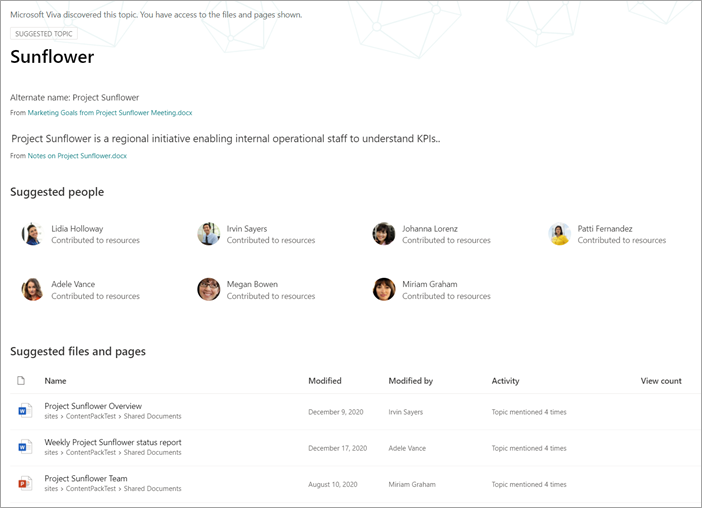

# Manage topics at scale in Microsoft Viva TopicsManage topics at scale in Microsoft Viva Topics

Wenn Sie Ihre SharePoint oder Ihre gesamte Organisation für "Viva Topics" indizieren, werden möglicherweise viele Themen generiert.When you index your SharePoint sites or your entire organization for Viva Topics, many topics might be generated. Wenn dies geschieht und Tausende von  vorgeschlagenen Themen auf der Seite Themen verwalten angezeigt werden, kann es schwierig sein, zu wissen, wo sie beginnen sollen.When this happens and you see thousands of suggested topics on the **Manage topics** page, it can be challenging to know where to start. In diesem Artikel wird beschrieben, wie Sie mit Themen von "Viva" optimieren können, welche Themen und Informationen Benutzern angezeigt werden, die nach Informationen suchen, auch in großen Organisationen mit einer großen Anzahl von Themen.This article describes how Viva Topics helps you optimize which topics and information are shown to users who are searching for information, even in large organizations with large numbers of topics.

Zunächst eine Erinnerung an die [vier Phasen für Themen:](manage-topics.md#topic-stages)First, a reminder of the [four stages for topics](manage-topics.md#topic-stages):

- **Vorgeschlagen**: Ein Thema wurde von KI identifiziert und verfügt über genügend unterstützende Ressourcen, Verbindungen und Eigenschaften.**Suggested**: A topic has been identified by AI and has enough supporting resources, connections, and properties. (Diese werden in der Benutzeroberfläche **als vorgeschlagenes** Thema gekennzeichnet.)(These are marked as a **Suggested Topic** in the UI.)

- **Bestätigt**: Ein Thema, das von AI vorgeschlagen wurde, muss überprüft werden.**Confirmed**: A topic that has been suggested by AI needs to be validated. Die Themenüberprüfung erfolgt, wenn eine der beiden:Topic validation occurs when either:
   - Ein Knowledge Manager bestätigt ein Thema.A knowledge manager confirms a topic. Ein Knowledge Manager [bestätigt ein Thema auf](manage-topics.md#confirmed-topics) der Seite Themen **verwalten.**A knowledge manager [confirms a topic](manage-topics.md#confirmed-topics) on the **Manage topics** page. 
   - Mehrere Benutzer bestätigen ein Thema.Multiple users confirm a topic. Es muss ein Netz von zwei positiven Stimmen von Benutzern sein, die mit dem Feedbackmechanismus auf der Themenkarte abgestimmt haben.There must be a net of two positive votes received from users who voted using the feedback mechanism on the topic card. Wenn beispielsweise ein Benutzer für ein bestimmtes Thema positiv und ein Benutzer für ein bestimmtes Thema negativ stimmte, benötigen Sie noch zwei weitere positive Stimmen, damit das Thema bestätigt wird.For example, if one user voted positive and one user voted negative for a particular topic, you would still need two more positive votes for the topic to be confirmed.
 
- **Veröffentlicht**: Ein bestätigtes Thema, das kuratiert wurde.**Published**: A confirmed topic that has been curated. Es wurden manuelle Bearbeitungen vorgenommen, um die Qualität zu verbessern.Manual edits have been made to improve its quality.

- **Entfernt:** Ein Thema wird von einem Wissensmanager abgelehnt und ist für die Betrachter nicht mehr sichtbar.**Removed**: A topic is rejected by a knowledge manager and will no longer be visible to viewers. Ein Thema kann in einem beliebigen Zustand entfernt werden (vorgeschlagen, bestätigt oder veröffentlicht).A topic can be removed in any state (suggested, confirmed, or published). Damit ein Thema entfernt werden kann, muss es ein Netz von zwei negativen Stimmen von Benutzern geben, die mit den Feedbackmechanismen auf der Themenkarte abgestimmt haben.For a topic to be removed, there must be a net of two negative votes received from users who voted using the feedback mechanisms on the topic card. Wenn beispielsweise ein Benutzer negativ und ein Benutzer für ein bestimmtes Thema positiv stimmte, benötigen Sie noch zwei negative Stimmen, damit das Thema entfernt werden kann.For example, if one user voted negative and one user voted positive for a particular topic, you would still need two more negative votes for the topic to be removed. Wenn ein veröffentlichtes Thema entfernt wird, muss die Seite mit den kuratierten Details manuell über die Seitenbibliothek des Themencenters gelöscht werden.When a published topic is removed, the page with the curated details will need to be deleted manually through the Pages Library of the topic center.

## Rolle "Knowledge Manager"Knowledge manager role 

Beim Konfigurieren von Themen für "Viva" fügen Sie eine Gruppe von Benutzern hinzu, denen Berechtigungen zum Anzeigen der Seite **"Themen** verwalten" im Themencenter erteilt wurden.When you configure Viva Topics, you'll add a group of users who are granted permissions to see the **Manage topics** page in the topic center. Es wird nur für diese Benutzer angezeigt, die die Rolle der primären Kuration für die Themen übernehmen.It will appear only for these users who hold the role of primary curation for the topics. Sie haben Zugriff auf Daten zu den Themen und können Listen aller Themen sehen, auf die sie Zugriff haben, um sie zu überprüfen und zu kuratieren.They'll have access to data about the topics and will be able to see lists of all topics that they have access to review and curate.

Mitarbeiter in dieser Rolle sollten über umfassende Berechtigungen zum Anzeigen einer breiten Palette von Themen verfügen.Employees in this role should have broad permissions to view a wide array of topics. Wenn Berechtigungen segmentiert sind, können Sie eine Gruppe von Benutzern auswählen, die unterschiedliche Bereiche des Unternehmens darstellen und für ihre eigenen Bereiche kuratieren können.Or if permissions are segmented, you might want to select a group of users that represent different areas of the business and can curate for their own areas.

Wenn Sie die Themen zum ersten Mal im Themencenter überprüfen, sind die vorgeschlagenen Themen rein KI-definiert.When you first review topics in the topic center, suggested topics are purely AI-defined. Möglicherweise möchten Wissensmanager die einzelnen Themen überprüfen, bevor sie "Viva Topics" für eine breite Benutzergemeinschaft ins Rollen bringen.Knowledge managers might want to review each one before rolling out Viva Topics to a broad user community. Bei der skalierungsorientierten Arbeit ist dieser Ansatz aufgrund der Tausenden von Themen selten praktikabel.When working at scale, this approach is rarely a practical because of the thousands of topics.

Der empfohlene Ansatz besteht in der Suche nach einer Balance der relevantesten oder wichtigsten Themen für Ihre anfänglichen Benutzer, und konzentrieren Sie sich vor dem Rollout von "Viva Topics" auf die Kurierung dieser Themen.The recommended approach is to find a balance of the most pertinent or important topics for your initial set of users and focus on curation of those topics before rollout of Viva Topics. Beginnen Sie, Feedback von den Benutzern zu sammeln und crowdsourcing die Verwendungs- und Beitragsmuster Ihrer Benutzer zu bestimmen, um die in diesem Artikel vorgeschlagenen Strategien zu informieren.Begin to collect feedback from the users and allow crowdsourcing to determine the usage and contribution patterns of your users to inform the strategies suggested in this article.

Es ist wichtig zu erkennen, dass das System sowohl von AI vorgeschlagene als auch vom Menschen kuratierte veröffentlichte Themen für alle Benutzer identifiziert und zeigt.It's important to recognize that the system will identify and show both AI-suggested and human-curated published topics to all users. Dies bedeutet jedoch nicht, dass jedes vorgeschlagene Thema allen Endbenutzern angezeigt wird.However, this doesn't mean that every suggested topic will be shown to all end users. Die eingerichteten Sicherheitseinstellungen zeigen nur die Themen an, auf die jeder Mitarbeiter basierend auf den Berechtigungen zugreifen kann, die für den Inhalt selbst festgelegt sind.The security settings in place will show only the topics that each employee can access based on the permissions that are set on the content itself.

Als Knowledge Manager mit Berechtigungen  zum Anzeigen der Seite Themen verwalten wird möglicherweise eine viel größere Anzahl von Themen aufgrund Ihrer eigenen erhöhten Berechtigungen aufgelistet, abhängig von Ihrer Rolle in der Organisation und der Zugriffsebene.As a knowledge manager with permissions to view the **Manage topics** page, you might see a much larger number of topics listed because of your own elevated permissions, depending on your role in the organization and level of access. Sie haben auch Zugriff auf Ansichten, mit denen Sie Themen an einem einzigen Speicherort sehen können, anstatt mithilfe von Hervorhebungen oder suchen auf sie zu zugreifen.You'll also have access to views that allow you see topics listed in a single location rather than accessing them by using highlights or search.

Darüber hinaus gibt es wahrscheinlich einen kleineren Prozentsatz von Themen, die von den meisten Benutzern angezeigt werden, und eine größere Gruppe von mehr Themen, die aufgrund von Berechtigungen viel seltener angezeigt werden.In addition, there is likely a smaller percentage of topics that will be viewed by most users and a larger set of more topics that will be seen much less frequently due to permissions. Daher ist es gut, zunächst alle Kurationsaufgaben auf die Themen zu konzentrieren, die für Ihre Organisation am wichtigsten sind und die am ehesten allgemein zu sehen sind.As a result, it is good to first focus any curation tasks on the topics that are the most important for your organization and that are the most likely to be seen more broadly.

In diesem Artikel werden einige Strategien für die Kuration behandelt.This article covers a few strategies for curation. Diese Strategien können bedeuten, dass die weniger häufigen oder weniger häufigen Themen möglicherweise nicht vollständig von Wissensmanagern behandelt werden.These strategies might mean that the less frequent or less common topics might not be fully curated by knowledge managers. Diese vorgeschlagenen Themen bleiben jedoch nützlich und können Einblicke oder einen Zeiger auf eine Person bieten, wodurch mitarbeiterzeitig nach einem Ausgangspunkt gesucht werden kann.However, these suggested topics remain useful and can provide insight or a pointer to a person, which can save an employee hours of looking for a starting point. Das Zulassen von crowdsourced-Updates für Themen ist von Vorteil und bietet mehr Inhalt und Abdeckung für weniger häufige Themen.Allowing crowdsourced updates to topics is beneficial and provides more content and coverage for the less common topics.

Dieser Artikel enthält einige Anleitungen und bewährte Methoden zum Umgang mit der Themenverwaltung und -curation.This article provides some guidance and best practices to approach topic management and curation.

## Grundlegendes zu vorgeschlagenen ThemenUnderstanding suggested topics

Wenn Themen von AI erkannt werden, werden sie als  vorgeschlagenes Thema **gekennzeichnet,** sowohl auf der Seite Themen verwalten als auch in den Themenkarten, die Benutzern angezeigt werden.When topics are discovered by AI, they're marked as a **Suggested Topic**, both on the **Manage topics** page, and in the topic cards that are presented to users. Alle Themen, die nicht als entfernt markiert wurden, werden Benutzern angezeigt– dazu gehören bestätigte, veröffentlichte und vorgeschlagene Themen.Any topic that hasn't been marked as removed will be shown to users—this includes confirmed, published, and suggested topics. Themen in allen drei Zustände stehen Endbenutzern zur Verfügung.Topics in all three states are available to end users.

Innerhalb einer Themenkarte oder Seite verwenden wir verschiedene Hinweise, um zu zeigen, wie die KI die Informationen generiert hat.Within a topic card or page, we use various cues to show how the AI has generated the information. Das System verwendet eine Vielzahl von Nachweisen, um die Ressourcen hinzuzufügen, hauptsächlich über den Inhalt selbst.The system uses a variety of evidence to add the resources, primarily through the content itself.

- Bezeichnungen zeigen, dass ein Thema vorgeschlagen wird und dass es von "Viva Topics" entdeckt wurde.Labels show that a topic is suggested and that it was discovered by Viva Topics.  

   

- Informationen auf der Karte geben an, woher eine Definition stammt, indem sie ihre Quelle angeben.Information on the card states where a definition has come from by specifying its source.

- Vorgeschlagene Personen werden durch Aggregieren von Personen abgeleitet, die Dokumente mit Themenbeweis geschrieben oder bearbeitet haben.Suggested people are derived by aggregating people who have written or edited documents with topic evidence. Wenn eine Person ein Dokument schreibt, das einen Themanamen im Titel enthält und viele Ansichten hat, kann es nur ein Dokument erfordern, um die Person als verwandt zu einrichten.If a person writes a document that has a topic name in the title, and that document has many views, it might only require one document to establish the person as related. In vielen Fällen sind jedoch mehr Nachweise besser, und die aufgelisteten Personen haben an mehreren Dokumenten gearbeitet.However, in many cases more evidence is better, and people who are listed have worked on multiple documents.  

   

- Für die angezeigten Dateien und Seiten gibt das System an, wie oft das Thema im Dokument erwähnt wurde, aber das Thema muss auch in einem bestimmten Kontext erwähnt werden, der den Verweis auf das Thema eines bestimmten Typs (z. B. Projekt oder Team) identifiziert.For the files and pages shown, the system identifies how many times the topic has been mentioned in the document, but the topic also must be mentioned in a specific context that identifies the reference to the topic of specific type (such as project or team). Dies ist der Beweis für die KI.This is what counts as evidence for the AI. Das System berücksichtigt auch das Vorkommen eines Themanamens in den Titeln von Dokumenten, Dokumenttypen und anderen Analysefeatures (z. B. Ansichten).The system also considers the occurrence of a topic name in the titles of documents, types of documents, and other analytics features (such as views).

   

   

   

Diese Attribute zeigen, dass der Inhalt von AI hinzugefügt wurde und wie die KI diese Bestimmung vorgenommen hat.These attributes demonstrate that the content has been added by AI, and how the AI has made that determination.

### KommunikationCommunication

Bei der Kommunikation mit Ihren Benutzern über "Viva Topics" ist es wichtig, den Unterschied zwischen ki-vorgeschlagenen Themen und Inhalten und ihren kuratierten Entsprechungen zu verdeutlichen.When communicating to your users about Viva Topics, it's important to clarify the difference between AI-suggested topics and content and their curated equivalents.

Als Leser sollten Sie vorgeschlagene Themen mit einem kritischen Auge anzeigen.As a reader, you should view suggested topics with a more critical eye. Sie sollten nicht als autorisierende Quellen der Organisationswahrheit wahrgenommen werden.They shouldn't be perceived as authoritative sources of organizational truth. Vielmehr handelt es sich um ein Wegsuchentool für den Zugriff auf stillschweigende Kenntnisse, die über die Inhalte präsentiert werden, auf die Sie Zugriff haben.Rather, they're a way-finding tool to access tacit knowledge that is presented through the content that you have access to. Die AI hat das Thema entdeckt und verfügt über genügend Nachweise, um es Ihnen zu zeigen, aber ihr Wert wurde von einer Person nicht bestätigt.The AI has discovered the topic and has enough evidence to show it to you, but its value hasn't been confirmed by a person.

### Crowdsourced-SteuerelementeCrowdsourced controls

Vorgeschlagene Themen können durch die Kuration der Seite und durch crowdsourced Feedback zu dem Thema verbessert werden.Suggested topics can be improved by curation of the page and through crowdsourced feedback on the topic.

Wenn Benutzer mit einem vorgeschlagenen Thema interagieren, wird ihnen möglicherweise eine einfache Frage auf der Benutzeroberfläche gestellt.When users interact with a suggested topic, they might be asked a simple question in the UI. Beispiel: *War dieses Thema für die Seite relevant?*For example: *Was this topic relevant to the page?* *Ist diese Person für das Thema relevant?**Is this person relevant for the topic?* *War diese Definition richtig?**Was this definition accurate?* Durch die Verwendung des Feedbacks zu solchen Fragen kann die Genauigkeit der Themen erhöht werden, ohne dass eine benannte Person die Seite kuratieren muss.By using the feedback to such questions, the accuracy of the topics can increase without the need for a named individual to curate the page.

Die Homepage eines Themencenters ist ein weiterer Ort, an dem Feedback zu vorgeschlagenen Themen gesammelt wird.The home page of a topic center is another location where feedback on suggested topics is gathered. Im Themencenter kann ein Benutzer die Themen sehen, denen er zugeordnet ist, und er kann diese Zuordnung entweder bestätigen oder entfernen lassen.In the topic center, a user can see the topics that they have been associated with and are given the option to either confirm this association or have it removed.

   

Wenn Sie ein umfassendes Crowdsourcing von Themen zulassen, sollten Sie die folgenden Faktoren berücksichtigen:When you allow broad crowdsourcing of topics, you should consider the following factors:

-   Benutzer sehen die Option **Bearbeiten** auf Themenseiten und können die Seiten in derselben Be benutzererfahrung wie andere moderne SharePoint bearbeiten.Users will see the **Edit** option on topic pages and can edit the pages in the same experience as other modern SharePoint pages.

-   Einige **vorgeschlagene Themenwebparts** können nicht entfernt werden.Some **Suggested Topic** web parts can't be removed. Der Themenname, alternative Namen, Definition, vorgeschlagene Personen und vorgeschlagene Ressourcen können nicht entfernt werden.The topic name, alternate names, definition, suggested people, and suggested resources can't be removed.

-   Es kann einige Zeit dauern, bis ein vorgeschlagenes oder  bestätigtes Thema, das veröffentlicht wurde, in die Veröffentlichte Liste auf der Seite **Themen verwalten verschoben** wird.It can take some time for a suggested or confirmed topic that has been published to be moved to the **Published** list on the **Manage topics** page.

    -   Die geschätzte Zeit für das Anzeigen eines Themas in der Suche, Hervorhebungen, Hashtags oder Anmerkungen beträgt 2 Stunden.The estimated time for a topic to appear in search, highlights, hashtags, or annotations is 2 hours.

    -   Die geschätzte Zeit, bis ein Thema  **in** der Veröffentlichten Liste auf der Seite Verwaltete Themen angezeigt wird, beträgt in den meisten Fällen nicht mehr als 24 Stunden.The estimated time for a topic to appear in **Published** list on the **Managed topics** page is no more than 24 hours in most cases. Sie sollten sie innerhalb von 2 Stunden sehen, aber da alle 24 Stunden eine vollständige Synchronisierung besteht, sollte die Wartezeit nicht länger als 24 Stunden sein.You should see them within 2 hours, but because there's a full sync every 24 hours, the wait shouldn't be longer than 24 hours.

-   Es ist möglich, dass ein Benutzer ein veröffentlichtes Thema in einem Ausgecheckten oder Bearbeitungsstatus belasse.It's possible that a user might leave a published topic in a checked-out or editing state. Ein Knowledge Manager kann diese in der Seitenbibliothek des Themencenters anzeigen und entweder die Änderungen des Benutzers verwerfen, um das Thema erneut zu veröffentlichen, oder er kann diesen Benutzer kontaktieren, um zu fordern, dass er das Thema eincheckt.A knowledge manager can see these in the Pages Library of the topic center and either can discard the user's changes to republish the topic or contact that user to request that they check in the topic.

### Sichtbarkeit und Inhalt eines Themas basieren auf den Berechtigungen eines BenutzersTopic visibility and content is based on a user's permissions

Wenn Sie die Liste der vorgeschlagenen Themen als Knowledge Manager überprüfen, beachten Sie, dass der Inhalt eines vorgeschlagenen Themas dynamisch auf Berechtigungen basiert.When you review the list of suggested topics as a knowledge manager, keep in mind that the contents on a suggested topic will be dynamically based on permissions. Die vorgeschlagenen Inhalte und Personen, die Ihnen angezeigt werden, sind möglicherweise nicht mit denen identisch, die einem Benutzer oder einem anderen Wissensmanager angezeigt werden.The suggested content and people that are shown to you might not be the same as those who are presented to any user or another knowledge manager.

Basierend auf den Berechtigungen zum Anzeigen von Inhalten, die einem Thema zugeordnet sind, wird jedem Benutzer möglicherweise ein anderer Satz vorgeschlagener Ressourcen, Personen, alternativer Namen und Definition angezeigt.Based on the permissions to view content that is associated with a topic, each user might see a different set of suggested resources, people, alternative names, and definition.

## Priorisieren der Themen für die KurationPrioritize the topics for curation

Sie können die folgenden Strategien verwenden, um Themen zu identifizieren, die wahrscheinlich prominent sind und daher gute Kandidaten für die Kur sind.You can use the following strategies to identify topics that are likely to be prominent, and therefore are good candidates for curation. 

### TaxonomienTaxonomies

Die Verwendung vorhandener Taxonomien kann eine Liste der Themen enthalten, die für Benutzer wahrscheinlich besonders hervor schen.Using existing taxonomies can provide a list of topics that are likely to be prominent for users. Dies kann z. B. folgende sein:For example, these could be:

-   Produkte und Dienste, die Ihre Organisation bietetProducts and services that your organization provides

-   Teams in Ihrer OrganisationTeams in your organization

-   Hochwertige ProjekteHigh-profile projects

Dieser Ansatz kann auch auf abteilungs- oder funktionaler Ebene mit Experten aus Fachbereichen verwendet werden, die diesen Bereich Ihrer Organisation verstehen.This approach could also be taken on a departmental or functional level, with subject-matter experts who understand that area of your organization. Das Ziel besteht nicht in der Überprüfung einer Auswahl oder aller Themen.The goal isn't to have them review a selection or all of the topics. Stattdessen bringen sie eigene Domänenkenntnisse mit, um die selektive Kuration zu leiten.Rather, they bring their own domain expertise to guide selective curation.

### SucheSearch

Häufig werden häufig Suchbegriffe als Themen erkannt.Common search terms are often discovered as topics. Mithilfe der [wichtigsten Abfrageberichte in Microsoft Search](/sharepoint/view-search-usage-reports)können Sie die häufigsten Suchbegriffe in Ihrer Organisation identifizieren.By using the [top query reports in Microsoft Search](/sharepoint/view-search-usage-reports), you can identify the most frequent search terms in your organization. Wenn Themen für diese Begriffe gefunden wurden, sind sie gute Kandidaten für die Kuration.If topics have been discovered for these terms, they're good candidates for curation. Diese Themen können in Microsoft Search als Antwortkarten dargestellt werden.These topics can be presented as answer cards in Microsoft Search.

Wenn Sie derzeit [Microsoft Search-Lesezeichen verwenden,](/microsoftsearch/manage-bookmarks)sollten Sie überlegen, welche dieser Lesezeichen durch ein Thema ersetzt werden können.If you're currently using [Microsoft Search bookmarks](/microsoftsearch/manage-bookmarks), consider which of these can be replaced with a topic. Eine Lesezeichenantwortkarte enthält einen Titel, eine Beschreibung und eine URL.A bookmark answer card contains a title, description, and URL. Unter bestimmten Umständen kann eine Themenkarte für einen Benutzer nützlicher sein, und auf einer Themenkarte werden auch Ressourcen und Personen angezeigt.In some circumstances, a topic card might be more useful to a user, and a topic card also shows resources and people.

Wenn ein Benutzer in der Suchfunktion eines Benutzers nach einem Begriff wie "Reisen" *sucht,* werden suchergebnisse in Microsoft Search in der folgenden Prioritätsreihenfolge angezeigt:In the user's search experience, when a user searches for a term like *travel*, search results are displayed in the following priority order in Microsoft Search:

1.  Veröffentlichte oder bestätigte ThemenPublished or confirmed topics

2.  LesezeichenBookmarks

3.  Vorgeschlagene ThemenSuggested topics

### Impressionen und QualitätsergebnisImpressions and quality score

Die [Anzahl der](manage-topics.md#impressions) Impressionen und die Qualität [sind](manage-topics.md#quality-score) wichtige Metriken für das Verständnis des Verhaltens eines Themas.The [impressions](manage-topics.md#impressions) count and [quality score](manage-topics.md#quality-score) are important metrics for understanding the behavior of a topic. Der Wert dieser Metriken ist begrenzt, wenn nur Wissensmanager oder IT-Teams Zugriff auf Themen haben.The value of these metrics will be limited when only knowledge managers or IT teams have access to topics. Wenn Sie Themen für eine Pilotgruppe von Benutzern verfügbar machen, werden repräsentativere Daten für diese Maßnahmen generiert.Exposing topics to a pilot group of users will generate more representative data for these measures.

Themen mit hoher Eindruckanzahl werden wahrscheinlich häufiger mit Themen interagiert.Topics with a high impression count are likely to be more frequently interacted with. Die Qualitätsnote für diese Themen zeigt, wie reich diese Themen sind.The quality score for these topics will give a sense of how rich those topics are. Themen mit einer hohen Eindrucksanzahl und einer niedrigen Qualität sind gute Ziele für die Curation.Topics with a high impression count and a low quality score are good targets for curation.

### Schlüsselbegriffe aus der Informationsarchitektur größerer UnternehmenswebsitesKey terms from the information architecture of larger organizational sites

Größere Portalwebsites in Ihrer Organisation haben möglicherweise Zeit in die Organisation ihrer Informationsarchitektur und die Navigation ihrer Website in wichtigen Themenbereichen für ihre Geschäftseinheiten, Produktlinien, Hauptprojekte und so weiter investiert.Larger portal sites within your organization might have invested time in organizing their information architecture and the navigation of their site around key topic areas for their business units, product lines, major projects, and so on. Das Überprüfen dieser Begriffe und das Identifizieren und Krümmen von Themen für diese Begriffe können Benutzern helfen, die nach Informationen zu diesen Bereichen suchen.Reviewing these terms and identifying and curating topics for these terms can help users who are looking for information on these areas.

### Nutzen interner Wissensdatenbanken oder WikiwebsitesLeverage internal knowledge bases or wiki sites

Wenn Ihre Organisation in Wissensdatenbanken oder Wikiwebsites investiert hat, können diese eine Liste der Themen bereitstellen, die Sie für Ihre anfänglichen Kurationsbemühungen verwenden können.If your organization has invested in knowledge bases or wiki sites, these can provide a list of topics to use for your initial curation efforts. Wenn sie besonders groß sind, wählen Sie die am häufigsten angezeigten oder bearbeiteten Themen als Ausgangspunkt aus.If they're particularly large, select the most viewed or edited topics as a starting point.

## Siehe auchSee also

[Themen im Topic Center verwaltenManage topics in the topic center](manage-topics.md)

[Themencenter-ÜbersichtTopic center overview](topic-center-overview.md)
