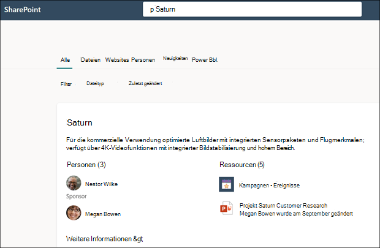

# Verwenden der Microsoft Search zum Suchen von Themen in Microsoft Viva TopicsUse Microsoft Search to find topics in Microsoft Viva Topics

Während Benutzer von "Viva Topics" Themen über Themenhighlights auf ihren SharePoint finden können, können sie sie auch über Microsoft Search finden.While Viva Topics users can find topics through topic highlights in their SharePoint sites, they can also find them through Microsoft Search. 

## ThemenantwortTopic Answer

Wenn Sie in Microsoft Search nach einem bestimmten Thema suchen (z. B. "Saturn"), wenn ein Thema vorhanden ist und gefunden wird, wird das Ergebnis im #A0 angezeigt.When you search for a specific topic in Microsoft Search (for example, "Saturn"), if a topic exists and is found, it will display the result in the Answers suggestion format.

Die Antwort des Themas wird angezeigt:The topic answer will display:
- ThemennameTopic name
- Alternative Namen: Alternative Namen oder Akronyme für das Thema.Alternate names: Alternate names or acronyms for the topic.
- Definition: Beschreibung des Themas, die von der KI bereitgestellt oder manuell von einer Person hinzugefügt wurde.Definition: Description of the topic provided by AI or manually added by a person.
- Vorgeschlagen oder angeheftet: Personen, die von AI vorgeschlagen oder von einer Person an das Thema angeheftet wurdenSuggested or Pinned people: People suggested by AI or pinned to the topic by a person
- Vorgeschlagene oder angeheftete Ressourcen: Dateien, Seiten oder Websites, die entweder von AI vorgeschlagen oder von einer Person an das Thema angeheftet wurden.Suggested or Pinned resources: Files, pages, or sites either suggested by AI or pinned to the topic by a person. 

    

Die Themenseite kann auch dann in den Suchergebnissen angezeigt werden, wenn die Antwortkarte des Themas nicht angezeigt wird.The topic page can display in the search results even if the topic answer card doesn't appear.

Die Suchergebnisse in Word, PowerPoint, Outlook und Excel zeigen auch die Antwort des Themas an, wenn eine gefunden wird.The search results in Word, PowerPoint, Outlook and Excel will also show the topic answer when one is found.

## AkronymeAcronyms

In "Viva Topics" können Sie ein Thema manuell bearbeiten, um ein Akronym als alternativen <b>Namen zu verwenden.</b>In Viva Topics, you can manually edit a topic to include an acronym for it as an <b>Alternate Name</b>. Auf diese Weise kann ein Benutzer, der nur nach dem Akronym des Themas sucht, die Themaantwort über Microsoft Search finden.This allows a user who is searching by only the topic's acronym to find the topic answer through Microsoft Search.

[Akronym Answers](/microsoftsearch/manage-acronyms) ist ein Feature, das über Microsoft Search bereitgestellt wird und separat von "Viva Topics" verwaltet wird.[Acronym Answers](/microsoftsearch/manage-acronyms) is a feature provided though Microsoft Search and is managed separately from Viva Topics.

## Lesezeichen und ThemenBookmarks and topics

Lesezeichen sind ein Microsoft Search-Feature, das Personen dabei hilft, wichtige Websites und Tools schnell mit nur einer Suche zu finden (z. B. ein [Reisebuchungstool](/microsoftsearch/manage-bookmarks) auf einer externen Website außerhalb des Microsoft 365 Mandanten).[Bookmarks](/microsoftsearch/manage-bookmarks) are a Microsoft Search feature that help people quickly find important sites and tools with just a search (for example, a travel booking tool on an external site outside of their Microsoft 365 tenant). Sie werden von Suchadministratoren im Microsoft 365 erstellt.They're created by search admins in the Microsoft 365 admin center. 

Für Benutzer, die nach Informationen zum Buchen einer Arbeitsreise suchen:For users who are looking for information about booking a trip for work:

- Wenn einige Benutzer den Namen des Reisetools kennen (z. B. "Concur"), ist es einfacher, ein Lesezeichen zu erstellen, um direkt zur externen Website zu wechseln.If some users know the travel tool name (for example, "Concur"), it's easier to create a bookmark to go directly to the external site.
- Erstellen Sie für Benutzer, die im Allgemeinen nach "Reisen" suchen, ein Thema unter "Reisen", das die informationen enthält, die sie erwarten.For users who search generally for "travel", create a topic on "Travel" that has the information they expect to see. Erwägen Sie, einen Link zur externen Website Concur in der Beschreibung des Themas zu hinzufügen.Consider adding a link to the Concur external site in the description of the topic. Wenn der Link stattdessen zu einer internen Reisebuchungswebsite verwendet wird, die im Microsoft 365 gehostet wird, können Sie ihn den "angehefteten Ressourcen" hinzufügen.If the link is instead to an internal travel booking site hosted on the Microsoft 365 tenant, you can add it to the “Pinned Resources”.
 
### Priorität der SuchergebnisseSearch results priority 
 
Wenn ein Benutzer in der Benutzersuche nach einem Begriff wie "Reisen" sucht, werden suchergebnisse in der folgenden Priorität in Microsoft Search angezeigt.In the users search experience, when a user searches for a term like “travel”, search results will display in the following priority in Microsoft Search
1. Veröffentlichte oder bestätigte ThemenPublished or Confirmed topics 
2. LesezeichenBookmarks
3. Vorgeschlagene ThemenSuggested topics
