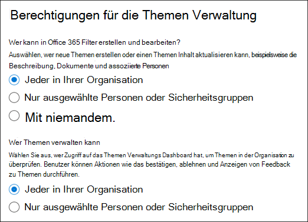
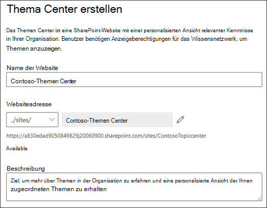
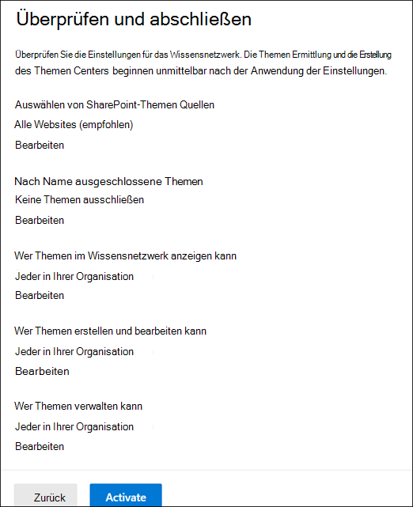

# Einrichten der Wissensverwaltung (Vorschau)

> [!Note] 
> Der Inhalt dieses Artikels ist für Project Cortex private Preview. [Erfahren Sie mehr über Project Cortex](https://aka.ms/projectcortex).

Sie können das Microsoft 365 Admin Center verwenden, um die [Wissensverwaltung](knowledge-management-overview.md)einzurichten und zu konfigurieren. 

> [!Important]
> Es ist wichtig, die beste Methode zum Einrichten und Konfigurieren des Wissensmanagements in Ihrer Umgebung zu planen. Beispielsweise müssen Sie Überlegungen zu den folgenden Aspekten treffen:
- Die SharePoint-Websites, die Sie für Themen analysieren möchten.
- Die Benutzer, für die Sie Themen sichtbar machen möchten.
- Die Benutzer, denen Sie Berechtigungen zum Verwalten von Themen im Themen Center erteilen möchten.
- Die Benutzer, denen Sie Berechtigungen zum Erstellen oder Bearbeiten von Themen im Themen Center erteilen möchten.
- Welchen Namen möchten Sie Ihrem Themen Center geben?

> [!Note]
> Möglicherweise ist es hilfreich, Sicherheitsgruppen zu erstellen, um Ihren Benutzern die Berechtigungen zu erteilen, die zum Anzeigen von Themen, zum Verwalten des Themas und zum Erstellen und Bearbeiten von Themen erforderlich sind.

Ein Administrator kann [Änderungen an den ausgewählten Einstellungen auch jederzeit nach dem Setup](manage-knowledge-network.md) über die Knowledge Management-Einstellungen im Microsoft 365 Admin Center vornehmen.

## Anforderungen 
Sie müssen über globale Administrator-oder SharePoint-Administratorberechtigungen verfügen, um auf das Microsoft 365 Admin Center zugreifen und organisatorische Wissens Aufgaben einrichten zu können.

## Einrichten Ihres Wissensnetzwerks

Das Einrichten Ihres Wissensnetzwerks führt Sie durch die folgenden Schritte:

- Thema Discovery: Auswählen von Themen Quellen und Themen, die von der Suche ausgeschlossen werden sollen.
- Thema Visibility: auswählen, wer Themen als Highlights anzeigen kann, in Such-und Themenseiten.
- Thema Permissions: Auswählen der Personen, die Themen erstellen, bearbeiten und verwalten können.
- Themen Center: Erstellen Ihres Themen Centers.
- Überprüfung: überprüfen und Anwenden Ihrer Einstellungen.

So richten Sie Ihr Wissensnetzwerk ein:

1. Wählen Sie im Microsoft 365 Admin Center (admin.Microsoft.com) die Option **Setup**aus, und zeigen Sie dann den Abschnitt **organisatorisches Wissen** an.
2. Klicken Sie im Abschnitt **organisatorisches Wissen** auf **Personen mit Wissen verbinden**. 

      

3. Klicken Sie auf der Seite **zum Verbinden von Benutzern mit Informationen** auf **Erste Schritte** , um Sie durch den Setupprozess zu führen. 

      

4. Auf der Seite **Wählen Sie aus, wie das Wissensnetzwerk Themen finden kann** , konfigurieren Sie die Themen Ermittlung. Wählen Sie im Abschnitt **SharePoint-Themen Quellen auswählen** aus, welche SharePoint-Websites während der Ermittlung als Quellen für Ihre Themen gecrawlt werden sollen. Hierzu zählen Folgende: 
    a. **Alle Websites**: alle SharePoint-Websites in Ihrem Mandanten. Dadurch werden aktuelle und zukünftige Websites erfasst. 
    b. **Alle, außer ausgewählte Websites**: Geben Sie die Namen der Websites ein, die Sie ausschließen möchten.  Sie können auch eine Liste der Websites hochladen, von denen Sie die Ermittlung deaktivieren möchten. In Zukunft erstellte Websites werden als Quellen für die Themen Ermittlung hinzugefügt.  
    c. **Nur ausgewählte Websites**: Geben Sie die Namen der Websites ein, die Sie einschließen möchten. Sie können auch eine Liste der Websites hochladen. In der Zukunft erstellte Websites werden nicht als Quellen für die Themen Ermittlung einbezogen.  

      
   
5. Im Abschnitt **Themen nach Name ausschließen** können Sie auswählen, dass Themen Namen eingeschlossen werden sollen, die nicht in den ermittelten Ergebnissen enthalten sein sollen. Verwenden Sie diese Einstellung, um zu verhindern, dass vertrauliche Themen als Teil des Wissensnetzwerks einbezogen werden. Zu den Optionen gehören: 
    a. **Keine Themen ausschließen**  
    b. **Thema ausschließen, das diese Begriffe enthält**: Wenn Sie Themen haben, die Sie Benutzern nicht als Teil des Wissensnetzwerks angezeigt werden sollen.
   -Laden Sie die bereitgestellte Vorlage herunter.
   – Geben Sie die Namen der Themen ein, die Sie ausschließen möchten. Sie müssen den Übereinstimmungs als exakt oder partiell angeben. Exakte Übereinstimmung bedeutet, dass Themen, die dem genauen Ausdruck entsprechen, ausgeschlossen werden. Partielle Übereinstimmung ist strenger und bedeutet, dass Themen, die den Begriff enthalten, ausgeschlossen werden. Wenn Sie beispielsweise *doc* als Namen des Themas eingeben, wird die *doc-Assembly* ausgeschlossen, wenn *docker* dies nicht tut. Bei Themen Namen wird die Groß-/Kleinschreibung nicht berücksichtigt.  
        – Wählen Sie diese Option aus  **+**   , um die abgeschlossene CSV-Datei zu importieren. Wählen Sie dann **hochladen**aus. Wenn Ihre Datei erfolgreich verarbeitet wurde, wird ein grünes Häkchen angezeigt. Wählen Sie **Weiter** aus. 

6. Auf der Seite " **Wer kann Themen sehen" und "wo Sie diese anzeigen können** " Konfigurieren Sie die Sichtbarkeit des Themas. In der Liste der Benutzer, die **Themen in der Wissensnetzwerk Einstellung anzeigen können** , wählen Sie aus, wer Zugriff auf Themen Details haben soll, wie beispielsweise hervorgehobene Themen, Themenkarten, Themen Antworten auf der Suche und Themenseiten. Sie können Folgendes auswählen: 
    a. **Jeder in Ihrer Organisation** 
    b. **Nur ausgewählte Personen oder Sicherheitsgruppen** 
    c. **Niemand** 

       

 > [!Note] 
 > Während Sie mit dieser Einstellung einen beliebigen Benutzer in Ihrer Organisation auswählen können, können nur Benutzer, denen Lizenzen für Wissensmanagement zugewiesen sind, Themen anzeigen. 

7. Wählen Sie auf der Seite **Berechtigungen für die Themen Verwaltung** aus, wer Themen erstellen, bearbeiten oder verwalten kann. Im Abschnitt **who can create and Edit topics** können Sie Folgendes auswählen: 
    a. **Jeder in Ihrer Organisation** 
    b. **Nur ausgewählte Personen oder Sicherheitsgruppen** 
8. Im Abschnitt **Verwalten von Themen** können Sie Folgendes auswählen: 
    a. **Jeder in Ihrer Organisation** 
    b. **Ausgewählte Personen oder Sicherheitsgruppen** 

      

    Wählen Sie **Weiter** aus. 
9. Auf der Seite **Thema Center erstellen** können Sie Ihre Themen Center-Website erstellen, in der die Themenseiten angezeigt und Themen verwaltet werden können.  Geben Sie im Feld **Themen Center Name** einen Namen für Ihr Themen Center ein. Sie können optional eine kurze Beschreibung in das Feld **Website Beschreibung** eingeben.  

Wählen Sie **Weiter** aus. 

      

10. Auf der Seite **überprüfen und fertig stellen** können Sie sich Ihre ausgewählte Einstellung ansehen und auswählen, dass Sie Änderungen vornehmen möchten. Wenn Sie mit Ihrer Auswahl zufrieden sind, wählen Sie **aktivieren**aus.

       

11. Die Seite **Wissensnetzwerk aktiviert** wird angezeigt und bestätigt, dass das System jetzt mit der Analyse der ausgewählten Websites für Themen beginnt und die Knowledge Center-Website erstellt. Wählen Sie **Fertig** aus. 

       

12. Sie kehren zur Seite " **Personen an Wissen verbinden** " zurück. Auf dieser Seite können Sie **Verwalten** auswählen, um Änderungen an Ihren Konfigurationseinstellungen vorzunehmen. 

         

> [!Note]
> Nach dem Setup kann ein Administrator jederzeit [Änderungen an den ausgewählten Wissens Verwaltungseinstellungen vornehmen](manage-knowledge-network.md) , indem er zu dieser Seite zurückkehrt.

## Siehe auch

  

