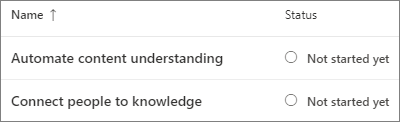

# Einrichten von Microsoft -Themen

Sie können das Microsoft 365 Admin Center zum Einrichten und Konfigurieren von Themen [verwenden.](topic-experiences-overview.md) 

Es ist wichtig, die beste Methode zum Einrichten und Konfigurieren von Themen in Ihrer Umgebung zu planen. Lesen Sie unbedingt ["Planen von Microsoft -Themen",](plan-topic-experiences.md) bevor Sie mit den Verfahren in diesem Artikel beginnen.

Sie müssen ein globaler Administrator oder ein SharePoint-Administrator sein, um auf das Microsoft 365 Admin Center zugreifen und Themen einrichten zu können.

## Videodemonstration

In diesem Video wird der Prozess zum Einrichten von Themen in Microsoft 365 gezeigt.

 

> [!VIDEO https://www.microsoft.com/videoplayer/embed/RE4Li0E]  

 

## Einrichten von Themen

So richten Sie Themen ein

1. Wählen Sie [im Microsoft 365 Admin Center](https://admin.microsoft.com) **"Setup"** aus, und zeigen Sie dann den Abschnitt **"Dateien und Inhalte"** an.
2. Klicken Sie **im Abschnitt "Dateien und Inhalte"** **auf "Personen mit Wissen verbinden".**

     

3. Klicken Sie **auf der Seite "Personen mit Wissen verbinden"** auf **"Erste** Schritte", um Sie durch den Einrichtungsprozess zu unterstützen.

     

4. Auf der **Seite "Auswählen, wie Themen unter "Themen" zu** finden sind, konfigurieren Sie die Themenermittlung. Wählen Sie **im Abschnitt "Auswählen von SharePoint-Themenquellen"** aus, welche SharePoint-Websites während der Ermittlung als Quellen für Ihre Themen durchforstet werden. Wählen Sie zwischen:
    - **Alle Websites:** Alle SharePoint-Websites in Ihrer Organisation. Dazu gehören aktuelle und zukünftige Websites.
    - **Alle, mit Ausnahme ausgewählter Websites:** Geben Sie die Namen der Websites ein, die Sie ausschließen möchten.  Sie können auch eine Liste der Websites hochladen, für die Sie die Suche abmelden möchten. Websites, die in Zukunft erstellt werden, werden als Quellen für die Themenermittlung einbezogen. 
    - **Nur ausgewählte Websites:** Geben Sie die Namen der Websites ein, die Sie enthalten möchten. Sie können auch eine Liste von Websites hochladen. Websites, die in Zukunft erstellt werden, werden nicht als Quellen für die Themenermittlung einbezogen.
    - **Keine Websites:** Keine SharePoint-Websites enthalten.

     
   
5. Im Abschnitt **"Themen nach Namen** ausschließen" können Sie Namen von Themen hinzufügen, die sie aus der Themenermittlung ausschließen möchten. Verwenden Sie diese Einstellung, um zu verhindern, dass vertrauliche Informationen als Themen einbezogen werden. Mögliche Optionen:
    - **Keine Themen ausschließen** 
    - **Ausschließen von Themen nach Namen**

     

    (Wissensmanager können auch Themen im Themencenter nach der Ermittlung ausschließen.)

    #### Ausschließen von Themen nach Namen    

    Wenn Sie Themen ausschließen müssen, laden Sie nach auswahl von "Themen nach Namen ausschließen" die CSV-Vorlage herunter, und aktualisieren Sie sie mit der Liste der Themen, die Sie aus ihren Ermittlungsergebnissen ausschließen möchten. 

     

    Geben Sie in der Csv-Vorlage die folgenden Informationen zu den Themen ein, die Sie ausschließen möchten:

    - **Name**: Geben Sie den Namen des Themas ein, das Sie ausschließen möchten. Sie können auf zwei Arten vorgehen:
        - Genaue Übereinstimmung: Sie können den genauen Namen oder das Akronym (z. B. *Contoso* oder *ATL) verwenden.*
        - Teilweise Übereinstimmung: Sie können alle Themen ausschließen, in denen ein bestimmtes Wort enthalten ist.  Der Bogen *schließt* z. B. alle Themen aus, *in* denen der Wortbogen enthalten ist, z. B. Bogenkreis,  *Arkusbogen* oder *Schulungsbogen.* Beachten Sie, dass Themen, in denen der Text als Teil eines Worts enthalten ist, wie z. B. Architektur, nicht *ausgeschlossen werden.*
    - **Steht für (optional):** Wenn Sie ein Akronym ausschließen möchten, geben Sie die Wörter ein, für die das Akronym steht.
    - **MatchType-Exact/Partial**: Geben Sie ein, ob der eingegebene Name ein *exakter* oder teilweiser *Übereinstimmungstyp* war.

    Nachdem Sie die CSV-Datei abgeschlossen und gespeichert haben, wählen Sie **"Durchsuchen"** aus, um sie zu suchen und auszuwählen.
    
    Wählen Sie **Weiter** aus.

6. Auf der **Seite "Wer kann Themen anzeigen und** wo kann er sie sehen" konfigurieren Sie die Sichtbarkeit des Themas. In der **Einstellung "Wer** kann Themen anzeigen" wählen Sie aus, wer Zugriff auf Themendetails hat, z. B. hervorgehobene Themen, Themenkarten, Themenantworten in der Suche und Themenseiten. Sie können dies auswählen:
    - **Jeder in meiner Organisation**
    - **Nur ausgewählte Personen oder Sicherheitsgruppen**
    - **Niemand**

      

    > [!Note] 
    > Während Sie mit dieser Einstellung beliebige Benutzer in Ihrer Organisation auswählen können, können nur Benutzer, denen Themenerfahrungslizenzen zugewiesen sind, Themen anzeigen.

7. Auf der **Seite "Berechtigungen für die Themenverwaltung"** wählen Sie aus, wer Themen erstellen, bearbeiten oder verwalten kann. Im Abschnitt **"Wer kann Themen erstellen und** bearbeiten" können Sie folgende Einstellungen auswählen:
    - **Jeder in meiner Organisation**
    - **Nur ausgewählte Personen oder Sicherheitsgruppen**
    - **Niemand**

     

8. Im Abschnitt **"Wer kann Themen verwalten"** können Sie folgende Auswählen:
    - **Jeder in meiner Organisation**
    - **Nur ausgewählte Personen oder Sicherheitsgruppen**

     

    Wählen Sie **Weiter** aus.

9. Auf der **Seite "Themencenter erstellen"** können Sie Ihre Themencenterwebsite erstellen, auf der Themenseiten angezeigt und Themen verwaltet werden können. Geben Sie **im Feld "Websitename"** einen Namen für Ihr Themencenter ein. Optional können Sie eine kurze Beschreibung in das Feld **"Beschreibung"** eingeben. 

   Wählen Sie **Weiter** aus.

     

10. Auf der Seite **Überprüfen und beenden** können Sie sich die ausgewählte Einstellung ansehen und Änderungen vornehmen. Wenn Sie mit Ihrer Auswahl zufrieden sind, wählen Sie **Aktivieren** aus.

11. Die **aktivierte Seite "Aktuelle** Themen" wird angezeigt, um zu bestätigen, dass das System nun mit der Analyse der ausgewählten Websites für Themen und dem Erstellen der Themencenterwebsite beginnt. Wählen Sie **Fertig** aus.

12. Sie werden zu Ihrer Seite "Personen mit Wissen **verbinden"** zurückgegeben. Auf dieser Seite können Sie **Verwalten** auswählen, um Änderungen an Ihren Konfigurationseinstellungen vorzunehmen. 

        

## Zuweisen von Lizenzen

Nachdem Sie die Themenerfahrung konfiguriert haben, müssen Sie den Benutzern, die Themen verwenden werden, Lizenzen zuweisen. Nur Benutzer mit einer Lizenz können Informationen zu Themen wie Highlights, Themenkarten, Themenseiten und das Themencenter anzeigen. 

So weisen Sie Lizenzen zu

1. Klicken Sie im Microsoft 365 Admin Center auf **Benutzer** > **Aktive Benutzer**.

2. Wählen Sie die Benutzer aus, die Sie lizenzen möchten, und klicken Sie auf **"Lizenzen und Apps".**

3. Stellen **Sie unter "Apps"** sicher, dass die Graph **Connectors search with Index** and **Topics** beide ausgewählt sind.

4. Klicken Sie auf **Änderungen speichern**.

## Verwalten von Themenerfahrungen

Nachdem Sie Themen eingerichtet haben, können Sie die Einstellungen ändern, die Sie während des Setups im [Microsoft 365 Admin Center ausgewählt haben.](https://admin.microsoft.com/AdminPortal#/featureexplorer/csi/KnowledgeManagement) Weitere Informationen finden Sie in den folgenden Referenzen:

- [Verwalten der Themenermittlung in Microsoft -Themen](topic-experiences-discovery.md)
- [Verwalten der Sichtbarkeit von Themen in Microsoft -Themen](topic-experiences-knowledge-rules.md)
- [Verwalten von Themenberechtigungen in Microsoft -Themen](topic-experiences-user-permissions.md)
- [Ändern des Namens des Themencenters in Microsoft Topics](topic-experiences-administration.md)

## Siehe auch

[Übersicht über die Themenerfahrungen](topic-experiences-overview.md)
