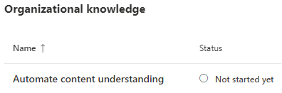
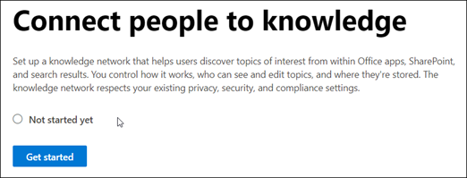
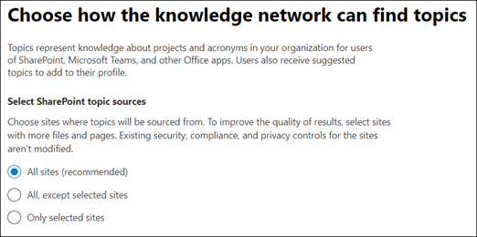
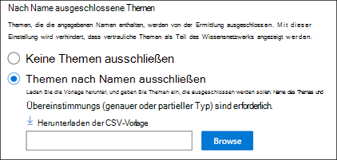

# Einrichten der Wissensverwaltung (Vorschau)Set up Knowledge Management (Preview)

> [!Note] 
> Der Inhalt dieses Artikels ist für Project Cortex private Preview.The content in this article is for Project Cortex Private Preview. [Erfahren Sie mehr über Project Cortex](https://aka.ms/projectcortex).[Find out more about Project Cortex](https://aka.ms/projectcortex).

Sie können das Microsoft 365 Admin Center verwenden, um die [Wissensverwaltung](knowledge-management-overview.md)einzurichten und zu konfigurieren.You can use the Microsoft 365 admin center to set up and configure [Knowledge Management](knowledge-management-overview.md). 

> [!Important]
> Es ist wichtig, die beste Methode zum Einrichten und Konfigurieren des Wissensmanagements in Ihrer Umgebung zu planen.It is important to plan the best way to set up and configure Knowledge Management in your environment. Beispielsweise müssen Sie Überlegungen zu den folgenden Aspekten treffen:For example, you will need to make considerations about the following:
- Die SharePoint-Websites, die Sie für Themen analysieren möchten.Which SharePoint sites you want to analyze for topics.
- Die Benutzer, für die Sie Themen sichtbar machen möchten.Which users you want to make topics visible to.
- Die Benutzer, denen Sie Berechtigungen zum Verwalten von Themen im Themen Center erteilen möchten.Which users you want to give permissions to manage topics in the topic center.
- Die Benutzer, denen Sie Berechtigungen zum Erstellen oder Bearbeiten von Themen im Themen Center erteilen möchten.Which users you want to give permissions to create or edit topics in the topic center.
- Welchen Namen möchten Sie Ihrem Themen Center geben?What name you want to give your topic center.

> [!Note]
> Möglicherweise ist es hilfreich, Sicherheitsgruppen zu erstellen, um Ihren Benutzern die Berechtigungen zu erteilen, die zum Anzeigen von Themen, zum Verwalten des Themas und zum Erstellen und Bearbeiten von Themen erforderlich sind.You may find it useful to create security groups to assign your users the permissions needed to view topics, manage topic, and create and edit topics.

Ein Administrator kann [Änderungen an den ausgewählten Einstellungen auch jederzeit nach dem Setup](topic-experiences-discovery.md) über die Knowledge Management-Einstellungen im Microsoft 365 Admin Center vornehmen.An admin can also [make changes to your selected settings anytime after setup](topic-experiences-discovery.md) through the Knowledge Management settings in the Microsoft 365 admin center.

## AnforderungenRequirements 
Sie müssen über globale Administrator-oder SharePoint-Administratorberechtigungen verfügen, um auf das Microsoft 365 Admin Center zugreifen und organisatorische Wissens Aufgaben einrichten zu können.You must have Global Admin or SharePoint admin permissions to be able to access the Microsoft 365 admin center and set up Organizational knowledge tasks.

## Einrichten Ihres WissensnetzwerksSet up your knowledge network

Das Einrichten Ihres Wissensnetzwerks führt Sie durch die folgenden Schritte:Setting up your knowledge network walks you through the following:

- Thema Discovery: Auswählen von Themen Quellen und Themen, die von der Suche ausgeschlossen werden sollen.Topic discovery: Selecting topic sources and topics to  exclude from discovery.
- Thema Visibility: auswählen, wer Themen als Highlights anzeigen kann, in Such-und Themenseiten.Topic visibility: Selecting who can view topics as highlights, in search and topic pages.
- Thema Permissions: Auswählen der Personen, die Themen erstellen, bearbeiten und verwalten können.Topic permissions: Selecting who can create, edit, and manage topics.
- Themen Center: Erstellen Ihres Themen Centers.Topic center: Create your topic center.
- Überprüfung: überprüfen und Anwenden Ihrer Einstellungen.Review: Check and apply your settings.

So richten Sie Ihr Wissensnetzwerk ein:To set up your knowledge network:

1. Wählen Sie im Microsoft 365 Admin Center (admin.Microsoft.com) die Option **Setup** aus, und zeigen Sie dann den Abschnitt **organisatorisches Wissen** an.In the Microsoft 365 admin center (admin.microsoft.com), select **Setup** , and then view the **Organizational Knowledge** section.
2. Klicken Sie im Abschnitt **organisatorisches Wissen** auf **Personen mit Wissen verbinden**.In the **Organizational Knowledge** section, click **Connect people to knowledge**. 

      

3. Klicken Sie auf der Seite **zum Verbinden von Benutzern mit Informationen** auf **Erste Schritte** , um Sie durch den Setupprozess zu führen.On the **Connect people to knowledge** page, click **Get started** to walk you through the setup process. 

      

4. Auf der Seite **Wählen Sie aus, wie das Wissensnetzwerk Themen finden kann** , konfigurieren Sie die Themen Ermittlung.On the **Choose how the knowledge network can find topics** page, you will configure topic discovery. Wählen Sie im Abschnitt **SharePoint-Themen Quellen auswählen** aus, welche SharePoint-Websites während der Ermittlung als Quellen für Ihre Themen gecrawlt werden sollen.In the **Select SharePoint topic sources** section, select which SharePoint sites will be crawled as sources for your topics during discovery. Hierzu zählen Folgende:This includes: 
    a.a. **Alle Websites** : alle SharePoint-Websites in Ihrem Mandanten.**All sites** : All SharePoint sites in your tenant. Dadurch werden aktuelle und zukünftige Websites erfasst.This captures current and future sites. 
    b.b. **Alle, außer ausgewählte Websites** : Geben Sie die Namen der Websites ein, die Sie ausschließen möchten.**All, except selected sites** : Type the names of the sites you want to exclude.  Sie können auch eine Liste der Websites hochladen, von denen Sie die Ermittlung deaktivieren möchten.You can also upload a list of sites that you want to opt out from discovery. In Zukunft erstellte Websites werden als Quellen für die Themen Ermittlung hinzugefügt.Sites created in future will be included as sources for topic discovery.  
    c.c. **Nur ausgewählte Websites** : Geben Sie die Namen der Websites ein, die Sie einschließen möchten.**Only selected sites** : Type the names of the sites you want to include. Sie können auch eine Liste der Websites hochladen.You can also upload a list of sites. In der Zukunft erstellte Websites werden nicht als Quellen für die Themen Ermittlung einbezogen.Sites created in the future will not be included as sources for topic discovery.  

      
   
5. Im Abschnitt **Themen nach Name ausschließen** können Sie auswählen, dass Themen Namen eingeschlossen werden sollen, die nicht in den ermittelten Ergebnissen enthalten sein sollen.In the **Exclude topics by name** section, you can choose to includes names of topics you don't want to be in the discovered results. Verwenden Sie diese Einstellung, um zu verhindern, dass vertrauliche Themen als Teil des Wissensnetzwerks einbezogen werden.Use this setting to prevent sensitive topics from being included as part of the knowledge network. Zu den Optionen gehören:Your options include: 
    a.a. **Keine Themen ausschließen****Don't exclude any topics**  
    b.b. **Themen nach Namen ausschließen** : Wenn Sie Themen haben, die den Benutzern nicht als Teil des Wissensnetzwerks angezeigt werden sollen.**Exclude topics by name** :  If you have topics you don’t want shown to users as part of the knowledge network. 

      

    #### So schließen Sie Themen nach Namen ausHow to exclude topics by name    

    Wenn Sie Themen ausschließen müssen, wählen Sie nach dem auswählen **von Themen nach Namen ausschließen** **die Option CSV-Vorlage herunterladen** aus.If you need to exclude topics, after selecting **Exclude topics by name** , select **Download the .csv template**. Verwenden Sie die Excel. CSV-Vorlage, um eine Liste von Themen einzuschließen, die von den Ermittlungsergebnissen ausgeschlossen werden sollen.Use the Excel .CSV template to include a list of topics that you want to exclude from your discovery results.

      

    Geben Sie in der CSV-Vorlage die folgenden Informationen zu den Themen ein, die Sie ausschließen möchten:In the CSV template, enter the following information about the topics you want to exclude:

    - **Name** : Geben Sie den Namen des Themas ein, das Sie ausschließen möchten.**Name** : Type the name of the topic you want to exclude. Sie können auf zwei Arten vorgehen:There are two ways to do this: 
        - Exakte Übereinstimmung: Sie können den genauen Namen oder das Akronym angeben (beispielsweise *contoso* oder *ATL* ).Exact match: You can include the exact name or acronym (for example, *Contoso* or *ATL* ). 
        - Partielle Übereinstimmung: Sie können alle Themen ausschließen, die ein bestimmtes Wort enthalten.Partial match: You can exclude all topics that have a specific word in it.  Beispielsweise schließt *Bogen* alle Themen mit dem Wort *Bogen* in ihm aus, wie *Bogen Kreis* , *Plasma Schweißen* oder *Schulungs Bogen*. Beachten Sie, dass die Themen, in denen der Text als Teil eines Wortes eingeschlossen ist, wie etwa die *Architektur* , nicht ausgeschlossen werden.For example, *arc* will exclude all topics with the word *arc* in it, such as *Arc circle* , *Plasma arc welding* , or *Training arc*. Note that it will not exclude topics in which the text is included as part of a word, such as *Architecture*. 
    - **Expansion (optional)** : Wenn Sie ein Akronym ausschließen möchten, geben Sie die Wörter ein, für die die Abkürzung steht.**Expansion (optional)** : If you want to exclude an acronym, type the words the acronym stands for. 
    - **MatchType-Exact/Partial** : Geben Sie an, ob es sich bei dem von Ihnen eingegebenen Namen um einen *genauen* oder *partiellen* Übereinstimmungs handelt.**MatchType-Exact/Partial** : Type whether the name you entered was an *exact* or *partial* match type. 

    Nachdem Sie die CSV-Vorlagendatei abgeschlossen und gespeichert haben, wählen Sie **Durchsuchen** aus, um Sie zu suchen und auszuwählen.After you've completed and saved your CSV template file, select **Browse** to locate and select it.
    
    Wählen Sie **Weiter** aus.Select **Next**. 

6. Auf der Seite " **Wer kann Themen sehen" und "wo Sie diese anzeigen können** " Konfigurieren Sie die Sichtbarkeit des Themas.On the **Who can see topics and where they can see them** page, you will configure topic visibility. In der Liste der Benutzer, die **Themen in der Wissensnetzwerk Einstellung anzeigen können** , wählen Sie aus, wer Zugriff auf Themen Details haben soll, wie beispielsweise hervorgehobene Themen, Themenkarten, Themen Antworten auf der Suche und Themenseiten.In the **Who can see topics in the knowledge network** setting, you choose who will have access to topic details, such as highlighted topics, topic cards, topic answers in search, and topic pages. Sie können Folgendes auswählen:You can select: 
    a.a. **Jeder in Ihrer Organisation****Everyone in your organization** 
    b.b. **Nur ausgewählte Personen oder Sicherheitsgruppen****Only selected people or security groups** 
    c.c. **Niemand****No one** 

       

 > [!Note] 
 > Während Sie mit dieser Einstellung einen beliebigen Benutzer in Ihrer Organisation auswählen können, können nur Benutzer, denen Lizenzen für Wissensmanagement zugewiesen sind, Themen anzeigen.While this setting allows you to select any user in your organization, only users who have knowledge management licenses assigned to them will be able to view topics. 

7. Wählen Sie auf der Seite **Berechtigungen für die Themen Verwaltung** aus, wer Themen erstellen, bearbeiten oder verwalten kann.In the **Permissions for topic management** page, you choose who will be able to create, edit, or manage topics. Im Abschnitt **who can create and Edit topics** können Sie Folgendes auswählen:In the **Who can create and edit topics** section, you can select: 
    a.a. **Jeder in Ihrer Organisation****Everyone in your organization** 
    b.b. **Nur ausgewählte Personen oder Sicherheitsgruppen****Only selected people or security groups** 
8. Im Abschnitt **Verwalten von Themen** können Sie Folgendes auswählen:In the **Who can manage topics** section, you can select: 
    a.a. **Jeder in Ihrer Organisation****Everyone in your organization** 
    b.b. **Ausgewählte Personen oder Sicherheitsgruppen****Selected people or security groups** 

      

    Wählen Sie **Weiter** aus.Select **Next**. 
9. Auf der Seite **Thema Center erstellen** können Sie Ihre Themen Center-Website erstellen, in der die Themenseiten angezeigt und Themen verwaltet werden können.On the **Create Topic  Center** page, you can create your topic center site in which topic pages can be viewed and topics can be managed.  Geben Sie im Feld **Themen Center Name** einen Namen für Ihr Themen Center ein.In the **Topic center name** box, type a name for your Topic center. Sie können optional eine kurze Beschreibung in das Feld **Website Beschreibung** eingeben.You can optionally type a short description in the **Site description** box.  

Wählen Sie **Weiter** aus.Select **Next**. 

      

10. Auf der Seite **Überprüfen und beenden** können Sie sich die ausgewählte Einstellung ansehen und Änderungen vornehmen.On the **Review and finish** page, you can look at your selected setting and choose to make changes. Wenn Sie mit Ihrer Auswahl zufrieden sind, wählen Sie **Aktivieren** aus.If you are satisfied with your selections, select **Activate**.

       

11. Die Seite **Wissensnetzwerk aktiviert** wird angezeigt und bestätigt, dass das System jetzt mit der Analyse der ausgewählten Websites für Themen beginnt und die Knowledge Center-Website erstellt.The **Knowledge network activated** page will display, confirming that the system will now start analyzing your selected sites for topics and creating the Knowledge Center site. Wählen Sie **Fertig** aus.Select **Done**. 

       

12. Sie kehren zur Seite " **Personen an Wissen verbinden** " zurück.You'll be returned to your **Connect people to knowledge** page. Auf dieser Seite können Sie **Verwalten** auswählen, um Änderungen an Ihren Konfigurationseinstellungen vorzunehmen.From this page, you can select **Manage** to make any changes to your configuration settings. 

         

> [!Note]
> Nach dem Setup kann ein Administrator jederzeit [Änderungen an den ausgewählten Wissens Verwaltungseinstellungen vornehmen](topic-experiences-discovery.md) , indem er zu dieser Seite zurückkehrt.After setup, an admin can [make changes to your selected knowledge management settings](topic-experiences-discovery.md) any time by returning to this page.

## Weitere Informationen:See also

  

