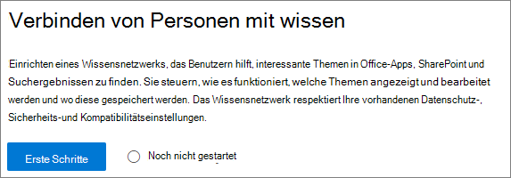
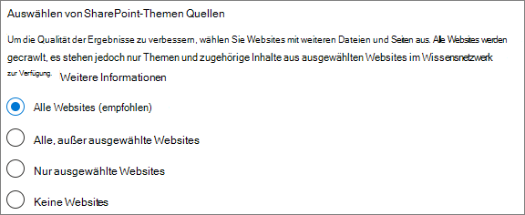
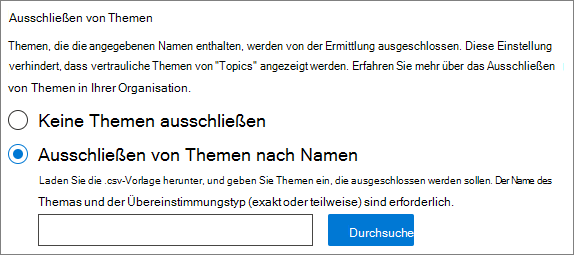
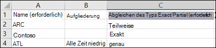
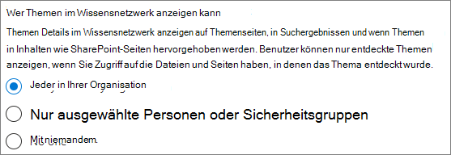
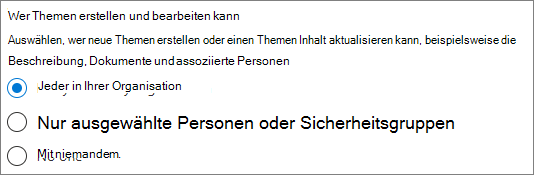
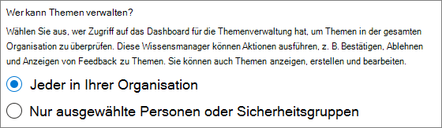
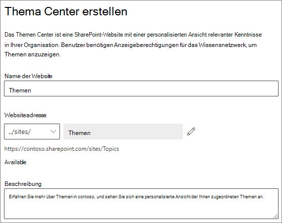
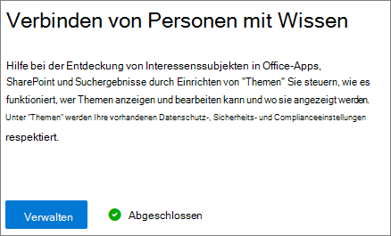
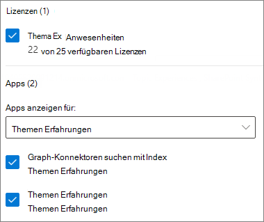

# Einrichten von Themen Erfahrungen in Microsoft 365

 

> [!VIDEO https://www.microsoft.com/videoplayer/embed/RE4LBp7]  

 

Sie können das Microsoft 365 Admin Center verwenden, um [Themen Erfahrungen](topic-experiences-overview.md)einzurichten und zu konfigurieren. 

Es ist wichtig, die beste Möglichkeit zum Einrichten und Konfigurieren von Themen in Ihrer Umgebung zu planen. Lesen Sie unbedingt [Plan Topic Experiences](plan-topic-experiences.md) , bevor Sie mit den Verfahren in diesem Artikel beginnen.

Sie müssen ein globaler Administrator oder SharePoint-Administrator sein, um auf das Microsoft 365 Admin Center zuzugreifen und Themen Erfahrungen einzurichten.

## Topic Experiences einrichten

So richten Sie Themen Erfahrungen in Microsoft 365 ein

1. Wählen Sie im [Microsoft 365 Admin Center](https://admin.microsoft.com) **Setup** aus, und zeigen Sie dann den Abschnitt **Dateien und Inhalt** an.
2. Klicken Sie im Abschnitt **Dateien und Inhalt** auf **Personen mit Wissen verbinden**.

     

3. Klicken Sie auf der Seite **zum Verbinden von Benutzern mit Informationen** auf **Erste Schritte** , um Sie durch den Setupprozess zu führen.

     

4. Auf der Seite **Wählen Sie aus, wie das Wissensnetzwerk Themen finden kann** , konfigurieren Sie die Themen Ermittlung. Wählen Sie im Abschnitt **SharePoint-Themen Quellen auswählen** aus, welche SharePoint-Websites während der Ermittlung als Quellen für Ihre Themen gecrawlt werden sollen. Wählen Sie zwischen:
    - **Alle Websites**: alle SharePoint-Websites in Ihrer Organisation. Dazu gehören aktuelle und zukünftige Websites.
    - **Alle, außer ausgewählte Websites**: Geben Sie die Namen der Websites ein, die Sie ausschließen möchten.  Sie können auch eine Liste der Websites hochladen, von denen Sie die Ermittlung deaktivieren möchten. In Zukunft erstellte Websites werden als Quellen für die Themen Ermittlung hinzugefügt. 
    - **Nur ausgewählte Websites**: Geben Sie die Namen der Websites ein, die Sie einschließen möchten. Sie können auch eine Liste der Websites hochladen. In der Zukunft erstellte Websites werden nicht als Quellen für die Themen Ermittlung einbezogen.
    - **Keine Websites**: keine SharePoint-Websites einschließen.

     
   
5. Im Abschnitt **Themen nach Name ausschließen** können Sie Namen von Themen hinzufügen, die Sie von der Themen Ermittlung ausschließen möchten. Verwenden Sie diese Einstellung, um zu verhindern, dass vertrauliche Informationen als Themen eingeschlossen werden. Mögliche Optionen:
    - **Keine Themen ausschließen** 
    - **Themen nach Namen ausschließen**

     

    (Knowledge Manager können Themen im Themen Center nach der Ermittlung auch ausschließen.)

    #### So schließen Sie Themen nach Namen aus    

    Wenn Sie Themen ausschließen müssen, nachdem Sie **Themen nach Namen ausschließen** ausgewählt haben, wählen Sie die CSV-Vorlage herunterladen aus, und aktualisieren Sie Sie mit der Liste der Themen, die Sie aus ihren Ermittlungsergebnissen ausschließen möchten.

     

    Geben Sie in der CSV-Vorlage die folgenden Informationen zu den Themen ein, die Sie ausschließen möchten:

    - **Name**: Geben Sie den Namen des Themas ein, das Sie ausschließen möchten. Sie können auf zwei Arten vorgehen:
        - Exakte Übereinstimmung: Sie können den genauen Namen oder das Akronym angeben (beispielsweise *contoso* oder *ATL*).
        - Partielle Übereinstimmung: Sie können alle Themen ausschließen, die ein bestimmtes Wort enthalten.  Beispielsweise schließt *Bogen* alle Themen mit dem Wort *Bogen* in ihm aus, wie *Bogen Kreis*, *Plasma Schweißen* oder *Schulungs Bogen*. Beachten Sie, dass die Themen, in denen der Text als Teil eines Wortes eingeschlossen ist, wie etwa die *Architektur*, nicht ausgeschlossen werden.
    - **Steht für (optional)**: Wenn Sie ein Akronym ausschließen möchten, geben Sie die Wörter ein, für die die Abkürzung steht.
    - **MatchType-Exact/Partial**: Geben Sie an, ob es sich bei dem von Ihnen eingegebenen Namen um einen *genauen* oder *partiellen* Übereinstimmungs handelt.

    Nachdem Sie die CSV-Datei abgeschlossen und gespeichert haben, wählen Sie **Durchsuchen** aus, um Sie zu suchen und auszuwählen.
    
    Wählen Sie **Weiter** aus.

6. Auf der Seite " **Wer kann Themen sehen" und "wo können Sie diese sehen** " wird die Sichtbarkeit des Themas konfiguriert. In der Liste der Benutzer, die **Themen in der Wissensnetzwerk Einstellung anzeigen können** , wählen Sie aus, wer Zugriff auf Themen Details haben soll, wie beispielsweise hervorgehobene Themen, Themenkarten, Themen Antworten auf der Suche und Themenseiten. Sie können Folgendes auswählen:
    - **Jeder in meiner Organisation**
    - **Nur ausgewählte Personen oder Sicherheitsgruppen**
    - **Niemand**

      

 > [!Note] 
 > Während diese Einstellung es Ihnen ermöglicht, einen beliebigen Benutzer in Ihrer Organisation auszuwählen, können nur Benutzer, denen die Lizenzen für ein Themen Erlebnis zugewiesen sind, Themen anzeigen.

7. Wählen Sie auf der Seite **Berechtigungen für die Themen Verwaltung** aus, wer Themen erstellen, bearbeiten oder verwalten kann. Im Abschnitt **who can create and Edit topics** können Sie Folgendes auswählen:
    - **Jeder in meiner Organisation**
    - **Nur ausgewählte Personen oder Sicherheitsgruppen**
    - **Niemand**

     

8. Im Abschnitt **Verwalten von Themen** können Sie Folgendes auswählen:
    - **Jeder in meiner Organisation**
    - **Nur ausgewählte Personen oder Sicherheitsgruppen**

     

    Wählen Sie **Weiter** aus.

9. Auf der Seite **Thema Center erstellen** können Sie Ihre Themen Center-Website erstellen, in der die Themenseiten angezeigt und Themen verwaltet werden können. Geben Sie im Feld **Websitename** einen Namen für Ihr Themen Center ein. Sie können optional eine kurze Beschreibung in das Feld **Beschreibung** eingeben. 

Wählen Sie **Weiter** aus.

     

10. Auf der Seite **Überprüfen und beenden** können Sie sich die ausgewählte Einstellung ansehen und Änderungen vornehmen. Wenn Sie mit Ihrer Auswahl zufrieden sind, wählen Sie **Aktivieren** aus.

11. Die Seite **Wissensnetzwerk aktiviert** wird angezeigt und bestätigt, dass das System jetzt mit der Analyse der ausgewählten Websites für Themen beginnt und die Knowledge Center-Website erstellt. Wählen Sie **Fertig** aus.

12. Sie kehren zur Seite " **Personen an Wissen verbinden** " zurück. Auf dieser Seite können Sie **Verwalten** auswählen, um Änderungen an Ihren Konfigurationseinstellungen vorzunehmen. 

        

## Zuweisen von Lizenzen

Nachdem Sie Themen Erfahrungen konfiguriert haben, müssen Sie Lizenzen für die Benutzer zuweisen, die Themen Erfahrungen verwenden werden. Nur Benutzer mit einer Lizenz können Informationen zu Themen wie Highlights, Themenkarten, Themenseiten und das Themen Center anzeigen. 

So weisen Sie Lizenzen zu

1. Klicken Sie im Microsoft 365 Admin Center auf **Benutzer** > **Aktive Benutzer**.

2. Wählen Sie die Benutzer aus, denen Sie eine Lizenz zuweisen möchten, und klicken Sie dann auf **Produktlizenzen verwalten**.

3. Wählen Sie **Weitere zuweisen** aus.

4. Wählen Sie unter **Lizenzen** die Option **Themen Erfahrungen** aus.

5. Stellen Sie sicher, dass unter **apps** die Option **Graph Connectors Search with Index** and **Topic Experiences** ausgewählt ist.

    > [!div class="mx-imgBorder"]
    > 

6. Klicken Sie auf **Änderungen speichern**.

## Verwalten von Themen Erfahrungen

Nachdem Sie Themen Erfahrungen eingerichtet haben, können Sie die Einstellungen ändern, die Sie während des Setups im [Microsoft 365 Admin Center](https://admin.microsoft.com/AdminPortal#/featureexplorer/csi/KnowledgeManagement)ausgewählt haben. Siehe die folgenden Verweise:

- [Verwalten der Themen Ermittlung in Microsoft 365](topic-experiences-discovery.md)
- [Verwalten der Themen Sichtbarkeit in Microsoft 365](topic-experiences-knowledge-rules.md)
- [Verwalten von Themen Berechtigungen in Microsoft 365](topic-experiences-user-permissions.md)
- [Ändern des Namens des Themen Centers in Microsoft 365](topic-experiences-administration.md)

## Siehe auch

[Übersicht über Themen Erlebnisse](topic-experiences-overview.md)
