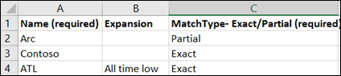
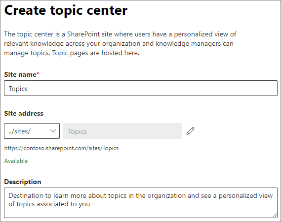

# Einrichten von Microsoft -ThemenSet up Microsoft Viva Topics

Sie können das Microsoft 365 Admin Center zum Einrichten und Konfigurieren von Themen [verwenden.](topic-experiences-overview.md)You can use the Microsoft 365 admin center to set up and configure [Topics](topic-experiences-overview.md). 

Es ist wichtig, die beste Methode zum Einrichten und Konfigurieren von Themen in Ihrer Umgebung zu planen.It is important to plan the best way to set up and configure topics in your environment. Lesen Sie unbedingt ["Planen von Microsoft -Themen",](plan-topic-experiences.md) bevor Sie mit den Verfahren in diesem Artikel beginnen.Be sure to read [Plan for Microsoft Viva Topics](plan-topic-experiences.md) before you begin the procedures in this article.

Sie müssen [Themen abonniert](https://www.microsoft.com/microsoft-viva/topics) haben und ein globaler Administrator oder ein SharePoint-Administrator sein, um auf das Microsoft 365 Admin Center zugreifen und Themen einrichten zu können.You must be [subscribed to Viva Topics](https://www.microsoft.com/microsoft-viva/topics) and be a global administrator or SharePoint administrator to access the Microsoft 365 admin center and set up Topics.

Wenn Sie SharePoint so konfiguriert haben, dass [verwaltete](https://docs.microsoft.com/sharepoint/control-access-from-unmanaged-devices)Geräte erforderlich sind, müssen Sie Die Themen von einem verwalteten Gerät einrichten.If you have configured SharePoint to [require managed devices](https://docs.microsoft.com/sharepoint/control-access-from-unmanaged-devices), be sure to set up Topics from a managed device.

## VideodemonstrationVideo demonstration

In diesem Video wird der Prozess zum Einrichten von Themen in Microsoft 365 gezeigt.This video shows the process for setting up Topics in Microsoft 365.

 

> [!VIDEO https://www.microsoft.com/videoplayer/embed/RE4Li0E]  

 

## Einrichten von ThemenSet up Topics

So richten Sie Themen einTo set up Topics

1. Wählen Sie [im Microsoft 365 Admin Center](https://admin.microsoft.com) **"Setup"** aus, und zeigen Sie dann den Abschnitt **"Dateien und Inhalte"** an.In the [Microsoft 365 admin center](https://admin.microsoft.com), select **Setup**, and then view the **Files and content** section.
2. Klicken Sie **im Abschnitt "Dateien und Inhalte"** **auf "Personen mit Wissen verbinden".**In the **Files and content** section, click **Connect people to knowledge**.

     

3. Klicken Sie **auf der Seite "Personen mit Wissen verbinden"** auf **"Erste** Schritte", um Sie durch den Einrichtungsprozess zu unterstützen.On the **Connect people to knowledge** page, click **Get started** to walk you through the setup process.

     

4. Auf der **Seite "Auswählen, wie Themen unter "Themen" zu** finden sind, konfigurieren Sie die Themenermittlung.On the **Choose how Viva Topics can find topics** page, you will configure topic discovery. Wählen Sie **im Abschnitt "SharePoint-Themenquellen** auswählen" aus, welche SharePoint-Websites während der Ermittlung als Quellen für Ihre Themen durchforstet werden.In the **Select SharePoint topic sources** section, select which SharePoint sites will be crawled as sources for your topics during discovery. Wählen Sie zwischen:Choose from:
    - **Alle Websites:** Alle SharePoint-Websites in Ihrer Organisation.**All sites**: All SharePoint sites in your organization. Dazu gehören aktuelle und zukünftige Websites.This includes current and future sites.
    - **Alle, mit Ausnahme ausgewählter Websites:** Geben Sie die Namen der Websites ein, die Sie ausschließen möchten.**All, except selected sites**: Type the names of the sites you want to exclude.  Sie können auch eine Liste der Websites hochladen, für die Sie die Suche abmelden möchten.You can also upload a list of sites that you want to opt out from discovery. Websites, die in Zukunft erstellt werden, werden als Quellen für die Themenermittlung einbezogen.Sites created in future will be included as sources for topic discovery. 
    - **Nur ausgewählte Websites:** Geben Sie die Namen der Websites ein, die Sie enthalten möchten.**Only selected sites**: Type the names of the sites you want to include. Sie können auch eine Liste von Websites hochladen.You can also upload a list of sites. Websites, die in Zukunft erstellt werden, werden nicht als Quellen für die Themenermittlung einbezogen.Sites created in the future will not be included as sources for topic discovery.
    - **Keine Websites:** Keine SharePoint-Websites enthalten.**No sites**: Do not include any SharePoint sites.

     
   
5. Im Abschnitt **"Themen nach Namen** ausschließen" können Sie Namen von Themen hinzufügen, die sie aus der Themenermittlung ausschließen möchten.In the **Exclude topics by name** section, you can add names of topics you want to exclude from topic discovery. Verwenden Sie diese Einstellung, um zu verhindern, dass vertrauliche Informationen als Themen einbezogen werden.Use this setting to prevent sensitive information from being included as topics. Mögliche Optionen:The options are:
    - **Keine Themen ausschließen****Don't exclude any topics** 
    - **Ausschließen von Themen nach Namen****Exclude topics by name**

     

    (Wissensmanager können auch Themen im Themencenter nach der Ermittlung ausschließen.)(Knowledge managers can also exclude topics in the topic center after discovery.)

    #### Ausschließen von Themen nach NamenHow to exclude topics by name    

    Wenn Sie Themen ausschließen müssen, laden Sie nach auswahl von "Themen nach Namen ausschließen" die CSV-Vorlage herunter, und aktualisieren Sie sie mit der Liste der Themen, die Sie aus Ihren Ermittlungsergebnissen ausschließen möchten. If you need to exclude topics, after selecting **Exclude topics by name**, download the .csv template and update it with the list of topics that you want to exclude from your discovery results.

     

    Geben Sie in der Csv-Vorlage die folgenden Informationen zu den Themen ein, die Sie ausschließen möchten:In the CSV template, enter the following information about the topics you want to exclude:

    - **Name**: Geben Sie den Namen des Themas ein, das Sie ausschließen möchten.**Name**: Type the name of the topic you want to exclude. Sie können auf zwei Arten vorgehen:There are two ways to do this:
        - Genaue Übereinstimmung: Sie können den genauen Namen oder das Akronym (z. B. *Contoso* oder *ATL) verwenden.*Exact match: You can include the exact name or acronym (for example, *Contoso* or *ATL*).
        - Teilweise Übereinstimmung: Sie können alle Themen ausschließen, in denen ein bestimmtes Wort enthalten ist.Partial match: You can exclude all topics that have a specific word in it.  Der Bogen *schließt* z. B. alle Themen aus, *in* denen der Wortbogen enthalten ist, z. B. Bogenkreis,  *Arkusbogen* oder *Schulungsbogen.* Beachten Sie, dass Themen, in denen der Text als Teil eines Worts enthalten ist, wie z. B. Architektur, nicht *ausgeschlossen werden.*For example, *arc* will exclude all topics with the word *arc* in it, such as *Arc circle*, *Plasma arc welding*, or *Training arc*. Note that it will not exclude topics in which the text is included as part of a word, such as *Architecture*.
    - **Steht für (optional):** Wenn Sie ein Akronym ausschließen möchten, geben Sie die Wörter ein, für die das Akronym steht.**Stands for (optional)**: If you want to exclude an acronym, type the words the acronym stands for.
    - **MatchType-Exact/Partial**: Geben Sie ein, ob der eingegebene Name ein *exakter* oder teilweiser *Übereinstimmungstyp* war.**MatchType-Exact/Partial**: Type whether the name you entered was an *exact* or *partial* match type.

    Nachdem Sie die CSV-Datei abgeschlossen und gespeichert haben, wählen Sie **"Durchsuchen"** aus, um sie zu suchen und auszuwählen.After you've completed and saved your .csv file, select **Browse** to locate and select it.
    
    Wählen Sie **Weiter** aus.Select **Next**.

6. Auf der **Seite "Wer kann Themen anzeigen und** wo kann er sie sehen" konfigurieren Sie die Sichtbarkeit des Themas.On the **Who can see topics and where can they see them** page, you will configure topic visibility. In der **Einstellung "Wer** kann Themen anzeigen" wählen Sie aus, wer Zugriff auf Themendetails hat, z. B. hervorgehobene Themen, Themenkarten, Themenantworten in der Suche und Themenseiten.In the **Who can see topics** setting, you choose who will have access to topic details, such as highlighted topics, topic cards, topic answers in search, and topic pages. Sie können dies auswählen:You can select:
    - **Jeder in meiner Organisation****Everyone in my organization**
    - **Nur ausgewählte Personen oder Sicherheitsgruppen****Only selected people or security groups**
    - **Niemand****No one**

      

    > [!Note] 
    > Während Sie mit dieser Einstellung beliebige Benutzer in Ihrer Organisation auswählen können, können nur Benutzer, denen Themenerfahrungslizenzen zugewiesen sind, Themen anzeigen.While this setting allows you to select any user in your organization, only users who have Topic Experiences licenses assigned to them will be able to view topics.

7. Auf der **Seite "Berechtigungen für die Themenverwaltung"** wählen Sie aus, wer Themen erstellen, bearbeiten oder verwalten kann.In the **Permissions for topic management** page, you choose who will be able to create, edit, or manage topics. Im Abschnitt **"Wer kann Themen erstellen und** bearbeiten" können Sie folgende Einstellungen auswählen:In the **Who can create and edit topics** section, you can select:
    - **Jeder in meiner Organisation****Everyone in my organization**
    - **Nur ausgewählte Personen oder Sicherheitsgruppen****Only selected people or security groups**
    - **Niemand****No one**

     

8. Im Abschnitt **"Wer kann Themen verwalten"** können Sie folgende Auswählen:In the **Who can manage topics** section, you can select:
    - **Jeder in meiner Organisation****Everyone in my organization**
    - **Nur ausgewählte Personen oder Sicherheitsgruppen****Only selected people or security groups**

     

    Wählen Sie **Weiter** aus.Select **Next**.

9. Auf der **Seite "Themencenter erstellen"** können Sie Ihre Themencenterwebsite erstellen, auf der Themenseiten angezeigt und Themen verwaltet werden können.On the **Create topic center** page, you can create your topic center site in which topic pages can be viewed and topics can be managed. Geben Sie **im Feld "Websitename"** einen Namen für Ihr Themencenter ein.In the **Site name** box, type a name for your topic center. Optional können Sie eine kurze Beschreibung in das Feld **"Beschreibung"** eingeben.You can optionally type a short description in the **Description** box. 

   Wählen Sie **Weiter** aus.Select **Next**.

     

10. Auf der Seite **Überprüfen und beenden** können Sie sich die ausgewählte Einstellung ansehen und Änderungen vornehmen.On the **Review and finish** page, you can look at your selected setting and choose to make changes. Wenn Sie mit Ihrer Auswahl zufrieden sind, wählen Sie **Aktivieren** aus.If you are satisfied with your selections, select **Activate**.

11. Die **aktivierte Seite "Aktuelle** Themen" wird angezeigt, um zu bestätigen, dass das System nun mit der Analyse der ausgewählten Websites für Themen und dem Erstellen der Themencenterwebsite beginnt.The **Viva Topics activated** page will display, confirming that the system will now start analyzing your selected sites for topics and creating the topic center site. Wählen Sie **Fertig** aus.Select **Done**.

12. Sie werden zu Ihrer Seite "Personen mit Wissen **verbinden"** zurückgegeben.You'll be returned to your **Connect people to knowledge** page. Auf dieser Seite können Sie **Verwalten** auswählen, um Änderungen an Ihren Konfigurationseinstellungen vorzunehmen.From this page, you can select **Manage** to make any changes to your configuration settings. 

        

## Zuweisen von LizenzenAssign licenses

Nachdem Sie die Themenerfahrung konfiguriert haben, müssen Sie den Benutzern, die Themen verwenden werden, Lizenzen zuweisen.Once you have configured topic experiences, you must assign licenses for the users who will be using Topics. Nur Benutzer mit einer Lizenz können Informationen zu Themen wie Highlights, Themenkarten, Themenseiten und das Themencenter anzeigen.Only users with a license can see information on topics including highlights, topic cards, topic pages and the topic center. 

So weisen Sie Lizenzen zuTo assign licenses:

1. Klicken Sie im Microsoft 365 Admin Center auf **Benutzer** > **Aktive Benutzer**.In the Microsoft 365 admin center, under **Users**, click **Active users**.

2. Wählen Sie die Benutzer aus, die Sie lizenzen möchten, und klicken Sie auf **"Lizenzen und Apps".**Select the users that you want to license, and click **Licenses and apps**.

3. Stellen **Sie unter "Apps"** sicher, dass die Graph **Connectors search with Index** and Topic **Experiences** ausgewählt sind.Under **Apps**, make sure **Graph Connectors Search with Index** and **Topic Experiences** are both selected.

4. Klicken Sie auf **Änderungen speichern**.Click **Save changes**.

## Verwalten von ThemenerfahrungenManage topic experiences

Nachdem Sie Themen eingerichtet haben, können Sie die Einstellungen ändern, die Sie während des Setups im [Microsoft 365 Admin Center ausgewählt haben.](https://admin.microsoft.com/AdminPortal#/featureexplorer/csi/KnowledgeManagement)Once you have set up Topics, you can change the settings that you chose during setup in the [Microsoft 365 admin center](https://admin.microsoft.com/AdminPortal#/featureexplorer/csi/KnowledgeManagement). Sehen Sie sich die folgenden Verweise an:See the following references:

- [Verwalten der Themenermittlung in Microsoft -ThemenManage topic discovery in Microsoft Viva Topics](topic-experiences-discovery.md)
- [Verwalten der Sichtbarkeit von Themen in Microsoft -ThemenManage topic visibility in Microsoft Viva Topics](topic-experiences-knowledge-rules.md)
- [Verwalten von Themenberechtigungen in Microsoft -ThemenManage topic permissions in Microsoft Viva Topics](topic-experiences-user-permissions.md)
- [Ändern des Namens des Themencenters in Microsoft TopicsChange the name of the topic center in Microsoft Viva Topics](topic-experiences-administration.md)

## Weitere ArtikelSee also

[Übersicht über die ThemenerfahrungenTopic Experiences Overview](topic-experiences-overview.md)
