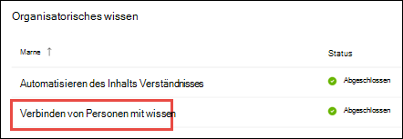

# Übersicht über das Themen Center (Vorschau)Topic center overview (Preview)

> [!Note] 
> Der Inhalt dieses Artikels ist für Project Cortex private Preview.The content in this article is for Project Cortex Private Preview. [Erfahren Sie mehr über Project Cortex](https://aka.ms/projectcortex).[Find out more about Project Cortex](https://aka.ms/projectcortex).

Das Themen Center ist eine moderne SharePoint-Website, die als Wissenszentrum für Ihre Organisation dient.The topic center is a Modern SharePoint site that serves as a center of knowledge for your organization. Sie wird während des [Setups der Wissensverwaltung](set-up-knowledge-network.md) im Microsoft 365 Admin Center erstellt.It is created during [Knowledge Management setup](set-up-knowledge-network.md) in the Microsoft 365 admin center.

Über das Themen Center können Benutzer mit den entsprechenden Berechtigungen folgende Aktionen ausführen:Through the topic center, users with the proper permissions can do the following:

- Bestätigen oder ablehnen erkannter ThemenConfirm or reject discovered topics
- Erstellen einer neuen Themen SeiteCreate a new topic page
- Bearbeiten einer vorhandenen Themen SeiteEdit an existing topic page

> [!Note] 
> Weitere Informationen zu den einzelnen Aufgaben finden Sie unter [Arbeiten mit Themen im Thema Center](work-with-topics.md).You can learn more about each task in [Work with topics in the topic center](work-with-topics.md).

## Wo ist das Themen CenterWhere is the topic center

Ihr Themen Center wird während des Knowledge Management-Setups erstellt.Your topic center is created during Knowledge Management setup. Nach Abschluss des Setups kann ein Administrator die URL auf der [Knowledge Center-Verwaltungsseite](manage-knowledge-network.md)finden.After setup completes, an admin can find the URL on the [knowledge center management page](manage-knowledge-network.md).

1. Wählen Sie im Microsoft 365 Admin Center im Navigationsbereich die Option **Setup** aus, und wählen Sie im Abschnitt **organisatorisches Wissen** die Option **Personen mit Wissen verbinden**aus.In the Microsoft 365 admin center, select **Setup** in the navigation pane, and in the **Organizational Knowledge** section, select **Connect people to knowledge**.

     

2. Klicken Sie auf der Seite mit den **Informationen zum Benutzer verbinden** im Abschnitt **auf einen Blick** finden Sie weitere Informationen unter **Themen Center-Adresse** für die Website-URL.On the **Connect people to knowledge** page, in the **At a glance** section, see **Topic center address** for the site URL.

## Berechtigungen zum Verwenden des Themen CentersPermissions to use the topic center

Damit Sie im Themen Center arbeiten können, müssen Sie über die erforderlichen Berechtigungen verfügen.To work in the topic center, you need to have the required permissions. Ihr Administrator kann diese Berechtigungen Benutzern während des [Knowledge Management-Setups](set-up-knowledge-network.md)zuweisen, oder neue Benutzer können anschließend über das Microsoft 365 Admin Center von einem Administrator [hinzugefügt](give-user-permissions-to-the-topic-center.md) werden.Your admin can assign these permissions to users during [knowledge management setup](set-up-knowledge-network.md), or new users can be [added afterwards](give-user-permissions-to-the-topic-center.md) by an admin through the Microsoft 365 admin center.

Topic Center Benutzer können zwei Berechtigungssätze erhalten:Topic center users can be given two sets of permissions:

- **Themen erstellen und bearbeiten**: neue Themen erstellen oder Themen Inhalte wie Beschreibung, Dokumente und zugehörige Personen aktualisieren.**Create and edit topics**: Create new topics or update topic content such as the description, documents and associated persons. Erteilen Sie diese Berechtigung Fachexperten, die mit der Überprüfung von Themenseiten beauftragt sind.Assign this permission to subject matter experts who are tasked with reviewing topic pages.
- **Themen verwalten**: Verwenden Sie das Themen Dashboard, um Themen in der gesamten Organisation zu überprüfen.**Manage topics**: Use the topic dashboard to review topics across the organization. Benutzer können Aktionen wie das bestätigen und ablehnen unbestätigter Themen durchführen.Users can perform actions such as confirming and rejecting unconfirmed topics.

Ein Benutzer kann beide Berechtigungsgruppen erhalten oder nur einen, falls erforderlich.A user can be given both sets of permissions, or only one if needed. 

## Überprüfen der Themen im Thema DashboardReviewing topics in the topic dashboard

Im Themen Dashboard werden Themen angezeigt, die von den angegebenen Quell Standorten abgebaut wurden.The topic dashboard shows topics that were mined from your specified source locations. In jedem Thema wird das Datum angezeigt, an dem das Thema erkannt wurde, und wenn Feedback dazu bereitgestellt wurde.Each topic will show the date the topic was discovered and if any feedback has been provided on it. Ein Benutzer, dem Berechtigungen zum **Verwalten von Themen** zugewiesen wurden, kann die unbestätigten Themen überprüfen und Folgendes auswählen:A user who was assigned **Manage topics** permissions can review the unconfirmed topics and choose to:
- Bestätigen Sie das Thema: hebt das Thema für Benutzer auf, die Zugriff haben, und ermöglicht Ihnen das Anzeigen der zugehörigen Themenkarte und der entsprechenden Themen Seite.Confirm the topic: Highlights the topic to users who have access and lets them see the associated topic card and topic page.
- Das Thema ablehnen: stellt Benutzern das Thema nicht zur Verfügung.Reject the topic: Makes the topic not available to users. Das Thema wird auf die Registerkarte **abgelehnt** verschoben und kann bei Bedarf später bestätigt werden.The topic is moved to the **Rejected** tab and can be confirmed later if needed.

## Erstellen oder Bearbeiten eines ThemasCreate or edit a topic

Wenn Sie über Berechtigungen zum **Erstellen und Bearbeiten von Themen** verfügen, können Sie Folgendes auswählen:If you have **Create and edit topics** permissions, you can choose to:

- Bearbeiten vorhandener Themen: Sie können Änderungen an vorhandenen Themenseiten vornehmen, die über Discovery erstellt wurden.Edit existing topics: You can make changes to existing topic pages that were created through discovery.
- Neue Themen erstellen: Sie können neue Themen für diejenigen erstellen, die nicht durch Discovery gefunden wurden, oder wenn AI-Tools nicht genügend Beweise zum Erstellen eines Themas gefunden haben.Create new topics: You can create new topics for ones that were not found through discovery, or if AI tools did not find enough evidence to create a topic.

## Siehe auchSee also

  

