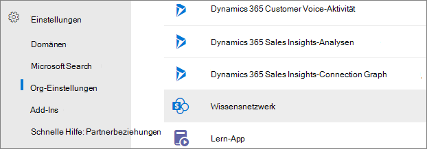
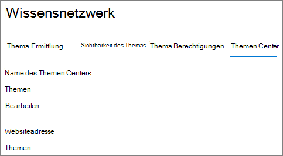
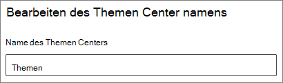

# Ändern des Namens des Themencenters in Microsoft Viva Topics

Sie können den Namen Ihres Themencenters im [Microsoft 365 ändern.](https://admin.microsoft.com) Sie müssen ein globaler Administrator oder ein SharePoint sein, um diese Aufgaben ausführen zu können.

## So greifen Sie auf die Themenverwaltungseinstellungen zu:

1. Klicken Sie Microsoft 365 Admin Center **auf Einstellungen**, und dann auf **Organisationseinstellungen**.
2. Klicken Sie **auf der** Registerkarte Dienste auf **Themenerfahrungen**.

     

3. Wählen Sie die **Registerkarte Themencenter** aus. Informationen zu den einzelnen Einstellungen finden Sie in den folgenden Abschnitten.

     

##  Aktualisieren des Themacenternamens

So ändern Sie den Namen des Themencenters

1. Wählen Sie **auf der Registerkarte Themencenter** unter **Name des Themencenters** **Bearbeiten aus.**
2. Geben Sie auf der Seite Name **des** Themencenters bearbeiten im Feld **Name** des Themencenters den neuen Namen für Ihr Themencenter ein.
3. Wählen Sie **Speichern** aus.

      

## Siehe auch

[Verwalten der Themensuche in Microsoft Viva Topics](topic-experiences-discovery.md)

[Verwalten der Sichtbarkeit von Themen in Microsoft Viva Topics](topic-experiences-knowledge-rules.md)

[Verwalten von Themenberechtigungen in Microsoft Viva Topics](topic-experiences-user-permissions.md)
