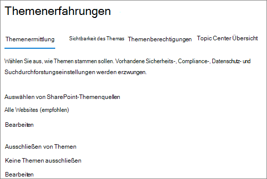
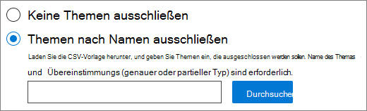

# <a name="manage-topic-discovery-in-microsoft-viva-topics"></a>Verwalten der Themensuche in Microsoft Viva Topics

Sie können die Themenerkennungseinstellungen im [Microsoft 365 Admin Center verwalten.](https://admin.microsoft.com) Sie müssen ein globaler Administrator oder SharePoint-Administrator sein, um diese Aufgaben ausführen zu können.

## <a name="to-access-topics-management-settings"></a>So greifen Sie auf die Themenverwaltungseinstellungen zu:

1. Klicken Sie im Microsoft 365 Admin Center auf **Einstellungen** und dann **auf Organisationseinstellungen.**
2. Klicken Sie **auf der** Registerkarte Dienste auf **Themenerfahrungen**.

     

3. Wählen Sie die **Registerkarte Themaermittlung** aus. Informationen zu den einzelnen Einstellungen finden Sie in den folgenden Abschnitten.

     

## <a name="select-sharepoint-topic-sources"></a>Auswählen von SharePoint-Themenquellen

Sie können die SharePoint-Websites in Ihrer Organisation ändern, die nach Themen durchforstet werden.

Wenn Sie eine bestimmte Liste von Websites hinzufügen oder ausschließen möchten, können Sie die folgende CSV-Vorlage verwenden:

``` csv
Site name,URL
```

Wenn Sie Websites mithilfe der Websiteauswahl hinzufügen, werden sie der vorhandenen Liste der Websites hinzugefügt, die ein- oder ausgeschlossen werden sollen. Wenn Sie eine CSV-Datei hochladen, werden alle vorhandenen Listen überschrieben. Wenn Sie zuvor bestimmte Websites eingeschlossen oder ausgeschlossen haben, laden Sie die Liste als CSV-Datei herunter, nehmen Änderungen vor und laden die neue Liste hoch.

So wählen Sie Websites für die Themenerkennung aus

1. Wählen Sie **auf der Registerkarte Themaermittlung** unter **SharePoint-Themenquellen auswählen** die Option Bearbeiten **aus.**
2. Wählen Sie auf der Seite **SharePoint-Themenquellen** auswählen aus, welche SharePoint-Websites während der Suche als Quellen für Ihre Themen durchforstet werden sollen. Dies umfasst Folgendes:
    - **Alle Websites:** Alle SharePoint-Websites in Ihrem Mandanten. Dadurch werden aktuelle und zukünftige Websites erfasst.
    - **Alle, mit Ausnahme ausgewählter Websites:** Geben Sie die Namen der Websites ein, die Sie ausschließen möchten.  Sie können auch eine Liste der Websites hochladen, die Sie von der Ermittlung abmelden möchten. Websites, die in Zukunft erstellt werden, werden als Quellen für die Themenerkennung einbezogen. 
    - **Nur ausgewählte Websites:** Geben Sie die Namen der Websites ein, die Sie enthalten möchten. Sie können auch eine Liste von Websites hochladen. Websites, die in Zukunft erstellt werden, werden nicht als Quellen für die Themenerkennung einbezogen.
    - **Keine Websites:** Themen werden nicht automatisch mit SharePoint-Inhalten generiert oder aktualisiert. Vorhandene Themen verbleiben im Themencenter.

    
   
3. Klicken Sie auf **Speichern**.

## <a name="exclude-topics-by-name"></a>Ausschließen von Themen nach Namen

Sie können Themen von der Ermittlung ausschließen, indem Sie eine Liste mithilfe einer CSV-Datei hochladen. Wenn Sie zuvor Themen ausgeschlossen haben, können Sie die CSV herunterladen, Änderungen vornehmen und sie erneut hochladen.

1. Wählen Sie auf der Registerkarte **Themaermittlung** unter **Themen ausschließen** die Option **Bearbeiten aus.**
2. Klicken **Sie auf Themen nach Name ausschließen**.
3. Wenn Sie eine Liste erstellen müssen, laden Sie die CSV-Vorlage herunter, und fügen Sie die Themen hinzu, die Sie ausschließen möchten (siehe Arbeiten mit der *CSV-Vorlage* unten). Wenn die Datei bereit ist, klicken Sie auf **Durchsuchen** und laden Sie die Datei hoch. Wenn eine Liste vorhanden ist, können Sie die CSV-Datei herunterladen, die die Liste enthält.
4. Klicken Sie auf **Speichern**.

    

### <a name="working-with-the-csv-template"></a>Arbeiten mit der CSV-Vorlage

Sie können die folgende CSV-Vorlage kopieren:

``` csv
Name (required),Expansion,MatchType- Exact/Partial (required)
```

Geben Sie in der CSV-Vorlage die folgenden Informationen zu den Themen ein, die Sie ausschließen möchten:

- **Name**: Geben Sie den Namen des Themas ein, das Sie ausschließen möchten. Sie können auf zwei Arten vorgehen:
    - Genaue Übereinstimmung: Sie können den genauen Namen oder das Akronym ausschließen (z. B. *Contoso* oder *ATL*).
    - Teilweise Übereinstimmung: Sie können alle Themen ausschließen, in denen ein bestimmtes Wort enthalten ist.  Der Bogen schließt *beispielsweise* alle Themen  aus, in denen der Wortbogen enthalten ist, z. B. Bogenkreis, Lichtbogenverschwesung oder *Schulungsbogen.*  Beachten Sie, dass Themen, in denen der Text als Teil eines Worts enthalten ist, wie z. B. Architektur, nicht *ausgeschlossen werden.*
- **Steht für (optional)**: Wenn Sie ein Akronym ausschließen möchten, geben Sie die Wörter ein, für die das Akronym steht.
- **MatchType-Exact/Partial**: Geben Sie ein, ob der eingegebene Name ein exakter oder *teilweiser* *Übereinstimmungstyp* war.

     

## <a name="see-also"></a>Siehe auch

[Verwalten der Thementransparenz in Microsoft 365](topic-experiences-knowledge-rules.md)

[Verwalten von Themenberechtigungen in Microsoft 365](topic-experiences-user-permissions.md)

[Ändern des Namens des Themencenters in Microsoft 365](topic-experiences-administration.md)
