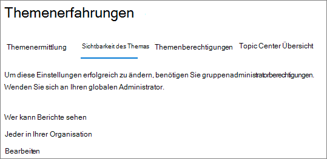
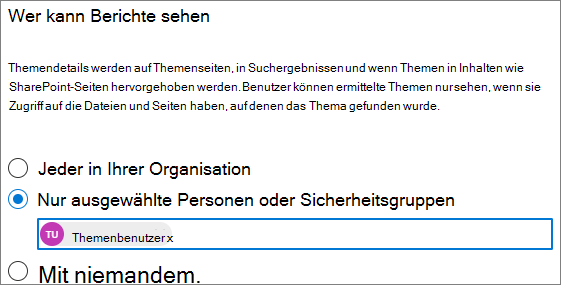

# Verwalten der Themen Sichtbarkeit in Microsoft 365

Sie können die Gruppe von Benutzern verwalten, die Themen Highlights, Themenkarten und das Themen Center im [Microsoft 365 Admin Center](https://admin.microsoft.com)anzeigen können. Sie müssen ein globaler Administrator oder SharePoint-Administrator sein, um diese Aufgaben ausführen zu können.

## So greifen Sie auf Themen Verwaltungseinstellungen zu:

1. Klicken Sie im Microsoft 365 Admin Center auf **Einstellungen** und dann auf **org-Einstellungen**.
2. Klicken Sie auf der Registerkarte **Dienste** auf **Wissensnetzwerk**.

     

3. Wählen Sie die Registerkarte **Themen Sichtbarkeit** aus. In den folgenden Abschnitten finden Sie Informationen zu den einzelnen Einstellungen.

     

##  Ändern der Personen, die Themen in Ihrer Organisation anzeigen können

Sie können die Benutzer ändern, die Themen in Ihrer Organisation anzeigen können.

1. Wählen Sie auf der Registerkarte **Thema Visibility** unter **wer Themen im Wissensnetzwerk sehen kann die** Option **Bearbeiten** aus.
2. Auf der Seite " **Wer kann Themen auf der Wissensnetzwerk Seite sehen** " wählen Sie aus, wer Zugriff auf Themen Details haben soll, wie beispielsweise hervorgehobene Themen, Themenkarten, Themen Antworten auf der Suche und Themenseiten. Sie können Folgendes auswählen:
    - **Jeder in Ihrer Organisation**
    - **Nur ausgewählte Personen oder Sicherheitsgruppen**
    - **Niemand**

     

3. Klicken Sie auf **Speichern**.  
 
> [!Note] 
> Während diese Einstellung es Ihnen ermöglicht, einen beliebigen Benutzer in Ihrer Organisation auszuwählen, können nur Benutzer, denen die Lizenzen für ein Themen Erlebnis zugewiesen sind, Themen anzeigen.

## Siehe auch

[Verwalten der Themen Ermittlung in Microsoft 365](topic-experiences-discovery.md)

[Verwalten von Themen Berechtigungen in Microsoft 365](topic-experiences-user-permissions.md)

[Ändern des Namens des Themen Centers in Microsoft 365](topic-experiences-administration.md)

