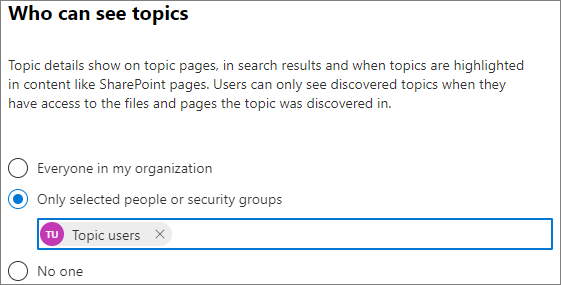

# Verwalten der Sichtbarkeit von Themen in Microsoft Viva Topics

Sie können die Gruppe von Benutzern verwalten, denen Themenhighlights, Themenkarten und das Themencenter im Microsoft 365 [werden können.](https://admin.microsoft.com) Sie müssen ein globaler Administrator oder ein SharePoint sein, um diese Aufgaben ausführen zu können.

## So greifen Sie auf die Themenverwaltungseinstellungen zu:

1. Klicken Sie Microsoft 365 Admin Center **auf Einstellungen**, und dann auf **Organisationseinstellungen**.
2. Klicken Sie **auf der** Registerkarte Dienste auf **Themenerfahrungen**.

     

3. Wählen Sie die **Registerkarte Sichtbarkeit des Themas** aus. Informationen zu den einzelnen Einstellungen finden Sie in den folgenden Abschnitten.

     

##  Ändern, wer Themen in Ihrer Organisation sehen kann

Sie können die Benutzer ändern, die Themen in Ihrer Organisation sehen können.

1. Wählen Sie **auf der** Registerkarte Sichtbarkeit des Themas unter Wer **themen anzeigen** die Option **Bearbeiten aus.**
2. Auf der **Wer** themenseite können Sie auswählen, wer Zugriff auf Themendetails hat, z. B. hervorgehobene Themen, Themenkarten, Themenantworten in der Suche und Themenseiten. Sie können wählen:
    - **Jeder in Ihrer Organisation**
    - **Nur ausgewählte Personen oder Sicherheitsgruppen**
    - **Niemand**

     

3. Klicken Sie auf **Speichern**.  
 
> [!Note] 
> Mit dieser Einstellung können Sie zwar beliebige Benutzer in Ihrer Organisation auswählen, aber nur Benutzer, denen Themenerfahrungslizenzen zugewiesen sind, können Themen anzeigen.

## Siehe auch

[Verwalten der Themensuche in Microsoft Viva Topics](topic-experiences-discovery.md)

[Verwalten von Themenberechtigungen in Microsoft Viva Topics](topic-experiences-user-permissions.md)

[Ändern des Namens des Themencenters in Microsoft Viva Topics](topic-experiences-administration.md)

