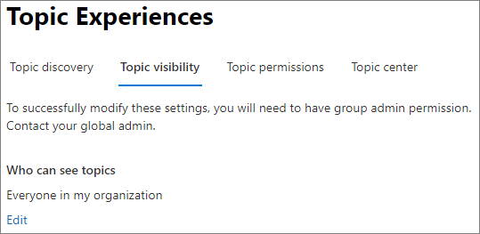

# Verwalten der Sichtbarkeit von Themen in Microsoft Viva Topics

Sie können verwalten, wer Themenhighlights, Themenkarten und das Themencenter im [Microsoft 365 Admin Center](https://admin.microsoft.com)sehen kann. Sie müssen ein globaler Administrator oder SharePoint Administrator und Gruppenadministrator sein, um diese Aufgaben ausführen zu können.

## So greifen Sie auf die Themenverwaltungseinstellungen zu:

1. Klicken Sie im Microsoft 365 Admin Center auf **Einstellungen** und dann auf **Organisationseinstellungen.**
2. Klicken Sie auf der Registerkarte **"Dienste"** auf **"Themenerfahrungen".**

     

3. Wählen Sie die Registerkarte **"Themensichtbarkeit"** aus. Informationen zu den einzelnen Einstellungen finden Sie in den folgenden Abschnitten.

     

##  Ändern, wer Themen in Ihrer Organisation sehen kann

Sie können die Benutzer ändern, die Themen in Ihrer Organisation sehen können.

1. Wählen Sie auf der Registerkarte **"Themensichtbarkeit"** unter **Wer Themen anzeigen können,** die Option **"Bearbeiten"** aus.
2. Auf der **Seite "Themen" Wer können** Sie auswählen, wer Zugriff auf Themendetails hat, z. B. hervorgehobene Themen, Themenkarten, Themenantworten in der Suche und Themenseiten. Sie können Folgendes auswählen:
    - **Jeder in Ihrer Organisation**
    - **Nur ausgewählte Personen oder Sicherheitsgruppen**
    - **Niemand**

     

3. Wählen Sie **Speichern**.  
 
> [!Note] 
> Mit dieser Einstellung können Sie zwar einen beliebigen Benutzer in Ihrer Organisation auswählen, aber nur Benutzer, denen Themenerfahrungslizenzen zugewiesen sind, können Themen anzeigen.

## Siehe auch

[Verwalten der Themensuche in Microsoft Viva Topics](topic-experiences-discovery.md)

[Verwalten von Themenberechtigungen in Microsoft Viva Topics](topic-experiences-user-permissions.md)

[Ändern des Namens des Themencenters in Microsoft Viva Topics](topic-experiences-administration.md)

