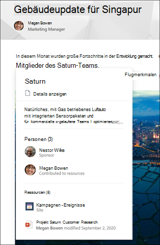

# Microsoft Viva Topics – ÜbersichtMicrosoft Viva Topics overview 

Viva Topics verwendet Microsoft AI-Technologie, Microsoft 365, Microsoft Graph, Suche und andere Komponenten und Dienste, um Ihren Benutzern Wissen in Microsoft 365-Apps zu vermitteln, die sie täglich verwenden, beginnend mit SharePoint modernen Seiten, Microsoft Search und Search in Word und PowerPoint.Viva Topics uses Microsoft AI technology, Microsoft 365, Microsoft Graph, Search, and other components and services to bring knowledge to your users in Microsoft 365 apps they use everyday, starting with SharePoint modern pages, Microsoft Search, and Search in Word and PowerPoint.

 

> [!VIDEO https://www.microsoft.com/videoplayer/embed/RE4LhZP]  

 

Viva Topics hilft bei der Lösung eines wichtigen Geschäftsproblems in vielen Unternehmen – indem Sie die Informationen für Benutzer bereitstellen, wenn diese benötigt werden.Viva Topics helps to address a key business issue in many companies - providing the information to users when they need it. Beispielsweise müssen neue Mitarbeiter schnell viele neue Informationen lernen und beim Lesen von Unternehmensinformationen auf Begriffe stoßen, über die sie nichts wissen.For example, new employees need to learn a lot of new information quickly, and encounter terms they know nothing about when reading through company information. Um mehr zu erfahren, muss der Benutzer möglicherweise seine Aktivitäten unterbrechen und wertvolle Zeit damit verbringen, nach Details zu suchen, z. B. nach Informationen über den Begriff, wer in der Organisation Fachexperte ist, und möglicherweise nach Websites und Dokumenten im Zusammenhang mit dem Begriff.To learn more, the user might need to step away from what they are doing and spend valuable time searching for details, such as information about what the term is, who in the organization is a subject matter expert, and maybe sites and documents that are related to the term.

Viva Topics verwendet KI, um automatisch nach **Themen** in Ihrer Organisation zu suchen und diese zu identifizieren.Viva Topics uses AI to automatically search for and identify **topics** in your organization. Es werden Informationen über sie zusammengestellt, z. B. eine kurze Beschreibung, Personen, die an dem Thema arbeiten, sowie Websites, Dateien und Seiten, die sich darauf beziehen.It compiles information about them, such as a short description, people working on the topic, and sites, files, and pages that are related to it. Ein Wissensmanager oder Mitwirkender kann die Themeninformationen nach Bedarf aktualisieren.A knowledge manager or contributor can choose to update the topic information as needed. Die Themen stehen Ihren Benutzern zur Verfügung. Dies bedeutet, dass für jede Instanz des Themas, die auf einer modernen SharePoint-Website in Nachrichten und Seiten angezeigt wird, der Text hervorgehoben wird.The topics are available to your users, which means that for every instance of the topic that appears in a modern SharePoint site in news and pages, the text will be highlighted. Benutzer können das Thema auswählen, um mehr darüber in den Themendetails zu erfahren.Users can choose to select the topic to learn more about it through the topic details. Themen finden Sie auch in der SharePoint-Suche.Topics can also be found in SharePoint Search.

## Wie Themen den Benutzern angezeigt werdenHow topics are displayed to users

Wenn ein Thema in Inhalten auf SharePoint-Nachrichten und -Seiten erwähnt wird, wird es hervorgehoben.When a topic is mentioned in content on SharePoint news and pages, you'll see it highlighted. Sie können die Themenübersicht über die Markierung öffnen.You can open the topic summary from the highlight. Öffnen Sie die Themendetails aus dem Titel der Zusammenfassung.Open the topic details from the title of the summary. Das erwähnte Thema kann automatisch identifiziert werden oder wurde der Seite mit einem direkten Verweis auf das Thema durch den Seitenautor hinzugefügt.The mentioned topic could be identified automatically or have been added to the page with a direct reference to the topic by the page author. 

    

Wenn Sie Die Suche in Word oder PowerPoint, entweder über das Suchfeld oder durch Auswählen von **Suchen** im Kontextmenü verwenden, werden die angezeigten Ergebnisse möglicherweise auch die Themenzusammenfassung angezeigt.When you use Search in Word or PowerPoint, either through the search box, or by selecting **Search** in the context menu, the results that are displayed might also show the topic summary.

   

   

## WissensindizierungKnowledge indexing

Viva Topics verwendet die Microsoft KI-Technologie, um **Themen** in Ihrer Microsoft 365-Umgebung zu identifizieren.Viva Topics uses Microsoft AI technology to identify **topics** in your Microsoft 365 environment.

Ein Thema ist eine Phrase oder ein Begriff, der organisatorisch bedeutsam oder wichtig ist.A topic is a phrase or term that is organizationally significant or important. Es hat eine spezifische Bedeutung für die Organisation und verfügt über Ressourcen, die den Menschen helfen können, zu verstehen, was es ist, und weitere Informationen darüber zu finden.It has a specific meaning to the organization, and has resources related to it that can help people understand what it is and find more information about it. Es gibt viele verschiedene Arten von Themen, die für Ihr Unternehmen wichtig sind.There are lots of different types of topics that will be important to your organization. Zunächst konzentriert sich die Microsoft KI-Technologie auf die folgenden Typen:Initially, the Microsoft AI technology focuses on the following types:
- ProjectProject
- EventEvent
- OrganisationOrganization
- SpeicherortLocation
- ProduktProduct
- Kreative ArbeitCreative work
- ForschungsgebietField of study

Wenn ein Thema identifiziert wird und KI feststellt, dass es über genügend Informationen verfügt, um ein vorgeschlagenes Thema zu sein, werden auf einer **Themenseite** die Informationen angezeigt, die durch Themenindizierung gesammelt wurden, z.B.:When a topic is identified and AI determines that it has enough information for it to be a suggested topic, a **topic page** displays the information that was gathered through topic indexing, such as:

- Alternative Namen und Akronyme.Alternate names and acronyms.
- Eine kurze Beschreibung des Themas.A short description of the topic.
- Personen, die sich mit dem Thema auskennen.People who might be knowledgeable about the topic.
- Dateien, Seiten und Websites, die sich auf das Thema beziehen.Files, pages, and sites that are related to the topic.

Ihre Wissensmanager können wählen, ob sie alle SharePoint-Sites in Ihrem Mandanten nach Themen durchsuchen oder nur bestimmte auswählen möchten.Your knowledge admins can choose to crawl all SharePoint sites in your tenant for topics, or to just select certain ones.

Siehe [Themenentdeckung und Kuration](./topic-experiences-discovery-curation.md)See [Topic discovery and curation](./topic-experiences-discovery-curation.md)

## RollenRoles

Wenn Sie Viva Topics in Ihrer Microsoft 365-Umgebung verwenden, haben Ihre Benutzer die folgenden Rollen:When you use Viva Topics in your Microsoft 365 environment, your users will have the following roles:

- Themenbetrachter: Benutzer, die Themenhighlights auf modernen SharePoint-Sites sehen können, auf die sie mindestens *Lesezugriff* haben, und in Microsoft Search.Topic viewers: Users who can see topic highlights on SharePoint modern sites that they have at least *Read* access to, and in Microsoft Search. Sie können Themenhighlights auswählen, um Themendetails auf Themenseiten anzuzeigen.They can select topic highlights to see topic details in topic pages. Themenbetrachter können Feedback geben, wie nützlich ein Thema für sie ist.Topic viewers can provide feedback on how useful a topic is to them.

- Mitwirkende: Benutzer, die das Recht haben, vorhandene Themen zu bearbeiten oder neue zu erstellen.Contributors: Users who have rights to edit existing topics or create new ones. Wissensadministratoren weisen Benutzern über die Viva Topics-Einstellungen im Microsoft 365 Admin Center Berechtigungen für Mitwirkende zu.Knowledge admins assign contributor permissions to users through the Viva Topics settings in the Microsoft 365 admin center. Beachten Sie, dass Sie auch festlegen können, dass alle Themenbetrachter die Berechtigung zum Bearbeiten und Erstellen von Themen erhalten, damit jeder zu den Themen beitragen kann, die er sieht.Note that you can also choose to give all topic viewers the permission to edit and create topics so that everyone can contribute to topics that they see.

- Wissensmanager: Benutzer, die Themen durch den Themenlebenszyklus führen.Knowledge managers: Users who guide topics through the topic lifecycle. Wissensmanager verwenden die Seite **Themen verwalten** im Themencenter, um von der KI vorgeschlagene Themen zu bestätigen, nicht mehr relevante Themen zu entfernen sowie vorhandene Themen zu bearbeiten oder neue zu erstellen. Sie sind die einzigen Benutzer, die Zugriff darauf haben.Knowledge managers use the **Manage Topics** page in the Topic center to confirm AI-suggested topics, remove topics that are no longer relevant, as well as edit existing topics or create new ones, and are the only users who have access to it. Wissensadministratoren weisen Benutzern über die Viva Topics-Administratoreinstellungen im Microsoft 365 Admin Center Wissensmanagerberechtigungen zu.Knowledge admins assign knowledge manager permissions to users through the Viva Topics admin settings in the Microsoft 365 admin center. 

- Wissensadministratoren: Wissensadministratoren richten Viva Topics ein und verwalten sie über die Administratorsteuerelemente im Microsoft 365 Admin Center.Knowledge admins: Knowledge admins set up Viva Topics and manage it through the admin controls in the Microsoft 365 admin center. Derzeit kann ein globaler Microsoft 365- oder SharePoint-Administrator als Wissensadministrator fungieren.Currently, a Microsoft 365 global or SharePoint administrator can serve as a knowledge admin.

Weitere Informationen finden Sie unter [Viva-Themenrollen](topic-experiences-roles.md).See [Viva Topics roles](topic-experiences-roles.md) for more information.

## ThemenverwaltungTopic management

Die Themenverwaltung erfolgt auf der Seite **Themen verwalten** im **Themenzentrum** Ihrer Organisation.Topic management is done in the **Manage topics** page in your organization's **Topic center**. Das Themenzentrum wird während der Einrichtung erstellt und dient als Wissenszentrum für Ihre Organisation.The Topic center is created during setup and serves as your center of knowledge for your organization. 

Während alle lizenzierten Benutzer Themen, mit denen sie verbunden sind, im Themenzentrum sehen können, können nur Benutzer mit Berechtigungen zum *Verwalten von Themen* (Wissensmanager) die Seite Themen verwalten anzeigen und verwenden.While all licensed users can see topics they're connected with in the Topic center, only users with *Manage topics* permissions (knowledge managers) can view and use the Manage topics page.

Wissensverwalter können:Knowledge managers can:

- Themen bestätigen oder entfernen, die in Ihrem Mandanten entdeckt wurden.Confirm or remove topics that were discovered in your tenant.
- Neue Themen nach Bedarf manuell erstellen (z. B. wenn nicht genügend Informationen bereitgestellt wurden, um über KI erkannt zu werden).Create new topics manually as needed (for example, if not enough information was provided for it to be discovered through AI).
- Vorhandene Themenseiten bearbeiten.Edit existing topic pages. 

Weitere Informationen finden Sie unter [Verwalten von Themen im Themencenter](manage-topics.md).See [Manage topics in the Topic center](manage-topics.md) for more information.  

## AdministratorsteuerelementeAdmin controls

Administratorsteuerelemente im Microsoft 365 Admin Center ermöglichen ihnen die Verwaltung von Themen von "Viva".Admin controls in the Microsoft 365 admin center allow you to manage Viva Topics. Mit ihnen können Microsoft 365 Global- oder SharePoint-Administrator:They allow a Microsoft 365 global or SharePoint administrator to:

- Steuern, welche Benutzer in Ihrer Organisation Themen auf modernen SharePoint-Seiten oder in SharePoint-Suchergebnissen anzeigen dürfen.Control which users in your organization are allowed to see topics in SharePoint modern pages or in SharePoint search results.
- Steuern, welche SharePoint-Websites durchsucht werden, um Themen zu identifizieren.Control which SharePoint sites will be crawled to identify topics.
- Das Auffinden bestimmter Themen ausschließen.Exclude specific topics from being found.
- Steuern, welche Benutzer Themen im Themencenter verwalten können.Control which users can manage topics in the topic center.
- Steuern, welche Benutzer Themen erstellen und bearbeiten können.Control which users can create and edit topics.
- Steuern, welcher Benutzer Themen anzeigen kann.Control which user can view topics.

Weitere Informationen zu Administratorsteuerelementen finden Sie unter [Zuweisen von Benutzerberechtigungen](./plan-topic-experiences.md#user-permissions), [Verwalten der Themensichtbarkeit](./topic-experiences-knowledge-rules.md) und [Verwalten der Themenerkennung](./topic-experiences-discovery.md).See [assign user permissions](./plan-topic-experiences.md#user-permissions), [manage topic visibility](./topic-experiences-knowledge-rules.md), and [manage topic discovery](./topic-experiences-discovery.md) for more information about admin controls.

## Kuration und Feedback zum ThemaTopic curation & feedback

KI wird kontinuierlich daran arbeiten, Ihnen Vorschläge zur Verbesserung Ihrer Themen zu unterbreiten, wenn Änderungen in Ihrer Umgebung auftreten.AI will continually work to provide you suggestions to improve your topics as changes occur in your environment. 

Benutzer mit Berechtigungen zum Bearbeiten oder Erstellen von Themen können Aktualisierungen an Themenseiten direkt vornehmen, wenn sie Korrekturen vornehmen oder zusätzliche Informationen hinzufügen möchten.Users with edit or create topics permissions can make updates to topic pages directly if they want to make corrections or add additional information. Sie können auch neue Themen hinzufügen, die die KI nicht identifizieren konnte.They can also add new topics that AI wasn't able to identify. Wenn genügend Informationen zu diesen manuell hinzugefügten Themen vorhanden sind und KI diese Art von Thema identifizieren kann, können zusätzliche Vorschläge von KI diese manuell hinzugefügten Themen verbessernIf there's enough information on these manually added topics, and AI is able to identify this type of topic, additional suggestions from AI may enhance these manually added topics 

Benutzer, denen Sie Zugriff gewähren, um Themen in ihrer täglichen Arbeit anzuzeigen, werden möglicherweise gefragt, ob das Thema für sie nützlich war.Users that you allow access to see topics in their daily work might be asked if the topic was useful to them. Das System überprüft diese Antworten und verwendet sie, um die Themenhervorhebung zu verbessern und um festzustellen, was in Themenzusammenfassungen und in Themendetails angezeigt wird.The system looks at these responses and uses them to improve the topic highlight, and help determine what's shown on topic summaries and in topic details.

Darüber hinaus können Benutzer mit entsprechenden Berechtigungen Elemente wie die Yammer-Konversation, die für ein Thema relevant sind, mit Tags versehen und einem bestimmten Thema hinzufügen.Additionally, users with proper permissions can tag items such as Yammer conversation that are relevant to a topic, and add them to a specific topic. 

Siehe [Themenentdeckung und Kuration](./topic-experiences-discovery-curation.md)See [Topic discovery and curation](./topic-experiences-discovery-curation.md)

## Weitere Informationen:See also
