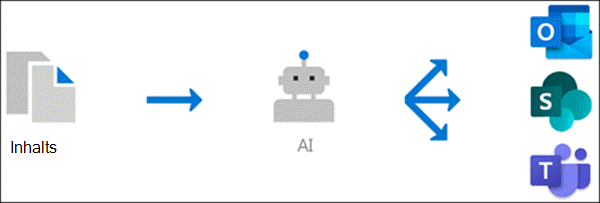

# Übersicht über Themen Erlebnisse (Vorschau)

> [!Note] 
> Der Inhalt dieses Artikels ist für Project Cortex private Preview. [Erfahren Sie mehr über Project Cortex](https://aka.ms/projectcortex).

In den Themenbereichen werden Microsoft AI-Technologie, Microsoft 365, forschen, Microsoft Graph, Suche und andere Komponenten und Dienste zum Erstellen eines Wissensnetzwerks in Ihrer Microsoft 365-Umgebung verwendet. 

      

Das Ziel besteht darin, Informationen in Wissen umzuwandeln und an Ihre Benutzer in apps, die Sie täglich verwenden, wie SharePoint-moderne Seiten und Microsoft-Suche, zuzustellen.

Thema-Erlebnisse helfen bei der Lösung eines wichtigen geschäftlichen Problems in vielen Unternehmen – bereitstellen der Informationen für die Benutzer, wenn Sie Sie benötigen. Beispielsweise müssen neue Mitarbeiter schnell eine Vielzahl neuer Informationen erlernen und auf Begriffe stoßen, über die Sie beim Lesen von Unternehmensinformationen nichts wissen. Um weitere Informationen zu erhalten, muss der Benutzer möglicherweise Schritt weg von dem, was Sie tun, und verbringen wertvolle Zeit die Suche nach Details, wie etwa Informationen über den Begriff ist, der in der Organisation ist ein Experte für Fachfragen, und vielleicht Websites und Dokumente, die sich auf den Begriff beziehen.

In den Themenbereichen wird AI verwendet, um **Themen** in Ihrer Organisation automatisch zu suchen und zu identifizieren. Es werden Informationen zu diesen kompiliert, beispielsweise eine kurze Beschreibung, Sachverständige für das Thema sowie Websites, Dateien und Seiten, die damit zusammenhängen. Ein Knowledge Manager oder ein Mitwirkender kann entscheiden, ob die Themen Informationen bei Bedarf aktualisiert werden sollen. Die Themen stehen ihren Benutzern zur Verfügung, was bedeutet, dass der Text für jede Instanz des Themas, die auf einer modernen SharePoint-Website in News und Seiten angezeigt wird, hervorgehoben wird. Benutzer können das Thema auswählen, um weitere Informationen über das Thema Details zu erhalten. Themen finden Sie auch in der SharePoint-Suche.

## Anzeigen von Themen für Benutzer

Wenn ein Thema in Inhalten auf SharePoint-News und-Seiten erwähnt wird, wird es hervorgehoben angezeigt. Sie können die Themen Zusammenfassung in der Hervorhebung öffnen. Öffnen Sie die Themen Details aus dem Titel der Zusammenfassung. Das erwähnte Thema konnte automatisch identifiziert werden oder wurde der Seite mit einem direkten Verweis auf das Thema vom Seitenautor hinzugefügt. 

      

## Wissens Indizierung

In diesem Thema werden Microsoft AI-Technologien verwendet, um **Themen** in Ihrer Microsoft 365-Umgebung zu identifizieren.

Ein Thema ist ein Ausdruck oder ein Begriff, der organisatorisch bedeutsam oder wichtig ist. Es hat eine spezifische Bedeutung für die Organisation und verfügt über Ressourcen, die dazu beitragen können, dass die Benutzer verstehen, was Sie sind, und weitere Informationen dazu finden.

Wenn ein Thema identifiziert wird und AI feststellt, dass es genügend Informationen dafür hat, dass es ein vorgeschlagenes Thema ist, wird eine **Themen Seite** dafür erstellt, die Informationen enthält, die über die Themen Indizierung gesammelt wurden, beispielsweise:

- Alternative Namen und/oder Akronyme.
- Eine kurze Beschreibung des Themas.
- Benutzer, die sich möglicherweise mit dem Thema vertraut sind.
- Dateien, Seiten und Websites im Zusammenhang mit dem Thema.

Ihre Knowledge-Administratoren können wählen, ob Sie alle SharePoint-Websites in Ihrem Mandanten nach Themen durchforsten möchten oder nur bestimmte auswählen.

## Rollen

Wenn Sie Themen Erfahrungen in Ihrer Microsoft 365-Umgebung verwenden, verfügen Ihre Benutzer über die folgenden Rollen:

- Themen Anzeige: Benutzer, die in der Lage sein werden, Themen Highlights auf modernen SharePoint-Websites anzuzeigen, auf die Sie mindestens *Lese* Zugriff haben, und in der Microsoft-Suche. Sie können Themen-Highlights auswählen, um Themen Details in Themenseiten anzuzeigen. Thema Betrachter können Feedback dazu geben, wie nützlich ein Thema für Sie ist.

- Mitwirkende: Benutzer, die Rechte zum Bearbeiten vorhandener Themen besitzen oder neue erstellen. Wissens Administratoren weisen Benutzern Benutzerberechtigungen über die Einstellungen im Thema Experiences im Microsoft 365 Admin Center zu. Beachten Sie, dass Sie auch festlegen können, dass allen Themen Benutzern die Berechtigung zum Bearbeiten und Erstellen von Themen erteilt wird, damit Sie auch zu den Themen beitragen können, die Ihnen angezeigt werden.

- Wissensmanager: Benutzer, die Themen im Thema Lifecycle durchführen. Wissensmanager verwenden die Seite **Themen verwalten** im Themen Center, um AI-vorgeschlagene Themen zu bestätigen oder zu entfernen sowie vorhandene Themen zu bearbeiten oder neue zu erstellen, und sind die einzigen Benutzer, die Zugriff darauf haben. Wissens-Admins weisen Benutzern Knowledge Manager-Berechtigungen über das Thema Erfahrungen im Admin-Center im Microsoft 365 Admin Center zu. 

- Wissens-Admins: Knowledge-Administratoren richten Themen Erfahrungen ein und verwalten diese über die admin-Steuerelemente im Microsoft 365 Admin Center. Derzeit kann ein Microsoft 365 Global-oder SharePoint-Administrator als Wissens Administrator fungieren.

Weitere Informationen finden Sie unter [Thema Experiences Roles](topic-experiences-roles.md) .

## Thema Verwaltung

Die Themen Verwaltung erfolgt auf der Seite **Themen verwalten** im **Themen Center** Ihrer Organisation. Das Themen Center wird während des Setups erstellt und dient als Ihr Wissenszentrum für Ihre Organisation. 

Während alle lizenzierten Benutzer Themen anzeigen können, mit denen Sie im Themen Center verbunden sind, können nur Benutzer mit den Berechtigungen " *Themen verwalten* " (Knowledge Manager) die Seite "Themen verwalten" anzeigen und verwenden.

Die Knowledge Manager können folgende Möglichkeiten nutzen:

- Bestätigen oder ablehnen von Themen, die in Ihrem Mandanten ermittelt wurden.
- Erstellen Sie bei Bedarf neue Themen manuell (beispielsweise, wenn nicht genügend Informationen bereitgestellt wurden, um Sie über AI zu entdecken).
- Bearbeiten vorhandener Themenseiten. 

Weitere Informationen finden Sie unter [Manage Topics in the Topic Center](manage-topics.md) .  

## Administrator Steuerelemente

Mit Administrator Steuerelementen im Microsoft 365 Admin Center können Sie Ihr Wissensnetzwerk verwalten. Sie ermöglichen einem Microsoft 365 Global-oder SharePoint-Administrator Folgendes:

- Steuern Sie, welche Benutzer in Ihrer Organisation Themen auf modernen SharePoint-Seiten oder in SharePoint-Suchergebnissen anzeigen können.
- Steuern Sie, welche SharePoint-Websites gecrawlt werden sollen, um nach Themen zu suchen.
- Konfigurieren Sie die Themen Ermittlung, um bestimmte Themen aus dem gefundenen auszuschließen.
- Steuern Sie, welche Benutzer Themen im Themen Center verwalten können.
- Steuern Sie, welche Benutzer Themen im Themen Center erstellen und bearbeiten können.
- Steuern, welcher Benutzer Themen anzeigen kann.

Weitere Informationen zu Administrator Steuerelementen finden Sie unter [assign User Permissions](https://docs.microsoft.com/microsoft-365/knowledge/plan-topic-experiences#user-permissions), [Manage Topic Visibility](https://docs.microsoft.com/microsoft-365/knowledge/topic-experiences-knowledge-rules)und [Manage Topic Discovery](https://docs.microsoft.com/microsoft-365/knowledge/topic-experiences-discovery) .

## Thema Kuration & Feedback

AI arbeitet kontinuierlich daran, Ihnen Vorschläge zur Verbesserung ihrer Themen zur Verfügung zu stellen, wenn Änderungen in Ihrer Umgebung stattfinden. 

Benutzer, denen Sie den Zugriff erlauben, Themen in ihrer täglichen Arbeit anzuzeigen, werden möglicherweise gefragt, ob das Thema hilfreich für Sie ist. AI untersucht diese Antworten und verwendet diese, um zu ermitteln, was in Themen Zusammenfassungen und Themen Details gezeigt wird.

Benutzer mit Berechtigungen zum Bearbeiten oder Erstellen von Themen können Aktualisierungen an Themenseiten direkt vornehmen, wenn Sie Korrekturen vornehmen oder zusätzliche Informationen hinzufügen möchten. 

Darüber hinaus können Benutzer mit den entsprechenden Berechtigungen Elemente wie "jammern"-Unterhaltungen, die für ein Thema relevant sind, markieren und zu einem bestimmten Thema hinzufügen. 

## Weitere Informationen:

