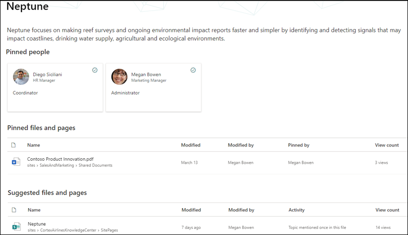

# Thema Experiences Security Trimming (Preview)Topic Experiences security trimming (Preview)

> [!Note] 
> Der Inhalt dieses Artikels ist für Project Cortex private Preview.The content in this article is for Project Cortex Private Preview. [Erfahren Sie mehr über Project Cortex](https://aka.ms/projectcortex).[Find out more about Project Cortex](https://aka.ms/projectcortex).

Thema Erlebnisse Benutzer können keine Informationen in Themen anzeigen, die durch die vorhandenen Office 365 Berechtigungen verhindert werden.Topic experiences users will not be able to view information in topics that their existing Office 365 permissions prevents them from seeing. Alle Elemente, die ein Benutzer auf einer Themen Seite sieht (beispielsweise SharePoint-Websites, Dokumente, Dateien), werden Informationen, die er bereits sehen darf.Everything a user sees on a topic page (for example, SharePoint sites, documents, files) will be information they are already allowed to see. In den Themen Erfahrungen werden keine Änderungen an vorhandenen Berechtigungen vorgenommen.Topic experiences does not make changes to any existing permissions.

## Warum zwei Benutzer möglicherweise unterschiedliche Ansichten desselben Themas habenWhy two users may have different views of the same topic

Wenn ein Thema über AI oder manuelle Kuration erstellt wird, kann es eine Beschreibung des Themas, Alternative Namen, Personen, die dem Thema zugeordnet sind, sowie Websites, Seiten und Dateien im Zusammenhang mit dem Thema enthalten.When a topic is created through AI or manual curation, it can contain a description of the topic, alternative names, people associated with the topic, as well as sites, pages, and files related to the topic. Wenn diese Informationen auf einer Themen Seite angezeigt werden, ist es möglich, dass zwei Benutzer, die dasselbe Thema anzeigen, nicht dieselben Informationen sehen.When this information is viewed on a topic page, it is possible that two users who are viewing the same topic my not see the same information.
  
Wenn beispielsweise der Benutzer 1 die Neptun-Themen Seite anzeigt, können diese möglicherweise angezeigt werden.For example, when User 1 views the Neptune topic page, this is what they might see.

   

Wenn Benutzer 2 jedoch dieselbe Neptun-Themen Seite betrachtet, unterscheidet sich Ihre Ansicht von Benutzer 1.However, when User 2 looks at the same Neptune topic page, her view differs from User 1.  Benutzer 2 kann die Produkt Übersichtsdatei der *GD-2000* im Abschnitt **fixierte Dateien und Seiten** der Seite Thema anzeigen, die nicht für Benutzer 1 angezeigt wird.User 2 is able to see the *DG-2000 Product Overview* file in the **Pinned files and pages** section of the topic page, which does not appear for User 1. 

   

Der Unterschied, was Benutzer im selben Thema sehen können, liegt daran, dass Benutzer möglicherweise nicht über die Office 365 Berechtigungen zum Anzeigen einer verwandten Website oder Datei verfügen.The difference in what users may see on the same topic is because users may not have the Office 365 permissions to view a related site or file.  Thema Experiences respektiert die Berechtigungen, die für Elemente in einem Thema festgelegt sind, und kann den Zugriff darauf nicht ändern.Topic experiences respects the permissions that are set on items in a topic, and cannot change access to them. In unserem Beispiel kann Benutzer 1 die Produkt Übersichtsdatei der *GD-2000* nicht in ihrer Themen Seite für Neptun anzeigen, da Benutzer 1 nicht über Office 365 Berechtigungen zum Anzeigen der Datei verfügt.In our example, User 1 is not able to view the *DG-2000 Product Overview* file in their topic page for Neptune because User 1 does not have Office 365 permissions to view the file.

Wenn ein Benutzer nicht in der Lage ist, genügend Informationen in einem Thema anzuzeigen, damit es nützlich ist, ist das Thema für den Benutzer nicht verfügbar.If a user is not able to see enough information in a topic for it to be useful, the topic will not be available to the user. In dieser Instanz wird dem Benutzer das markierte Thema nicht angezeigt.In this instance, the user will not see the highlighted topic. Ein anderer Benutzer, der über Berechtigungen für weitere Informationen im Thema verfügt, damit er hilfreich ist, kann das Thema jedoch sehen.However, a different user who has permissions to more information in the topic for it to be useful, will be able to see the topic.

## Thema Berechtigungen für Knowledge Manager und Thema MitwirkendeTopic permissions for knowledge managers and topic contributors

Benutzer, denen Berechtigungen zum Verwalten von Themen zugewiesen sind – Wissensmanager – können nur Informationen anzeigen, für die Sie Berechtigungen zum Anzeigen von Themen haben.Users that are assigned permissions to manage topics - knowledge managers - will only be able to view information they have permissions to see within topics.

Auf ähnliche Weise können Benutzer, die über Berechtigungen zum Erstellen und Bearbeiten von Themen verfügen – Thema Mitwirkende – nur Informationen anzeigen, für die Sie Berechtigungen zum Anzeigen von Themen haben.Similarly, users who have create and edit topic permissions - topic contributors - will only be able to view information they have permissions to see within topics. 

## AI versus manuell kuratierte Themen InformationenAI versus manually curated topic information

Themen können Informationen enthalten, die von AI generiert werden, sowie Informationen, die von Mitwirkenden oder Wissensmanagern hinzugefügt oder bearbeitet wurden.Topics can contain information generated by AI and information added or edited by topic contributors or knowledge managers.

 - Informationen in einem Thema, das von AI hinzugefügt wurde, sind nur für Personen sichtbar, die Zugriff auf den Quellinhalt haben.Information in a topic that was added by AI is only visible to people who have access to the source content.
 - Informationen, die von einem Mitwirkenden oder Wissensmanager manuell hinzugefügt oder bearbeitet wurden, sind für alle sichtbar, die das Thema sehen können.Information that has been manually added or edited by a topic contributor or knowledge manager is visible to everyone who can see the topic.

In der folgenden Tabelle wird beschrieben, was Benutzer – Thema Betrachter, Mitwirkende und Wissensmanager – in einem bestimmten Thema basierend auf Ihren Berechtigungen sehen können.The following table describes what users - topic viewers, contributors, and knowledge managers - can see in a given topic based on their permissions.

|Thema-ElementTopic item|Was Benutzer sehen könnenWhat users can see|
|:---------|:------------------|
|Name des ThemasTopic name|Benutzer können den Thema Namen aller Themen im Thema Center anzeigen.Users can see the topic name of all topics in the topic center. Einige Themen sind möglicherweise nicht sichtbar, wenn Sie eine geringe Relevanz für den Benutzer haben.Some topics may not be visible if they have a low relevancy to the user.|
|Beschreibung des ThemasTopic description|Von AI generierte Beschreibungen sind nur für Benutzer sichtbar, die über Berechtigungen für den Quellinhalt verfügen.AI-generated descriptions are visible only to users who have permissions to the source content. Manuell eingegebene oder bearbeitete Beschreibungen sind für alle Benutzer sichtbar.Manually entered or edited descriptions are visible to all users.|
|PersonenPeople|Angeheftete Personen sind für alle Benutzer sichtbar.Pinned people are visible to all users. Vorgeschlagene Personen sind nur für Benutzer sichtbar, die über Berechtigungen für den Quellinhalt verfügen.Suggested people are only visible to users who have permissions to the source content.|
|DateienFiles|Dateien sind nur für Benutzer sichtbar, die über Berechtigungen für den Quellinhalt verfügen.Files are only visible to users who have permissions to the source content.|
|SeitenPages|Seiten sind nur für Benutzer sichtbar, die über Berechtigungen für den Quellinhalt verfügen.Pages are only visible to users who have permissions to the source content.|
|WebsitesSites|Websites sind nur für Benutzer sichtbar, die über Berechtigungen für den Quellinhalt verfügen.Sites are only visible to users who have permissions to the source content.|

## Weitere Informationen:See also

