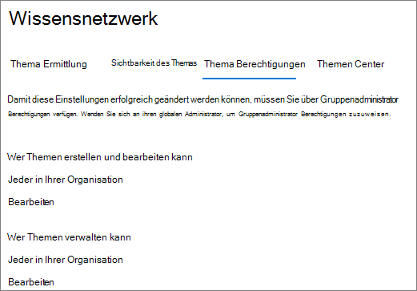
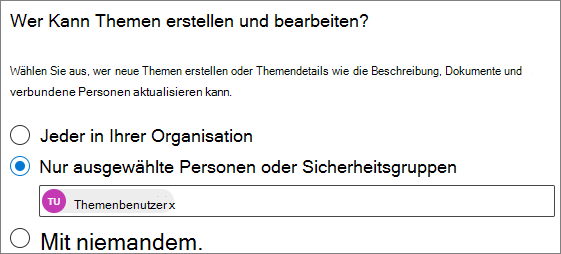
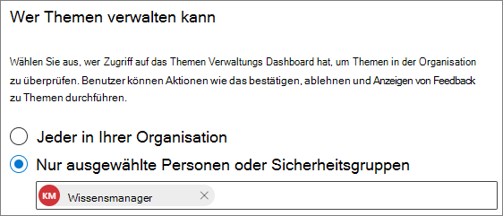

# Verwalten von Themenberechtigungen in Microsoft -ThemenManage topic permissions in Microsoft Viva Topics

Sie können Die Einstellungen für Themenberechtigungen im [Microsoft 365 Admin Center verwalten.](https://admin.microsoft.com)You can manage topic permissions settings in the [Microsoft 365 admin center](https://admin.microsoft.com). Sie müssen ein globaler Administrator oder ein SharePoint-Administrator sein, um diese Aufgaben ausführen zu können.You must be a global administrator or SharePoint administrator to perform these tasks.

Mit Den Einstellungen für Themenberechtigungen können Sie wählen:With topic permissions settings you can choose:

- Welche Benutzer Themen erstellen und bearbeiten können: Erstellen Sie neue Themen, die während der Suche nicht gefunden wurden, oder bearbeiten Sie vorhandene Themendetails.Which users can create and edit topics: Create new topics that were not found during discovery or edit existing topic details.
- Welche Benutzer Themen verwalten können: Greifen Sie auf das Themenverwaltungscenter zu, zeigen Sie Feedback zu Themen an, und verschieben Sie Themen durch den Lebenszyklus.Which users can manage topics: Access the topic management center and view feedback on topics as well as move topics through the lifecycle.

## So greifen Sie auf Die Themenverwaltungseinstellungen zu:To access topics management settings:

1. Klicken Sie im Microsoft 365 Admin Center auf **"Einstellungen"** und dann auf **"Organisationseinstellungen".**In the Microsoft 365 admin center, click **Settings**, then **Org settings**.
2. Klicken Sie **auf der** Registerkarte "Dienste" auf **"Themenerfahrungen".**On the **Services** tab, click **Topic experiences**.

     

3. Wählen Sie die Registerkarte **"Themenberechtigungen"** aus. Informationen zu den einzelnen Einstellungen finden Sie in den folgenden Abschnitten.Select the **Topic permissions** tab. See the following sections for information about each setting.

     

## Ändern der Personen, die über Berechtigungen zum Aktualisieren von Themendetails verfügenChange who has permissions to update topic details

So aktualisieren Sie, wer über Berechtigungen zum Erstellen und Bearbeiten von Themen verfügt:To update who has permissions to create and edit topics:

1. Wählen Sie **auf der Registerkarte "Themenberechtigungen"** unter "Wer kann Themen **erstellen und bearbeiten"** die Option **"Bearbeiten" aus.**On the **Topic permissions** tab, under **Who can create and edit topics**, select **Edit**.
2. Auf der **Seite "Wer kann Themen erstellen und** bearbeiten" können Sie folgende Einstellungen auswählen:On the **Who can create and edit topics** page, you can select:
    - **Jeder in Ihrer Organisation****Everyone in your organization**
    - **Nur ausgewählte Personen oder Sicherheitsgruppen****Only selected people or security groups**
    - **Niemand****No one**

      

3. Klicken Sie auf **Speichern**.Select **Save**.

So aktualisieren Sie, wer über Berechtigungen zum Verwalten von Themen verfügt:To update who has permissions to manage topics:

1. Wählen Sie **auf der Registerkarte "Themenberechtigungen"** unter **"Wer kann** Themen verwalten" die Option **"Bearbeiten" aus.**On the **Topic permissions** tab, under **Who can manage topics**, select **Edit**.
2. Auf der **Seite "Wer kann Themen verwalten"** können Sie folgende Auswählen:On the **Who can manage topics** page, you can select:
    - **Jeder in Ihrer Organisation****Everyone in your organization**
    - **Ausgewählte Personen oder Sicherheitsgruppen****Selected people or security groups**

      

3. Klicken Sie auf **Speichern**.Select **Save**.

## Siehe auchSee also

[Verwalten der Themenermittlung in Microsoft -ThemenManage topic discovery in Microsoft Viva Topics](topic-experiences-discovery.md)

[Verwalten der Sichtbarkeit von Themen in Microsoft -ThemenManage topic visibility in Microsoft Viva Topics](topic-experiences-knowledge-rules.md)

[Ändern des Namens des Themencenters in Microsoft TopicsChange the name of the topic center in Microsoft Viva Topics](topic-experiences-administration.md)
