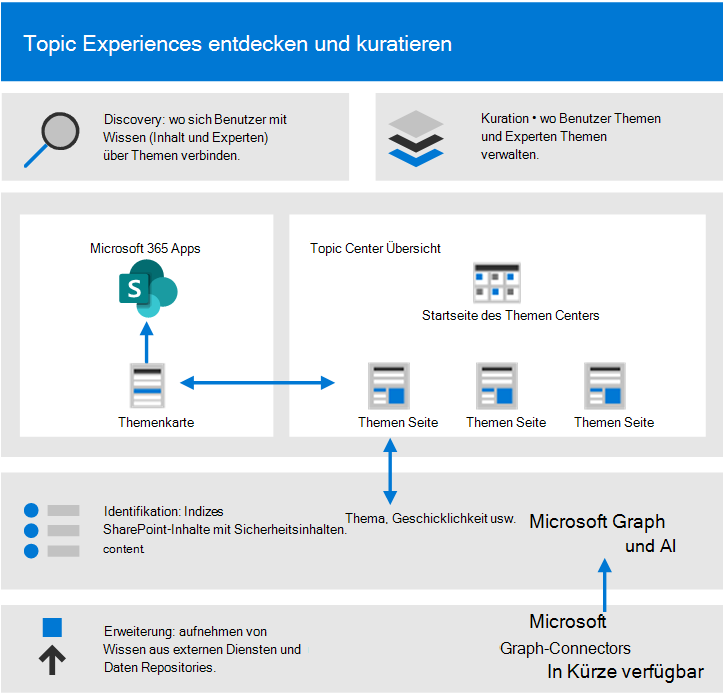
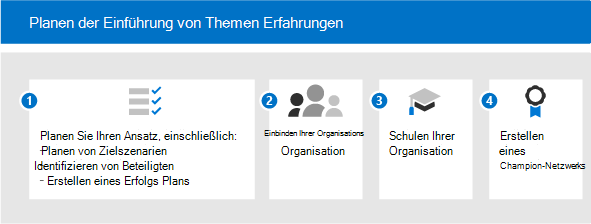
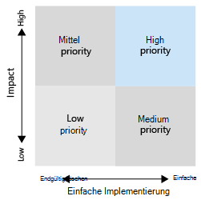

# Erste Schritte bei der Einführung von Microsoft Viva Topics

Bevor Sie mit der Einführung beginnen, müssen Sie sich mit den Konzepten des Wissensmanagements und der Themen von "Viva" klarmachen. Das folgende Diagramm zeigt, was während der Themenerkennung und -curation geschieht:

- **Discovery:** Benutzer können wissen in den Apps, die sie täglich verwenden, über Themenkarten entdecken – sie können auch Themen in Microsoft Search entdecken.
- **Curation**: Experten für Themen (Subject Matter Experts, SMEs) verfeinern Themen über Themenseiten, und KI lernt aus ihren Eingaben. The Topic Center contains topic pages that users can explore and experts can manage.
- **Identifikation**: Mit Microsoft Graph und künstlicher Intelligenz (KI) werden Kenntnisse und Personen (Themen, Fähigkeiten und so weiter) identifiziert und automatisch in verwandte Themen organisiert. SharePoint-Inhalte werden mit Sicherheitsinhalten indiziert.
- **Erweiterung**: Mit Microsoft Graph-Inhaltsconnectors (in Kürze verfügbar) können Sie Wissen aus externen Diensten und Datenrepositorys nutzen.

Weitere Informationen finden Sie in der Übersicht [für](topic-experiences-overview.md) eine Einführung.

Denken Sie daran, dass:

- Die Themenermittlung wird verbessert, wenn mehr Inhalte verfügbar sind.
- Die Sicherheit, der Datenschutz und der Speicherort Ihrer Daten bleiben erhalten, auch wenn die Informationen in einer neuen Erfahrung präsentiert werden.
- Benutzer benötigen eine Lizenz zum Anzeigen von Themen von "Viva".
- Die Ermittlung wird zunächst für englischsprachige Inhalte verwendet.

Um die Vorbereitung zu unterstützen, sollten Sie sich die folgenden Fragen überlegen:

- Welche Inhalte sollten für die Themenerkennung verwendet werden?
- Wer verwaltet Themen?
- Wem werden Themenkarten und Highlights zu sehen sein?
- Welche Themen werden erwartet?

Überprüfen Sie diese Liste der Voraussetzungen, um das Beste aus Den Themen von "Viva" zu machen:

|Produkt oder Feature |Description |
|:-------|:--------|
|SharePoint Online mit modernen SharePoint-Seiten |Das Thema Mining umfasst nur Inhalte auf SharePoint-Websites, und Themenkarten können nur auf modernen Seiten angezeigt werden.|
|Microsoft Graph |Sie können mit den Microsoft Graph-Einstellungen steuern, ob Themen von der Suche oder von Delve eingeschlossen oder ausgeschlossen werden. |

## Planen der Einführung

Um die Einführung von "Viva Topics" zu planen, müssen Sie:

1. Planen Sie Ihren Ansatz und Ihre Zielszenarien:
    - Denken Sie darüber nach, die Szenarien zu definieren und zu [priorisieren.](#target-scenarios)
    - Denken Sie an [die Beteiligten](#identify-stakeholders) und Projektteammitglieder, die Sie beteiligt haben müssen.  
    - Finden Sie heraus, welche geschäftlichen Auswirkungen Sie erzielen möchten und wie Sie den [Erfolg messen werden.](#create-a-success-plan)

2. Engagieren Sie Ihre Organisation:
    - Identifizieren Sie die Geschäftsgruppen und Geschäftsteams, die beteiligt werden müssen, und erhalten Sie eine Ausrichtung für die geplanten Szenarien.
    - Beginnen Sie zu überlegen, wie Sie einige early adopters für kritisches, frühes Feedback engagieren können, damit Sie iterieren können, um zur besten Lösung zu kommen.
    - Beginnen Sie mit dem Erstellen der Community, und überlegen Sie, wie Sie Die Themen von "Viva Topics" in Ihrer Organisation von diesen verschiedenen Gruppen verwenden können.

3. Schulen Sie Ihre Organisation: Die meisten Personen verstehen intuitiv das Konzept von Themen und wie Themenkarten relevante Informationen kompilieren und den Wert verstehen und sehen. Vielleicht möchten Sie jedoch schulungen erstellen, die auf Ihre eigene Kultur und Organisation zugeschnitten sind, um zu zeigen, wie Sie die Verwendung von "Viva Topics" wünschen. Einige Schulungsressourcen:
    - [Project Cortex Resource Center](https://aka.ms/projectcortex). Enthält Übersichten und Featureinformationen, aufgezeichnete Videos und Präsentationen zur Bürozeit sowie Informationen zu Partnern und deren Angeboten.
    - In Kürze erhalten Sie Schulungsvideos und Hilfe für Endbenutzer.

4. [Erstellen eines Championnetzwerks:](#build-a-champion-network)
    - Möglicherweise gibt es bereits Communitys von Praxis- oder Championnetzwerken. Dies sind großartige Möglichkeiten, um Peers bei der Gegenseitigen Hilfe zu unterstützen und zu evangelisieren. Und sie können Erfolgsgeschichten teilen, die wertvoll sein können. Sie können Rat und Begeisterung bieten.

### Zielszenarien

Bestimmen Sie, wie Sie "Viva Topics" in Ihrer Organisation verwenden möchten, damit Sie sie erfolgreich verwenden können. Im Folgenden finden Sie einige Szenarien, in denen Wissensverwaltung und Themen Ihrer Organisation helfen können:

- Rollen onboarding &: Grundlegendes zur Terminologie, den wichtigsten Projekten und der Kultur einer neuen Organisation sind wichtige Schritte beim Onboarding. Die einfache Suche nach Themen kann neuen Mitarbeitern dabei helfen, neue Aufgaben, Rollen oder Projekte schnell zu übernehmen.
- Suche nach Fachwissen und Informationsfreigabe: Wenn Themen verwaltet und freigegeben werden, können Personen in Ihren Organisationen leichter Informationen und Experten finden, die ihnen bei der täglichen Arbeit helfen.
- Erweiterte Entscheidungsfindung und verbesserte Markteinführungszeit: Wenn Informationen und Experten leicht zu erreichen sind, können Sie Entscheidungen einfacher treffen und Zeit von Projekten abrasieren.

#### Beispielszenario für rollen onboarding

Ein Personalmanager muss neuen Mitarbeitern Informationen bereitstellen, die ihnen dabei helfen, sich schnell in das Unternehmen und seine Teams zu integrieren. Sie möchten sie auf die richtigen Ressourcen, Dokumente und Teammitglieder verweisen, die sie schnell und effizient integrieren müssen. Sie suchen nach einer Lösung, mit der der neue Mitarbeiter schnell die benötigten Informationen finden kann, ohne in mehreren Repositorys suchen zu müssen oder die anwendungen, die er bereits verwendet hat, verlassen zu müssen.

Beispiel:

- Ein Mitarbeiter (Jordanien) übernimmt eine neue Rolle oder wurde neu eingestellt und beginnt gerade mit einer Rolle. Jordanien möchte sich so schnell wie möglich engagieren und produktiv arbeiten. Jordanien benötigt aber auch Hilfe bei der Suche nach einem Startplatz.
- Ein Kollege (Kim), der vor Jordanien in der Rolle war, hat Themenseiten erstellt, die neuen Mitarbeitern und anderen Personen helfen können, die nach diesen Informationen suchen.
- Kim war ein KMU und verfügte über berechtigungen zum Betrachten von nicht bestätigten Themenseiten. Unbestätigte Themenseiten sind hervorragende Ausgangspunkte für das, was die KI entdeckt und erstellt hat, und Kim konnte sie bearbeiten, um Expertenressourcen, Definitionen und andere Ressourcen anheften zu können.
- Während Jordan einen neuen Beitrag auf SharePoint durch liest, wird ein Thema hervorgehoben und der Mauszeiger darüber bewegt, um schnell eine Definition des Begriffs zu erhalten und mit wem sie mit weiteren Fragen kontaktiert werden können. Zuvor musste Jordanien möglicherweise nach diesen Informationen fahnden und Kollegen kontaktieren, um zu sehen, wer nach etwas fragen soll.
- Die Enignung dieser Informationen über Themen kann sehr leistungsfähig sein, da diese Informationen zwar zuvor verfügbar waren, sie aber möglicherweise isoliert und schwer zu finden waren. Die Einbindung in die Von Jordan verwendeten Anwendungen und die Unterstützung bei der Suche nach diesen Experten können auch ein Gefühl von Engagement und Community fördern. Es kann ihnen auch helfen, sich im Umgang mit der neuen Rolle stärker zu fühlen.

Wenn Sie dieses Szenario automatisieren, können Sie sicherstellen, dass:

- Neue Mitarbeiter können sich schnell mit den richtigen Personen in den richtigen Projekten verbinden.
- Neue Mitarbeiter haben unmittelbaren Zugriff auf die neuesten Projektinformationen innerhalb des Arbeitsflusses.
- Die Suchzeiten werden erheblich reduziert.
- Die Onboardingzeiten sind erheblich reduziert.

#### Beispielszenario für Kundenanrufcenter

Sie können es dem Kundendienst ermöglichen, schnell Dateien und Experten zu finden, um bei ungewöhnlichen Steuerfragen zu helfen und die Antwort für andere schnell zu dokumentieren, um mit "Viva Topics" auf einfache Weise zugreifen zu können.

Beispielsweise muss ein Supportmitarbeiter schnell Knowledge Base-Artikel, Dokumente und Richtlinien finden, damit er Kunden unterstützen kann. Sie möchten die richtigen Informationen zum richtigen Zeitpunkt finden, ohne mehrere Datenbanken, Repositorys oder Anwendungen manuell durchsaugen oder einen Anruf versenden zu müssen. Und sie suchen nach einer Lösung, die es ihnen ermöglicht, innerhalb ihrer Hauptanrufanruf- und Zugriffsrichtlinien, -vorschriften und -richtlinien im Fluss ihrer Unterhaltungen zu bleiben, damit sie schnell auf Fragen antworten und den Fall aktualisieren können.

Wenn Sie dieses Szenario mit "Viva Topics" automatisieren, können Sie sicherstellen, dass:

- Supportanrufzeiten werden reduziert.
- Eskalationen auf die Unterstützung der 2. und 3. Ebene werden reduziert.
- Die Anzahl der Rückrufe für einen bestimmten Fall wird reduziert.
- Die Kundenzufriedenheit wird erhöht.

#### Priorisieren Ihrer Szenarien

Nachdem Sie Ihre Szenarien identifiziert haben, können Sie die Folgenden priorisieren:

Eine Möglichkeit, sie zu priorisieren, besteht in der Darstellung Ihrer Szenarien in einem Raster, das Auswirkungen im Vergleich zur einfacheren Implementierung zeigt. Suchen Sie nach Szenarien, die sowohl hohe Auswirkungen haben als auch einfach zu implementieren sind und diese zu Ihrer obersten Priorität machen. Niedrige Auswirkungen und schwer zu implementierende Szenarien haben die niedrigste Priorität. Wenn Sie einen schnellen Gewinn mit einem szenario mit hoher Auswirkung und einfach zu implementieren haben, hilft es den Menschen, sich zu begeistern und die Möglichkeiten der Verwendung von Themen zu sehen.

Wählen Sie einige wichtige Szenarien aus, auf die Sie sich zunächst konzentrieren können, arbeiten Sie mit Ihren early Adopters zusammen, um Feedback zu erhalten, und nehmen Sie dann phasenweise den Rollout vor. Auf diese Weise können Sie iterieren, Verbesserungen erzielen und Feedback erhalten, damit Sie die Akzeptanz im Laufe der Zeit verbessern können.

### Bestimmen der Beteiligten

Identifizieren Sie die Projektbeteiligten. Die Wichtigsten Rollen sind der Hauptsponsor, der Besitzer des Erfolgs und Champions.

|Rolle |Responsibilities |Abteilung |
|:-------|:-------|:--------|
| Executive Sponsor(s)   | Kommunizieren von Visionen und Werten auf hoher Ebene für das Unternehmen   |  Führungsspitze   |
| Projektleiter | Überwachen des gesamten Startausführungs- und Rolloutprozesses | Projektmanagement |
| Wissensadministratoren| Einrichten und Konfigurieren von "Viva Topics" | IT-Abteilung |
| Wissensmanager | Verwalten von Themen und Überwachen der Taxonomie | Jede Abteilung |
| Taxonomiemanager | Überwachen der Taxonomie | Jede Abteilung |
| Experten und Mitwirkende von Themen | Generieren oder Überprüfen von Themen und Beschreibungen | Jede Abteilung |
| Experten | Hilfe bei der Evangelisierung und Verwaltung der Behandlung von Einwand | Jede Abteilung (Mitarbeiter) |
| Mandantenadministrator | Konfigurieren von Einstellungen auf Mandantenebene | IT-Abteilung |
| Power Platform-Administrator| Konfigurieren einer allgemeinen Data Services-Umgebung | IT-Abteilung |
| Suchadministrator oder -manager | Konfigurieren von Sucheinstellungen | IT-Abteilung |

In einer größeren Organisation haben Sie möglicherweise auch mehrere Personen in diesen Rollen, und Sie müssen die Koordination zwischen ihnen vordrangen. In einem kleineren Unternehmen kann eine einzelne Person mehrere dieser Rollen ausführen. Unterschiedliche Rollen können in verschiedenen Phasen des Projekts stärker einbezogen werden. Beispielsweise sind Mandantenadministratoren stärker an der Einrichtung der Features beteiligt, während Experten für Themen und Champions erst mit der Definition von Themen beginnen.
 
Obwohl wir empfehlen, dass jede dieser Rollen während ihres Rollouts erfüllt wird, müssen Sie möglicherweise nicht alle rollen, um mit Ihrer identifizierten Lösung zu beginnen.

### Erstellen eines Erfolgsplans

Verwenden Sie diese Indikatoren, um den Erfolg von "Viva Topics" in Ihrer Organisation zu messen. Schau auf:

1. Verwendung des Themas:
      - Themenaufrufe
      - Anzahl der Themen – sowohl bestätigt als auch unbestätigt in der Liste der kuratierten Themen.
      - Anzahl der veröffentlichten Themenseiten.
1. Endbenutzerfeedback von Themenkarten.
1. Durchführen von Umfragen zur Mitarbeiterzufriedenheit. "Viva Topics" sollte die Fähigkeit der Mitarbeiter verbessern, Informationen zu finden, sodass Sie Möglichkeiten finden, ihre Eingaben und Ihr Feedback zu dieser Erfahrung zu sammeln.
1. Positive Auswirkungen auf die Suchanalyse. Da Themen in der Sucherfahrung angezeigt werden, kann es im Laufe der Zeit zu niedrigeren Raten von abgebrochenen Suchen kommen, da Personen leichter in der Lage sind, die Themen in der Suche zu finden. 

### Erstellen eines Championnetzwerks

Erstellen Sie ein Championnetzwerk in Ihrer Organisation. Champions sind wichtig, da sie:

- Erstellen eines Einflusskreises innerhalb ihrer Teams
- Laufwerksthemaverwaltung & Wartung

Sie können Champions aus unterschiedlichen Rollen rekrutieren – Wissensmanager und Experten für Themen.

Viele Championnetzwerke verwenden Yammer als Plattform. In Yammer können Personen Fragen stellen, Antworten erhalten und Erfolgsgeschichten teilen. Es ist schwierig, das Wort allein zu verwenden, sodass Sie sich auf das Netzwerk von Personen in Ihrem Unternehmen verlassen können, um ihren Kollegen Ratschläge zu geben und zu zeigen, wie ihr Team "Viva Topics" verwendet, damit andere Teams sich eigene Szenarien überlegen können.

Einige Organisationen verwenden Hackathons (formal oder informell, virtuell oder persönlich), um Gruppen von Personen für die Arbeit an einem bestimmten Projekt zu sammeln. Beispielsweise könnten Sie Ihre Experten für Themen sammeln und diese zusammen an der Härtung einer Reihe von Themenseiten arbeiten lassen.

Überlegen Sie, wie Sie Ihre Champions erkennen können. Belohnen Sie ihre Aktivitäten, geben Sie ihnen eine gewisse Anerkennung, und generieren Sie ein sichtbares Community-Gefühl und Engagement, damit sie das Gefühl haben, dass sie zu etwas beitragen, und sie erhalten auch etwas von ihren Investitionen zurück.

Jetzt, da Sie bereit sind, ein Rollout zu erstellen, möchten Sie sicherstellen, dass Sie kontinuierliches Engagement fördern.

- Verwalten Sie aktive Yammer Gruppen für Ihre Champions.
- Teilen Sie Erfolgsgeschichten.
- Hosten Sie regelmäßig Engagement-Ereignisse, um Storys zu teilen oder neue Features einzuführen.
- Stellen Sie Herausforderungen für Personen ein, und führen Sie Wettbewerbe aus.

## Nächste Schritte

Wenn Sie bereit sind, Die Themen von "Viva" auf den Weg zu machen, müssen Sie die Beteiligten an der Einführung beteiligen.

- Beginnen Sie mit der Einführung des Featuresets, und machen Sie sich Gedanken über ihre Szenarien.
- Sammeln Sie die Beteiligten, und erstellen Sie Szenarien.
- Führen Sie die Community aus, und überlegen Sie, wie Sie sie engagieren werden.
- Führen Sie dann die Vorbereitungsschritte aus. Einige sind möglicherweise technische Bereitschaft und einige Geschäftsbereitschaft.
- Schließlich socialize and promote.
