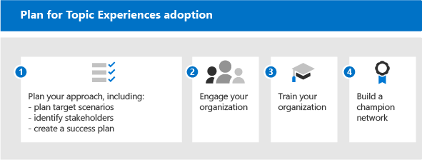

# Erste Schritte bei der Einführung von Microsoft -Themen

Bevor Sie mit der Einführung beginnen, müssen Sie sich mit den Konzepten im Umgang mit Wissensmanagement und Themen im Thema "Themen" aus der Erfahrung machen. Das folgende Diagramm zeigt, was während der Themenerkennung und -curation geschieht:

- **Ermittlung:** Benutzer können Wissen in den Apps, die sie täglich verwenden, über Themenkarten entdecken – sie können auch Themen in Microsoft Search entdecken.
- **Curation:** Experten (Subject Matter Experts, SMEs) verfeinern Themen über Themenseiten, und KI lernt aus ihren Beiträgen. Das Themencenter enthält Themenseiten, die Benutzer erkunden und von Experten verwalten können.
- **Identifikation:** Mit Microsoft Graph und Künstlicher Intelligenz (AI) werden Wissen und Personen (Themen, Fertigkeiten und so weiter) identifiziert und automatisch in verwandten Themen organisiert. SharePoint-Inhalte werden mit Sicherheitsinhalten indiziert.
- **Erweiterung:** Mit Microsoft Graph-Inhaltsconnectors (in Kürze verfügbar) können Sie Wissen aus externen Diensten und Datenrepositorys nutzen.

Weitere Informationen finden Sie in der [Übersicht für](topic-experiences-overview.md) eine Einführung.

Beachten Sie, dass:

- Die Themenermittlung wird verbessert, wenn mehr Inhalte verfügbar sind.
- Die Sicherheit, der Datenschutz und der Speicherort Ihrer Daten bleiben erhalten, obwohl die Informationen in einer neuen Besensung präsentiert werden.
- Benutzer benötigen eine Lizenz zum Anzeigen von Themen.
- Die Ermittlung wird zunächst für englischsprachige Inhalte verwendet.

Um die Vorbereitung zu unterstützen, sollten Sie sich die folgenden Fragen durchdingen:

- Welche Inhalte sollten für die Themenermittlung verwendet werden?
- Wer verwaltet Themen?
- Wer wird Themenkarten und Highlights sehen?
- Welche Themen werden erwartet?

Sehen Sie sich diese Liste der Voraussetzungen an, damit Sie die Themen von Sichten am besten aus der Übersicht machen können:

|Produkt oder Feature |Beschreibung |
|:-------|:--------|
|SharePoint Online mit modernen SharePoint-Seiten |Das ThemaMining umfasst nur Inhalte auf SharePoint-Websites, und Themenkarten können nur auf modernen Seiten angezeigt werden.|
|Microsoft Graph |Sie können mit den Microsoft Graph-Einstellungen steuern, ob Themen in die Suche oder delve aufgenommen oder von dieser ausgeschlossen werden. |

## Planen der Einführung

Zum Planen der Einführung von "Topics" müssen Sie folgende Punkte einplanen:

1. Planen Sie Den Ansatz und die Zielszenarien:
    - Denken Sie darüber nach, die Szenarien zu definieren und zu [priorisieren.](#target-scenarios)
    - Denken Sie an die [Projektbeteiligten](#identify-stakeholders) und Projektteammitglieder, die Sie benötigen.  
    - Erfahren Sie, welche geschäftlichen Auswirkungen Sie erzielen möchten und wie Sie den [Erfolg messen werden.](#create-a-success-plan)

2. Interagieren Sie Mit Ihrer Organisation:
    - Identifizieren Sie die Geschäftsbereichen und Geschäftsteams, die beteiligt sein müssen, und ermitteln Sie die Ausrichtung in diesen und den szenarien, die Sie planen.
    - Denken Sie darüber nach, wie Sie einige Early Adopter für ein kritisches, frühes Feedback engagieren können, damit Sie die beste Lösung finden können.
    - Beginnen Sie mit dem Erstellen der Community, und überlegen Sie, wie Themen in Ihrer Organisation von diesen verschiedenen Gruppen verwendet werden können.

3. Schulen Sie Ihre Organisation: Die meisten Benutzer verstehen intuitiv das Konzept von Themen und wie Themenkarten relevante Informationen kompilieren und den Wert verstehen und sehen. Vielleicht möchten Sie aber schulungen erstellen, die auf Ihre eigene Kultur und Organisation zugeschnitten sind, um zu zeigen, wie Themen verwendet werden sollen. Einige Schulungsressourcen:
    - [Project Cortex Resource Center](https://aka.ms/projectcortex). Enthält Übersichten und Featureinformationen, aufgezeichnete Videos und Präsentationen zur Bürozeit sowie Informationen zu Partnern und ihren Angeboten.
    - In Kürze werden Schulungsvideos und Hilfe für Endbenutzer zur Verfügung stellen.

4. [Erstellen Sie ein Champion-Netzwerk:](#build-a-champion-network)
    - Möglicherweise verfügen Sie bereits über Communitys von Praxis- oder Championsnetzwerken. Dies sind großartige Möglichkeiten, um soziale Netzwerke zu isieren und zu besennen und Gleichgesinnte an der gegenseitigen Hilfe zu beteiligen. Und sie können Erfolgsgeschichten teilen, die wirklich hilfreich sein können. Sie können Ratschläge anbieten und Begeisterung erzeugen.

### Zielszenarien

Sie müssen bestimmen, wie Sie Themen in Ihrer Organisation verwenden möchten, bevor Sie mit Themen erfolgreich sein können. Hier sind einige Szenarien, in denen Wissensverwaltung und Themen Ihrer Organisation helfen können:

- Rollen-&-Schulung: Das Verständnis der Terminologie, der wichtigsten Projekte und der Kultur einer neuen Organisation sind wichtige Schritte beim Onboarding. Die einfache Suche nach Themen kann neuen Mitarbeitern dabei helfen, schnell mit neuen Positionen, Rollen oder Projekten zu arbeiten.
- Suche nach Fachwissen und Gemeinsame Nutzung von Informationen: Wenn Themen verwaltet und freigegeben werden, können Personen in Ihren Organisationen leichter Informationen und Experten finden, die ihnen bei ihrer täglichen Arbeit helfen.
- Erweiterte Entscheidungsfindung und verbesserte Markteinführungszeit: Wenn Informationen und Experten leicht zu erreichen sind, können Sie Entscheidungen einfacher treffen und Zeit für Projekte schattieren.

Hier ist beispielsweise ein Szenario für das Rollen-Onboarding:

- Ein Mitarbeiter (Jordanien) übernimmt eine neue Rolle oder wurde neu eingestellt und beginnt gerade mit einer Rolle. Jordanien möchte sich so schnell wie möglich einmischen und produktiv arbeiten. Aber Jordanien benötigt auch Hilfe bei der Suche nach einem Ausgangspunkt.
- Eine Kollegein (Kim), die in der Rolle war, bevor Jordanien Themenseiten erstellt hat, die neue Mitarbeiter und alle anderen Personen unterstützen können, die nach diesen Informationen suchen.
- Kim war ein MITTELSTAND und verfügte über berechtigungen zum Betrachten nicht bestätigter Themenseiten. Nicht bestätigte Themenseiten sind hervorragende Ausgangspunkte für das, was die KI entdeckt und erstellt hat, und Kim konnte sie bearbeiten, um Expertenressourcen, Definitionen und andere Ressourcen hinzuzufügen.
- Während Jordanien einen neuen Beitrag auf SharePoint durchlesen kann, wird ein Thema hervorgehoben und mit der Maus darüber bewegt, um schnell eine Definition des Begriffs zu erhalten und mit wem sie sich mit weiteren Fragen in Verbindung setzen können. Zuvor hatte Jordanien möglicherweise nach diesen Informationen gejagt und sich mit Kollegen in Verbindung setzen müssen, um zu sehen, wer etwas fragen sollte.
- Die Enignung dieser Informationen über Themen kann sehr leistungsfähig sein, da diese Informationen zwar zuvor verfügbar waren, aber möglicherweise isoliert und schwer zu finden waren. Die Einbindung in die Von Jordanien verwendeten Anwendungen und die Unterstützung dieser Experten können ebenfalls ein Gefühl des Engagements und der Community fördern. Es kann ihnen auch helfen, sich im Umgang mit der neuen Rolle befähigt zu fühlen.

Nachdem Sie Ihre Szenarien identifiziert haben, können Sie die Szenarien priorisieren:

Eine Möglichkeit, diese zu priorisieren, besteht in der Darstellung Ihrer Szenarien in einem Raster mit Auswirkungen und einfacher Implementierung. Suchen Sie nach Szenarien mit hohen Auswirkungen, die einfach zu implementieren sind, und machen Sie diese zu Ihrer obersten Priorität. Szenarien mit geringen Auswirkungen und schwer zu implementierende Szenarien haben die niedrigste Priorität. Wenn Sie einen schnellen Gewinn mit einem leistungsstarken, einfach zu implementierende Szenario haben, hilft es Ihnen, sich zu freuen und die Möglichkeiten der Verwendung von Themen zu sehen.

Wählen Sie einige wichtige Szenarien aus, auf die Sie sich zunächst konzentrieren sollten, arbeiten Sie mit Ihren Early Adoptern zusammen, um Feedback zu erhalten, und setzen Sie den Rollout dann in Phasen durch. Auf diese Weise können Sie iterieren, Verbesserungen vorzunehmen und Feedback zu erhalten, damit Sie die Akzeptanz im Laufe der Zeit wachsen können. 

### Bestimmen der Beteiligten

Identifizieren Sie die Projektbeteiligten. Die wichtigsten Rollen sind der Hauptsponsor, der Besitzer des Erfolgs und Champions.

|Rolle |Responsibilities |Abteilung |
|:-------|:-------|:--------|
| Geschäftsleitungssponsor(en)   | Kommunizieren von visionären Und Werten auf hoher Ebene für das Unternehmen   |  Führungskräfte   |
| Projektleiter | Überwachen des gesamten Startausführungs- und Rolloutprozesses | Projektmanagement |
| Wissensadministratoren| Einrichten und Konfigurieren von "Themen" | IT-Abteilung |
| Wissensmanager | Verwalten von Themen und Überwachen der Taxonomie | Jede Abteilung |
| Taxonomiemanager | Überwachen der Taxonomie | Jede Abteilung |
| Experten und Themen mitwirkende Themen | Generieren oder Überprüfen von Themen und Beschreibungen | Jede Abteilung |
| Experten | Unterstützung bei der Verankündigung und Verwaltung der Behandlung von Ablehnungen | Jede Abteilung (Mitarbeiter) |
| Mandantenadministrator | Konfigurieren von Einstellungen auf Mandantenebene | IT-Abteilung |
| Power Platform-Administrator| Konfigurieren einer allgemeinen Datendiensteumgebung | IT-Abteilung |
| Suchadministrator oder -manager | Konfigurieren von Sucheinstellungen | IT-Abteilung |

In einer größeren Organisation sind möglicherweise auch mehrere Personen in diesen Rollen, und Sie müssen die Koordination untereinander verbessern. In einem kleineren Unternehmen kann eine einzelne Person mehrere dieser Rollen ausführen. Unterschiedliche Rollen sind in verschiedenen Phasen des Projekts möglicherweise stärker beteiligt. Mandantenadministratoren sind beispielsweise stärker an der Einrichtung der Features beteiligt, während Experten und Experten erst mit der Definition von Themen beginnen.
 
Obwohl wir empfehlen, jede dieser Rollen während des Rollouts zu erfüllen, stellen Sie möglicherweise fest, dass Sie nicht alle für die ersten Schritte mit Ihrer identifizierten Lösung benötigen.

### Erstellen eines Erfolgsplans

Verwenden Sie diese Indikatoren, um den Erfolg von Topics in Ihrer Organisation zu messen. Schau auf:

1. Verwendung des Themas:
      - Themenaufrufe
      - Anzahl der Themen – sowohl bestätigt als auch nicht bestätigt in der Liste der behandelten Themen.
      - Anzahl der veröffentlichten Themenseiten.
1. Endbenutzerfeedback von Themenkarten.
1. Durchführen von Umfragen zur Mitarbeiterzufriedenheit. Themen sollten die Fähigkeit der Mitarbeiter verbessern, Informationen zu finden, sodass Sie Möglichkeiten finden, ihre Input und Ihr Feedback zu dieser Erfahrung zu sammeln.
1. Positive Auswirkungen auf die Suchanalyse. Da Themen in der Sucherfahrung angezeigt werden, werden im Laufe der Zeit möglicherweise niedrigere Raten abgebrochener Suchen angezeigt, da Benutzer die Themen einfacher in der Suche finden können. 

### Erstellen eines Championnetzwerks

Erstellen Sie ein Championnetzwerk in Ihrer Organisation. Champions sind wichtig, da sie:

- Erstellen eines Kreises von Einfluss innerhalb ihrer Teams
- Laufwerk zur Themenverwaltung & Wartung

Sie können Experten aus unterschiedlichen Rollen rekrutieren – Knowledge Manager und Experten.

Viele Championnetzwerke verwenden Yammer als Plattform. In Yammer können Personen Fragen stellen und Antworten erhalten und Erfolgsgeschichten teilen. Es ist schwierig, das Wort allein zu verwenden, sodass Sie sich auf das Netzwerk von Personen in Ihrem Unternehmen verlassen können, um Ihren Kollegen Ratschläge zu geben und zu zeigen, wie ihr Team "Themen" verwendet, damit andere Teams ihre eigenen Szenarien ins Blick nehmen können.

Einige Organisationen verwenden Hackathons (formell oder informell, virtuell oder persönlich), um Gruppen von Personen zu sammeln, um an einem bestimmten Projekt zu arbeiten. Beispielsweise könnten Sie Ihre Fachexperten zusammenbringen und diese zusammen an der Härtung einer Reihe von Themenseiten arbeiten lassen.

Überlegen Sie, wie Sie Ihre Champions erkennen können. Belohnen Sie ihre Aktivitäten, geben Sie ihnen eine gewisse Anerkennung, und generieren Sie ein sichtbares Community-Gefühl und Engagement, sodass sie das Gefühl haben, zu etwas beizutragen, und sie erhalten auch etwas von ihren Investitionen zurück.

Nun, da Sie bereit für die Einführung sind, möchten Sie sicherstellen, dass Sie kontinuierliches Engagement fördern.

- Verwalten Sie aktive Yammer Gruppen für Ihre Champions.
- Teilen von Erfolgsgeschichten.
- Hosten Sie in regelmäßigen Abständen Engagementereignisse, um Geschichten zu teilen oder neue Features einzuführen.
- Stellen Sie Herausforderungen für Personen und führen Sie Wettbewerbe aus.

## Nächste Schritte

Wenn Sie zum Rollout von "Themen" bereit sind, müssen Sie die Beteiligten an der Einführung beteiligen.

- Beginnen Sie mit der Einführung der Feature-Gruppe, und machen Sie sich Gedanken über ihre Szenarien.
- Sammeln Sie die Beteiligten, und erstellen Sie Szenarien.
- Machen Sie sich gedanken darüber, wie Sie die Community erreichen möchten.
- Führen Sie dann die Vorbereitungsschritte aus. Einige sind möglicherweise technische Bereitschaft und einige Geschäftsbereitschaft.
- Zum Schluss socialisieren und bewerben.
