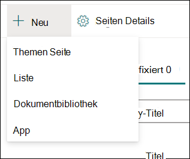
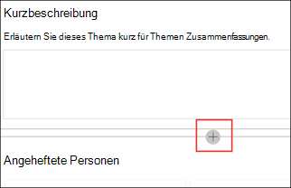

# Arbeiten mit Themen im Themen Center (Vorschau)

> [!Note] 
> Der Inhalt dieses Artikels ist für Project Cortex private Preview. [Erfahren Sie mehr über Project Cortex](https://aka.ms/projectcortex).

Im Themen Center kann ein Wissensmanager Themen überprüfen, die in den von Ihnen angegebenen SharePoint-Quell Standorten abgebaut und erkannt wurden, und Sie können Sie entweder bestätigen oder ablehnen. Ein Knowledge Manager kann auch neue Themenseiten erstellen und veröffentlichen, wenn diese nicht in der Themen Erkennung gefunden wurden, oder vorhandene bearbeiten, wenn Sie aktualisiert werden müssen.

## Anforderungen

Um im Themen Center arbeiten zu können, müssen Sie über die erforderlichen Berechtigungen verfügen. Ihr Administrator kann Sie während des [Knowledge Management-Setups](set-up-knowledge-network.md)hinzufügen, oder anschließend können neue Benutzer [hinzugefügt](give-user-permissions-to-the-topic-center.md)werden.

Topic Center Benutzer können zwei Berechtigungssätze erhalten:

- Themen erstellen und bearbeiten: neue Themen erstellen oder Themen Inhalte wie Beschreibung, Dokumente und zugehörige Personen aktualisieren.

- Themen verwalten: Verwenden Sie das Themen Verwaltungs Dashboard, um Themen in der gesamten Organisation zu überprüfen. Benutzer können Aktionen wie Themen bestätigen und ablehnen ausführen.

## Überprüfen der vorgeschlagenen Themen

Auf der Startseite des Themen Centers werden Themen, die in den angegebenen SharePoint-Quellspeicherorten ermittelt wurden, auf der Registerkarte **vorgeschlagen** aufgeführt. Ein Benutzer mit Berechtigungen zum Verwalten von Themen kann unbestätigte Themen überprüfen und auswählen, ob diese bestätigt oder abgelehnt werden sollen.

So überprüfen Sie ein vorgeschlagenes Thema:

1. Wählen Sie auf der Registerkarte **vorgeschlagen** das Thema aus, um die Themen Seite zu öffnen. 

2. Lesen Sie auf der Seite Thema die Seite Thema, und wählen Sie **Bearbeiten** aus, wenn Sie Änderungen an der Seite vornehmen müssen.

3. Auf der Knowledge Center-Startseite für das ausgewählte Thema können Sie Folgendes tun:

    1. Aktivieren Sie das Kontrollkästchen, um zu bestätigen, dass Sie das Thema beibehalten möchten.
    
    1. Wählen Sie das **x** aus, wenn Sie das Thema ablehnen möchten.

    Bestätigte Themen werden aus der **unbestätigten** Liste entfernt und werden jetzt auf der Registerkarte **bestätigt** angezeigt.

    Abgelehnte Themen werden aus der **unbestätigten** Liste entfernt und werden nun auf der Registerkarte **abgelehnt oder ausgeschlossen** angezeigt.

## Überprüfen der bestätigten Themen

Auf der Startseite des Themen Centers werden Themen, die in ihren angegebenen SharePoint-Quell Standorten ermittelt wurden und von einem Knowledge Manager oder Crowdsourcing bestätigt wurden, durch 2 oder mehr Personen über den Kartenfeedback Mechanismus bestätigt, auf der Registerkarte **bestätigt** angezeigt. Ein Benutzer mit Berechtigungen zum Verwalten von Themen kann bestätigte Themen überprüfen und auswählen, Sie abzulehnen.

So überprüfen Sie ein bestätigtes Thema:

1. Wählen Sie auf der Registerkarte **bestätigt** das Thema aus, um die Themen Seite zu öffnen. 

2. Lesen Sie auf der Seite Thema die Seite Thema, und wählen Sie **Bearbeiten** aus, wenn Sie Änderungen an der Seite vornehmen müssen.

3. Sie können Sie auch ablehnen.

## Überprüfen veröffentlichter Themen
Veröffentlichte Themen wurden bearbeitet, sodass speific-Informationen immer angezeigt werden, wer auf die Seite stößt. Manuell erstellte Themen werden hier angezeigt.

   
## Erstellen eines neuen Themas

Ein Benutzer mit Berechtigungen zum Erstellen oder Bearbeiten von Themen kann bei Bedarf ein neues Thema erstellen. Dies ist möglicherweise erforderlich, wenn das Thema nicht durch Discovery erkannt wurde oder wenn die AI-Technologie nicht genügend Beweise gefunden hat, um Sie als Thema zu etablieren.

So erstellen Sie ein neues Thema:

1. Wählen Sie auf der Seite Topic Center die Option **neu** und dann **Themen Seite** aus.

    

2. Auf der Seite Neues Thema können Sie die Informationen zur neuen Thema Vorlage eingeben:

    1. Geben Sie im Abschnitt **Name dieses Themas** den Namen des neuen Themas ein.
    
    1. Geben Sie im Abschnitt **Alternative Namen** Namen oder Akronyme ein, die auch zum besprechen des Themas verwendet werden.
    
    1. Geben Sie im Abschnitt **kurze Beschreibung** eine Beschreibung des Themas ein oder zwei Sätze ein. Dieser Text wird für die zugeordnete Themenkarte verwendet.
    
    1. Geben Sie im Abschnitt **Personen** die Namen der Experten für Sachverständige für das Thema ein.
    
    1. Wählen Sie im Abschnitt **Dateien und Seiten** die Option **Hinzufügen** aus, und wählen Sie dann auf der nächsten Seite zugeordnete OneDrive-Dateien oder SharePoint Online Seiten aus.
    
    1. Wählen Sie im Abschnitt **Websites** die Option **Hinzufügen** aus. Wählen Sie im Bereich  **Websites** , der angezeigt wird, die Websites aus, die dem Thema zugeordnet sind.

    
    
3. Wenn Sie der Seite weitere Komponenten hinzufügen müssen, wie Text, Bilder, Webparts, Links usw., wählen Sie das Canvas-Symbol in der Mitte der Seite aus, um Sie zu suchen und hinzuzufügen.

    

4. Wenn Sie fertig sind, wählen Sie **veröffentlichen** aus, um die Seite Thema zu veröffentlichen. Veröffentlichte Themenseiten werden auf der Registerkarte **Seiten** angezeigt.

> [!Note] 
> Die neue Themen Seite besteht aus Webparts, die *Knowledge Network-fähig* sind. Dies bedeutet, dass, wenn AI mehr Informationen zum Thema sammelt, die Informationen in diesen Webparts mit Vorschlägen aktualisiert werden, um die Seite für Benutzer nützlicher zu machen.

## Bearbeiten einer vorhandenen Themen Seite

Vorhandene Themenseiten befinden sich auf der Seite **Seiten** . 

1. Wählen Sie auf der Seite Themen Center die Option **Seiten** aus.

2. Auf der Seite **Seiten** wird eine Liste der Themenseiten angezeigt. Verwenden Sie das Suchfeld, um die Themen Seite zu finden, die Sie aktualisieren möchten. Klicken Sie auf den Namen der Themen Seite, die Sie bearbeiten möchten.

3. Wählen Sie auf der Seite Thema die Option **Bearbeiten** aus.

4. Nehmen Sie die erforderlichen Änderungen an der Seite vor. Dies umfasst Aktualisierungen für die folgenden Felder:

    1. Alternative Namen
    1. Beschreibung
    1. Personen
    1. Dateien und Seiten
    1. Websites
    1. Sie können der Seite auch statische Elemente hinzufügen, beispielsweise Text, Bilder oder Links, indem Sie das Canvas-Symbol auswählen.

5. Wählen Sie **erneut veröffentlichen** aus, um die Änderungen zu speichern.

<!--## See also-->

