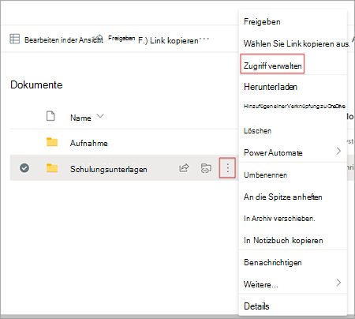
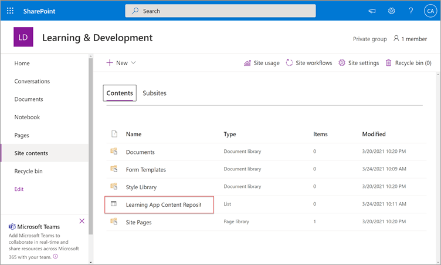
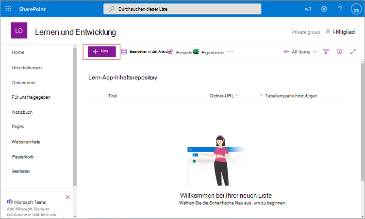
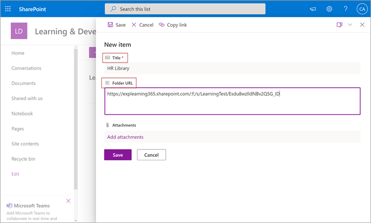
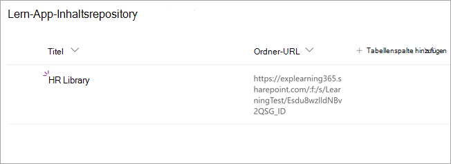
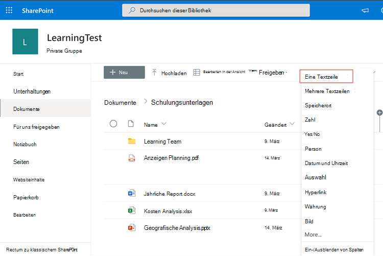
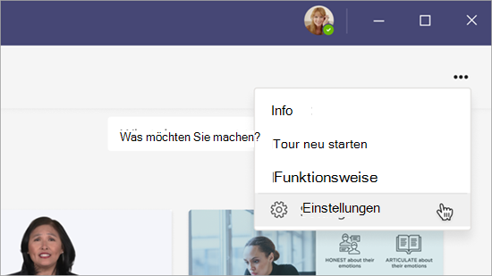

# In Kürze: Konfigurieren von SharePoint als Lerninhaltsquelle für Microsoft Viva Learning (Vorschau)

> [!NOTE]
> Die Informationen in diesem Artikel beziehen sich auf ein Vorschauprodukt, das möglicherweise erheblich geändert wird, bevor es kommerziell veröffentlicht wird. 

Sie können SharePoint als Lerninhaltsquelle konfigurieren, um die eigenen Inhalte Ihrer Organisation in Viva Learning (Vorschau) verfügbar zu machen.

## Übersicht

Der Wissensadministrator (oder globaler Administrator) stellt eine Website-URL zur Verfügung, zu der der Lerndienst einen leeren zentralen Speicherort – das Lern-App-Inhaltsrepository – in Form einer strukturierten SharePoint-Liste erstellen kann. Diese Liste kann von Ihrer Organisation verwendet werden, um Links zu unternehmensübergreifenden SharePoint-Ordnern zu speichern, die Lerninhalte enthalten. Administratoren sind für das Sammeln und Krümmen einer Liste von URLs für Ordner verantwortlich. Diese Ordner sollten nur Inhalte enthalten, die in Viva Learning (Vorschau) verfügbar gemacht werden können.

Viva Learning (Preview) unterstützt die folgenden Dokumenttypen:

- Word, PowerPoint, Excel, PDF
- Audio (.m4a)
- Video (.mov, .mp4, .avi)

Weitere Informationen finden Sie unter [SharePoint-Beschränkungen](/office365/servicedescriptions/sharepoint-online-service-description/sharepoint-online-limits?redirectSourcePath=%252farticle%252fSharePoint-Online-limits-8f34ff47-b749-408b-abc0-b605e1f6d498). 

## Berechtigungen

URLs für Dokumentbibliotheksordner können von jeder beliebigen SharePoint-Website in der Organisation gesammelt werden. Viva Learning (Preview) folgt allen vorhandenen Inhaltsberechtigungen. Daher sind nur Inhalte, für die ein Benutzer Zugriffsrechte hat, in Viva Learning (Vorschau) durchsuchbar und sichtbar. Alle Inhalte in diesen Ordnern sind durchsuchbar, aber nur Inhalte, für die der einzelne Mitarbeiter Berechtigungen besitzt, können verwendet werden.

Das Löschen von Inhalten aus dem Repository Ihrer Organisation wird derzeit nicht unterstützt.

Führen Sie die folgenden Schritte aus, um unbeabsichtigt angezeigte Inhalte zu entfernen:

1.  Um den Zugriff auf die Dokumentbibliothek einzuschränken, wählen Sie **die** Option Aktionen anzeigen aus, und wählen Sie dann Zugriff **verwalten aus.**
     
     

2.  Löschen Sie das ursprüngliche Dokument in der Dokumentbibliothek.

Weitere Informationen finden Sie unter [Freigabe und Berechtigungen in der modernen SharePoint-Erfahrung.](/sharepoint/modern-experience-sharing-permissions) 

## Lerndienst

Der Lerndienst verwendet die bereitgestellten Ordner-URLs, um Metadaten aus allen Inhalten zu erhalten, die in diesen Ordnern gespeichert sind. Innerhalb von 24 Stunden nach der Bereitstellung der Ordner-URL im zentralen Repository können Mitarbeiter innerhalb von Viva Learning (Vorschau) nach den Inhalten Ihrer Organisation suchen und diese verwenden. Alle Änderungen an Inhalten, einschließlich aktualisierter Metadaten und Berechtigungen, werden auch innerhalb von 24 Stunden im Lerndienst angewendet.

## Konfigurieren von SharePoint als Quelle

Sie müssen ein globaler Microsoft 365-Administrator, SharePoint-Administrator oder Wissensadministrator sein, um diese Aufgaben ausführen zu können.

Führen Sie die folgenden Schritte aus, um SharePoint als Lerninhaltsquellen in für Viva Learning (Preview) zu konfigurieren:

1.  Wechseln Sie in der linken Navigation des Microsoft 365 Admin Centers zu **Einstellungen**  >  **Organisationseinstellungen**.
 
2.  Wählen Sie **auf der** Seite Organisationseinstellungen auf der Registerkarte **Dienste** die Option Viva **Learning (Vorschau)** aus.

     

3.  Im **Bereich "Viva Learning(Preview)"** unter SharePoint wird die Website-URL zur SharePoint-Website angegeben, auf der Sie ein zentrales Repository von Viva Learning (Preview) erstellen möchten.

     

4.  Eine SharePoint-Liste wird automatisch auf der bereitgestellten SharePoint-Website erstellt.

     

     Wählen Sie im linken Navigationsbereich der SharePoint-Website **Websiteinhalte**  >  **Lern-App-Inhaltsrepository aus.** 

      

5. Füllen Sie auf der Seite Lern-App-Inhaltsrepository die SharePoint-Liste mit URLs in die Lerninhaltsordner auf. 

   1. Wählen **Sie Neu** aus, um den Bereich Neues Element **anzeigen** zu können. 

       
 
   2. Fügen Sie **im Bereich** Neues Element im Feld **Titel** einen Verzeichnisnamen Ihrer Wahl hinzu. Fügen Sie **im Feld Ordner-URL** die URL dem Lerninhaltsordner hinzu. Wählen Sie **Speichern** aus.

       

   3. Die **Seite Lern-App-Inhaltsrepository** wird mit den neuen Lerninhalten aktualisiert.

       

> [!NOTE]
> Um einen umfassenderen Zugriff auf das Inhaltsrepository der Lern-App zu ermöglichen, wird in Kürze ein Link zur Liste in der Benutzeroberfläche von Viva Learning (Vorschau) verfügbar sein, auf der Benutzer Zugriff anfordern und letztendlich dazu beitragen können, die Liste auffüllen zu können. Websitebesitzer und globale Administratoren müssen Zugriff auf die Liste gewähren. Der Zugriff ist nur für die Liste spezifisch und gilt nicht für die Website, auf der die Liste gespeichert ist. Weitere Informationen finden Sie weiter unten in diesem Artikel unter [Bereitstellen](#provide-your-own-organizations-content) der Inhalte Ihrer eigenen Organisation.

### Krümmung der Ordner-URL-Dokumentbibliothek

Standardmetadaten (z. B. Geändertes Datum, erstellt durch, Dokumentname, Inhaltstyp und Organisationsname) werden automatisch von der Microsoft Graph-API in Viva Learning (Vorschau) gezogen.
 
Um die allgemeine Such- und Suchrelevanz des Inhalts zu verbessern, empfehlen wir das Hinzufügen einer **Beschreibungsspalte.**

Führen Sie **die** folgenden Schritte aus, um der Dokumentbibliotheksseite eine Beschreibungsspalte hinzuzufügen:

1.  Wählen Sie **auf der** Seite Dokumente die Option Spalte **hinzufügen aus.**

2. Wählen Sie **die Option Aktionen** anzeigen aus, und wählen Sie dann Einzelne **Textzeile aus.**

     

3. Fügen Sie **im Bereich** Spalte erstellen im **Feld Name** einen beschreibenden Namen für die Spalte hinzu. Wählen Sie **Speichern** aus.

     
 
4. Fügen Sie **auf** der Seite Dokumente in der **Spalte Beschreibung** benutzerdefinierte Beschreibungen für jedes Element hinzu. Wenn keine Beschreibung angegeben wird, stellt Viva Learning (Preview) eine Standardnachricht zur Verfügung, die den Inhalt als aus Ihrer eigenen SharePoint-Bibliothek hervorhebt. 

     
 
### Bereitstellen der Inhalte Ihrer eigenen Organisation

Wissensadministratoren können auf das Lern-App-Inhaltsrepository ihrer Organisation in SharePoint zugreifen, wo sie Verweise auf organisationsübergreifende Dokumentbibliotheken bereitstellen können. Inhalte in diesen Bibliotheken werden dann in "Viva Learning" (Vorschau) als Lerninhalte angezeigt.

1. Wählen Sie in Viva Learning (Vorschau) **weitere Optionen** (**...**) aus, und wählen Sie dann **Einstellungen aus.**

     
     
2. Wählen **Sie unter Einstellungen** die Option Berechtigungen **aus.**

     

3. Wählen **Sie Zugriff überprüfen** aus, um eine Verbindung mit der zentralen Bibliothek Ihrer Organisation herzustellen.
     
